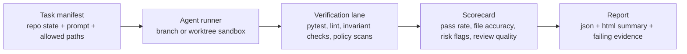

# Eval Harnesses for AI Coding Agents That Actually Catch Bad Patches

Most AI coding demos still fail the same test: the patch looks plausible, but it quietly breaks something off-camera. The model updates the file you expected, misses the adjacent invariant, and the reviewer only notices after CI fails or a customer does.

If you want coding agents to improve, you need an eval harness that grades real repository work instead of prompt beauty contests. That means task manifests, sandboxed verification, invariant checks, and scorecards that separate "made a diff" from "produced a safe fix."

This post walks through the harness shape I would actually use for patch-level agent evaluation: how to define tasks, how to verify them, what to score, and what failure modes are worth surfacing early.

## Why this matters

A coding agent is rarely judged on one thing. In practice you care about several layers at once:

- did it edit the right files?
- did tests pass?
- did it preserve behavior outside the target bug?
- did it avoid risky shortcuts like deleting assertions or loosening auth?
- is the diff reviewable enough for a human to merge quickly?

That mix is why generic benchmark scores are not enough. A repo-local harness lets you grade the work that matters for your stack, your tests, and your risk tolerance.

Direct references worth skimming if you are building this seriously:

- [OpenAI Evals](https://github.com/openai/evals)
- [SWE-bench](https://www.swebench.com/)
- [OpenTelemetry](https://opentelemetry.io/)
- [LangSmith evaluations](https://docs.smith.langchain.com/evaluation)

## Architecture or workflow overview

A useful harness has four stages: prepare a task, run the agent in isolation, verify the patch, and score the result.



### What the task packet should include

I like task manifests that are explicit enough to replay later and small enough to diff in code review.

```yaml
id: auth-refresh-token-regression
base_commit: 6bbda18
repo: github.com/acme/api
prompt: |
  Fix the bug where refresh tokens remain valid after password reset.
  Preserve the mobile login flow and do not change public API schemas.
allowed_paths:
  - services/auth/**
  - tests/auth/**
verify:
  - pytest tests/auth -q
  - ruff check services/auth tests/auth
  - python scripts/check_invariants.py --task auth-refresh-token-regression
invariants:
  - password reset must revoke outstanding refresh tokens
  - existing session audit logging must stay intact
risk_flags:
  - auth
  - session-management
```

This is better than a raw natural-language prompt for two reasons. First, you can rerun it across models and prompt revisions. Second, you can keep risk-sensitive rules out of the model's working memory if you want to enforce them separately in verification.

### The runner should collect more than a diff

The runner is where a lot of teams under-invest. Saving only the final patch makes debugging miserable. At minimum, I want:

- the final diff
- changed file list
- test and lint output
- agent messages or tool trace
- wall-clock runtime
- token or cost estimate
- any policy violations or blocked actions

```python
from dataclasses import dataclass
from pathlib import Path
import subprocess
import time

@dataclass
class EvalResult:
    task_id: str
    exit_code: int
    changed_files: list[str]
    runtime_seconds: float
    checks: dict
    risk_flags: list[str]


def run_check(command: str, cwd: Path) -> dict:
    started = time.time()
    proc = subprocess.run(command, cwd=cwd, shell=True, text=True, capture_output=True)
    return {
        "command": command,
        "ok": proc.returncode == 0,
        "exit_code": proc.returncode,
        "stdout": proc.stdout[-6000:],
        "stderr": proc.stderr[-6000:],
        "runtime_seconds": round(time.time() - started, 2),
    }
```

The important part is not the Python itself. It is the shape of the evidence. If a run fails, you want enough structured output to ask, "did the model misunderstand the task, touch the wrong files, or produce a fragile patch that only passed the happy path?"

## Implementation details

### Score the patch on multiple axes

The highest-value evals I have seen do not collapse everything into one magic number. They keep a small scorecard with a few dimensions that map to human review.

| Dimension | What it measures | Good signal | Failure smell |
| --- | --- | --- | --- |
| Task success | Whether required checks passed | targeted tests green | test suite skipped or loosened |
| File accuracy | Whether edits stayed in the right blast radius | only expected files changed | unrelated churn across repo |
| Invariant safety | Whether critical behavior stayed true | custom invariant checks pass | auth, billing, or data-loss regressions |
| Reviewability | Whether a human can inspect the patch quickly | clear diff, small scope | giant generated rewrite |
| Efficiency | Whether runtime and cost stay reasonable | bounded tokens and runtime | very slow retries or looping |

That scorecard gives you something much closer to operational quality than a single binary grade.

### Add invariant checks outside the main test suite

A lot of bad patches pass the task-specific tests because the original tests were incomplete. That is why I like a second verification lane for invariants.

```python
from pathlib import Path
import re

DIFF = Path('.git/invariant.patch')

def invariant_auth_logging(diff_text: str) -> bool:
    return 'audit.log_security_event' in diff_text


def invariant_no_test_downgrade(diff_text: str) -> bool:
    forbidden = [
        r'-\s*assert .*is False',
        r'\bskip\(',
        r'xfail',
    ]
    return not any(re.search(pattern, diff_text) for pattern in forbidden)
```

### Record terminal output people can actually use

A terse terminal block is often more useful than a paragraph of prose when you are triaging a failed eval.

```text
$ python run_eval.py --task auth-refresh-token-regression --model local-qwen-coder
[agent] plan: inspect auth service, patch token revocation, run focused tests
[verify] pytest tests/auth -q .................................... PASSED
[verify] ruff check services/auth tests/auth ..................... PASSED
[verify] python scripts/check_invariants.py ...................... FAILED
[score] task_success=0.75 file_accuracy=1.00 invariant_safety=0.00 reviewability=0.92
[hint] audit.log_security_event disappeared from services/auth/reset.py
```

That single hint is usually enough to decide whether the run is worth manual review or should go straight back into prompt and harness tuning.

## What went wrong and the tradeoffs

### Failure mode 1, you overfit to your harness

If the agent sees the same task formats and verification patterns repeatedly, it can learn the harness instead of the engineering problem. This is especially common when evaluation tasks stay static for weeks.

**What I would do instead:** rotate task wording, keep hidden holdout tasks, and add a few adversarial checks where the obvious shortcut should fail.

### Failure mode 2, patch success hides review pain

A patch can pass tests and still be awful to merge because it rewrites a file, renames unrelated symbols, or adds generated noise. That is why "reviewability" deserves its own dimension.

### Failure mode 3, security-sensitive repos need harsher scoring

In auth, payments, infrastructure, and data deletion flows, a passing unit test is not enough. I would weight invariant safety and forbidden-pattern checks more heavily than raw task completion.

<div class="callout callout-warning">
  <strong>Pitfall:</strong> do not let the harness grade only success-path tests. Models are very willing to preserve the demo and quietly weaken the guardrails around it.
</div>

### Comparison of common eval styles

| Eval style | Fast to set up | Useful for coding agents | Main weakness |
| --- | --- | --- | --- |
| Prompt-response grading | Yes | Low | ignores repo state and execution |
| Golden diff matching | Medium | Medium | punishes valid alternate fixes |
| Test-only grading | Yes | Medium | misses unsafe shortcuts |
| Patch + invariants + review score | No | High | more setup and maintenance |

My bias is simple: use the richer harness for any workflow where the agent can open PRs or touch production code. The setup cost pays for itself quickly.

## Practical checklist

<div class="callout callout-success">
  <strong>Best practice:</strong> keep the harness boring and deterministic. The model can be creative. The grader should not be.
</div>

- define task manifests with base commit, prompt, allowed paths, and verify commands
- run each task in a fresh branch, worktree, or container
- score both success and blast radius
- add at least one invariant check for every high-risk task family
- save structured artifacts, not just pass or fail
- maintain a hidden holdout set before changing prompts or models
- inspect a sample of "passing" patches manually every week

## Conclusion

If you want better coding agents, stop asking whether the model can produce a patch and start asking whether the patch survives verification, preserves invariants, and stays mergeable. A good eval harness turns that question into data instead of guesswork.
