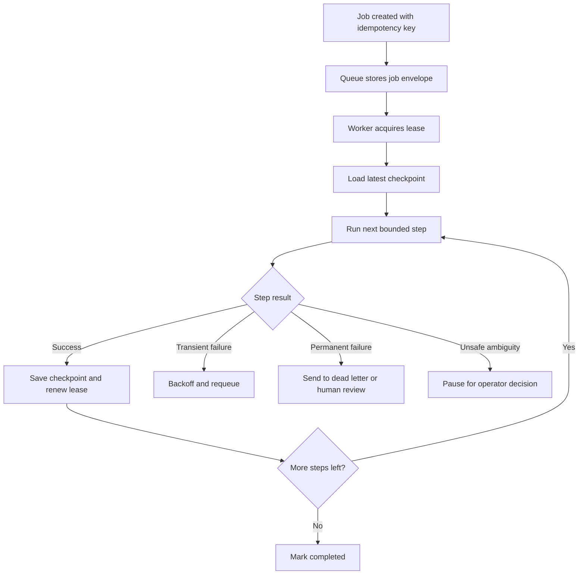

# Retry and Recovery Patterns for Long-Running AI Agent Jobs

A lot of AI agent demos look reliable right up until the first timeout, model 429, or half-finished side effect. Then the job either starts over from scratch, duplicates work, or leaves an operator guessing what actually happened.

Long-running agent tasks need the same discipline as any other background system. If a job can call tools, write data, or spend money for ten minutes straight, retry logic is no longer a small implementation detail. It is the difference between a recoverable blip and a broken workflow.

This post walks through the patterns I would use to make long-running agent jobs restartable, observable, and safer to operate: idempotency keys, leases, checkpoints, bounded retries, and clean human handoff.

## Why this matters

The failure shape of agent jobs is messy by default:

- a model call can time out after the tool already mutated state
- a worker can die after generating a useful partial result
- a queue retry can replay the same side effect unless the job is idempotent
- an operator can rerun a stuck task without knowing whether the previous attempt is still alive

That makes “just retry it” a risky answer. The system needs to know which work is safe to repeat, which work should resume from a checkpoint, and which work should stop and ask for a human.

## Architecture or workflow overview

### The flow I want



### The design rule

Treat the agent like a workflow engine, not a single giant prompt. Each step should be small enough to retry or resume with confidence.

| Concern | Good default | Why it helps |
| --- | --- | --- |
| Duplicate protection | Idempotency key per externally visible action | Stops replayed writes and duplicate PRs, tickets, or messages |
| Progress tracking | Durable checkpoint after each meaningful step | Avoids restarting the whole run after minute nine of ten |
| Worker ownership | Lease with heartbeat renewal | Prevents two workers from “helpfully” processing the same job |
| Retry policy | Exponential backoff plus retry budget | Handles flaky dependencies without creating infinite churn |
| Human intervention | Explicit paused state | Makes ambiguity visible instead of silently guessing |

## Implementation details

### 1. Put every job in a durable envelope

The queue payload should carry enough state to answer three questions later: what is this job, what has it already done, and how many more times am I willing to try.

```json
{
  "jobId": "blog-pr-2026-04-12-001",
  "workflow": "daily-blog-pr",
  "attempt": 2,
  "maxAttempts": 5,
  "leaseOwner": null,
  "idempotencyKey": "daily-blog-pr:2026-04-12",
  "checkpointVersion": 4,
  "resumeFrom": "write_html",
  "createdAt": "2026-04-12T11:55:02Z",
  "visibilityTimeoutSeconds": 900
}
```

I like keeping the envelope boring and explicit. The agent can still have rich internal state, but the queue contract should be simple enough for operators and scripts to inspect quickly.

### 2. Separate step execution from workflow control

A worker should not blindly re-run the whole plan on every retry. It should load the latest checkpoint, execute one bounded step, persist the result, then decide whether to continue or requeue.

```ts
async function processJob(job: JobEnvelope) {
  const lease = await acquireLease(job.jobId, workerId, 15 * 60);
  if (!lease.ok) return;

  const checkpoint = await loadCheckpoint(job.jobId);
  const step = nextStep(checkpoint);

  try {
    const result = await runStep(step, checkpoint.context);

    await saveCheckpoint(job.jobId, {
      ...checkpoint,
      lastStep: step.name,
      context: result.context,
      completedSteps: [...checkpoint.completedSteps, step.name]
    });

    await renewLease(job.jobId, workerId);
    await enqueueIfNeeded(job.jobId);
  } catch (error) {
    if (isTransient(error) && job.attempt < job.maxAttempts) {
      await requeueWithBackoff(job, nextDelay(job.attempt + 1));
      return;
    }

    if (isAmbiguousWrite(error)) {
      await pauseForHuman(job.jobId, checkpoint, error);
      return;
    }

    await moveToDeadLetter(job, error);
  } finally {
    await releaseLease(job.jobId, workerId);
  }
}
```

The main point is that the worker owns orchestration, while `runStep` owns task logic. That split makes replay and debugging much less chaotic.

### 3. Checkpoint before risky boundaries

I would checkpoint before and after any expensive or side-effecting operation:

- before a model call that can take 60 seconds and burn a lot of tokens
- before a tool call that writes to GitHub, Jira, Slack, or a database
- after generating an artifact that is expensive to reproduce
- before switching from analysis to action

A good checkpoint is not a full transcript dump. It is the minimum structured state required to continue safely.

```yaml
job_id: blog-pr-2026-04-12-001
last_step: create_pr
completed_steps:
  - choose_topic
  - write_markdown
  - write_html
artifacts:
  branch: ai-blog/2026-04-12-agent-retry-recovery
  commit_sha: 7d9e3ba
  pr_url: null
side_effects:
  github_push:
    done: true
    idempotency_key: daily-blog-pr:2026-04-12:push
  github_pr_create:
    done: false
context:
  slug: agent-retry-recovery
  title: Retry and Recovery Patterns for Long-Running AI Agent Jobs
```

That is enough to resume from PR creation without regenerating the post or pushing another branch.

### 4. Use logs that operators can actually act on

A clean terminal trace is a reliability feature. If the log makes it obvious whether the worker retried, resumed, or paused, humans can recover faster.

```text
2026-04-12T11:58:02Z job=blog-pr-2026-04-12-001 step=create_pr attempt=1 lease=worker-3
2026-04-12T11:58:06Z provider=github status=502 class=transient action=requeue delay=120s
2026-04-12T12:00:07Z job=blog-pr-2026-04-12-001 step=create_pr attempt=2 checkpoint=write_html
2026-04-12T12:00:09Z provider=github status=201 pr=142 action=complete
```

That is much better than a single vague line saying “task failed”.

## What went wrong, and the tradeoffs

### Retry is not the same thing as recovery

A transient timeout on a read-only model call is a normal retry case. A timeout after sending an email or creating a pull request is different. The system may not know whether the side effect already happened.

That is why I separate failures into three buckets:

| Failure type | Example | Best response |
| --- | --- | --- |
| Transient | 429, network timeout, overloaded model gateway | Retry with backoff |
| Recoverable with checkpoint | Worker restart mid-run, deploy interruption | Resume from last durable step |
| Ambiguous side effect | Request timed out after a write may have succeeded | Pause, verify externally, then resume or mark done |

### The most common mistake

The most common mistake is storing the entire workflow state only in memory. It works until the worker restarts. Then the queue retries a job that no longer remembers what it already did.

### Security and reliability concerns

If the job can perform write actions, every replay path needs guardrails:

- use idempotency keys for external APIs whenever possible
- bind every checkpoint to a concrete principal or service account
- keep step outputs structured so you can audit what happened
- avoid automatic retries on destructive steps unless the downstream API is explicitly idempotent

### What I would not do

I would not let a single agent prompt manage a 20-step workflow without durable checkpoints. I also would not auto-retry side-effecting tool calls just because the HTTP client labeled the error as retryable. In agent systems, ambiguity matters more than optimistic throughput.

> **Pitfall callout**
>
> If your workflow creates Git branches, PRs, tickets, or notifications, a missing idempotency key will eventually show up as duplicate human-visible work. That is the kind of bug that makes an automation feel untrustworthy very quickly.

## Practical checklist or decision framework

### What I would do again

- [ ] Give every externally visible action its own idempotency key
- [ ] Break long jobs into bounded steps with checkpointable outputs
- [ ] Use worker leases so only one runner owns a job at a time
- [ ] Keep retry budgets finite and visible in the job envelope
- [ ] Pause ambiguous writes for operator review instead of guessing
- [ ] Send dead-letter jobs somewhere an operator will actually inspect

### Quick decision framework

1. **Can this step be repeated safely?** If yes, retry.
2. **Can this step resume from saved state?** If yes, restore checkpoint and continue.
3. **Could this step have already mutated the outside world?** If yes, verify before replay.
4. **Is the failure repeated after the retry budget is spent?** Escalate to a human or dead-letter queue.

## Conclusion

Long-running agent jobs become much easier to trust once retry and recovery are treated as first-class design problems. Durable checkpoints, explicit idempotency, and honest pause states keep failures small instead of mysterious.

If I were building a new agent runner today, I would optimize less for uninterrupted happy-path execution and more for clean restarts after the inevitable messy failure. That is what makes the automation feel production-ready instead of lucky.
