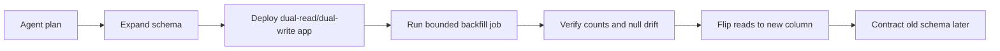

# Agent-Safe Database Migrations with Expand-Contract and Rollback Checkpoints

A lot of AI coding agents are surprisingly decent at adding a column, updating an ORM model, and wiring a feature flag. They are much worse at respecting the ugly part of schema changes, which is that production data outlives code suggestions.

The failure mode is predictable. The model sees `rename full_name to display_name`, generates a destructive migration, updates the app code, and moves on. Meanwhile, background workers, cached binaries, old jobs, BI queries, and rollback paths still depend on the old shape.

If you want AI assistance on database changes without turning every migration into a trust exercise, you need a workflow that is hard to do unsafely. In this post I’ll walk through the expand-contract pattern, the guardrails I’d put around an AI agent, and the exact checkpoints that make rollback possible.

## Visual plan

- **Hero image idea:** dark terminal-and-schema banner showing migration, backfill, and verify stages
- **Architecture diagram idea:** request flow from agent plan to schema expand, dual-write app, backfill, verify, contract
- **Optional terminal visual:** migration apply output plus verification counts
- **Optional comparison table:** fast rename vs expand-contract vs shadow-table copy
- **Tags:** AI Agents, Database Migrations, Reliability, DevOps, Production Engineering
- **Meta description:** A practical guide to shipping database changes with AI coding agents using expand-contract migrations, schema guards, dual writes, and rollback checkpoints.
- **Suggested code sections:** SQL expand migration, application dual-write logic, verification query, rollout checklist

## Why this matters

Schema changes are one of the easiest places for an AI coding workflow to look correct in review while still being operationally unsafe.

A text diff can hide the real blast radius. Maybe the generated migration drops a column before a batch job stops reading it. Maybe the backfill runs without bounds and crushes the primary. Maybe a rollback restores code but not the data shape. Those are not theoretical edge cases. They are normal production problems.

The right bar is not “can the model generate a migration.” The right bar is “can the system evolve the schema in a way that tolerates partial rollout, retries, and rollback.”

## Architecture or workflow overview



A practical sequence looks like this:

1. **Expand** the schema with additive changes only.
2. **Deploy** application code that can tolerate both old and new shapes.
3. **Backfill** old data into the new structure in bounded chunks.
4. **Verify** row counts, null rates, lagging writers, and read-path correctness.
5. **Flip reads** to the new field behind a flag.
6. **Contract** the old column or table only after one or more safe release cycles.

## Implementation details

### 1. Start with an additive migration, not a rename

If an AI agent proposes a direct rename in production, I would reject it by default.

```sql
-- 20260423_expand_users_display_name.sql
ALTER TABLE users
  ADD COLUMN display_name TEXT;

CREATE INDEX CONCURRENTLY IF NOT EXISTS idx_users_display_name
  ON users (display_name);
```

This is boring, and that is exactly why it is good. Additive migrations preserve rollback options. Old code still works. New code can start writing the new field. BI queries do not explode immediately.

### 2. Force the app into a dual-write period

The dual-write window is the part most AI-generated patches skip or under-specify.

```ts
export async function updateProfile(userId: string, input: { fullName?: string }) {
  const displayName = normalizeDisplayName(input.fullName ?? null);

  await db.user.update({
    where: { id: userId },
    data: {
      full_name: input.fullName,
      display_name: displayName,
    },
  });
}

export function readPreferredDisplayName(user: {
  display_name: string | null;
  full_name: string | null;
}) {
  return user.display_name ?? user.full_name ?? "Anonymous";
}
```

Two important rules here:

- Reads should prefer the new field but still tolerate the old one.
- Writes should keep both fields in sync until the backfill and rollout are proven clean.

If your agent only updates the write path and not the read path, the migration is incomplete.

### 3. Backfill in bounded chunks

A backfill that touches the whole table in one transaction is the kind of thing a model will happily generate if you let it optimize for brevity.

```ts
const BATCH_SIZE = 1000;

export async function backfillDisplayNames() {
  let cursor: string | null = null;

  while (true) {
    const rows = await db.$queryRaw<Array<{ id: string; full_name: string | null }>>`
      SELECT id, full_name
      FROM users
      WHERE display_name IS NULL
        AND (${cursor}::uuid IS NULL OR id > ${cursor}::uuid)
      ORDER BY id
      LIMIT ${BATCH_SIZE}
    `;

    if (rows.length === 0) break;

    for (const row of rows) {
      await db.user.update({
        where: { id: row.id },
        data: { display_name: normalizeDisplayName(row.full_name) },
      });
    }

    cursor = rows[rows.length - 1].id;
  }
}
```

This is not the fastest possible implementation. It is, however, easy to pause, resume, observe, and rate-limit. For AI-assisted changes, those properties matter more than elegance.

### 4. Add machine-checkable verification

I want the agent to leave behind verification queries, not just code.

```sql
SELECT
  COUNT(*) AS total_users,
  COUNT(*) FILTER (WHERE display_name IS NULL) AS missing_display_name,
  COUNT(*) FILTER (
    WHERE COALESCE(display_name, '') <> COALESCE(full_name, '')
  ) AS drifted_rows
FROM users;
```

And I want release output that looks something like this:

```text
$ pnpm tsx scripts/backfill-display-name.ts
processed=1000 remaining=42120 rate=910 rows/s
processed=1000 remaining=41120 rate=928 rows/s
processed=1000 remaining=40120 rate=905 rows/s
...
verification total_users=982144 missing_display_name=0 drifted_rows=0
```

If the PR does not tell reviewers how to verify migration success, it is not ready.

## What went wrong, and the tradeoffs

### The failure modes I would expect

- **Destructive first step.** The agent renames or drops before compatibility code ships.
- **Unbounded backfill.** One huge update causes lock pressure, replica lag, or dead tuples.
- **Half migration.** Writes go to both fields, but some readers still hardcode the old column.
- **Rollback illusion.** The app rolls back, but the forward-only migration left the system in an awkward intermediate state.
- **Hidden dependency drift.** Dashboards, exports, and sidecar jobs keep reading the old field long after app traffic is clean.

### Tradeoff table

| Strategy | Speed | Rollback safety | Operational load | Good fit |
| --- | --- | --- | --- | --- |
| Direct rename/drop | High | Poor | Low at first, high later | Local/dev only |
| Expand-contract | Medium | Strong | Medium | Most production apps |
| Shadow table copy | Low | Strongest | High | Very large or high-risk rewrites |

My bias is simple: if a schema change touches production data and an AI agent helped author it, expand-contract should be the default unless there is a strong reason not to use it.

### Security and reliability concerns

AI agents often have enough repo context to generate migrations, but not enough runtime context to know:

- whether a table is hot,
- whether replicas are already behind,
- whether a downstream service polls the old column,
- whether a migration framework wraps DDL in a bad transaction mode.

That means the human or the automation harness needs explicit guardrails. I would require:

- migration lint rules that reject destructive first steps,
- protected review for files under `migrations/`,
- pre-merge verification commands in the PR body,
- rollout notes that name the flag flip and contract step,
- a policy that contract migrations ship later, never in the same release.

## Practical checklist

### What I’d do again

- [ ] Keep the first migration additive only.
- [ ] Make the app read both shapes before changing reads globally.
- [ ] Dual-write during the transition window.
- [ ] Backfill in resumable chunks with visible progress.
- [ ] Add verification SQL to the PR, not just to a runbook nobody opens.
- [ ] Delay the contract step until at least one clean release passes.
- [ ] Treat AI-generated migration plans as drafts, not authority.

### What I would not do

- I would not let an agent merge a rename-plus-drop migration in one shot.
- I would not run a bulk backfill without a throttle or resume point.
- I would not assume application rollback equals data rollback.
- I would not remove the old schema path until logs, metrics, and ad hoc queries say it is unused.

## Conclusion

AI coding agents can absolutely help with database work, but only if the workflow is opinionated enough to resist the model’s love of short, clean, unsafe patches.

Use expand-contract, keep the dual-write period explicit, require verification artifacts, and postpone the destructive cleanup. The safest migration is usually the one that looks slightly overcautious in code review and slightly boring in production.
