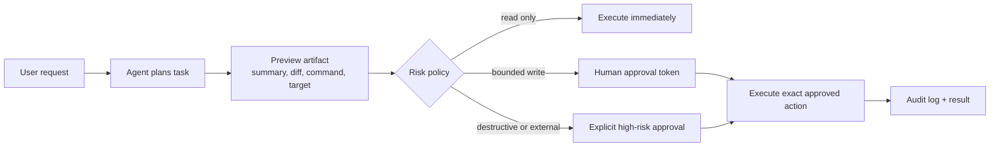

# Approval Workflows for AI Agents That Can Actually Write Code

Most teams do not need a lecture about AI safety. They need a workflow that lets an agent do useful work without quietly turning a repo, inbox, or production system into a trust exercise.

That is the real approval problem. If approvals are too loose, the agent gets broad write power and mistakes compound fast. If approvals are too heavy, the agent becomes a glorified autocomplete with extra latency.

The sweet spot is a staged workflow: preview first, show the exact effect, require approval only for actions with real blast radius, then keep a clean audit trail. This post walks through the approval pattern I would use for code-writing agents, repo workers, and tool-calling assistants.

## Why this matters

Approval design becomes important the moment an agent can do more than read. Opening a pull request, modifying files, sending a message, merging a branch, or rotating a token all have different risk profiles. Treating them as one generic “confirm?” step usually fails both security and usability.

In production, the approval system has to answer four practical questions:

1. What exactly is the agent asking to do?
2. Can a human inspect the real effect before it happens?
3. Does approval cover only this action, or a whole session?
4. What evidence exists after the fact?

If you cannot answer those clearly, the workflow will drift into either blind trust or constant interruption.

## Architecture and workflow overview

A good approval path separates planning from execution and binds approval to a specific proposed action, not a vague intention.



The key detail is that the preview is a first-class artifact. For code workflows that usually means a diff, branch, file list, and command summary. For external actions it might mean recipients, message body, or changed records.

## The approval model I would actually use

I like approval systems with three lanes instead of one.

### Lane 1: auto-execute for read-only and reversible low-risk actions

Examples:
- list issues
- inspect CI logs
- read files inside an allowed workspace
- render a preview page in a temp directory

These actions should not ask humans to click a button every time. Requiring approval here trains people to approve without reading.

### Lane 2: preview-bound approval for bounded writes

Examples:
- edit files in an allowed repo
- push a branch
- open a draft PR
- update a scheduled task inside a limited namespace

These are the best candidates for human-in-the-loop approval. The system can show the real delta, bind approval to that exact action, then execute only if the payload still matches.

### Lane 3: high-friction approval for destructive or external actions

Examples:
- merge to a protected branch
- delete data
- send email or public messages
- change infra or secrets
- run elevated commands outside the normal sandbox

These should require a more explicit step than “looks good.” Often that means a separate confirmation phrase, a short-lived elevated token, or a second approver depending on the environment.

## Implementation detail 1: classify risk before asking for approval

The approval step should not decide risk at the UI layer. Risk classification belongs in policy code.

```ts
const policyTable = {
  read_file: { lane: 'auto', effect: 'read' },
  list_pull_requests: { lane: 'auto', effect: 'read' },
  edit_workspace_file: { lane: 'preview', effect: 'write' },
  create_pull_request: { lane: 'preview', effect: 'write' },
  merge_pull_request: { lane: 'high', effect: 'write' },
  send_email: { lane: 'high', effect: 'external' },
} as const;

function classifyAction(toolName: string, args: unknown) {
  const policy = policyTable[toolName as keyof typeof policyTable];
  if (!policy) throw new Error(`Tool ${toolName} is not approved`);

  return {
    lane: policy.lane,
    effect: policy.effect,
    fingerprint: stableHash({ toolName, args }),
  };
}
```

This matters because “approval required” is not enough. The system needs a consistent answer about why approval is required and what level of approval applies.

## Implementation detail 2: approve the exact artifact, not a broad session

One bad pattern is session-wide approval like “allow the agent to keep making changes.” It feels convenient, but it quietly converts a narrow review into an open-ended permission grant.

A safer pattern is to approve a specific action fingerprint.

```ts
type ApprovalRequest = {
  toolName: string;
  args: unknown;
  summary: string;
  fingerprint: string;
  expiresAt: string;
};

function mintApproval(request: ApprovalRequest, approverId: string) {
  return signJwt({
    sub: approverId,
    toolName: request.toolName,
    fingerprint: request.fingerprint,
    expiresAt: request.expiresAt,
  });
}

function assertApprovalMatches(token: string, fingerprint: string, toolName: string) {
  const decoded = verifyJwt(token);
  if (decoded.fingerprint !== fingerprint) throw new Error('Approval no longer matches request');
  if (decoded.toolName !== toolName) throw new Error('Approval granted for a different tool');
}
```

If the diff changes, the command changes, or the recipient changes, the fingerprint changes and the approval should be invalid.

## Implementation detail 3: previews need to be inspectable, not poetic

A lot of agent systems generate approval summaries that sound nice but hide the real action. That is risky.

Good previews are concrete:
- exact command or sanitized script
- files changed
- branch name
- diff summary
- external destination
- whether network or elevated access is involved
- expiration window

Here is the kind of terminal-style approval summary I would want:

```text
Approval requested: create_pull_request
Repo: negiadventures/negiadventures.github.io
Branch: ai-blog/2026-04-15-ai-agent-approval-workflows
Base: master
Files changed:
- blog/ai-agent-approval-workflows.html
- blog/ai-agent-approval-workflows.md
- blog/index.html
- blog/.ai-topic-history.json
- sitemap.xml
Diff summary: add one new blog post, prepend blog card, add sitemap entry, record topic history
Network access: required
Elevated access: no
Approval expires in: 15 minutes
```

That is much easier to reason about than “the agent would like to finish publishing your post.”

## Implementation detail 4: make execution fail closed after approval

An approval system should re-check policy at execution time. Do not assume that a once-approved request remains valid forever.

```python
from dataclasses import dataclass
from datetime import datetime, timezone

@dataclass
class ExecutionRequest:
    tool_name: str
    args: dict
    fingerprint: str
    approval_token: str | None


def execute_with_policy(request: ExecutionRequest):
    classification = classify_action(request.tool_name, request.args)

    if classification["lane"] == "auto":
        return run_tool(request.tool_name, request.args)

    if request.approval_token is None:
        raise PermissionError("Approval required before execution")

    assert_approval_matches(
        request.approval_token,
        request.fingerprint,
        request.tool_name,
    )

    return run_tool(request.tool_name, request.args)
```

The practical rule is simple: if the approved thing and the executed thing are not provably the same, do not run it.

## Tradeoffs: the three common approval designs

| Design | Good at | Breaks when | My take |
| --- | --- | --- | --- |
| Blanket session approval | fast iteration | agent scope drifts, humans stop reading | only acceptable in tightly sandboxed personal workflows |
| Per-tool approval | simple mental model | frequent interruptions, approval fatigue | decent baseline, but noisy |
| Preview-bound approval | inspectable writes, tighter audit trail | preview generation is weak or fingerprints are unstable | best default for repo and ops workflows |

Preview-bound approval is a bit more engineering work, but it pays for itself quickly once the agent can touch real systems.

## What goes wrong in practice

### Failure mode 1: approvals become meaningless because they are too frequent

If every harmless read or reversible action asks for confirmation, people stop reading and start clicking. That is not human oversight, that is ritual.

### Failure mode 2: the preview is not the real action

I’m wary of systems where the preview says “edit two files” but the actual execution step can still modify five. If the preview is lossy, approval is mostly theater.

### Failure mode 3: approval accidentally covers follow-up actions

A common bug in agent platforms is chained execution after one approved step. The agent edits files, then pushes, then opens a PR, then posts to chat because all of those feel related. They are related, but they are not the same action.

### Failure mode 4: policy lives only in prompts

If the rule is “never message external recipients without approval,” that rule needs to exist in executable policy, not just in an instruction file. Prompts help behavior. Policies enforce behavior.

## Security and reliability concerns that matter

### Replay resistance

Approval tokens should expire quickly and bind to a single action fingerprint. Otherwise a captured token can be reused for a modified request.

### Workspace and tenant boundaries

For code-writing agents, approval alone is not enough. The runtime should still enforce allowed repos, writable paths, branch prefixes, and network restrictions.

### Auditability

You want a durable event for request, approval, execution, and result. That matters for debugging just as much as compliance.

```json
{
  "timestamp": "2026-04-15T12:02:00Z",
  "session_id": "sess_blog_412",
  "tool": "create_pull_request",
  "lane": "preview",
  "fingerprint": "fp_8f6f0b",
  "approver": "user_123",
  "status": "executed",
  "files_changed": 5,
  "external_destination": "github.com",
  "duration_ms": 912
}
```

### Idempotency

Approved writes should be safe to retry when possible. If a network call times out after approval, the system needs a way to avoid creating duplicate PRs or duplicate notifications.

## What I would not do

I would not give a coding agent permanent approval to run arbitrary commands in a repo just because it usually behaves.

I would not let “approve once” silently upgrade into “approve all follow-up actions in this chain.”

I would not build external message sending and local file editing behind the same generic confirm button. Those risks are different, and the workflow should say so plainly.

## Practical checklist

Use this when you design an approval system for an agent that can write or act externally.

- classify tools into auto, preview, and high-risk lanes
- generate a concrete preview artifact before every bounded write
- bind approval to a stable fingerprint of the exact action
- expire approvals quickly
- re-check policy at execution time
- keep follow-up actions separate unless they are explicitly approved too
- log request, approval, execution, and result as distinct events
- enforce branch, path, repo, and destination constraints outside the prompt
- make read-only actions silent enough that people keep paying attention when approvals do appear
- fail closed when preview, token, or policy state no longer matches

## Conclusion

Approval workflows are not there to make agents feel supervised. They are there to preserve velocity without losing inspectability.

The best pattern I know is boring in a good way: classify risk, preview the exact effect, approve only what can be inspected, execute only what was approved, and leave a clean trail behind. That is enough to make code-writing agents useful without pretending trust scales automatically.

## References

- [GitHub Docs: About pull request reviews](https://docs.github.com/en/pull-requests/collaborating-with-pull-requests/reviewing-changes-in-pull-requests/about-pull-request-reviews)
- [GitHub Docs: About protected branches](https://docs.github.com/en/repositories/configuring-branches-and-merges-in-your-repository/managing-protected-branches/about-protected-branches)
- [OWASP Top 10 for LLM Applications 2025](https://genai.owasp.org/llmrisk/llm01-prompt-injection/)
- [Anthropic, Model Context Protocol overview](https://www.anthropic.com/news/model-context-protocol)
