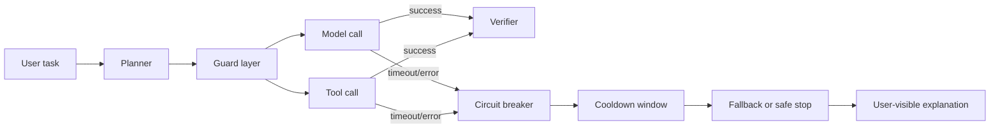

# Circuit Breakers for AI Agents That Touch Real Systems

AI agents fail differently than normal request handlers. A flaky model endpoint does not just fail one call. It can trigger retries, replan loops, duplicate tool invocations, and confused fallback behavior that burns budget while doing less work.

I have become a lot more skeptical of “just retry it” in agent systems. When an LLM is orchestrating other systems, a retry policy without a circuit breaker is often an outage amplifier.

This post shows how to wrap model calls and tool invocations in circuit breakers, what signals to trip on, how to recover safely, and where people usually get the thresholds wrong.

## Why this matters

In a production AI workflow, one broken dependency can spread across the whole run:

- a model API starts timing out
- the planner retries and creates more requests
- the executor repeats a side-effecting tool call
- the user gets a vague “working on it” response while costs keep climbing

Traditional services usually have clearer edges. Agents do not. Their control loop can turn a small dependency wobble into latency spikes, token waste, and accidental duplicate actions.

The practical goal is simple: when a dependency gets unhealthy, the agent should do less, explain more, and preserve the option to recover cleanly.

## Architecture or workflow overview

### Failure containment path



A healthy run goes through the guard layer and continues. An unhealthy run should trip quickly, enter cooldown, and either downgrade safely or stop before it causes side effects.

### The operating sequence

1. classify the dependency call, model or tool
2. attach cost, timeout, and retry budget
3. record success and failure counts in a sliding window
4. open the breaker when the error budget is exhausted
5. allow only a few half-open probes to test recovery
6. close the breaker only after stable success

## Implementation details

### 1) Put a breaker in front of every unstable edge

The first mistake is having one global breaker for “the agent.” That hides the real failure domain. Breakers should usually live per model endpoint, per tool class, or per tenant-sensitive integration.

```ts
// breaker.ts
export type BreakerState = 'closed' | 'open' | 'half-open';

export class CircuitBreaker {
  private state: BreakerState = 'closed';
  private failures = 0;
  private successes = 0;
  private openedAt = 0;

  constructor(
    private readonly failureThreshold = 5,
    private readonly halfOpenSuccesses = 2,
    private readonly cooldownMs = 30_000,
  ) {}

  canExecute(now = Date.now()) {
    if (this.state === 'open' && now - this.openedAt < this.cooldownMs) return false;
    if (this.state === 'open') {
      this.state = 'half-open';
      this.successes = 0;
    }
    return true;
  }

  recordSuccess() {
    if (this.state === 'half-open') {
      this.successes += 1;
      if (this.successes >= this.halfOpenSuccesses) {
        this.state = 'closed';
        this.failures = 0;
      }
      return;
    }

    this.failures = 0;
  }

  recordFailure() {
    this.failures += 1;
    if (this.failures >= this.failureThreshold) {
      this.state = 'open';
      this.openedAt = Date.now();
    }
  }

  snapshot() {
    return { state: this.state, failures: this.failures, openedAt: this.openedAt };
  }
}
```

This is intentionally boring. That is the point. A breaker should be inspectable enough that an on-call engineer can explain why it opened.

### 2) Wrap model calls with timeout and token budget guards

Model outages are not always hard 500s. Often the first symptom is latency drift or cost blowups from repeated re-asks. The wrapper should account for both.

```ts
// guarded-model-call.ts
import pTimeout from 'p-timeout';
import { CircuitBreaker } from './breaker';

const plannerBreaker = new CircuitBreaker(4, 2, 45_000);

export async function guardedPlannerCall(client: any, payload: any) {
  if (!plannerBreaker.canExecute()) {
    throw new Error('planner breaker open: skip call and use fallback summary');
  }

  try {
    const result = await pTimeout(
      client.responses.create(payload),
      { milliseconds: 12_000, message: 'planner timed out' }
    );

    if (result.usage?.total_tokens > 40_000) {
      throw new Error('planner exceeded token budget');
    }

    plannerBreaker.recordSuccess();
    return result;
  } catch (error) {
    plannerBreaker.recordFailure();
    throw error;
  }
}
```

Two useful details here:

- timeout is part of health, not just convenience
- token budget breaches can count as failures when they imply runaway replanning

### 3) Policy belongs in config, not buried in prompts

Agent teams often tune behavior by editing prompts alone. That is too soft for operational safety. Breaker policy should live in code or config that can be reviewed like infrastructure.

```yaml
# breaker-policy.yaml
models:
  planner:
    failure_threshold: 4
    cooldown_ms: 45000
    half_open_successes: 2
    timeout_ms: 12000
    max_total_tokens: 40000
  executor:
    failure_threshold: 3
    cooldown_ms: 60000
    half_open_successes: 1
    timeout_ms: 15000

tools:
  github_write:
    failure_threshold: 2
    cooldown_ms: 180000
    half_open_successes: 1
    side_effecting: true
  web_fetch:
    failure_threshold: 5
    cooldown_ms: 20000
    half_open_successes: 2
    side_effecting: false
```

A GitHub write tool should trip faster and recover more cautiously than a read-only fetch tool. Side-effecting tools deserve lower tolerance.

### 4) Log why the breaker opened

A breaker that opens silently creates a second debugging problem. You want structured events that say what tripped, what dependency was involved, and what fallback path ran.

```text
2026-05-05T11:42:09Z breaker.open dependency=planner-model reason=timeout_window
window_failures=4 timeout_ms=12000 fallback=summary_only_request

2026-05-05T11:42:54Z breaker.half_open dependency=planner-model probe=1

2026-05-05T11:43:01Z breaker.close dependency=planner-model stable_successes=2
```

That terminal view is small, but it saves a lot of guesswork during incidents.

## What went wrong, and the tradeoffs

### The common failure modes

**Retry storms**

Without a breaker, retries stack on top of replanning and tool loops. The system looks “busy” while quality collapses.

**Duplicate side effects**

If a write tool fails after the remote system already accepted the request, an agent may try again. Breakers reduce blast radius, but you still need idempotency keys for write paths.

**False opens from bursty traffic**

If thresholds are too strict, one short regional wobble opens the circuit for everyone. Sliding windows and tenant-aware scopes help.

**Half-open thundering herd**

If every worker is allowed to probe recovery at once, the dependency gets hit right when it is weakest. Limit half-open probes aggressively.

### Tradeoff table

| Choice | Upside | Downside | I would use it when |
| --- | --- | --- | --- |
| Per-model breaker | Clean failure isolation | More configs to tune | Planner and executor use different providers or budgets |
| Global agent breaker | Easy to add | Hides root cause, over-blocks healthy paths | Almost never, except tiny single-model prototypes |
| Fast open thresholds | Stops cost leaks quickly | Can degrade availability during transient blips | Side-effecting tools or expensive premium models |
| Slow open thresholds | Fewer false positives | More wasted retries and user latency | Read-only tools with cheap fallback |
| Aggressive fallback | Better uptime | Lower answer quality | Non-critical summarization or enrichment tasks |
| Hard fail closed | Strongest safety | More visible user interruptions | Payment, deploy, or write-heavy workflows |

### Security and reliability concerns

A breaker is not a security control by itself. If tool output is malicious or prompts are tainted, the dependency may be “healthy” while the behavior is unsafe. Keep prompt-injection defenses and approval gates separate.

I also would not let the model decide its own breaker thresholds. The policy has to come from the system owner, not the system under stress.

## Practical checklist

Use this when adding breakers to an existing agent stack:

- [ ] define breakers per dependency, not one giant global switch
- [ ] separate read-only tools from side-effecting tools
- [ ] count timeouts and token budget blowups as health signals
- [ ] persist breaker state where parallel workers can see it
- [ ] cap half-open probes so recovery testing stays gentle
- [ ] pair write tools with idempotency keys
- [ ] emit structured open, half-open, and close events
- [ ] expose a user-facing fallback message instead of silent spinning
- [ ] review thresholds after real incidents, not only in staging

## Best practices I would keep

> **Best practice:** When the breaker opens, do not pretend the agent is still fully capable. Downgrade the plan visibly, for example “search is temporarily degraded, returning cached context only,” so users know the system chose safety on purpose.

> **Pitfall:** Teams often keep retries in the HTTP client, the tool wrapper, and the agent planner at the same time. That triple stack makes outages look random. Pick one owner for retries and let the breaker coordinate the rest.

## Conclusion

Agent reliability gets much better when unhealthy dependencies cause smaller behavior, not louder behavior. Circuit breakers are not glamorous, but they are one of the cleanest ways to stop model hiccups and flaky tools from turning into cascading incidents.

If I were adding only three things tomorrow, I would start with per-dependency breakers, token-aware health thresholds, and visible fallback messages.

## References

- [Martin Fowler, Circuit Breaker](https://martinfowler.com/bliki/CircuitBreaker.html)
- [Release It!, Stability Patterns and Production Failure Design](https://pragprog.com/titles/mnee2/release-it-second-edition/)
- [OpenAI API error codes](https://platform.openai.com/docs/guides/error-codes)
- [Anthropic API errors](https://docs.anthropic.com/en/api/errors)
