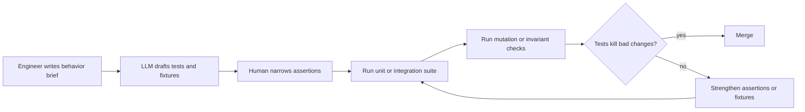

# AI-Generated Tests That Actually Help, and Where They Quietly Fail

Most teams discover the same thing the hard way: AI can produce a lot of tests very quickly, but that is not the same as producing tests you should trust. A model will happily generate assertions that mirror the implementation, lock in a bug, or pass because the fixture is too forgiving.

The useful version of AI-generated testing is narrower and more practical. Let the model draft cases, edge conditions, and fixture scaffolding, then force those tests through stronger review gates like mutation checks, invariant assertions, and flaky-test detection.

This post covers the workflow I would actually use in a production repo, where the goal is not "more tests". The goal is faster coverage gains without filling CI with pretty nonsense.

## Why this matters

AI-generated tests are attractive because they compress the slowest part of test writing: enumerating cases, setting up data, and sketching repetitive assertions. That helps most when a codebase already has a clear architecture and a human reviewer who knows what correct behavior looks like.

They become risky when teams treat passing tests as evidence of correctness. In practice, the weak points are predictable:

- the model copies implementation details into the assertion
- the test only checks the happy path
- mocks are too broad, so integration mistakes disappear
- the fixture encodes the bug the test should catch
- the test increases coverage without increasing fault detection

The production question is simple: does this test fail when the system is wrong? If not, it is documentation at best and noise at worst.

## Architecture and workflow overview



I like a five-stage loop:

1. Describe the behavior, contract, or bug in plain language.
2. Let the model draft tests around that contract.
3. Replace weak assertions with invariant or outcome-based assertions.
4. Run the suite plus a mutation pass on critical modules.
5. Keep only the tests that would have caught a meaningful bug.

### Before vs after

| Draft style | What usually happens | Better version |
| --- | --- | --- |
| Assert exact private helper output | Locks tests to implementation details | Assert public contract or state transition |
| Mock every dependency | Hides integration drift | Keep one thin integration path with real serialization or DB boundaries |
| Golden path only | Coverage goes up, faults still leak | Add invalid input, timeout, and duplicate-event cases |
| Snapshot huge payloads | Review becomes useless | Assert key fields, invariants, and stability boundaries |

## Implementation details

A good prompt for AI-generated tests is contract-first and annoyingly specific. Do not ask for "tests for this file". Ask for behavior.

```text
Write pytest tests for `build_invoice_summary`.
Focus on public behavior, not helper internals.
Include:
- one golden path case
- one duplicate line-item case
- one currency mismatch case
- one empty invoice case
Use factories instead of inline dict walls.
Avoid snapshots.
Every assertion must check a business invariant or externally visible field.
```

That prompt tends to produce something useful enough to edit instead of something impressive enough to delete.

Here is the kind of test shape I want after cleanup:

```python
import pytest
from billing.summary import build_invoice_summary
from tests.factories import invoice_factory, line_item_factory


def test_build_invoice_summary_rejects_mixed_currencies():
    invoice = invoice_factory(
        items=[
            line_item_factory(amount_cents=2500, currency='USD'),
            line_item_factory(amount_cents=1900, currency='EUR'),
        ]
    )

    with pytest.raises(ValueError, match='currency'):
        build_invoice_summary(invoice)


def test_build_invoice_summary_computes_totals_from_visible_items_only():
    invoice = invoice_factory(
        items=[
            line_item_factory(amount_cents=2500, hidden=False),
            line_item_factory(amount_cents=1800, hidden=True),
        ]
    )

    summary = build_invoice_summary(invoice)

    assert summary.total_cents == 2500
    assert summary.item_count == 1
    assert summary.currency == 'USD'
```

Notice what changed from the average model draft:

- the test uses a public function, not a helper
- the assertions target outcomes, not internal steps
- hidden items and invalid currencies force real branch coverage
- the failure mode is tied to a business rule

The second hardening layer is mutation testing. I would not run it on every file in a giant repo, but it is excellent for critical logic that AI-generated tests tend to fake their way through.

```yaml
# .github/workflows/test-quality.yml
name: test-quality

on:
  pull_request:
    paths:
      - "billing/**"
      - "tests/**"

jobs:
  quality:
    runs-on: ubuntu-latest
    steps:
      - uses: actions/checkout@v4
      - uses: actions/setup-python@v5
        with:
          python-version: "3.12"
      - run: pip install -r requirements-dev.txt
      - run: pytest tests/billing -q
      - run: mutmut run --paths-to-mutate billing/summary.py
      - run: mutmut results
```

If a simple operator flip or condition inversion survives, the new tests are probably too weak. That is the exact failure mode AI tends to produce: plausible assertions with poor fault detection.

You can also add one lightweight integration check so the model cannot hide behind mocks forever:

```python
def test_invoice_summary_api_returns_contract_fields(client, seeded_invoice):
    response = client.get(f"/api/invoices/{seeded_invoice.id}/summary")

    assert response.status_code == 200
    payload = response.json()
    assert set(payload) >= {"invoice_id", "currency", "total_cents", "item_count"}
    assert payload["invoice_id"] == seeded_invoice.id
    assert payload["total_cents"] > 0
```

This kind of test is boring in the best way. It catches serializer drift, route wiring mistakes, and field regressions that fully mocked unit tests often miss.

### Terminal output I actually care about

```text
$ pytest tests/billing -q
18 passed in 2.41s

$ mutmut run --paths-to-mutate billing/summary.py
1. survived, 14. killed, 0. timeout

$ mutmut results
billing.summary.x_total_discount_percent: survived
```

That surviving mutation is a gift. It tells you exactly where the model wrote a test that looked convincing but did not truly constrain the behavior.

## What went wrong and the tradeoffs

### The biggest failure mode: implementation mirroring

Models often inspect the current function and then reproduce its logic inside the test expectation. The test passes, but only because the same bug exists on both sides.

What I would not do:

- ask the model to generate expected values from the current implementation for nontrivial business logic
- accept giant snapshots for structured API payloads
- rely on coverage percentage as a proxy for meaningful checks

### Mocks make AI-generated tests look smarter than they are

If every dependency is mocked, an LLM can produce a wall of green tests that never exercise serialization, database constraints, queue payloads, or permission checks. That is fast, but it is also how fragile systems get a false sense of safety.

### Cost and latency tradeoff

AI-generated tests are great for accelerating first drafts, but they create review work. The net win shows up when:

- the test target has a stable contract
- fixtures already exist
- reviewers can reject weak assertions quickly
- CI has one quality gate beyond raw pass or fail

They are a poor fit when the code is still thrashing or the contract is unclear. In those cases, the model mostly amplifies ambiguity.

### Security and reliability concern

If you feed the model production incidents, private fixtures, or real customer payloads to generate tests, you are turning test generation into a data handling problem. Use redacted fixtures or synthetic factories, especially for logs, auth flows, and regulated data.

## Practical checklist

Use AI-generated tests when most of these are true:

- the public behavior is already clear
- factories or fixtures already exist
- you need breadth more than deep domain invention
- a reviewer can spot weak assertions quickly
- one mutation or invariant gate protects critical modules

My default review checklist:

- [ ] Does the test assert public behavior instead of helper internals?
- [ ] Would the test fail if a condition flipped or a field disappeared?
- [ ] Does at least one case cover invalid input or a boundary condition?
- [ ] Is there a real integration seam somewhere in the suite?
- [ ] Did we avoid giant snapshots and over-mocking?
- [ ] Would I keep this test if a human, not an LLM, had written it?

## Useful references

- Pytest docs: https://docs.pytest.org/
- Mutmut mutation testing: https://mutmut.readthedocs.io/
- Hypothesis property-based testing: https://hypothesis.readthedocs.io/
- Playwright testing: https://playwright.dev/
- Martin Fowler on test doubles: https://martinfowler.com/articles/mocksArentStubs.html

## Conclusion

AI-generated tests are worth using, but only if you treat them as drafts that must earn trust. Let the model do the repetitive part. Keep the judgment, invariants, and fault-detection bar firmly human.
