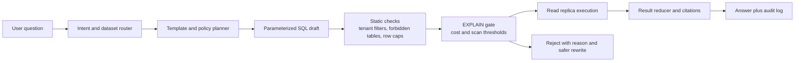

# AI-to-SQL Guardrails With Read Replicas, Query Budgets, and EXPLAIN Gates

Natural-language analytics feels harmless right up until an agent decides a dashboard question deserves a five-table join against production. The failure mode is not usually dramatic. It is a quiet full scan, a missed tenant filter, or a query that looks fine in review but melts a replica at 10:07 a.m.

The fix is not, “just make the prompt stricter.” If you want AI-to-SQL to survive contact with a real warehouse or OLTP replica, you need rails under the model: query-shape constraints, plan inspection, resource budgets, and a hard rule that generated SQL never goes straight to your primary.

This is the workflow I would use for an analytics agent that answers product and ops questions safely. You will learn how to route every query to a read-only lane, reject expensive plans before execution, and leave behind an audit trail that makes incidents debuggable instead of spooky.

## Why this matters

AI-to-SQL systems fail in three predictable ways:

1. They generate technically valid SQL that is operationally rude.
2. They miss business constraints like tenant scoping or soft-delete filters.
3. They answer fast during demos, then collapse when real users ask broad, messy questions.

The practical goal is not to let the model write arbitrary SQL. The goal is to let it assemble safe queries inside a controlled lane.

## Architecture and workflow overview



### Visual plan

- Hero image idea: a dark terminal-style control panel showing question to plan gate to safe result
- Diagram idea: NL request flowing through template planner, static policy, EXPLAIN gate, and read replica
- Optional terminal visual: EXPLAIN rejection with row estimate and scan warning
- Optional comparison table: raw model SQL vs guarded execution lane
- Tags: AI Agents, SQL Safety, Analytics, Platform Engineering, Data Reliability
- Meta description: A practical guide to AI-to-SQL guardrails using read replicas, query budgets, EXPLAIN gates, parameterized templates, and audit logs so natural-language analytics does not turn into runaway database risk.
- Suggested code sections: query policy config, execution gate pseudocode, audited result packet

## Implementation details

### 1. Treat SQL generation as template selection, not open-ended synthesis

```yaml
query_families:
  signup_funnel_by_week:
    dataset: analytics_replica
    sql: |
      SELECT date_trunc('week', created_at) AS week,
             plan_tier,
             count(*) AS signups
      FROM accounts
      WHERE created_at >= :start_date
        AND created_at < :end_date
        AND tenant_id = :tenant_id
      GROUP BY 1, 2
      ORDER BY 1 DESC;
    required_params: [start_date, end_date, tenant_id]
    max_rows: 500
```

Template families are less magical than free-form SQL, which is exactly why they work in production.

### 2. Gate every query with static policy and EXPLAIN budgets

```python
FORBIDDEN_PATTERNS = [r"\bUPDATE\b", r"\bDELETE\b", r"\bINSERT\b"]
MAX_PLAN_ROWS = 2_000_000
MAX_COST = 150_000

async def approve_query(conn, sql, params, context):
    for pattern in FORBIDDEN_PATTERNS:
        if re.search(pattern, sql, flags=re.IGNORECASE):
            return {"ok": False, "reason": f"forbidden pattern: {pattern}"}

    if context["tenant_id"] and "tenant_id = :tenant_id" not in sql:
        return {"ok": False, "reason": "missing tenant scope"}

    plan = await conn.fetchval("EXPLAIN (FORMAT JSON) " + sql, *bind_params(sql, params))
    summary = extract_plan_summary(plan)

    if summary["total_cost"] > MAX_COST or summary["plan_rows"] > MAX_PLAN_ROWS:
        return {"ok": False, "reason": "query budget exceeded", "plan": summary}

    return {"ok": True, "plan": summary}
```

### 3. Use a read-only execution lane with timeouts and row caps

```python
async def run_guarded_query(pool, sql, params, audit):
    async with pool.acquire() as conn:
        await conn.execute("SET statement_timeout = '2500ms'")
        await conn.execute("SET default_transaction_read_only = on")

        approved = await approve_query(conn, sql, params, audit)
        if not approved["ok"]:
            return {"status": "rejected", **approved, "audit": audit}

        rows = await conn.fetch(sql, *bind_params(sql, params))
        return {
            "status": "ok",
            "row_count": min(len(rows), 500),
            "rows": [dict(row) for row in rows[:500]],
            "plan": approved["plan"],
            "audit": audit,
        }
```

```text
$ agent ask "Show top accounts by events this quarter"
planner: selected query_family=events_by_account
policy: tenant scope present
explain: cost=412881 rows=9876543
reject: plan cost too high
rewrite hint: require narrower date range or add event_type filter
```

## What went wrong and the tradeoffs

| Approach | Upside | Downside | Where it fits |
| --- | --- | --- | --- |
| Free-form SQL generation | Maximum flexibility | Easy to create expensive or unsafe queries | Almost nowhere without heavy isolation |
| Template families with params | Predictable and reviewable | Needs ongoing template maintenance | Best default for internal analytics agents |
| Semantic layer plus generated filters | Better abstraction for business users | More metadata work up front | Mature teams with stable metrics definitions |

### Failure modes I would plan for

- The model picks the wrong metric source even though the SQL is cheap.
- EXPLAIN says the plan is fine, but stale stats make execution worse.
- The agent keeps retrying narrower versions that are still useless.
- Sensitive joins sneak through unless column-level policy exists.

### What I would not do

I would not let an analytics agent connect to the primary database.

I would not trust prompt-only instructions like “never write expensive SQL.”

I would not return raw result blobs to the model without a reducer.

## Practical checklist

- [ ] Route agent queries to a read replica or warehouse lane only
- [ ] Require parameterized query families for common analytics tasks
- [ ] Enforce tenant and environment filters in static policy
- [ ] Run EXPLAIN before execution and reject high-cost plans
- [ ] Apply statement timeout, row cap, and retry budget
- [ ] Log question, selected template, plan summary, and final result shape
- [ ] Redact sensitive columns before results re-enter model context
- [ ] Measure estimate-versus-actual drift for repeated query families

> **Best practice:** start with ten useful query families that cover 80 percent of internal questions.

> **Pitfall:** prompt tuning does not replace policy, plan inspection, or metric definitions.

## Conclusion

AI-to-SQL gets much more useful when you stop treating SQL generation as a creativity problem and start treating it as a safety and systems problem. Put the model inside a constrained planning lane, make every query survive policy plus EXPLAIN, and run the result on infrastructure that can afford a mistake.
