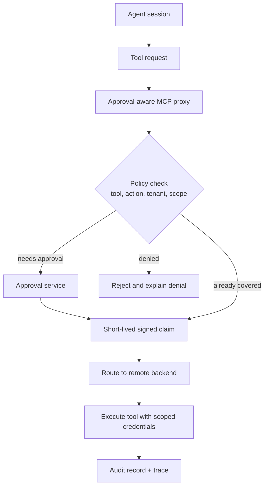

# Approval-Aware MCP Proxies for Remote Tool Routing

If you put a single remote MCP endpoint in front of GitHub, cloud APIs, shell runners, and ticketing systems, you get a nice integration story fast.

You also get a new failure mode fast: the proxy becomes ambient power. One agent session gets broad reach, approvals become fuzzy, and suddenly a harmless-seeming remote tool layer is one policy bug away from writing in the wrong repo or account.

This is the pattern I would use instead: make the proxy approval-aware, route by policy, carry short-lived signed claims, and treat replay defense plus audit trails as part of the tool contract, not a later add-on.

## Why this matters

Remote tool routing is attractive because it centralizes auth, transport, and execution. The trap is that centralization also centralizes blast radius.

In practice, the ugly failures are usually one of these:

- the proxy forwards a valid tool call to the wrong backend because routing keys came from model text
- a read approval quietly gets reused for a write-capable action with a similar shape
- a signed claim is technically valid but gets replayed after the human context changed
- logs show that a tool ran, but not why the proxy believed it was allowed

The point of an approval-aware proxy is not to make tools slower. It is to make remote reach explainable.

## Architecture or workflow overview



Think of the proxy as a control plane. It decides whether a remote action is in-bounds, which backend receives it, which scoped credential lane is used, and what audit evidence gets preserved.

## Implementation details

### 1) Route by server-side policy, not model-declared destination

The model should ask for an action, not pick the backend host or credential lane. That mapping belongs to trusted config.

```yaml
routes:
  github.comment_pr:
    backend: github-api
    risk: write
    approval: required
    scopeTemplate: repo:{repo}/pull:{pull}

  cloud.read_logs:
    backend: observability-gateway
    risk: read
    approval: not-required
    scopeTemplate: project:{project}/service:{service}
```

This prevents a tool call from smuggling its own execution target through a free-form parameter like `base_url`, `host`, or `project_override`.

### 2) Mint claims that are narrow enough to mean something

If your claim can authorize ten related actions across three systems, it is not really scoped.

```json
{
  "claim_id": "clm_01JX8Q8P3W4F",
  "session_id": "sess_4fa2c8",
  "tool": "github.comment_pr",
  "tenant_id": "team-acme",
  "scope": "repo:payments-api/pull:184",
  "approval_id": "apr_93d10c",
  "issued_at": "2026-06-05T12:01:00Z",
  "expires_at": "2026-06-05T12:06:00Z",
  "nonce": "7f8d1e90a3",
  "max_uses": 1
}
```

I like `max_uses: 1` for sensitive writes. It is a tiny bit less convenient and a lot easier to reason about during incident review.

### 3) Verify claims and route with replay defense

The proxy should reject stale, replayed, mismatched, or downgraded claims before the backend ever sees the request.

```ts
async function authorizeAndRoute(req: ToolRequest) {
  const route = routes[req.toolName];
  if (!route) throw new Error("unknown tool");

  const claim = await claimVerifier.verify(req.claim);
  assert(claim.tool === req.toolName, "tool mismatch");
  assert(claim.scope === renderScope(route.scopeTemplate, req.args), "scope mismatch");
  assertNotExpired(claim.expires_at);
  await nonceStore.consumeOnce(claim.nonce);

  return backendRegistry.dispatch(route.backend, {
    toolName: req.toolName,
    args: req.args,
    tenantId: claim.tenant_id,
    audit: {
      sessionId: claim.session_id,
      approvalId: claim.approval_id,
      claimId: claim.claim_id,
    },
  });
}
```

If a proxy validates signature and expiry but forgets nonce consumption or scope matching, it still has a replay problem. That is the bug I worry about most in remote write lanes.

### 4) Separate credential brokering from tool execution

The backend should receive only the least privilege it needs for that specific routed action.

```bash
# proxy-side mental model
claim -> route -> policy -> scoped credential -> backend request

# bad mental model
agent session -> long-lived API token -> everything
```

This is where a lot of otherwise decent systems quietly fail. The proxy becomes policy-aware, but the backend still runs on a broad bearer token that can do five unrelated things if one route is compromised.

### 5) Emit audit records that answer the reviewer’s real question

The useful question is not just “did the tool run?” The useful question is “why did the proxy think this exact remote action was allowed right now?”

| Audit field | Why it matters |
| --- | --- |
| tool name | tells you the intended action |
| route backend | shows which remote system actually handled it |
| session ID | ties the action to a conversation or run |
| approval ID | proves whether a human gate existed |
| claim ID and nonce | helps detect replay or duplicate delivery |
| rendered scope | shows what resource the proxy believed it was acting on |
| credential lane | reveals privilege level used at execution time |

Without that evidence, “auditable” usually just means “we have a timestamp somewhere.”

## What went wrong, and the tradeoffs

### Failure mode 1, proxy routing keys come from prompt text

If the model can choose `backend=prod-admin` or change a project slug in free text, the proxy is only pretending to be a control plane.

Server-side routing tables are boring, which is exactly why I trust them more.

### Failure mode 2, approval semantics are too coarse

A human approves “post the comment”, but the proxy interprets that as broad approval for any comment on that repo for the next hour.

That sounds efficient until an agent retries with altered text or a different target. For write actions, I prefer approval fingerprints that include the tool, scope, session, and a short action summary hash.

### Failure mode 3, proxy convenience raises latency pressure

There is a real tradeoff here. More policy checks, more claim verification, and more audit data mean a little more latency.

| Choice | Benefit | Cost | When I would use it |
| --- | --- | --- | --- |
| broad reusable approvals | fewer prompts | weak boundaries | almost never for writes |
| short-lived single-use claims | strong replay defense | more approval churn | high-risk remote actions |
| per-route scoped credentials | least privilege | operational complexity | any multi-system proxy |
| shared backend token | simpler rollout | big blast radius | only for low-risk internal reads |

I would gladly pay tens of milliseconds at the proxy to avoid a cross-system write incident.

<div class="callout callout-warning"><p><strong>Pitfall:</strong> do not treat transport security as authorization. Mutual TLS, signed requests, or private networking prove who connected to the proxy. They do not prove that a specific action inside the session should be allowed.</p></div>

<div class="callout callout-best"><p><strong>Best practice:</strong> when a routed action is write-capable, bind approval to a rendered scope and a short text summary hash. If the tool target or meaningful payload changes, require a fresh claim.</p></div>

## Practical checklist

- [ ] keep backend selection in trusted proxy config
- [ ] classify routes by read, write, and privilege lane
- [ ] mint short-lived claims with scope, nonce, and max uses
- [ ] consume nonces once to block replay
- [ ] render scopes server-side from validated arguments
- [ ] broker least-privilege credentials per route
- [ ] log route backend, scope, approval, and claim metadata
- [ ] test stale-claim, replay, and wrong-backend failures on purpose

## Conclusion

Remote MCP proxies are worth it when they reduce integration sprawl without turning into a universal skeleton key.

The difference is whether the proxy is just a transport hop or a real control plane. Approval-aware routing, single-use claims, scoped credentials, and reviewer-friendly audit records are what make the remote tool layer safe enough to keep using.

## References

- [Model Context Protocol](https://modelcontextprotocol.io)
- [OAuth 2.0 Token Exchange, RFC 8693](https://datatracker.ietf.org/doc/html/rfc8693)
- [Google Zanzibar paper](https://research.google/pubs/zanzibar-googles-consistent-global-authorization-system/)
- [NIST SP 800-207 Zero Trust Architecture](https://csrc.nist.gov/pubs/sp/800/207/final)
