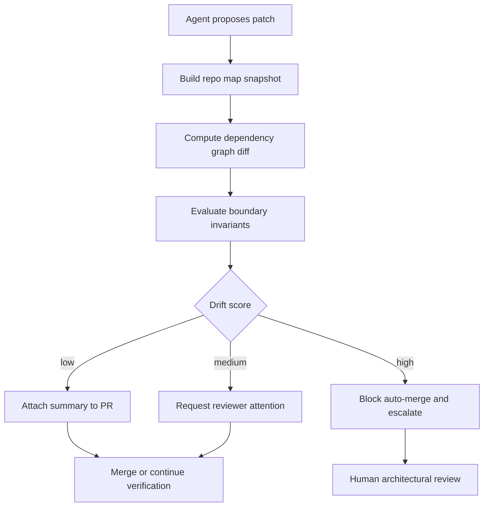

# Architecture Drift Detection for AI-Maintained Repositories

Small AI-generated edits usually look harmless in code review. One import crosses a layer boundary. One utility reaches into a feature module because it was convenient. A background worker starts depending on web-layer code because the model saw a function it could reuse.

None of that looks dramatic in a single PR. A month later the repo feels softer, harder to reason about, and more expensive to change.

If AI is touching a repository every day, you need a structural drift check, not just lint, tests, and human vibes. This post shows the pattern I like: keep a lightweight repo map, snapshot the dependency graph, enforce a few invariants, and attach a reviewer-friendly drift summary to every risky PR.

## Why this matters

AI coding agents are good at solving local problems. Architecture is not a local problem. It is a constraint across time.

That is why drift shows up even when each individual patch seems reasonable. The model optimizes for the shortest valid path in front of it. The repository needs a system that defends boundaries the model cannot reliably hold in working memory.

Useful outcomes from a drift check:

- imports that cross forbidden layers get caught before merge
- reviewers see structural impact, not just line diffs
- agent-generated refactors stay easier to audit
- repo maps stay current enough to guide future runs

## Architecture or workflow overview



The important design choice is that the agent does not decide whether the new structure is acceptable. It produces evidence, and the policy layer scores the change.

## Implementation details

### 1) Keep a lightweight repo map with allowed boundaries

I do not like giant architecture documents for this. They rot fast. A small machine-readable map works better.

```yaml
layers:
  web:
    paths: ["apps/web/src/**"]
    canDependOn: ["services", "shared"]
  services:
    paths: ["packages/services/**"]
    canDependOn: ["data", "shared"]
  data:
    paths: ["packages/data/**"]
    canDependOn: ["shared"]
  shared:
    paths: ["packages/shared/**"]
    canDependOn: []

forbiddenImports:
  - from: "apps/web/src/**"
    to: "packages/data/**/migrations/**"
  - from: "packages/shared/**"
    to: "apps/web/src/**"
```

This does two jobs. It gives the verifier something enforceable, and it gives future agents a compact picture of how the repo is supposed to fit together.

### 2) Turn the patch into a graph diff, not just a file diff

Line diffs are not enough when the real risk is structural. I want an import graph delta.

```ts
type Edge = { from: string; to: string };

type DriftReport = {
  newEdges: Edge[];
  removedEdges: Edge[];
  forbiddenEdges: Edge[];
  crossLayerEdges: Edge[];
};

export function diffGraphs(before: Edge[], after: Edge[], isForbidden: (e: Edge) => boolean): DriftReport {
  const key = (e: Edge) => `${e.from} -> ${e.to}`;
  const beforeSet = new Set(before.map(key));
  const afterSet = new Set(after.map(key));

  const newEdges = after.filter((e) => !beforeSet.has(key(e)));
  const removedEdges = before.filter((e) => !afterSet.has(key(e)));
  const forbiddenEdges = newEdges.filter(isForbidden);

  return {
    newEdges,
    removedEdges,
    forbiddenEdges,
    crossLayerEdges: newEdges.filter((e) => !isForbidden(e) && e.from.split('/')[0] !== e.to.split('/')[0])
  };
}
```

This is where a lot of false confidence disappears. The patch that looked tiny now clearly shows a new web-to-data dependency, or a shared package reaching upward into a feature app.

### 3) Score drift so reviewers do not have to infer severity from raw output

Raw graph diffs are still noisy. I prefer a simple scorecard.

```json
{
  "changed_files": 7,
  "new_edges": 5,
  "removed_edges": 2,
  "forbidden_edges": 1,
  "new_layer_crossings": 3,
  "touches_shared_package": true,
  "touches_runtime_entrypoint": false,
  "drift_score": 82,
  "policy": "human_review_required"
}
```

A rough policy that works well in practice:

| Signal | Why it matters | Suggested weight |
| --- | --- | --- |
| Forbidden import | Direct boundary violation | very high |
| New layer crossing | Structural complexity increase | medium |
| Shared package edit | Wider blast radius | medium |
| Entry point change | Runtime behavior can fan out | medium |
| Pure edge removal | Usually good, but still inspect | low |

The point is not mathematical purity. The point is forcing consistency across dozens of agent-generated PRs.

### 4) Attach a terminal-style evidence packet to the PR

If the evidence is annoying to read, nobody reads it.

```text
$ drift-check --base origin/master --head HEAD
repo-map: .repo-architecture.yml
new-edges: 5
removed-edges: 2
forbidden-edges: 1
new-layer-crossings: 3
score: 82
policy: human_review_required

forbidden:
  apps/web/src/features/billing/page.tsx
    -> packages/data/src/internal/billingLedger.ts

summary:
  - web layer now depends on data internals
  - shared package imports increased by 2
  - patch likely solved a local need by bypassing service boundary
```

That summary is what I want beside the normal CI checks. It gives the reviewer a reason to pause without making them read a graph dump.

## What went wrong, and the tradeoffs

The first failure mode is over-enforcement. If your boundary map is too rigid, the system becomes annoying and people start ignoring it.

The second failure mode is stale architecture metadata. A repo map that nobody updates becomes just another fiction layer, and then the agent plus the verifier are both working from bad assumptions.

A few tradeoffs matter here:

| Approach | Strength | Weakness | When I’d use it |
| --- | --- | --- | --- |
| Static import rules only | fast and cheap | misses runtime coupling | smaller TypeScript or Python repos |
| Full graph snapshots | richer signal | heavier setup and more noise | medium to large repos |
| Reviewer-only architecture checks | flexible | inconsistent, easy to miss | only when repo is changing rarely |
| Agent-generated architecture summaries | scalable context | can hallucinate boundary intent | as evidence, never as sole gate |

<div class="callout-warning">
<strong>Pitfall:</strong> do not let the model update the boundary map automatically in the same PR that violates it. That turns the guardrail into a rubber stamp.
</div>

<div class="callout-best">
<strong>Best practice:</strong> keep the repo map small, reviewable, and tied to real package or directory boundaries. If it takes fifteen minutes to understand, it will not stay alive.
</div>

Security and reliability concerns matter too:

- generated code may import internal modules that were never meant to be public APIs
- graph builders can miss dynamic imports, so high-risk areas still need human review
- monorepos with multiple languages need language-aware parsers or the signal gets patchy
- drift summaries should be stored with the PR so recurring patterns become visible over time

What I would not do is use a giant LLM summary of the codebase as the architecture source of truth. That can help with explanation, but it is too unstable for policy.

## Practical checklist

- [ ] define a tiny repo map with paths and allowed dependencies
- [ ] generate a dependency graph before and after the patch
- [ ] score new layer crossings and forbidden edges separately
- [ ] block auto-merge on explicit boundary violations
- [ ] attach a short reviewer summary, not just raw graph JSON
- [ ] keep shared packages and entry points on a higher-risk lane
- [ ] review and update the repo map when architecture actually changes
- [ ] treat agent summaries as evidence, not policy

## Conclusion

AI-maintained repositories need structural checks because local correctness is not enough.

A repo map, a graph diff, and a small drift score will catch a surprising amount of architectural decay before it spreads. That is the kind of boring safeguard that keeps frequent automation from slowly softening a codebase.

## References

- [dependency-cruiser](https://github.com/sverweij/dependency-cruiser)
- [Madge](https://github.com/pahen/madge)
- [Nx enforce-module-boundaries](https://nx.dev/features/enforce-module-boundaries)
- [ArchUnit](https://www.archunit.org/)
