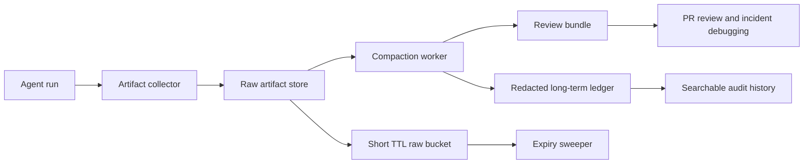

# Artifact Retention Budgets for AI Coding Agents Without Evidence Hoarding

## Visual plan
- **Hero image idea:** A dark control-plane banner that shows raw artifacts flowing into a compact evidence bundle with an explicit expiry lane.
- **Architecture diagram idea:** Agent run to artifact store to compacted evidence bundle to retention policy executor.
- **Terminal-output visual idea:** A retention worker showing which bundles were kept, compacted, and deleted.
- **Comparison table idea:** Compare keep-everything, compact-and-expire, and summary-only approaches.
- **Tags:** AI Coding Agents, Artifact Retention, Evidence Ops, Reviewability, Storage
- **Meta description:** Set artifact retention budgets for AI coding agents so logs, traces, screenshots, and test bundles stay reviewable without turning storage and privacy risk into a quiet tax.
- **Suggested code snippet sections:** Evidence manifest schema, compaction worker config, retention sweeper output.

A lot of AI coding systems get the first half of reviewability right. They save everything. Screenshots, traces, test logs, shell output, prompt packets, diff previews, replay fixtures. Then a month later the storage bucket is huge, search is slow, privacy review is tense, and nobody knows which artifacts still matter.

The opposite failure is just as bad. Teams prune aggressively, then discover the one flaky browser trace or verifier log they needed is already gone when a regression lands. That is how “we have observability” quietly turns into “we had observability for 48 hours.”

What matters is not maximum retention. It is intentional retention. In this post I will show a practical artifact budget model for AI coding agents, how to compact evidence without losing review value, and what I would absolutely not keep forever.

## Why this matters

AI coding agents create more side-channel evidence than human developers do in a normal commit flow. A single run can produce:

- model request and response metadata
- patch proposals and diff previews
- test logs and coverage slices
- browser screenshots and traces
- tool-call payloads
- failure packets for retries or incident replay

That evidence is useful for three reasons:

1. **PR review**, because humans want proof that the patch was verified.
2. **Incident response**, because broken automation is easier to debug when the failing evidence still exists.
3. **Governance**, because regulated teams need an audit trail for risky changes.

But keeping every raw artifact forever is a bad production habit. Storage cost rises, privacy risk expands, and retrieval quality gets worse because the evidence index fills up with stale junk. Evidence is part of the product surface now. It deserves lifecycle design.

## Architecture or workflow overview



The workflow I like has three lanes:

1. **Raw lane**, short-lived and high detail.
2. **Compacted bundle lane**, medium retention and reviewer-friendly.
3. **Ledger lane**, long-lived but heavily reduced metadata.

That split is the important design move. If you only have one bucket, you either keep too much or delete too much.

## Implementation details

### 1. Define a retention manifest per artifact class

The easiest mistake is storing everything with one TTL. Different artifact classes have different value curves.

```yaml
artifact_classes:
  browser_trace:
    raw_ttl_days: 7
    compact_ttl_days: 30
    long_term: false
    redact: [cookies, auth_headers]
  verifier_log:
    raw_ttl_days: 14
    compact_ttl_days: 90
    long_term: true
    compact_strategy: summarize_failures
  patch_packet:
    raw_ttl_days: 30
    compact_ttl_days: 180
    long_term: true
    compact_strategy: keep_diff_and_checks
  model_io:
    raw_ttl_days: 3
    compact_ttl_days: 14
    long_term: false
    redact: [user_content, secrets]
```

A few production notes:

- Browser traces are huge and often privacy-sensitive, so I keep them briefly.
- Verifier logs are more useful over time because they explain why a patch was trusted.
- Raw model I/O is usually the first thing I delete unless there is a compliance reason to store it.

### 2. Emit compact evidence bundles for the runs humans will revisit

Raw artifacts are for machines and immediate debugging. Humans want a smaller packet.

```json
{
  "run_id": "run_2026_06_18_1842",
  "repo": "negiadventures/negiadventures.github.io",
  "commit": "abc1234",
  "task": "publish daily technical blog post",
  "artifacts": {
    "diff": "artifacts/diff.patch",
    "tests": [
      {"name": "html-link-check", "status": "passed"},
      {"name": "sitemap-validate", "status": "passed"}
    ],
    "screenshots": ["artifacts/blog-card.png"],
    "key_logs": ["artifacts/build-summary.log"]
  },
  "risk_flags": ["direct_master_push"],
  "retention": {
    "raw_expires_at": "2026-06-25T12:00:00Z",
    "bundle_expires_at": "2026-09-16T12:00:00Z"
  }
}
```

This bundle is what I would link from a PR, incident ticket, or job history page. It should be boring to read and quick to search.

### 3. Run compaction as a first-class worker, not a manual cleanup job

A lot of teams say they will “clean up artifacts later.” They do not. Retention only works when compaction is part of the pipeline.

```python
from datetime import datetime, timedelta

RETENTION_RULES = {
    "browser_trace": {"raw_days": 7, "compact_days": 30},
    "verifier_log": {"raw_days": 14, "compact_days": 90},
    "patch_packet": {"raw_days": 30, "compact_days": 180},
}

def plan_retention(artifact_type: str, created_at: datetime) -> dict:
    rule = RETENTION_RULES[artifact_type]
    return {
        "raw_delete_at": created_at + timedelta(days=rule["raw_days"]),
        "bundle_delete_at": created_at + timedelta(days=rule["compact_days"]),
    }


def should_compact(run_record: dict) -> bool:
    return (
        run_record["status"] in {"failed", "merged", "escalated"}
        or run_record.get("risk_score", 0) >= 7
    )
```

This is also where you decide what *not* to compact. I would not waste time generating pretty long-term bundles for low-risk runs that changed a comment and passed lint.

### 4. Keep a terminal-friendly retention summary

A small operational detail matters here. When the sweeper runs, the output should explain what happened without making someone open ten files.

```text
$ retention-sweeper --window 24h
run_1842  raw=deleted  compact=kept   ledger=kept   reason=merged_with_risk_flag
run_1843  raw=kept     compact=queued ledger=queued reason=failed_browser_verifier
run_1844  raw=deleted  compact=none   ledger=kept   reason=low_risk_pass
bucket_savings=18.4GB
redaction_failures=0
```

If this summary is missing, operators stop trusting the cleanup job and start over-retaining everything “just in case.”

## Comparison table

| Strategy | Review quality | Storage cost | Privacy exposure | Debug value after 30 days |
| --- | --- | --- | --- | --- |
| Keep everything forever | High at first, noisy later | Very high | Very high | High, but expensive and messy |
| Summary only | Medium | Low | Low | Poor for real incident replay |
| Compact and expire by class | High | Moderate | Moderate to low | High where it matters |

The middle option is the one I would choose almost every time.

## What went wrong and the tradeoffs

### Failure mode 1: “Helpful” raw prompt retention becomes a secret leak

Teams often justify storing model I/O because it helps with prompt debugging. That is true right until a tool output contains a token, customer payload, or internal URL that should never have lived in long-term storage.

My rule is simple: raw model I/O should expire quickly unless it already passed a redaction boundary. If you need long-term debugging, keep normalized fields and hashes, not raw payloads.

### Failure mode 2: over-compaction destroys replay value

I have seen systems compact browser failures into a one-line summary like “selector timeout in checkout flow.” That is not enough. If the run is high-risk or user-visible, you still need one preserved trace or screenshot path for replay.

The tradeoff is not raw versus summary. It is **which classes deserve one durable sample**.

### Failure mode 3: retention policies ignore merge outcome

A failed run and a merged run should not age the same way. Merged risky changes deserve longer-lived proof. Rejected low-signal attempts usually do not.

That means retention should consider:

- risk score
- merge status
- incident linkage
- artifact sensitivity
- whether the run triggered an approval step

### What I would not do

I would not:

- keep every screenshot forever
- store raw prompts long-term by default
- let each tool decide its own ad hoc TTL without a central policy
- make PR reviewers click through dozens of raw artifacts instead of one compact bundle

## Pitfalls and best practices

> **Pitfall:** If your evidence index mixes expired references with still-live metadata, search results become misleading fast. Operators click a record that points to a deleted trace and assume the system is broken.

> **Best practice:** Store retention state next to every artifact reference, and update search documents when compaction or deletion happens. A missing artifact should look intentionally expired, not mysteriously broken.

## Practical checklist

Use this if you are building or cleaning up an agent evidence pipeline:

- [ ] Split artifacts into raw, compact bundle, and long-term ledger lanes.
- [ ] Set TTLs by artifact class, not one global retention number.
- [ ] Redact before long-term storage, not after an incident.
- [ ] Keep one reviewer-friendly bundle per important run.
- [ ] Extend retention for merged, escalated, or incident-linked runs.
- [ ] Make retention sweeps observable with small terminal summaries.
- [ ] Mark expired artifacts clearly in search and audit views.
- [ ] Review retention cost and privacy posture monthly, not only after a scare.

## Conclusion

AI coding agents produce a lot of evidence. That is good, as long as the evidence ages intentionally. The goal is not infinite retention. The goal is to keep the artifacts that still explain why a change was safe, why a run failed, and what a human needs to trust the system later.

If I were setting this up from scratch, I would start with class-based TTLs, compact review bundles, and aggressive deletion of raw model I/O. That gets you most of the reviewability upside without paying the long-term tax of evidence hoarding.
