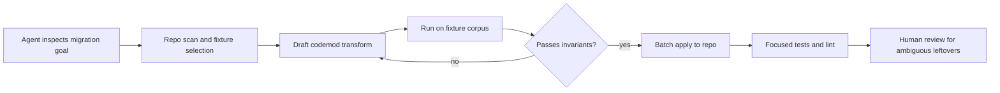

# AST Codemods for AI Coding Agents That Need to Rewrite Large Codebases Safely

A repo-wide API migration looks easy right up until the regex catches a comment, misses an alias, or rewrites a call site that needed human review. This is where a lot of AI-assisted refactors go sideways. The model is good at spotting patterns, but the repository pays the price when the edit mechanism is too blunt.

The safer pattern is to let the agent help design and explain the migration while an AST codemod does the mechanical rewrite. That gives you syntax awareness, narrower blast radius, and diffs that reviewers can reason about.

In this post I’ll walk through a workflow I like for large JavaScript or TypeScript migrations: discover the surface area, draft the transform with an agent, verify it on fixtures, run it in batches, and keep a small human review lane for ambiguous files.

## Why this matters

Large codebases accumulate small API patterns that look regular until you try to change all of them. Renaming a prop, swapping a function signature, or moving a utility between packages often touches hundreds of files. If you let an AI coding agent edit them one by one, you get inconsistent style, duplicated reasoning cost, and a lot of reviewer fatigue.

A codemod flips that model. You write the transformation once, then apply it everywhere the syntax matches. The AI still helps, but it helps in the high-leverage places: choosing the migration rule, drafting the transform, finding edge cases, and generating fixture coverage.

Useful references if you are setting this up:

- [jscodeshift](https://github.com/facebook/jscodeshift)
- [ast-grep](https://ast-grep.github.io/)
- [ts-morph](https://ts-morph.com/)
- [Babel parser](https://babeljs.io/docs/babel-parser)

## Architecture and workflow overview

Hero plan: a dark banner with scan, transform, and verify lanes.



Numbered sequence I would actually use:

1. scan the repo for symbols, imports, and suspicious aliases
2. write a transform that only changes syntax you can prove
3. build fixture pairs for common and ugly edge cases
4. run the transform in dry-run mode and inspect sample diffs
5. batch the rollout so reviewers can spot a bad assumption early

## Implementation details

### 1) Start with repo discovery, not the rewrite

Before touching code, I want a small inventory: where is the old API imported, how many variants exist, and which files are obviously weird. That inventory tells the agent whether this is a codemod problem or a manual refactor with a codemod assist.

```bash
rg "from ['"]@/ui/legacy-button['"]|LegacyButton|buttonStyle=" src --glob '!dist'
rg "<LegacyButton|legacyButton\(" src --glob '!dist' -n
```

I also like exporting a symbol sample for the agent to inspect before it drafts the transform. The goal is to keep it grounded in real usage patterns instead of a guessed abstraction.

### 2) Let the agent draft a codemod, then make the transform deterministic

This example migrates a legacy button API to a new `Button` component, renames `buttonStyle` to `variant`, and converts `isPrimary` to `variant="primary"` only when that is actually safe.

```javascript
module.exports = function transformer(file, api) {
  const j = api.jscodeshift;
  const root = j(file.source);

  root.find(j.ImportDeclaration, { source: { value: '@/ui/legacy-button' } })
    .forEach(path => {
      path.value.source.value = '@/ui/button';
      path.value.specifiers = path.value.specifiers.map(specifier => {
        if (specifier.local && specifier.local.name === 'LegacyButton') {
          return j.importSpecifier(j.identifier('Button'));
        }
        return specifier;
      });
    });

  root.findJSXElements('LegacyButton').forEach(path => {
    path.value.openingElement.name.name = 'Button';
    if (path.value.closingElement) path.value.closingElement.name.name = 'Button';

    path.value.openingElement.attributes = path.value.openingElement.attributes.flatMap(attr => {
      if (!attr || attr.type !== 'JSXAttribute') return [attr];
      if (attr.name.name === 'buttonStyle') attr.name.name = 'variant';
      if (attr.name.name === 'isPrimary') {
        return [j.jsxAttribute(j.jsxIdentifier('variant'), j.stringLiteral('primary'))];
      }
      return [attr];
    });
  });

  return root.toSource({ quote: 'single', trailingComma: true });
};
```

The important thing is not that the agent wrote the first draft. The important thing is that the final transform is deterministic, inspectable, and narrow. If the migration needs business logic, stop and split the work.

### 3) Build fixture tests before the repo run

Codemods feel safe right until a weird file shape breaks them. A tiny fixture harness catches more than people expect because it forces you to encode the ugly examples instead of hoping the main branch will find them later.

```javascript
import { defineTest } from 'jscodeshift/dist/testUtils';

defineTest(__dirname, 'legacy-button-to-button', null, 'basic-jsx');
defineTest(__dirname, 'legacy-button-to-button', null, 'aliased-import');
defineTest(__dirname, 'legacy-button-to-button', null, 'spread-props');
defineTest(__dirname, 'legacy-button-to-button', null, 'already-migrated');
```

A good fixture set usually includes:

- the happy path everyone remembers
- one alias or renamed import
- one file with spread props or nested expressions
- one case that should remain unchanged
- one case you deliberately mark unsupported

### 4) Add a rollout wrapper around the codemod

Agents are helpful here because they can generate the wrapper script and reviewer notes, but I still want the execution lane to be boring.

```bash
#!/usr/bin/env bash
set -euo pipefail

TRANSFORM=codemods/legacy-button-to-button.js
pnpm test codemods
npx jscodeshift -t "$TRANSFORM" src/components src/pages --extensions=ts,tsx,js,jsx --parser=tsx
pnpm eslint src --max-warnings=0
pnpm test -- --runInBand button

echo "Review changed files with: git diff --stat && git diff -- src/components src/pages"
```

That wrapper matters because it keeps the migration tied to verification. A codemod without an execution contract is just a faster way to make the same mistake many times.

## What went wrong and the tradeoffs

### Where codemods beat agent-by-agent edits

| Approach | Best at | Failure mode | Review shape |
| --- | --- | --- | --- |
| Regex replace | tiny literal swaps | false matches, formatting churn | noisy and scary |
| Agent edits per file | nuanced local reasoning | inconsistency and drift | many small, uneven diffs |
| AST codemod | repeatable syntax changes | missed edge cases in transform logic | one rule, many mechanical diffs |
| AST codemod + human lane | mixed migrations | slower upfront setup | best balance for production repos |

### Common failure modes

**Spread props hide meaning.** If `isPrimary` comes in via `...props`, your transform cannot safely infer the final runtime shape. Leave it for human review.

**Type-only imports and local aliases create near-misses.** A migration that only handles the obvious import form will under-report success and leave confusing leftovers.

**Formatting can mask logic bugs.** If the transform rewrites a lot of lines, reviewers may miss the one semantic change that was wrong. I like running Prettier after the transform so formatting noise stays predictable.

**Security and reliability still matter.** If the agent is allowed to generate shell wrappers or edit CI config around the codemod, keep those operations in the same review lane as the transform itself. The dangerous part is often the automation around the rewrite, not the AST walk.

### What I would not do

I would not ask an agent to rewrite 400 files directly when the migration can be described as a syntax tree rule. That costs more, produces less consistent diffs, and makes rollback harder.

I also would not force every migration into a codemod. If the change depends on runtime behavior, product intent, or domain-specific interpretation, an AST transform should only do the easy 80 percent.

## Practical checklist

Use a codemod when most of these are true:

- the old API has a recognizable syntax signature
- the rewrite rule can be expressed without runtime guesses
- you can name unsupported cases up front
- you have a fixture corpus with both valid and invalid shapes
- the transformed files can pass focused lint and test gates
- reviewers can sample the diff and understand the rule quickly

Best-practice summary:

- keep the transform narrow
- generate evidence before rollout
- treat unsupported files as a success condition, not a failure of ambition
- batch the migration so you can stop after the first bad assumption
- save the agent for rule design, edge-case discovery, and reviewer docs

## Conclusion

AI coding agents are great at helping you design a migration, but they should not be the only mechanism that performs it. When a refactor is mostly mechanical, AST codemods give you the leverage and the safety story. The agent adds speed around the edges. The codemod keeps the repo from turning into cleanup week.
