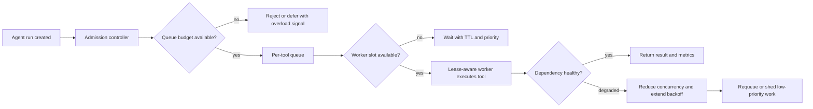

# Backpressure and Concurrency Caps for AI Agents That Would Otherwise DDoS Your Own Tools

Backpressure is the missing control loop in a lot of agent systems. The model gets faster, orchestration gets cleaner, and then one flaky dependency slows down enough that every worker piles on at once.

That is how a helpful agent fleet turns into an internal DDoS. The scary part is that nothing is “down” at first. Queues keep growing, retries look reasonable in isolation, and latency quietly spreads from one tool to every workflow around it.

This post is about the practical fixes that matter: queue budgets, per-tool concurrency caps, overload-aware admission, and lease-based workers that stop pretending infinite parallelism is free.

## Why this matters

Most production agent failures are not caused by one bad prompt. They are caused by too much successful work arriving at a dependency that cannot keep up.

If your agents can call search, CI, GitHub, databases, browsers, or internal APIs, you already have a distributed systems problem. The model layer may decide what to do, but the queueing layer decides whether your system stays useful under stress.

A bounded system degrades honestly. An unbounded one creates ghost incidents: duplicate jobs, runaway retries, stale approvals, and operators who cannot tell whether the tool is slow or just buried.

## Architecture or workflow overview



I like to separate admission from execution. Admission decides whether work is allowed into the system at all. Execution decides how much of that admitted work can run right now against each dependency.

That split matters because the queue is not a trash can. If you let every job in, you have already accepted a future outage.

## Implementation details

### 1) Give every tool its own queue budget

A single global queue hides which dependency is actually overloaded. Per-tool budgets make pressure visible and give you a place to shed load deliberately.

```yaml
tools:
  github:
    maxQueueDepth: 120
    maxConcurrent: 8
    ttlSeconds: 180
  browser:
    maxQueueDepth: 20
    maxConcurrent: 2
    ttlSeconds: 90
  embeddings:
    maxQueueDepth: 400
    maxConcurrent: 32
    ttlSeconds: 60
```

This is intentionally boring configuration. The important part is not the exact numbers. It is that the limits exist, they differ by tool, and they match the real cost profile of each dependency.

I would not give browser automation and embeddings the same concurrency lane just because both are “tools”. One blocks scarce stateful workers. The other is often a cheap network call with better horizontal scaling.

### 2) Make admission control return an overload result the model can handle

If a queue is full, reject the work with a structured signal. Do not silently enqueue it forever.

```python
from dataclasses import dataclass

@dataclass
class AdmissionResult:
    accepted: bool
    reason: str | None = None
    retry_after_ms: int | None = None


def admit(job, stats) -> AdmissionResult:
    lane = stats[job.tool]
    if lane.queue_depth >= lane.max_queue_depth:
        return AdmissionResult(
            accepted=False,
            reason='QUEUE_SATURATED',
            retry_after_ms=15000,
        )
    return AdmissionResult(accepted=True)
```

That error is useful. The model can defer, summarize the overload, or choose a cheaper fallback path. An infinitely growing queue gives it nothing actionable.

### 3) Use worker leases so stalled jobs do not pin capacity forever

A worker should lease a slot, renew it while healthy, and release it decisively when the process crashes or times out.

```sql
create table tool_leases (
  lease_id text primary key,
  tool_name text not null,
  job_id text not null,
  expires_at timestamptz not null,
  heartbeat_at timestamptz not null
);

-- reclaim expired slots
select lease_id, job_id
from tool_leases
where expires_at < now();
```

Without leases, concurrency caps drift upward in practice because dead workers still “count” and operators start overriding limits manually. That is exactly the kind of reliability debt agent platforms accumulate.

### 4) Reduce concurrency when latency spikes, not just when requests fail

Waiting for outright failure is too late. If p95 latency doubles, you should shrink the active worker count before the queue turns toxic.

```python
def next_concurrency(current: int, p95_ms: int, error_rate: float) -> int:
    if error_rate > 0.1:
        return max(1, current // 2)
    if p95_ms > 4000:
        return max(1, current - 2)
    if p95_ms < 1200 and error_rate < 0.02:
        return min(current + 1, 16)
    return current
```

This does not need to be fancy. Simple additive increase and conservative decrease already beats “leave the worker pool at 20 and hope the API forgives us.”

## Terminal output that should exist before you trust the system

```text
tool=github queue_depth=119/120 active_workers=8/8 p95_ms=4820 error_rate=0.03
admission=reject reason=QUEUE_SATURATED retry_after_ms=15000
controller_action=decrease_concurrency new_limit=6
shed_low_priority=true
```

If you cannot see this state quickly, you will debug overload by vibes. That gets expensive fast.

## Comparison table

| Pattern | Works well for | Upside | Downside |
| --- | --- | --- | --- |
| Unbounded queue + fixed workers | Toy demos | Easy to ship | Turns slow tools into backlog explosions |
| Bounded queue + fixed workers | Small stable workloads | Predictable failure mode | Still sluggish during latency spikes |
| Bounded queue + adaptive workers | Mixed production workloads | Better survival under bursty load | Needs metrics and sane control logic |
| Manual operator throttling | Rare high-risk systems | Maximum human oversight | Too slow for routine agent bursts |

## What went wrong and the tradeoffs

The first bad pattern is overvaluing throughput. Teams see an idle model fleet and assume the bottleneck must be more parallelism. Usually the real bottleneck is a fragile tool dependency that never asked for forty concurrent callers.

The second bad pattern is retrying inside the worker while holding the slot. That makes every slow call occupy scarce capacity for longer and starves fresh work that might actually succeed.

The tradeoff is straightforward:

- Tight caps protect dependencies but may increase visible deferrals.
- Loose caps improve best-case latency but make tail events much uglier.
- Priority queues help urgent work, but only if low-priority work can actually be dropped.

### Failure modes worth planning for

- **Retry storms:** every timed-out worker retries together and multiplies pressure.
- **Zombie slots:** crashed workers never release browser or sandbox capacity.
- **Stale work:** queued jobs outlive the context or approval they depended on.
- **Cross-tool contagion:** one slow dependency steals workers from unrelated tools because the scheduler is shared.

## Best-practices checklist

- [ ] Every tool has a queue depth limit and a concurrency cap.
- [ ] Admission rejection is explicit, structured, and visible to the model and operator.
- [ ] Jobs carry TTLs so stale work expires instead of executing late.
- [ ] Worker slots are lease-based and reclaimable after crashes.
- [ ] Concurrency reacts to latency, not just hard failures.
- [ ] Low-priority work can be shed before critical work is impacted.
- [ ] Retry policy is outside the worker hot path when possible.
- [ ] Metrics include queue depth, wait time, active slots, p95 latency, and shed counts.

## What I would do again

1. Start with smaller worker caps than you think you need.
2. Add overload responses that the agent can reason about instead of generic failures.
3. Expire queued jobs aggressively when the user context is no longer fresh.
4. Keep per-tool controls separate even if the infrastructure is shared.

## Conclusion

Agent systems need pressure relief valves just as much as APIs do. Once you bound queues, cap concurrency, and shed load on purpose, the system stops pretending every job can run right now and starts acting like reliable software.

## References

- [Google SRE Book, Handling Overload](https://sre.google/sre-book/handling-overload/)
- [AWS Builders Library, Timeouts, retries, and backoff](https://aws.amazon.com/builders-library/timeouts-retries-and-backoff-with-jitter/)
- [Stripe on idempotent requests](https://stripe.com/docs/api/idempotent_requests)
