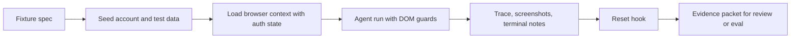

# Browser Session Fixtures for AI Web Agents Without Flaky Demos

AI web agents tend to look impressive right up until they hit the same login wall, stale modal, or half-loaded dashboard for the third run in a row. Then the problem is no longer reasoning quality, it is state drift.

A lot of teams blame the model when the real issue is that the browser environment changes underneath it. Session cookies expire, demo accounts mutate, async widgets race, and one run leaves the next run in a weird state.

This post covers the fixture layer I would build first: seeded browser sessions, deterministic reset hooks, trace capture, and a narrow contract for what an agent is allowed to assume before it starts clicking.

## Why this matters

If your browser-using agent touches real products, reliability comes from controlling the page state before the model ever sees the DOM. A stable fixture layer makes agent evals more meaningful, keeps debugging honest, and stops reviewers from mistaking lucky runs for durable workflows.

> **Short version:** browser agents need environment discipline more than extra prompt prose.

## Architecture or workflow overview

```text
fixture spec
  -> state seeder
  -> browser context with stored auth
  -> agent run with DOM guards
  -> trace and screenshot capture
  -> reset hook
  -> pass/fail evidence packet
```



## Implementation details

### 1. Define the fixture contract before the agent starts

The fixture should describe the account, page entry point, seeded resources, and reset behavior. Keep it explicit enough that a human reviewer can tell what state the agent is relying on.

```yaml
name: billing-upgrade-fixture
base_url: https://staging.example.com
entry_path: /app/billing
account:
  email: agent-billing-fixture@example.com
  role: owner
seed:
  plan: starter
  invoices: 3
  payment_method: visa-test
assert_ready:
  - text=Current plan
  - data-testid=billing-summary
reset:
  endpoint: POST /internal/test/reset-billing-fixture
artifacts:
  trace: true
  screenshots: true
  console: true
```

This becomes the agreement between product state and agent behavior. If the run fails before the ready assertions pass, I treat that as fixture failure, not agent failure.

### 2. Separate session setup from agent execution

I would not let the agent spend tokens logging in unless login itself is the task under test. Preload auth state and hand the agent a clean context.

```ts
import { chromium, type BrowserContext } from '@playwright/test';

export async function createFixtureContext(storageStatePath: string): Promise<BrowserContext> {
  const browser = await chromium.launch({ headless: true });
  return browser.newContext({
    storageState: storageStatePath,
    viewport: { width: 1440, height: 960 },
    ignoreHTTPSErrors: true
  });
}

export async function openFixturePage(context: BrowserContext, url: string) {
  const page = await context.newPage();
  await page.goto(url, { waitUntil: 'domcontentloaded' });
  await page.getByTestId('billing-summary').waitFor();
  return page;
}
```

That one decision removes a huge amount of test flake. It also makes traces more useful because the run starts where the actual workflow starts.

### 3. Add DOM guards that fail early and loudly

Browser agents get into trouble when they act on partially ready interfaces. A few deterministic guards are cheaper than letting the model improvise around loading states.

```python
from playwright.sync_api import Page, TimeoutError as PlaywrightTimeoutError

READY_SELECTORS = [
    "[data-testid='billing-summary']",
    "text=Current plan",
]


def wait_for_fixture_ready(page: Page, timeout_ms: int = 8000) -> None:
    try:
        for selector in READY_SELECTORS:
            page.locator(selector).first.wait_for(timeout=timeout_ms)
    except PlaywrightTimeoutError as exc:
        page.screenshot(path="artifacts/fixture-not-ready.png", full_page=True)
        raise RuntimeError("fixture failed readiness checks before agent execution") from exc
```

### 4. Capture replayable evidence, not just pass-fail text

For browser workflows, traces and screenshots matter more than long natural-language summaries. The best debugging loop is one where you can replay the exact run.

```bash
npx playwright test tests/agent-billing.spec.ts   --trace=on   --video=retain-on-failure   --reporter=line

npx playwright show-trace test-results/agent-billing/trace.zip
```

```text
[fixture] reset complete in 420ms
[fixture] auth state loaded from .auth/billing-owner.json
[fixture] ready selectors satisfied
[agent] opened upgrade modal
[agent] selected annual plan
[agent] failed on missing confirm button
[artifacts] trace.zip, final.png, console.log
```

## Tradeoff table

| Approach | What it optimizes | Failure mode | My take |
| --- | --- | --- | --- |
| Agent logs in every run | Realism | Slow, brittle, token-heavy | Only for auth-specific tests |
| Shared long-lived demo account | Convenience | Hidden state drift between runs | I would avoid this |
| Seeded fixture account plus reset hook | Determinism | Requires backend support | Best default |
| Snapshotting whole browser storage forever | Speed | Stale auth and silent UI drift | Useful only with rotation checks |

## What went wrong or the tradeoffs

### Stale storage state can create fake confidence

A saved auth file feels deterministic until the backend changes a cookie format or feature flag shape. Then the browser opens fine but the product behaves differently.

**What I would not do:** treat storage state files as permanent assets. Rotate and verify them.

### Reset hooks need ownership and limits

The fastest fixtures usually rely on internal reset endpoints or seeded DB helpers. That is great for reliability, but it adds a privileged test surface that needs access controls and auditability.

**Security concern:** keep reset hooks off public networks and scope them to non-production data only.

### Flake often comes from widgets, not the model

Rich dashboards with client-side hydration, toasts, and nested modals can create timing bugs that look like reasoning bugs. If the DOM is not stable, the agent should not be acting yet.

**Best practice:** prefer product-owned ready markers like `data-testid=page-ready` over generic sleep calls.

### Some workflows are not good fixture candidates

OAuth handoffs, captcha flows, and email-based approval links are usually too environment-specific for deterministic browser-agent evaluation.

**My bias:** test the product logic around those steps, not the human-verification ceremony itself.

## Practical checklist

- Create one fixture spec per high-value workflow
- Pre-seed auth state unless login is the task under test
- Add product-owned ready markers before agent execution begins
- Capture trace, screenshot, and console artifacts on every failure
- Reset account and test data after every run
- Rotate storage state files and verify them in CI
- Keep reset hooks private and non-production only

## References

- [Playwright trace viewer](https://playwright.dev/docs/trace-viewer)
- [Playwright authentication guide](https://playwright.dev/docs/auth)
- [Chrome DevTools on performance traces](https://developer.chrome.com/docs/devtools/performance)

## Conclusion

Browser agents get called flaky when the real system around them is flaky. Once you add fixture specs, session seeding, ready guards, and replayable traces, you can finally tell the difference between a bad model decision and a bad browser environment.

That distinction is the difference between demo energy and engineering.
