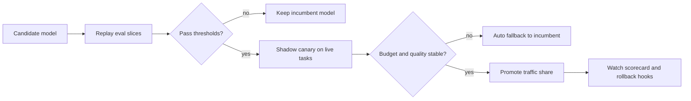

# Canary Model Upgrades for AI Coding Agents Without Surprise Regressions


## Hook

Upgrading the model behind a coding agent looks deceptively safe. The API still returns tokens, the basic smoke tests still pass, and the demos often look better because the new model sounds more confident.

The painful part shows up later. Reviewers start seeing wider diffs, flaky tests reappear, or the agent burns twice the budget to land the same patch quality. Nothing is obviously broken, but the workflow gets worse.

What actually works is treating model upgrades like production releases. Canary them on real task slices, score them against the old lane, and keep a fast rollback path when they start drifting.

## Why this matters

AI coding agents sit in a weird middle ground between CI automation and human pair programming. A model upgrade changes reasoning style, tool behavior, verbosity, and token usage all at once. That means regressions are not just about accuracy.

In production, the failure modes usually look like this:

- bigger diffs for the same task
- more follow-up review comments
- weaker adherence to repo instructions
- slower tool loops because the agent overthinks simple edits
- higher spend from longer context reuse and retries

That is why I prefer a release process with explicit promotion gates rather than a blanket `MODEL=latest` switch.

## Architecture or workflow overview

### Upgrade flow



The shape matters more than the exact tooling:

1. keep an incumbent lane
2. run the candidate on a fixed eval slice
3. shadow it on a small percentage of live work
4. promote only after both quality and cost stay inside bounds

### Decision matrix

| Signal | Incumbent lane | Candidate lane | Promotion rule |
|---|---:|---:|---|
| Task success rate | 92% | 94% | candidate must be at least equal |
| Median tokens per successful task | 18k | 24k | candidate cannot exceed 1.25x without justification |
| Reviewer follow-up comments per patch | 1.3 | 2.1 | candidate must stay below incumbent + 0.3 |
| Instruction adherence failures | 2 | 5 | candidate cannot regress on policy-sensitive tasks |
| End-to-end latency | 84s | 79s | nice to have, not enough alone to promote |

Fast models can look great on latency and still be a worse engineering choice once review load is included.

## Implementation details

### 1) Define upgrade lanes explicitly

I like a config that keeps the incumbent, canary, and rollback policy in one place.

```yaml
# config/model-release.yaml
release:
  incumbent: gpt-5.3-coder
  candidate: gpt-5.4-coder
  liveCanaryShare: 0.1
  rollbackOn:
    successRateDrop: 0.02
    reviewerCommentIncrease: 0.3
    medianTokenMultiplier: 1.25
    policyFailureCount: 1
  evalSlices:
    - repo-onboarding
    - bugfix-small
    - refactor-medium
    - test-generation
    - migration-risky
```

This is boring configuration, which is exactly why it is useful. It makes the rollout policy reviewable and keeps the promotion logic out of scattered scripts.

### 2) Score the candidate against stable task slices

A canary only means something if it runs against stable, labeled tasks. I usually keep a small ledger with expected constraints, not just pass or fail.

```python
PROMOTION_GATES = {
    "success_rate_drop": 0.02,
    "token_multiplier": 1.25,
    "review_comment_increase": 0.3,
    "policy_failures": 1,
}


def should_promote(incumbent, candidate):
    success_drop = incumbent["success_rate"] - candidate["success_rate"]
    token_multiplier = candidate["median_tokens"] / max(incumbent["median_tokens"], 1)
    review_comment_increase = candidate["review_comments"] - incumbent["review_comments"]

    return (
        success_drop <= PROMOTION_GATES["success_rate_drop"]
        and token_multiplier <= PROMOTION_GATES["token_multiplier"]
        and review_comment_increase <= PROMOTION_GATES["review_comment_increase"]
        and candidate["policy_failures"] < PROMOTION_GATES["policy_failures"]
    )
```

The important part is that this scorecard mixes quality, cost, and governance. A pure benchmark score is not enough for coding agents that touch real repos.

### 3) Route live traffic with an immediate fallback lane

A shadow canary becomes much safer when the live router can demote the candidate automatically.

```ts
export function selectModel(task: TaskContext, metrics: ReleaseMetrics): string {
  const candidateHealthy =
    metrics.candidate.successRate >= metrics.incumbent.successRate - 0.02 &&
    metrics.candidate.policyFailures === 0 &&
    metrics.candidate.medianTokens <= metrics.incumbent.medianTokens * 1.25;

  if (!candidateHealthy) return "gpt-5.3-coder";
  if (task.risk === "high") return "gpt-5.3-coder";
  if (Math.random() < 0.10) return "gpt-5.4-coder";
  return "gpt-5.3-coder";
}
```

I would not send high-risk migrations or policy-sensitive edits into a fresh model canary on day one. Keep risky lanes pinned until the candidate earns trust.

### Terminal snapshot

```text
$ agent-evals replay --lane candidate --slice migration-risky
slice: migration-risky
success_rate: 0.89
median_tokens: 31240
policy_failures: 1
review_comment_avg: 2.4
promotion_status: BLOCKED
reason: policy failure + token multiplier 1.41x
```

This is the kind of output that helps operators act quickly. It tells you why the rollout stopped, not just that it stopped.

## What went wrong and the tradeoffs

### The most common bad canary pattern

Teams often promote the candidate because it solved more toy tasks in a benchmark notebook. Then live repos expose the real problems:

- it reads too much context and costs more
- it ignores narrow edit instructions and rewrites adjacent code
- it produces cleaner prose but weaker patches
- it retries tool calls in a way that increases latency and approval friction

### Security and reliability concerns

Model upgrades can change instruction-following behavior around approvals, secret handling, and external tool usage. That means the canary scorecard should include policy-sensitive evals, not just coding correctness.

> **Pitfall**  
> If your eval set contains only happy-path bugfixes, you will miss the failures that actually hurt, like over-broad file edits, weak rollback discipline, or leaking tainted tool output into execution steps.

### Tradeoff table

| Choice | Upside | Downside | When I would use it |
|---|---|---|---|
| Immediate full cutover | simple rollout | high blast radius | almost never |
| Shadow-only canary | safe observation | no direct user impact signal | early validation |
| 10% live canary with fallback | balanced signal and safety | needs router + metrics | default choice |
| Per-task opt-in canary | very controlled | slower learning | high-risk repos or regulated workflows |

## Practical checklist

> **What I would do again**
>
> - keep one incumbent model that is known-good for rollback
> - maintain eval slices that reflect real repo work, not benchmark theater
> - score promotion on quality, cost, and policy behavior together
> - exclude high-risk tasks from early live canaries
> - log why a candidate was blocked so the next upgrade is easier

### Minimal release checklist

- [ ] Candidate model pinned by exact version or alias contract
- [ ] Stable eval slices rerun against incumbent and candidate
- [ ] Policy-sensitive tasks included in the scorecard
- [ ] Live traffic share capped and reversible
- [ ] Automatic fallback lane tested before rollout
- [ ] Reviewer feedback loop included, not just machine evals
- [ ] Budget guard alerts configured for token drift

## Conclusion

Model upgrades for coding agents should feel closer to releasing infrastructure than swapping chatbots. The teams that stay out of trouble keep a fixed incumbent lane, canary against real engineering tasks, and promote only when the scorecard says the upgrade is actually better.

## References

- [OpenAI Evals](https://github.com/openai/evals)
- [Anthropic Engineering](https://www.anthropic.com/engineering)
- [OpenTelemetry](https://opentelemetry.io/)
- [GitHub Actions environments and deployment protection rules](https://docs.github.com/en/actions/deployment/targeting-different-environments/using-environments-for-deployment)
