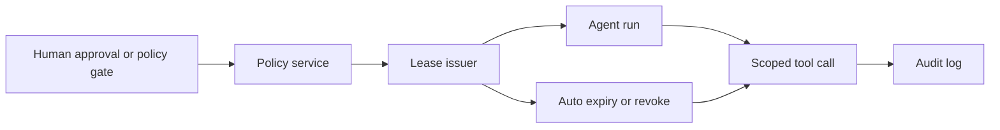

# Capability Leases for AI Agents That Need Temporary Access

## Hook
A lot of agent demos quietly assume the dangerous part away. The model can run the deployment script, hit the production database, or call the billing API because the tool is just there.

That works right up until a prompt is malformed, a tool output gets weird, or a retry loop keeps reusing access that should have expired ten minutes ago.

The safer pattern is not “never give the agent power.” It is “give the agent power briefly, for one reason, with a receipt.” This post walks through capability leases: short-lived grants that let an agent do one bounded thing, then disappear.

## Why this matters
Permanent tool permissions are easy to wire and hard to trust. In production systems, the real problem is not whether the model is smart. It is whether access survives longer than the task that justified it.

Capability leases help in places like:

- deploy approvals for CI agents
- temporary write access to a ticketing system
- one-off production read queries during incident response
- short admin windows for migration or rollback helpers

The core idea is simple: an agent should ask for a lease, receive a scope with a TTL, use it, and lose it automatically.

## Architecture or workflow overview
Visual plan for this post:

- **Hero:** dark banner with lease artifact, policy check, and revoke steps
- **Diagram:** approval service issuing a short-lived lease token to the agent through a policy engine
- **Terminal visual:** sample grant and revoke events from an audit log
- **Comparison table:** permanent permissions vs session-scoped tokens vs capability leases
- **Tags:** AI Agents, Security, Access Control, Tooling, Reliability
- **Meta description:** A practical guide to capability leases for AI agents, using short-lived access grants, scoped tokens, policy checks, and audit trails instead of permanent tool permissions.
- **Code sections:** lease schema, policy check middleware, audit output



1. The agent requests a capability for a specific action.
2. A policy service checks actor, task, scope, and time budget.
3. The lease issuer returns a short-lived token or signed document.
4. The tool verifies the lease before every privileged operation.
5. The lease expires or gets revoked, and the tool stops honoring it.

## Implementation details
### 1) Define the lease like a real contract
A lease should be inspectable and boring. If you cannot explain it to an auditor in one minute, it is too loose.

```json
{
  "lease_id": "lease_01hxqj4k6v9",
  "subject": "agent-run-88421",
  "tool": "deploy.prod",
  "allowed_actions": ["release:create", "release:status"],
  "resource_constraints": {
    "service": "payments-api",
    "environment": "staging"
  },
  "issued_at": "2026-05-06T12:00:00Z",
  "expires_at": "2026-05-06T12:12:00Z",
  "approved_by": "human:anirudh",
  "reason": "promote already-built artifact for smoke test",
  "signature": "base64-ed25519-signature"
}
```

Useful fields:

- **subject** ties access to one run, not a whole session forever
- **allowed_actions** keeps the tool surface narrow
- **resource_constraints** stop cross-environment drift
- **expires_at** forces cleanup even if the worker crashes

What I would not do: issue a generic `admin=true` lease and hope downstream code behaves.

### 2) Verify at the tool boundary, not only in the orchestrator
Central policy helps, but the tool still needs to fail closed. Otherwise an old token can leak through a forgotten side path.

```ts
import { verifyLeaseSignature, isExpired } from './lease-crypto';
import type { Lease } from './types';

export async function authorizeLease(
  lease: Lease,
  action: string,
  target: { service: string; environment: string }
) {
  if (!verifyLeaseSignature(lease)) throw new Error('invalid lease signature');
  if (isExpired(lease.expires_at)) throw new Error('lease expired');
  if (!lease.allowed_actions.includes(action)) throw new Error('action denied');
  if (lease.resource_constraints.service !== target.service) throw new Error('service denied');
  if (lease.resource_constraints.environment !== target.environment) throw new Error('environment denied');

  return true;
}
```

This check should happen on every privileged call. Not once at session start.

### 3) Keep the issuance path small and observable
Lease issuance tends to sprawl because teams pack in too many escape hatches. I prefer one small endpoint with explicit defaults.

```python
from datetime import datetime, timedelta, timezone

MAX_TTL_SECONDS = 900


def issue_lease(request, approver_id):
    ttl = min(request.get("ttl_seconds", 300), MAX_TTL_SECONDS)
    now = datetime.now(timezone.utc)

    lease = {
        "lease_id": new_lease_id(),
        "subject": request["subject"],
        "tool": request["tool"],
        "allowed_actions": request["allowed_actions"],
        "resource_constraints": request["resource_constraints"],
        "issued_at": now.isoformat(),
        "expires_at": (now + timedelta(seconds=ttl)).isoformat(),
        "approved_by": approver_id,
        "reason": request["reason"],
    }

    write_audit_event("lease.issued", lease)
    return sign_lease(lease)
```

The important design choice is the max TTL. Teams almost always start too long. Five to fifteen minutes is enough for most dangerous tasks.

### 4) Show the operator what changed
If the human cannot see what was granted, approval becomes theater.

```bash
$ clawctl lease inspect lease_01hxqj4k6v9
subject: agent-run-88421
scope: deploy.prod -> release:create,release:status
resource: payments-api / staging
approved-by: human:anirudh
expires-in: 08m14s
status: active
```

That terminal output is not decoration. It is part of the control surface.

## Comparison table
| Pattern | Good at | Main risk | My take |
| --- | --- | --- | --- |
| Permanent tool credentials | Simplicity | Hidden blast radius, stale access | Fine for read-only low-risk tools, bad default for write paths |
| Session-scoped credentials | Slightly better containment | Sessions outlive tasks, accidental reuse | Better than permanent, still too broad for risky actions |
| Capability leases | Narrow, explainable access | More plumbing and policy work | Best default for dangerous tools |

## What went wrong / tradeoffs
### Failure mode 1: the lease outlived the queue
One ugly bug pattern is when a worker retries a job after a long delay, but the old lease is still cached somewhere. The job looks “resumable” and suddenly performs a stale action.

Fix: bind the lease to both a run ID and a monotonic attempt ID, then reject mismatches.

### Failure mode 2: humans approve scopes they cannot parse
If the approval card says “Grant elevated tool access,” people will click yes because they want the task finished.

Fix: show exact action verbs, target resource, TTL, and reason. Small text details matter here.

### Failure mode 3: revocation exists on paper but not in the tool
I have seen systems add a revoke button while the downstream tool never checks the revocation ledger after first validation.

Fix: either make leases short enough that revocation is rare, or check revocation on every state-changing operation.

### Security and reliability concerns
- Signed leases are better than opaque booleans in memory.
- Clock skew matters if TTLs are short, so keep servers NTP-sane.
- Audit logs need append-only or tamper-evident storage if these leases gate production writes.
- If a tool fans out to sub-tools, decide whether the lease can delegate. My default is no.

## Practical checklist
Use capability leases when the tool can change state, spend money, expose secrets, or touch prod.

- [ ] Scope the lease to a run, not a whole assistant identity
- [ ] Limit actions to verbs the human can understand
- [ ] Add explicit resource constraints like environment, repo, or service
- [ ] Set a hard max TTL and keep it short
- [ ] Verify the lease at the privileged tool boundary
- [ ] Log issuance, use, expiry, and revoke events
- [ ] Show approval details before the human clicks yes
- [ ] Refuse delegation unless you have a strong reason to allow it

## Best-practices callout
The trick is not making the model “safe enough” to trust forever. It is making access temporary enough that one bad step cannot turn into ambient power.

## Conclusion
Capability leases add friction, but it is the useful kind. They turn “the agent can do this” into “the agent can do this, for this reason, until this time, and we can prove it.” For real systems, that is a much better deal.
