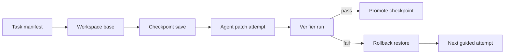

# Checkpointed Workspaces for AI Coding Agents Without Restarting Every Debug Loop

## Visual plan
- **Hero image idea:** A dark control-plane banner showing a clean workspace, checkpoint diff, and fast rollback lane.
- **Architecture diagram idea:** Task manifest to workspace base to risky edit to verifier to rollback or promotion.
- **Terminal-output visual idea:** A checkpoint CLI showing save, verify, and restore steps after a failing patch.
- **Comparison table idea:** Compare no checkpoints, full VM snapshots, and diff-plus-manifest checkpoints.
- **Tags:** AI Coding Agents, Workspace Checkpoints, Recovery, Verification, Developer Workflow
- **Meta description:** Use checkpointed workspaces, resumable manifests, and verifier-aware rollback points so AI coding agents can recover from bad edits without restarting every long debug loop from scratch.
- **Suggested code snippet sections:** checkpoint manifest schema, save-and-restore helper, terminal verification output.

A lot of AI coding demos assume the agent gets the edit mostly right on the first pass. Real debugging loops are messier. The agent changes a config file, tests fail in a new way, a generated migration dirties the workspace, and suddenly the next attempt is building on accidental state instead of the last known-good point.

Most teams respond with brute force. They restart the whole task, rebuild the environment, and rehydrate context from scratch. That works, but it is slow, expensive, and surprisingly easy to get wrong when the original bug only showed up after ten minutes of setup.

A better pattern is to checkpoint the workspace on purpose. In this post I will show how to use lightweight snapshots, resumable task manifests, and verifier-aware rollback points so AI coding agents can recover quickly without pretending every experiment deserves a fresh machine.

## Why this matters

Long-running AI coding tasks often accumulate hidden state:

- generated files that should not survive the next attempt
- dependency installs that changed the environment
- test fixtures that mutated local data
- half-finished migrations or build outputs
- “temporary” patches that quietly became the new baseline

That hidden state hurts in three ways:

1. **Bad retries get compounded.** The next edit is applied on top of accidental damage.
2. **Verification becomes noisy.** A failing test may reflect residue from the previous attempt, not the current patch.
3. **Latency balloons.** Restarting the whole environment every time wastes both human and model time.

Checkpointed workspaces give you a middle path between fragile in-place iteration and expensive full rebuilds.

## Architecture or workflow overview



The core idea is simple:

1. Start from a known workspace base.
2. Save a checkpoint before risky edits.
3. Run the agent and verifier.
4. Promote the checkpoint if the verifier passes.
5. Restore quickly if the verifier fails or the workspace drifts.

That is enough to remove a lot of chaos from iterative agent work.

## Implementation details

### 1. Store a small checkpoint manifest next to the workspace

The checkpoint should describe what can be restored, not only where the files live. I like a manifest that tracks the repo commit, untracked file policy, and verifier hints.

```yaml
run_id: run_2026_06_19_1201
repo: negiadventures/negiadventures.github.io
base_commit: 4b83d9a
checkpoint_id: cp_003
created_at: 2026-06-19T12:07:00Z
restore_strategy: git_plus_overlay
tracked_files:
  from_git: true
untracked:
  include:
    - tmp/test-fixtures/
    - .agent-state/
  exclude:
    - node_modules/
    - .venv/
verifier:
  command: python3 scripts/check_blog_links.py
  expected_clean_after_restore: true
notes:
  - before_html_template_edit
```

The manifest matters because a checkpoint is not just a blob of files. It is an agreement about how restoration should work.

### 2. Use Git for tracked state, overlay archives for the messy bits

Full VM or filesystem snapshots are sometimes justified, but they are heavier than most coding tasks need. For repository work, I prefer a hybrid approach: Git for tracked files, a small archive for selected untracked state.

```python
from pathlib import Path
import subprocess
import tarfile


def save_checkpoint(workdir: Path, checkpoint_dir: Path, name: str, include_untracked: list[str]) -> None:
    cp_dir = checkpoint_dir / name
    cp_dir.mkdir(parents=True, exist_ok=True)

    tracked_patch = subprocess.check_output(
        ["git", "diff", "--binary", "HEAD"], cwd=workdir, text=True
    )
    (cp_dir / "tracked.patch").write_text(tracked_patch)

    with tarfile.open(cp_dir / "overlay.tar.gz", "w:gz") as tar:
        for rel_path in include_untracked:
            path = workdir / rel_path
            if path.exists():
                tar.add(path, arcname=rel_path)
```

```python
def restore_checkpoint(workdir: Path, checkpoint_dir: Path, name: str) -> None:
    cp_dir = checkpoint_dir / name
    subprocess.run(["git", "reset", "--hard", "HEAD"], cwd=workdir, check=True)
    subprocess.run(["git", "clean", "-fd"], cwd=workdir, check=True)

    patch_file = cp_dir / "tracked.patch"
    if patch_file.read_text().strip():
        subprocess.run(["git", "apply", "--whitespace=nowarn", str(patch_file)], cwd=workdir, check=True)

    overlay_file = cp_dir / "overlay.tar.gz"
    if overlay_file.exists():
        with tarfile.open(overlay_file, "r:gz") as tar:
            tar.extractall(workdir)
```

This is lightweight, inspectable, and fast enough for most patch loops. I especially like that reviewers can inspect the patch-based checkpoint instead of treating restore state like magic.

### 3. Tie checkpoint promotion to verifier milestones

A checkpoint is only useful if you know when it became trustworthy. The promotion rule should follow verifier state, not human optimism.

```json
{
  "checkpoint_id": "cp_003",
  "status": "candidate",
  "created_before_step": "rewrite blog hero block",
  "verifiers": [
    {"name": "html-link-check", "status": "passed"},
    {"name": "sitemap-validate", "status": "passed"},
    {"name": "visual-smoke", "status": "skipped"}
  ],
  "promotion_rule": "promote_when_all_required_verifiers_pass",
  "on_failure": "restore_and_retry"
}
```

The mistake I see most often is treating “the agent said it fixed it” as a promotion event. It is not. Promotion should happen only after the same checks a human reviewer would trust.

### 4. Keep a terminal log that explains the recovery path

Small operational output goes a long way when you are debugging an automation run at 2 AM.

```text
$ claw-checkpoint run --task fix-broken-blog-card
checkpoint saved: cp_003
agent patch attempt: 2
verifier: html-link-check .......... passed
verifier: sitemap-validate ......... failed
reason: missing blog url entry for checkpointed-workspaces-ai-coding-agents.html
restoring checkpoint cp_003
workspace status: clean
next action: regenerate sitemap and rerun
```

If the restore path is not visible in logs, operators start distrusting the checkpoint system and go back to full restarts.

## Comparison table

| Strategy | Recovery speed | Storage cost | Reviewability | Best use case |
| --- | --- | --- | --- | --- |
| No checkpoints, retry in place | Fast at first, then chaotic | Low | Poor | Tiny one-shot edits |
| Full machine snapshots | Moderate to slow | High | Low to medium | Heavy environment drift |
| Git plus overlay checkpoints | Fast | Moderate | High | Most repo-based agent workflows |

I like the hybrid model because it restores quickly without hiding what changed.

## What went wrong and the tradeoffs

### Failure mode 1: checkpointing too late

If you save the checkpoint after the agent already mutated the workspace, you have just preserved the problem. The clean point needs to exist before risky edits, dependency changes, or migrations.

### Failure mode 2: archiving too much junk

If the overlay includes `node_modules`, virtualenvs, build caches, or giant browser traces by default, save and restore times get bloated fast. Most of that state is cheaper to rebuild than to archive.

### Failure mode 3: restoring files but not meaning

A restored workspace is not enough if the agent lost the reasoning context that explains what it was trying next. That is why I like pairing checkpoints with a resumable task manifest that records:

- the last failing verifier
- the current hypothesis
- files under active edit
- the next safe move

### Security and reliability concern

Checkpoint archives can accidentally capture secrets in local config files, test fixtures, or generated outputs. Treat checkpoint overlays like artifacts with retention rules, not like harmless temp files.

### What I would not do

I would not:

- snapshot every single agent turn
- store giant dependency trees inside each checkpoint
- promote a checkpoint without verifier evidence
- let restore logic run silently without logging what was brought back

## Pitfalls and best practices

> **Pitfall:** If restore uses `git clean -fd` without a deliberate allowlist for useful untracked fixtures, the system will “recover” by deleting the exact local state that made the failure reproducible.

> **Best practice:** Keep untracked overlay rules explicit and small. If a directory is worth restoring, name it in the manifest. If it is not named, assume it can be rebuilt.

## Practical checklist

- [ ] Save checkpoints before risky edits, not after the workspace is already dirty.
- [ ] Track repo commit, restore strategy, and untracked overlay rules in a manifest.
- [ ] Use verifier results to promote or reject checkpoints.
- [ ] Keep overlay archives small and explicit.
- [ ] Log save, restore, and promotion events in terminal-friendly form.
- [ ] Apply retention rules to checkpoint archives so they do not become a quiet storage leak.
- [ ] Pair each checkpoint with a short “next hypothesis” note for the next attempt.
- [ ] Test restore on purpose before you trust it during an incident.

## Conclusion

AI coding agents do not need a pristine new machine for every mistake, but they do need recovery discipline. Checkpointed workspaces give you a practical way to preserve a clean baseline, recover from bad experiments quickly, and keep long-running debug loops grounded in evidence instead of accidental residue.

If I were setting this up today, I would start with Git-plus-overlay checkpoints, verifier-based promotion, and short-lived checkpoint retention. That gives most teams a big reliability win without the operational tax of full environment snapshots.
