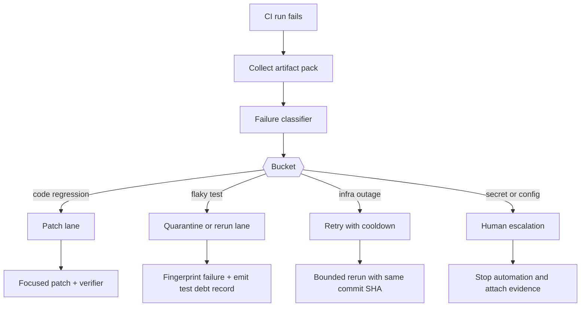

# CI Failure Triage for AI Coding Agents That Should Not Retry Blindly

## Visual plan
- **Hero image idea:** dark CI control-room banner with artifact pack, failure bucket, and safe lane callouts
- **Architecture or diagram idea:** Mermaid flow from failed run to classifier, artifact packer, retry lane, and patch lane
- **Optional terminal-output visual idea:** a failed GitHub Actions run summary showing bucket assignment and retry verdict
- **Optional comparison table idea:** code bug vs flaky test vs infra fault vs secret/config failure
- **Tags:** AI Agents, CI/CD, Reliability, Test Automation, GitHub Actions
- **Meta description:** A practical guide to triaging CI failures for AI coding agents with failure buckets, artifact packs, flaky-test fingerprints, and patch-vs-retry rules so automation stops retrying doomed jobs or patching around broken infrastructure.
- **Suggested code snippet sections:** failure classifier config, artifact bundle payload, retry policy logic

## Hook
Most AI coding pipelines treat a red CI run like a generic “try again” signal. That is how you end up paying for three more model calls while the real problem is a bad cache key, a missing secret, or one flaky browser test on Ubuntu.

A human reviewer usually spots the difference quickly. The log says `npm ERR! 401`, or the stack trace only appears on one shard, or the failure is obviously infra because the Docker pull timed out before tests even started.

Agents need that judgment encoded. This post walks through a triage pattern I like: classify failures into buckets, collect a compact artifact pack, then send the run into an explicit retry lane, patch lane, or human-escalation lane.

## Why this matters
When AI agents are allowed to patch code after CI fails, the expensive mistake is not a bad diff. It is misdiagnosis.

If the run failed because the code is wrong, generating a patch is useful. If the run failed because the runner lost network, a test is flaky, or a secret is unavailable on forks, code changes are noise. They waste review time and can even make the branch worse.

In production repo automation, I care about four outcomes:

- **faster recovery** for real code regressions
- **lower token burn** on failures that should never trigger another model pass
- **cleaner audit trails** for why the system retried, patched, or escalated
- **fewer fake fixes** that paper over infra or test hygiene problems

## Architecture or workflow overview


The key design choice is that retry, patch, and escalation are different products. They need different evidence, different budgets, and different permissions.

## Implementation details

### 1) Normalize failures into buckets before you ask the model to help
I would not feed the raw CI transcript straight back into the agent. First reduce it into a classifier input with exit signals, failing step names, and a few high-value log lines.

```yaml
buckets:
  code_regression:
    match_any:
      - "AssertionError"
      - "TypeError:"
      - "undefined is not a function"
    action: patch
    max_auto_retries: 0
  flaky_test:
    match_any:
      - "Timeout 30000ms exceeded"
      - "ECONNRESET during test"
      - "stale element reference"
    action: rerun_once
    max_auto_retries: 1
  infra_fault:
    match_any:
      - "failed to pull image"
      - "network timed out"
      - "No space left on device"
    action: cooldown_retry
    max_auto_retries: 2
  secret_or_config:
    match_any:
      - "401 Unauthorized"
      - "Missing required environment variable"
      - "Resource not accessible by integration"
    action: escalate
    max_auto_retries: 0
```

This does not need to be perfect. It just needs to be good enough to stop obviously wrong remediation paths.

### 2) Build a compact artifact pack, not a log dump
The artifact pack is what I would persist and pass downstream. It is smaller than the full logs, but rich enough for both an agent and a human reviewer.

```json
{
  "run_id": 194281775,
  "commit_sha": "1d3c5af",
  "workflow": "test-and-lint",
  "failed_job": "playwright-e2e",
  "bucket": "flaky_test",
  "fingerprint": "playwright-timeout:checkout.spec.ts:guest checkout works",
  "first_failure_line": "Timeout 30000ms exceeded while waiting for [data-test=place-order]",
  "suspect_files": ["tests/e2e/checkout.spec.ts", "playwright.config.ts"],
  "rerun_eligible": true,
  "links": {
    "run": "https://github.com/org/repo/actions/runs/194281775",
    "artifacts": "https://github.com/org/repo/actions/runs/194281775/artifacts"
  }
}
```

I like storing one fingerprint per distinct failure shape. That makes it easier to spot recurring flakes without rereading the same logs every day.

### 3) Make retry policy explicit in code
Blind retry loops are where automation gets sloppy. Put the retry decision behind a small policy function so you can audit and tune it.

```ts
export function decideNextAction(input: {
  bucket: 'code_regression' | 'flaky_test' | 'infra_fault' | 'secret_or_config';
  retriesUsed: number;
  maxRetries: number;
  sameFingerprintCount: number;
}) {
  if (input.bucket === 'code_regression') {
    return { action: 'open_patch_lane', reason: 'code evidence present' };
  }

  if (input.bucket === 'flaky_test' && input.retriesUsed < 1) {
    return { action: 'rerun_same_sha', reason: 'single rerun allowed for flaky bucket' };
  }

  if (input.bucket === 'infra_fault' && input.retriesUsed < input.maxRetries) {
    return { action: 'cooldown_retry', reason: 'runner or network fault likely transient' };
  }

  return {
    action: 'escalate',
    reason: input.sameFingerprintCount > 2
      ? 'repeated fingerprint suggests systemic issue'
      : 'policy disallows more automation'
  };
}
```

The nice thing about this pattern is that the model no longer decides whether it deserves another turn. The runtime does.

### 4) Add a terminal-style summary for reviewers
Short summaries save a lot of human patience. This is the kind of output I want attached to a bot comment or run note.

```text
$ triage-ci-failure --run 194281775
bucket: flaky_test
fingerprint: playwright-timeout:checkout.spec.ts:guest checkout works
sha: 1d3c5af
next-action: rerun_same_sha
why: single rerun allowed for flaky bucket
notes: same code passed on previous two commits, failure isolated to e2e shard 3
```

That is enough for someone skimming the PR to understand why the system retried instead of opening a bad patch.

## What went wrong, and the tradeoffs
One lesson here is that failure buckets drift. Tests change, CI providers change, and a pattern that used to mean “flaky” can become a real regression after a framework upgrade.

Another lesson is that artifact packs can become too thin. If you over-reduce the evidence, the patch lane loses the context it needs to fix a legitimate bug. If you under-reduce it, you are back to shoving giant logs into the model.

| Bucket | Best first action | Risk if misclassified | What I watch |
| --- | --- | --- | --- |
| Code regression | Open patch lane | Missed bug or bad auto-fix | failing test name, blame window, suspect files |
| Flaky test | Rerun once, same SHA | hides real instability | fingerprint frequency, shard skew, pass-on-rerun rate |
| Infra fault | Cooldown retry | wasteful loops during outages | provider status, runner error rate, pull/cache failures |
| Secret or config | Escalate to human | impossible code patch attempts | auth errors, env availability, permission scopes |

### A few failure modes I would not ignore
- **Fork PR permissions**: bots often try to “fix” code when the real problem is that secrets are intentionally unavailable to forked workflows.
- **Test-order dependence**: reruns can pass and still hide contamination between tests.
- **Artifact expiry**: if your pack points at logs that vanish in a day, incident review gets much harder.
- **Cost leaks**: one noisy flake can repeatedly wake an expensive patching agent unless fingerprint repetition is capped.

<div class="callout callout-warning"><p><strong>Pitfall:</strong> never let the patch lane mutate the branch after a failure bucket that says <code>secret_or_config</code>. If the environment is wrong, code changes are usually theater.</p></div>

<div class="callout callout-best"><p><strong>Best practice:</strong> keep the patch lane focused on suspect files and the failing test context. The agent should get a narrow packet, not the entire workflow transcript.</p></div>

## Practical checklist
- [ ] define a small, reviewable set of CI failure buckets
- [ ] collect compact artifact packs with stable fingerprints
- [ ] separate retry, patch, and escalation lanes in code
- [ ] cap retries by bucket, not with one global number
- [ ] rerun flaky buckets on the same commit SHA before changing code
- [ ] persist failure fingerprints so repeat offenders are visible
- [ ] stop automation on auth, secret, and permission failures
- [ ] attach a short reviewer summary to every automated decision

## Conclusion
AI coding agents get much better the moment CI failure handling stops being one vague “fix it” loop.

Bucket the failure, preserve the evidence, and make retry a policy decision. That alone cuts a lot of bad patches, useless reruns, and noisy automation theater.

## References
- [GitHub Actions workflow commands and contexts](https://docs.github.com/actions)
- [OpenTelemetry semantic conventions](https://opentelemetry.io/docs/specs/semconv/)
- [pytest flaky test guidance](https://docs.pytest.org/en/stable/explanation/flaky.html)
- [Buildkite test analytics concepts](https://buildkite.com/docs/test-engine)
