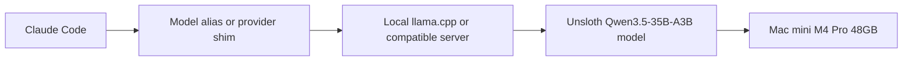

# How to Run Claude Code with Unsloth Qwen3.5-35B-A3B on a Mac mini M4 Pro

If you want Claude Code to use a local model, the hard part is not finding a model name. The hard part is choosing the right model shape, getting the serving stack right, and avoiding the performance traps that make open models feel much slower than they should.

This guide walks through a practical setup for running Claude Code with **Unsloth/Qwen3.5-35B-A3B** on a **Mac mini M4 Pro with 48GB of unified memory**. The goal is not just to get it technically running. The goal is to get a setup that is usable for real coding sessions, especially agentic flows where latency compounds across many tool calls.

The short version is that **Qwen3.5-35B-A3B is often a better local fit than the dense Qwen3.5-35B** for this kind of workflow because it is designed for more efficient inference while still retaining strong coding ability. On a machine like an M4 Pro Mac mini, that difference matters.

## Who this guide is for

This guide is for people who want:

- a local fallback or primary model for Claude Code
- better privacy and local control than a hosted-only setup
- a step-by-step macOS workflow they can copy without guessing
- a coding model that is practical for repeated agentic turns, not just one-off completions

## First fix the slowdown issue

Before anything else, **See Fixing 90% slower inference in Claude Code first to fix open models being 90% slower due to KV Cache invalidation**.

This matters because many people judge an open-model setup before fixing the most obvious performance trap. If Claude Code is invalidating the KV cache too aggressively, the model can feel dramatically slower than it should, even if the model and hardware are otherwise fine.

That means the right setup order is:

1. understand the KV cache issue
2. apply the fix or recommended configuration from the Unsloth guidance
3. then judge throughput and usability

References:
- [Unsloth Claude Code basics](https://unsloth.ai/docs/basics/claude-code)
- If you are following Unsloth's companion notes on KV cache invalidation, do that first before benchmarking the final setup.

## Why Qwen3.5-35B-A3B is a good fit for agentic coding

A dense 35B model can still be very capable, but for local agentic setups you usually care about more than raw benchmark quality. You care about latency, sustained throughput across many requests, memory pressure, and whether the model remains pleasant to use when the tool loop gets long.

That is where **Qwen3.5-35B-A3B** gets interesting. The A3B version is optimized around a more efficient mixture-of-experts style architecture, which means you can often get better speed behavior than a dense 35B model while still keeping strong coding performance.

## Quick comparison

| Model | Why you might choose it | Main downside | Best fit |
|---|---|---|---|
| Dense Qwen3.5-35B | Strong all-around quality | Heavier, slower local feel on repeated turns | Higher-latency local use or stronger hardware |
| Unsloth/Qwen3.5-35B-A3B | Better efficiency for local inference, practical for agent loops | Still not as strong as top hosted frontier models in every scenario | Local Claude Code workflows and iterative coding |
| Smaller Qwen variants | Faster response and easier memory fit | Lower ceiling on difficult coding tasks | Lightweight local assistance |

The point is not that the dense model is bad. The point is that for **Claude Code-style agentic usage**, where you care about many repeated calls and not just a single completion, the efficient variant is often the more practical choice.

## Hardware target: Mac mini M4 Pro with 48GB

This is a strong machine for local development because the unified memory pool makes larger local model setups much more realistic than they would be on many laptops. You still have to be careful with context size, quantization choice, and server flags, but the machine is a very good fit for a serious local coding workflow.

At a practical level, you should expect to spend most of your time tuning for:

- stable model loading
- reasonable context size
- good cache behavior
- acceptable parallelism
- avoiding pathological slowdowns

## Architecture overview



In practice, Claude Code talks to a model alias, that alias points to a local server, and the local server hosts the Unsloth model with the serving flags that keep latency under control.

## Step 1: install prerequisites on macOS

Start with the basic toolchain.

```bash
xcode-select --install
brew install git cmake python node
```

If you already have Homebrew and the developer tools, this should be quick. The point is just to make sure you have the build and runtime dependencies needed for local serving and command-line tooling.

## Step 2: install or build llama.cpp

If you want the most predictable local serving path on macOS, `llama.cpp` is a good default.

```bash
git clone https://github.com/ggml-org/llama.cpp.git
cd llama.cpp
cmake -B build
cmake --build build --config Release -j
```

If you already have a working `llama.cpp`, you can skip rebuilding it.

## Step 3: get the Unsloth model

Follow the Unsloth guidance for the exact model artifact you want. For a local Claude Code workflow on Apple Silicon, an Unsloth-flavored Qwen3.5-35B-A3B GGUF is the practical target here.

A representative local path might look like this:

```bash
mkdir -p ~/models/qwen
# place the model file here once downloaded
ls ~/models/qwen
```

One practical filename pattern looks like this:

```text
Qwen3.5-35B-A3B-UD-Q4_K_XL.gguf
```

The exact file name may vary depending on the published artifact and quantization you choose.

## Step 4: launch the local inference server

A representative `llama.cpp` server command for this setup looks like this:

```bash
cd ~/ai/llama.cpp
./llama-server \
  --model ~/models/qwen/Qwen3.5-35B-A3B-UD-Q4_K_XL.gguf \
  --alias unsloth/Qwen3.5-35B-A3B \
  --temp 0.6 \
  --top-p 0.95 \
  --top-k 20 \
  --min-p 0.0 \
  --port 8081 \
  --parallel 4 \
  --kv-unified \
  --cache-type-k q8_0 --cache-type-v q8_0 \
  --flash-attn on \
  --ctx-size 131072
```

## Why these flags matter

- `--alias` gives Claude Code a stable model name to target.
- `--parallel 4` helps the server handle multi-turn activity more smoothly.
- `--kv-unified` and the cache flags matter for performance and consistency.
- `--flash-attn on` is important for throughput.
- `--ctx-size 131072` is ambitious, so you may want to lower it if memory pressure or latency becomes ugly.

## Step 5: create a simple Claude Code alias

A simple way to test the local model with Claude Code is to create a shell alias that pins the model name directly. Add this to your shell config, such as `~/.zshrc`:

```bash
alias claudecli='claude --model unsloth/Qwen3.5-35B-A3B'
```

Then reload your shell:

```bash
source ~/.zshrc
```

If you are intentionally testing a permissive local workflow, you can create a second alias for that case only:

```bash
alias claudecli_unsafe='claude --model unsloth/Qwen3.5-35B-A3B --dangerously-skip-permissions'
```

I would keep the safer alias as the default and only use the permissive one for deliberate local experiments.

## Step 6: reload your shell

Reload your shell so the new alias is actually available in the terminal you are using.

```bash
source ~/.zshrc
which claudecli || echo "alias loaded in shell config"
```

If `claudecli` is not available after this step, stop and fix that before going further.

## Step 7: verify the local server is healthy

Before touching Claude Code, make sure the server itself is alive:

```bash
curl http://127.0.0.1:8081/health || true
curl http://127.0.0.1:8081/models || true
```

You want to confirm the server is reachable and that the model alias exists before debugging Claude Code itself.


The point of the first run is not to do heavy work. It is to confirm that:

- Claude Code starts cleanly
- the local alias resolves
- responses are coming from the local model path you expect
- latency is tolerable enough for repeated agentic turns

## Step 8: run Claude Code against the local model

Now move into a small test repo and invoke Claude Code through the alias:

```bash
cd ~/path/to/test-repo
claudecli
```

Use a tiny first prompt so you can validate the loop quickly. Start with something like this:

```text
What model are you?
```

That quick check helps confirm the local alias is actually being used before you do any real coding work. After that, try a tiny repo prompt such as:

```text
Summarize the repo structure and suggest one safe small improvement.
```

The point of the first run is not to do heavy work. It is to confirm that Claude Code starts cleanly, the local alias resolves, responses are coming from the local model path you expect, and latency is tolerable enough for repeated agentic turns.

## Step 9: verify the model is actually in use

If anything feels wrong, keep the verification loop small. Check:

- the local server logs
- the model alias
- whether Claude Code is silently falling back to another model
- whether the KV cache fix is actually in place

Only after that should you judge whether the setup is good enough for everyday use.

## The smallest version that actually works

If you do not want to think about all the tuning up front, the smallest reasonable loop is:

1. install `llama.cpp`
2. download the Unsloth model artifact
3. start the server with a moderate context size
4. verify the alias
5. fix the KV cache invalidation issue
6. test Claude Code on a small task

That gets you to a usable baseline faster than trying to optimize everything at once.

## Practical tuning on an M4 Pro Mac mini

Once the setup works, the main tuning levers are context size, parallelism, cache precision, and prompt discipline.

### Context size
A huge context window sounds attractive, but on local hardware it can hurt latency badly. Start lower if the machine feels sluggish.

### Parallelism
If the system feels unstable or too memory-hungry, reduce `--parallel`. If it is underutilized, you can experiment upward.

### Cache precision
The cache flags are worth keeping an eye on because they affect both memory usage and runtime behavior.

### Prompt discipline
Agentic systems magnify token waste. Smaller, cleaner context packets help local models much more than people expect.

## Where most setups go wrong

> Pitfall: Many people compare open local models to hosted frontier models before fixing the obvious performance killers. If KV cache invalidation or a bad server configuration is dragging the system down, you are not evaluating the model fairly. You are evaluating a broken setup.

The other common mistakes are:

- using an overly large context window immediately
- assuming the biggest model is automatically the best local choice
- forgetting to verify that Claude Code is actually using the local alias
- judging the setup on one bad run before the cache and server settings are sane

## Best practices I would use

> Best practice: optimize for responsiveness and stability first. A local model that is slightly weaker on paper but consistently fast enough for repeated coding turns is often more useful than a heavier model that drags the entire loop down.

Here is the checklist I would follow:

- fix KV cache invalidation first
- start with a moderate context size
- verify the alias and server health explicitly
- keep one known-good server command documented
- only then start chasing bigger context windows or fancier tuning

## What I would not do

I would not jump straight to the dense 35B variant just because it sounds more complete on paper. On a local agentic workflow, the subjective feel of the system matters a lot. If the model becomes sluggish across repeated calls, the whole setup becomes harder to use no matter how good its raw capability is.

I would also avoid treating this as a full replacement for hosted top-end Claude models in every scenario. The better framing is:

- local model for private, iterative, or cost-sensitive workflows
- hosted model when you need the highest-end reasoning or coding ceiling

That hybrid mindset is usually more productive than trying to force one setup to do everything.

## Final checklist

- [ ] Install the macOS prerequisites
- [ ] Build or install `llama.cpp`
- [ ] Download the Unsloth Qwen3.5-35B-A3B model artifact
- [ ] Start the local server with a documented command
- [ ] Read the Unsloth Claude Code guide
- [ ] Fix the KV cache invalidation issue first
- [ ] Verify Claude Code is actually calling the local alias
- [ ] Test on a small repo before using it for real work
- [ ] Tune context size and parallelism for your machine

## Conclusion

If you want a local coding model for Claude Code on a Mac mini M4 Pro, **Unsloth/Qwen3.5-35B-A3B is a very sensible choice**. The reason is not just model quality. It is that the model is much more practical for repeated local agent loops than a heavier dense alternative when the rest of the stack is tuned properly.

The key is to treat the setup as a system, not just a model download. Fix the KV cache issue first, keep the serving command sane, verify the alias path end to end, and tune for repeated interactive use rather than bragging-rights context sizes.

## References and resources

- [Unsloth Claude Code guide](https://unsloth.ai/docs/basics/claude-code)
- [llama.cpp repository](https://github.com/ggml-org/llama.cpp)
- [Claude Code documentation](https://docs.anthropic.com/en/docs/claude-code)
