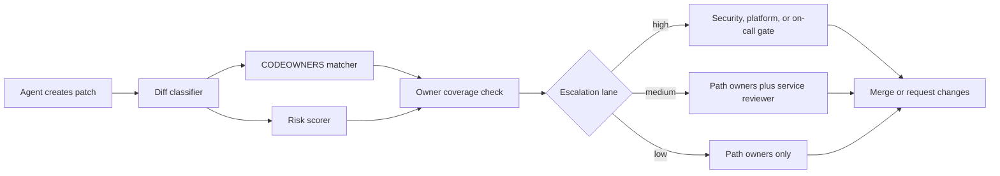

# CODEOWNERS-Aware Escalation for AI Coding Agents

## Hook

AI-generated patches often fail in a boring way. The code compiles, CI passes, and the wrong reviewer clicks approve because the diff landed in a folder they nominally own but do not actually understand.

That gets worse when agents move fast. A bot can touch auth middleware, billing jobs, and internal SDK glue in one pull request, then route review using a flat CODEOWNERS match as if all files carry the same risk.

The fix is not more reviewers everywhere. It is better escalation. In this post I’ll show how to combine CODEOWNERS, diff classification, and a small risk score so agent-generated patches reach the right humans before ownership drift turns into production cleanup.

## Why this matters

CODEOWNERS is useful, but it is a routing primitive, not a safety system. It tells you who should be asked, not whether the change is scary, cross-cutting, or sitting in a folder with stale ownership.

For AI coding workflows, that distinction matters a lot:

- agents tend to edit multiple layers in one run
- reviewers can over-trust tidy diffs with good commit messages
- ownership files drift more slowly than team reality
- risky changes often look mechanically simple

A good review router answers three questions before it requests approval:

1. Which owners match the files?
2. How risky is the patch?
3. Should approval stay with path owners, or escalate to a broader lane?

## Architecture or workflow overview



The core idea is simple. Keep CODEOWNERS for the first pass, but add a second layer that understands file type, blast radius, and ownership confidence.

### Minimal routing model

| Signal | Example | Why it matters |
| --- | --- | --- |
| Path ownership | `services/billing/** @payments-team` | Baseline reviewer routing |
| Risk markers | auth, infra, secrets, migrations | Some files deserve stronger gates |
| Cross-service spread | 1 file vs 8 directories | Wide diffs deserve more skepticism |
| Ownership confidence | active owner vs stale team alias | Prevent silent owner drift |
| Agent confidence | low-verification patch vs fully tested patch | Good evidence can lower noise, not eliminate review |

## Implementation details

A practical version fits in one small policy service or CI step.

### 1. Parse CODEOWNERS and map files to candidate reviewers

```python
from pathlib import Path
from codeowners import CodeOwners

owners = CodeOwners(Path(".github/CODEOWNERS").read_text())

def match_owners(changed_files: list[str]) -> dict[str, list[str]]:
    matches: dict[str, list[str]] = {}
    for file_path in changed_files:
        owners_for_path = owners.of(file_path)
        handles = [entry[1] for entry in owners_for_path]
        matches[file_path] = handles
    return matches
```

This is the easy part. Most teams already stop here, which is why review routing looks correct while still missing the real decision.

### 2. Add a risk score that looks beyond path matches

```yaml
risk_rules:
  critical_paths:
    - "infra/**"
    - "terraform/**"
    - "services/auth/**"
    - "db/migrations/**"
  sensitive_terms:
    - "token"
    - "secret"
    - "iam"
    - "encryption"
  escalation_thresholds:
    medium: 4
    high: 7
  spread_penalty:
    per_top_level_dir: 1
  unowned_file_penalty: 3
  stale_owner_penalty: 2
```

Then calculate a score from the diff metadata:

```python
def score_patch(changed_files: list[str], file_summaries: dict[str, str], owner_matches: dict[str, list[str]], stale_owners: set[str]) -> int:
    score = 0
    top_level_dirs = {path.split("/")[0] for path in changed_files if "/" in path}
    score += len(top_level_dirs)

    for path in changed_files:
        summary = file_summaries.get(path, "").lower()
        if path.startswith(("infra/", "terraform/", "services/auth/", "db/migrations/")):
            score += 3
        if not owner_matches.get(path):
            score += 3
        if any(term in summary for term in ["token", "secret", "iam", "encryption"]):
            score += 2
        if any(owner in stale_owners for owner in owner_matches.get(path, [])):
            score += 2

    return score
```

The point is not perfect math. The point is to surface obvious reasons a seemingly normal patch should get a stronger review lane.

### 3. Turn the score into an escalation decision

```json
{
  "patch_id": "pr-1842",
  "owners": ["@payments-team", "@platform-core"],
  "risk_score": 8,
  "coverage": {
    "matched_files": 11,
    "unowned_files": 1,
    "stale_owners": ["@infra-legacy"]
  },
  "lane": "high",
  "required_reviewers": ["@payments-team", "@platform-oncall", "@security-reviewers"],
  "why": [
    "touches auth and migration paths",
    "contains one unowned file",
    "crosses four top-level directories"
  ]
}
```

That JSON payload is what I want attached to the PR, not just a raw reviewer list. Humans should see why the escalation happened.

### Example terminal output

```text
$ review-router classify --pr 1842
Patch risk: HIGH (8)
Matched owners: @payments-team, @platform-core
Unowned files: scripts/backfill_customer_flags.py
Escalation: add @platform-oncall and @security-reviewers
Reason: db/migrations touched, auth code changed, ownership gap detected
```

## What went wrong and the tradeoffs

### Failure mode 1: stale CODEOWNERS files create false confidence

This is the biggest problem. A file can technically have an owner while the real expert changed teams months ago. If your routing logic treats any match as trustworthy coverage, the system becomes a clean-looking lie.

**What I would not do:** assume CODEOWNERS freshness just because GitHub accepted the file.

A cheap fix is to maintain an owner freshness job that flags teams or handles that have not reviewed matching paths in the last 60 to 90 days.

### Failure mode 2: every high-risk patch becomes everyone’s problem

If you escalate too aggressively, people learn to ignore the router. Security, platform, and staff engineers become default reviewers for routine changes. That kills velocity fast.

Use three lanes, not one:

| Lane | Typical patch | Reviewer pattern | Cost |
| --- | --- | --- | --- |
| Low | docs, UI copy, isolated tests | path owners only | fast |
| Medium | service logic, SDK, background jobs | path owners plus service maintainer | moderate |
| High | auth, secrets, infra, migrations, wide diffs | path owners plus central gate | slow but safer |

### Failure mode 3: agent evidence is ignored

Some teams route every agent PR as if it were a blind code dump. That is too blunt. A patch with focused tests, a migration plan, and before/after traces should still get review, but it should not be treated the same as an unverifiable sweep across ten directories.

Evidence should reduce uncertainty, not erase risk.

### Security concern: malicious or compromised prompts can target trusted paths

Attackers do not need to bypass CODEOWNERS if they can steer an agent toward a path with sleepy reviewers. That is why routing needs risk context and not just path matching.

At minimum:

- escalate secret, auth, and policy files automatically
- flag unowned or newly created executable files
- require explicit human approval for workflow and infra changes

## Practical checklist

Use this before you trust review routing for AI-generated patches:

- [ ] Parse CODEOWNERS and show matched owners per file
- [ ] Detect unowned files and fail closed on critical paths
- [ ] Score cross-directory spread, not just raw file count
- [ ] Maintain stale-owner detection from actual review activity
- [ ] Attach the escalation reasons directly to the PR
- [ ] Distinguish low, medium, and high review lanes
- [ ] Require stronger review for infra, auth, secrets, and migrations
- [ ] Let evidence reduce noise, but never skip human review for risky lanes

## Best practices I would keep

1. Keep the scoring model small and inspectable.
2. Explain every escalation in plain language.
3. Review the router itself every few weeks, because ownership drift is continuous.
4. Measure false positives, or the system will become background wallpaper.

## Conclusion

CODEOWNERS is still the right starting point, but it is not enough for fast AI coding workflows. Once agents can generate plausible multi-file patches on demand, review routing has to become risk-aware, not just path-aware.

If I were building this today, I would keep CODEOWNERS, add a tiny risk scorer, and make escalation reasons visible in every PR. That gets you a review system that is still lightweight, but much harder to fool.
