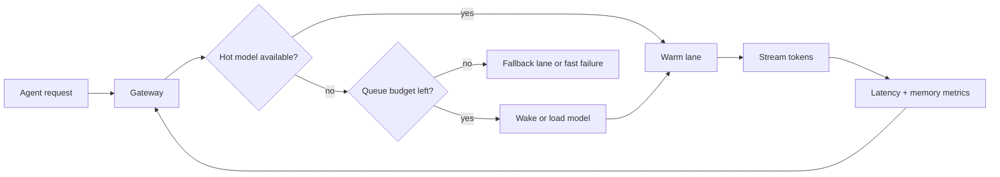

# Cold-Start Control for Local Coding Model Gateways

Local coding stacks feel great right up until they sit idle for ten minutes. Then the next agent call hits a half-awake model server, spends a minute paging weights back into memory, and times out before the first token arrives.

That failure mode looks random from the agent side, but it usually is not. It is a traffic-shaping problem mixed with memory pressure, weak health checks, and a gateway that assumes every request is equally urgent.

This post covers a setup I would actually run for a small team: one warm lane, one burst lane, a strict queue budget, and a cheap fallback path. The goal is not maximum benchmark throughput. It is predictable first-token latency for real coding workflows.

## Why this matters

Cold starts are more expensive in coding workflows than in chat demos:

- coding agents often call the model after a tool run, so the user is already waiting
- retries can duplicate expensive repo analysis or verifier work
- local boxes have uneven memory headroom, especially when an editor, browser, and vector index are open
- one stuck request can back up every other session behind it

If you are serving models through Ollama, llama.cpp, or vLLM on a workstation or small server, you need explicit policy for when to keep a model warm, when to queue, and when to route elsewhere.

## Architecture and workflow overview



A good local gateway usually needs four moving parts:

1. **Admission control** so a sudden burst does not trigger five simultaneous model loads.
2. **Warm-pool policy** so at least one high-value model stays resident during active hours.
3. **Health probes** that measure first-token readiness, not just whether the port is open.
4. **Fallback routing** to a smaller local model or remote endpoint when the box is under pressure.

## Implementation details

### 1) Put a real gateway in front of the model runtime

The runtime should focus on serving tokens. The gateway should decide whether a request can enter, wait, or reroute.

```yaml
# gateway-policy.yaml
models:
  deep-coder:
    backend: ollama
    model: qwen2.5-coder:32b
    keepWarm: true
    maxConcurrent: 2
    maxQueue: 6
    coldStartBudgetMs: 25000
    fallback: coder-small
  coder-small:
    backend: llama.cpp
    model: /models/qwen2.5-coder-7b-q4_k_m.gguf
    keepWarm: true
    maxConcurrent: 4
    maxQueue: 12
    coldStartBudgetMs: 4000

routing:
  - match: { lane: "high-context" }
    target: deep-coder
  - match: { lane: "fast-edit" }
    target: coder-small
```

The important part is that the gateway owns queue budgets and fallback policy. If you let every caller talk directly to the runtime, each caller will discover overload independently and too late.

### 2) Probe for first-token readiness, not just process liveness

A port check tells you only that the server process exists. It does not tell you whether the model is already loaded, whether KV cache allocation is about to stall, or whether the first token will arrive before your agent gives up.

```python
import time
import requests


def probe_first_token(base_url: str, model: str, timeout_s: float = 8.0) -> dict:
    started = time.perf_counter()
    response = requests.post(
        f"{base_url}/api/generate",
        json={"model": model, "prompt": "ping", "stream": False, "options": {"num_predict": 1}},
        timeout=timeout_s,
    )
    response.raise_for_status()
    elapsed_ms = round((time.perf_counter() - started) * 1000)
    return {"ok": True, "latencyMs": elapsed_ms, "model": model}
```

This is crude, but it exposes the failure that matters. If your probe says the model takes 18 seconds to answer one token, your gateway should mark the lane as cold and stop accepting latency-sensitive work.

### 3) Serialize model wake-ups

One of the easiest ways to wreck a local box is to let several requests trigger a load at once. That creates memory thrash, swaps useful cache pages out, and often makes every request slower than if you had queued them behind one load.

```python
from asyncio import Lock

wake_locks: dict[str, Lock] = {}

async def ensure_model_ready(model_key: str, load_fn):
    lock = wake_locks.setdefault(model_key, Lock())
    async with lock:
        state = await current_state(model_key)
        if state.ready:
            return state
        await load_fn(model_key)
        return await current_state(model_key)
```

### Example terminal view

```text
$ gateway status
MODEL         STATE   FIRST TOKEN   QUEUE   MEM
qwen32b       warm    1180ms        2/6     31.8G
qwen7b        warm    420ms         1/12    8.6G
embed-small   warm    90ms          0/20    1.4G

policy: deep-coder fallback -> coder-small after 25000ms cold-start budget
```

### 4) Use memory-aware routing instead of fixed favorite models

A lot of local AI setups become fragile because the system always tries the biggest model first. That works fine in a benchmark run and poorly in a real workstation with browsers, terminals, and background jobs competing for RAM or VRAM.

| Routing choice | Good for | Risk | What I would do |
| --- | --- | --- | --- |
| Always hit the biggest coder | Best quality when idle | Terrible burst behavior | Avoid as a default |
| Always hit the smallest coder | Fast replies | Lower patch quality on harder edits | Use only for trivial lanes |
| Memory-aware primary with fallback | Mixed workloads | More routing complexity | Best overall tradeoff |
| Remote failover after queue budget | Keeps SLOs intact | Costs money and needs trust boundaries | Worth it for team use |

A simple rule works surprisingly well: if available memory drops below a floor or first-token latency exceeds a threshold, route fast-edit work to the smaller model and reserve the bigger lane for the tasks that justify it.

## What went wrong and the tradeoffs

### Pitfall: keep-alive can hide bad capacity planning

Keeping a big model warm improves user experience, but it also masks the fact that the machine may be undersized. If one resident model leaves the box with almost no breathing room, your next terminal build or browser tab burst will destabilize the whole stack.

### Pitfall: burst queues feel nice until they become silent latency

A queue is safer than overload, but only if the queue is visible. Once requests wait in silence for 40 seconds, users assume the system is broken. Expose queue depth and estimated wait time to the caller.

### Security and reliability concern

If you add a remote fallback, treat it as a separate trust lane. Do not blindly forward full repo context, secrets, or raw tool output just because the local box is busy. Redact, summarize, or require an explicit higher-trust policy for remote escalation.

### Rough comparison

On a small shared GPU host, the difference between a cold and warm model is often more dramatic than the difference between two adjacent quantization levels:

- warm 7B coding model: first token in well under a second
- warm 32B coding model: often one to three seconds
- cold 32B load after idle eviction: easily 20 to 90 seconds depending on storage and memory pressure

That is why cold-start policy deserves first-class treatment.

## Practical checklist

Use this checklist before you tell your team the local gateway is "ready":

- [ ] Keep exactly one high-value coding model warm during active hours
- [ ] Measure first-token readiness, not only port health
- [ ] Serialize wake-ups per model
- [ ] Set a queue budget per lane and fail fast after it fills
- [ ] Reserve a smaller fallback model for short or low-risk tasks
- [ ] Expose queue depth, first-token latency, and memory headroom in status output
- [ ] Treat remote fallback as a separate trust boundary

## What I would do again

If I were setting this up from scratch today, I would keep the architecture boring:

- Ollama or vLLM as the model runtime
- a tiny gateway service for admission control and routing
- one warm large model, one warm small model
- optional remote failover only for explicit high-priority lanes

That gives you most of the user-perceived benefit without turning local inference into an ops hobby project.

## Conclusion

Local coding models do not fail only because the model is weak. They fail because the serving path has no opinion about cold starts, queues, or memory pressure. Add those opinions at the gateway layer and the whole stack feels far more reliable.

## References

- [Ollama API docs](https://github.com/ollama/ollama/blob/main/docs/api.md)
- [llama.cpp server docs](https://github.com/ggml-org/llama.cpp/tree/master/examples/server)
- [vLLM documentation](https://docs.vllm.ai/)
