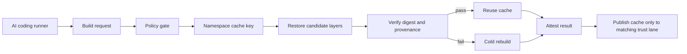

# Container Cache Poisoning Defenses for AI Coding Runners

## Hook

Shared build caches save a lot of money for AI coding runners. They also create a quiet trust problem. If one runner restores the wrong layer, a stale package mirror, wrong compiler binary, or cross-tenant artifact can slip into a build before anyone looks closely.

The failure mode is sneaky because nothing looks obviously compromised. The build is fast, the diff is small, and the agent still produces a plausible patch. What changed is the substrate under the patch.

This post shows how I would harden container cache restores for AI coding runners using digest pins, tenant-scoped cache keys, provenance attestations, and restore-time verification.

## Why this matters

AI coding runners tend to execute lots of short-lived builds. That pushes teams toward aggressive layer reuse in Docker BuildKit, registry caches, and CI cache backends. The performance win is real, but the trust boundary often gets fuzzy.

If you let every runner share the same cache namespace, a low-trust branch can warm layers that a higher-trust automation lane later reuses. If you restore layers without verifying their upstream inputs, a cache hit becomes a hidden dependency injection point.

That is especially risky when the runner is allowed to test, package, or publish software automatically.

## Architecture or workflow overview



The important design choice is that cache restore is not a blind optimization step. It is a policy decision with verification before trust is granted.

## Implementation details

### 1. Build cache keys should include trust lanes, not just Dockerfile hashes

A lot of cache setups key only on the Dockerfile and lockfile. That is not enough for shared AI automation. I would include the repo, base image digest, dependency manifest hash, and trust lane.

```bash
export BASE_DIGEST=$(crane digest ghcr.io/acme/runner-base:2026-06)
export DEPS_HASH=$(sha256sum package-lock.json Dockerfile | sha256sum | cut -d' ' -f1)
export CACHE_SCOPE="repo=payments-api|lane=trusted-pr|base=${BASE_DIGEST}|deps=${DEPS_HASH}"

docker buildx build \
  --cache-from type=registry,ref=ghcr.io/acme/buildcache:${CACHE_SCOPE} \
  --cache-to type=registry,ref=ghcr.io/acme/buildcache:${CACHE_SCOPE},mode=max \
  --provenance=true \
  --sbom=true \
  -t ghcr.io/acme/runner:${GIT_SHA} .
```

This is a little noisier than a single global cache tag, but it closes one of the worst failure paths. A cache written by a low-trust fork should not be eligible for a protected release lane.

### 2. Verify restored layers against expected provenance before reuse

A cache hit should still prove where it came from. I like a small verifier that checks the base image digest, the attestation subject, and the allowed builder identity before the runner marks a restore as trusted.

```python
import json
import subprocess
from dataclasses import dataclass

@dataclass
class CachePolicy:
    expected_base_digest: str
    allowed_builder_ids: set[str]
    required_repo: str


def verify_attestation(image_ref: str, policy: CachePolicy) -> None:
    raw = subprocess.check_output([
        'gh', 'attestation', 'verify', image_ref,
        '--format', 'json'
    ], text=True)
    doc = json.loads(raw)

    predicate = doc['verificationResult']['statement']['predicate']
    materials = predicate.get('materials', [])
    builder = predicate.get('builder', {}).get('id', '')

    if builder not in policy.allowed_builder_ids:
        raise RuntimeError(f'untrusted builder: {builder}')

    if policy.expected_base_digest not in json.dumps(materials):
        raise RuntimeError('base image digest mismatch')

    if policy.required_repo not in json.dumps(predicate):
        raise RuntimeError('repository mismatch in attestation')
```

This is where many teams stop because it feels like extra ceremony. I think it is worth it. Without a restore verifier, you are treating the cache backend as implicitly honest.

### 3. Fail closed when restore verification does not pass

If verification fails, do a cold rebuild and write a fresh attested cache only into the same trust lane. Do not silently fall back to a more permissive namespace.

```yaml
name: runner-build
on: [push]

jobs:
  container-build:
    runs-on: ubuntu-latest
    permissions:
      id-token: write
      contents: read
      attestations: write
    steps:
      - uses: actions/checkout@v4
      - uses: docker/setup-buildx-action@v3
      - name: Try trusted cache restore
        id: cache_restore
        run: python .ci/verify_cache_restore.py
      - name: Build with cold fallback
        run: |
          if [ "${{ steps.cache_restore.outcome }}" != "success" ]; then
            echo "cache verification failed, forcing rebuild"
            export NO_CACHE=--no-cache
          fi
          docker buildx build $NO_CACHE \
            --provenance=true \
            --sbom=true \
            --push \
            -t ghcr.io/acme/runner:${{ github.sha }} .
```

The boring but important rule is this: a cache verification miss is a reliability event, not a hint to broaden trust.

## What went wrong or the tradeoffs

### The tradeoff table

| Choice | Faster | Safer | What I think |
| --- | --- | --- | --- |
| One global cache namespace | Yes | No | Fine for personal experiments, bad for shared automation |
| Per-repo cache scope | Mostly | Better | Good default |
| Per-repo plus trust-lane scope | Slightly less | High | Best default for teams |
| Restore without attestation checks | Yes | No | Too optimistic |
| Cold rebuild on verification miss | No | High | Correct for protected lanes |

### Failure modes I would expect

- **Cross-tenant cache bleed**. A shared registry cache tag lets one project warm artifacts another project should never trust.
- **Base image drift**. A mutable tag like `node:20` changes upstream, but the old cached layer still looks valid locally.
- **Poisoned package manager state**. A restored layer contains the wrong registry config, mirror URL, or auth helper from an earlier run.
- **False confidence from speed**. Reviewers assume a fast green build is healthy when the dangerous part was the reused substrate.

### Security and ops concerns

- Provenance verification adds latency and some complexity, especially if you wire in attestations and SBOM checks.
- Cache miss rates will go up if you segment too aggressively.
- You need retention rules, otherwise each trust lane creates a pile of old cache objects.

I still prefer that cost over debugging an incident where an AI runner used the wrong cached compiler or dependency snapshot and nobody noticed for days.

## Practical checklist

- Pin base images by digest, not mutable tags.
- Include repo and trust lane in cache keys.
- Verify attestations before trusting a restore.
- Rebuild cold on verification failure.
- Publish refreshed cache only back into the same namespace.
- Expire stale cache objects aggressively.
- Log cache source, verification result, and fallback reason for every run.

## Best-practices callout

What I would do again:

1. Start with per-repo cache namespaces.
2. Add trust lanes before allowing AI runners to package or release artifacts.
3. Treat cache restore logs as part of reviewer evidence, not hidden infrastructure trivia.
4. Keep the fallback path simple so operators trust it under pressure.

## Conclusion

Shared container caches are worth keeping. They just need the same security thinking we already apply to credentials, tool permissions, and release workflows.

For AI coding runners, fast builds are helpful. Trusted fast builds are the real goal.
