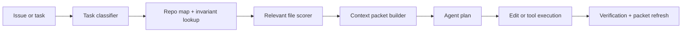

# Context Packets for Engineering Agents That Actually Reduce Bad Edits

If an engineering agent keeps touching the wrong files, the problem is often not the model. It is the context packet.

Too many teams still hand an agent a giant repo dump, a vague task, and hope retrieval or tool use will clean it up. That works right up until the agent edits a similarly named module, misses a hidden invariant, or burns half its token budget re-reading noise.

What actually helps is a bounded packet: a task manifest, a repo map, a short evidence bundle, and a few hard constraints. This post walks through the packet shape I would use, how to build it, and where it still breaks.

## Why this matters

Good agents do not just need more context. They need the *right* context, in an order that helps them plan before they edit.

In production, context packet quality changes four things fast:

1. bad-edit rate
2. reviewability of the resulting diff
3. latency and token cost
4. how often the agent needs human rescue

A repo instruction file helps, but it is not enough for task-specific work. A context packet is the bridge between static repo guidance and the live task in front of the agent.

## Architecture or workflow overview

A context packet should be assembled before the first write-capable tool call. The packet can be static for a short task, or refreshed at checkpoints for longer jobs.



The packet itself should look boring on purpose:

- a one-screen task summary
- allowed and disallowed paths
- relevant files with short reasons
- local commands to verify success
- known invariants, failure modes, and adjacent systems

## Implementation details

### 1. Start with a task manifest, not just prose

I like a small YAML manifest because it forces structure before the agent starts improvising.

```yaml
kind: engineering-task
objective: Add retry-safe webhook delivery to the background worker
success:
  - duplicate webhook sends are prevented
  - failed deliveries are retried with backoff
  - existing metrics still emit
constraints:
  - do not change public API routes
  - keep edits inside worker/ and shared/queue/
  - add tests for retry dedupe behavior
verify:
  - pnpm test worker/retry.test.ts
  - pnpm lint
avoid:
  - touching billing/
  - changing database migrations
```

This is boring, which is good. The agent now knows where success lives, where it should not wander, and how the result will be checked.

### 2. Build a repo map with file roles, not raw tree dumps

A raw directory listing is cheap to generate but not very useful. A repo map should explain *what matters*.

```json
{
  "areas": [
    {
      "path": "worker/dispatcher.ts",
      "role": "dequeues jobs and handles retry state transitions",
      "editLikelihood": "high"
    },
    {
      "path": "shared/queue/idempotency.ts",
      "role": "idempotency key generation and lease checks",
      "editLikelihood": "medium"
    },
    {
      "path": "billing/",
      "role": "separate domain, not relevant to webhook retries",
      "editLikelihood": "forbidden"
    }
  ],
  "invariants": [
    "job attempt count is monotonic",
    "delivery metrics use the existing queue labels",
    "duplicate sends must fail closed"
  ]
}
```

I would rather give an agent eight annotated files than sixty unlabelled ones.

### 3. Score relevance before bundling source excerpts

The packet builder should rank candidate files using cheap signals first: changed-path history, import proximity, symbol overlap, test names, and issue keywords.

```ts
export function scoreCandidate(file: RepoFile, task: TaskManifest): number {
  let score = 0;

  if (task.objectiveWords.some(word => file.path.includes(word))) score += 3;
  if (file.exports.some(symbol => task.symbolHints.includes(symbol))) score += 4;
  if (file.tags.includes('entrypoint')) score += 2;
  if (file.tags.includes('forbidden')) score -= 100;
  if (file.recentlyChangedWithTests) score += 2;

  return score;
}
```

A small relevance model like this is usually enough to produce a clean first packet. Save embeddings and bigger retrieval machinery for when the repo is truly large or the task is fuzzy.

### 4. Bundle evidence in layers

| Layer | What goes in it | Why it exists | Failure if missing |
| --- | --- | --- | --- |
| task | objective, constraints, verify commands | keeps the agent pointed at the actual job | vague plans and scope drift |
| map | file roles, invariants, ownership hints | gives structure before source code | edits the right concept in the wrong place |
| evidence | short excerpts from top files | provides implementation truth | agent hallucinates unseen details |
| guardrails | no-go paths, approval notes, rollout cautions | limits blast radius | agent does something locally reasonable but operationally bad |

### 5. Refresh the packet after major discoveries

The first packet is never perfect. If the agent learns a key invariant halfway through, capture it and rebuild the packet before the next write step.

```python
def refresh_packet(packet, finding):
    if finding.kind == "invariant":
        packet["repo_map"]["invariants"].append(finding.text)
    if finding.kind == "new_hot_file":
        packet["evidence_files"].append(finding.path)
    packet["version"] += 1
    return packet
```

That refresh loop matters on longer debugging or refactor tasks, especially when the first plan was slightly wrong.

## What went wrong and the tradeoffs

### Failure mode 1: packet bloat

Teams discover context packets, then immediately turn them into mini wikis. Once the packet becomes a dumping ground, the agent starts skipping important bits because everything looks equally important.

### Failure mode 2: stale repo maps

A stale map is worse than no map if it confidently points the agent at old architecture. If you keep maps in-repo, regenerate or review them when major modules move.

### Failure mode 3: overfitting to path names

Simple relevance scoring can be fooled by similar names. `worker/retry.ts` and `web/retry-banner.tsx` may both rank well. That is why invariant notes and file-role annotations matter.

### Security and reliability concern

Do not let the packet builder freely include secrets, `.env` files, or production dumps just because they looked relevant. Packet assembly needs the same permission boundaries as the agent itself.

### What I would not do

I would not stuff entire files into the packet by default. I would not let the agent pick forbidden paths and “justify later.” And I would not trust vector retrieval alone to understand repo boundaries.

## Practical checklist

Use this when building your own packet system:

- define success criteria before selecting files
- annotate allowed and forbidden paths explicitly
- include 5 to 12 high-signal files, not 50 low-signal ones
- attach verify commands the agent can run immediately
- record invariants in plain language
- rebuild the packet after major discoveries
- log the packet version used for each edit batch

## Best-practices callout

> If reviewers cannot tell what packet the agent saw, debugging bad edits gets much harder. Store a packet id or manifest hash next to the run record.

## Conclusion

Context packets are one of the highest-leverage boring tools in an engineering-agent stack. They reduce wasted tokens, improve edit quality, and make failures easier to explain. The main trick is staying selective. Smaller, fresher, and more explicit beats bigger almost every time.

## Links

- [Source repo map ideas](https://negiadventures.github.io/blog/agent-playbooks-repo-instructions.html)
- [Prompt caching for tool-heavy agents](https://negiadventures.github.io/blog/prompt-caching-tool-heavy-agents.html)
- [Agent observability with traces](https://negiadventures.github.io/blog/agent-observability-opentelemetry.html)
