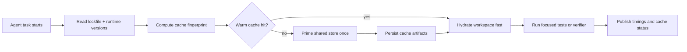

# Dependency Cache Warming for AI Coding Agents Without Cold Install Thrash

AI coding agents are surprisingly bad at one very ordinary thing, waiting through the same dependency bootstrap over and over.

If half of every run is `pnpm install`, `uv sync`, or rebuilding the same Docker layers, the model is not the bottleneck anymore. Your packaging and cache policy is.

What matters is not just having a cache somewhere. What matters is warming the right cache, keyed to the right evidence, before the agent starts editing.

## Why this matters

A human developer tolerates one slow install and keeps working in the same shell for hours. Agent workflows do the opposite. They spin up fresh workspaces, bounce across repos, retry in CI, and often verify patches in isolation.

That changes the economics. A 90 second bootstrap penalty is annoying for a person. For an agent that runs 40 times a day, it quietly becomes the dominant cost in latency, CI minutes, and flaky failed runs.

This is especially true when you mix:

- ephemeral worktrees or sandboxes
- language-specific stores like `pnpm`, `uv`, `pip`, or `cargo`
- Docker-based verifiers
- cache-hostile keys such as branch names or timestamps

## Architecture and workflow overview

### Visual plan
- Hero: neon terminal-style banner showing lockfile key, warm store, fast verify
- Diagram: lockfile hash to shared cache to workspace bootstrap to focused verify
- Terminal visual: before vs after bootstrap timings for cold and warm runs
- Comparison table: package-manager cache type, what to warm, common failure mode
- Tags: AI Coding Agents, Build Systems, CI Reliability, Dependency Caching, Developer Workflow
- Meta description: A practical guide to warming pnpm, uv, Docker BuildKit, and CI caches so AI coding agents stop wasting runs on repeated dependency installs and flaky bootstrap latency.
- Code sections: GitHub Actions cache keying, local bootstrap script, Docker BuildKit cache mounts

### Mermaid flow



The key design choice is that the cache belongs to the dependency graph, not to a branch or an agent session. If the lockfile and runtime match, the agent should inherit a warm store immediately.

## Implementation details

### 1. Key caches from dependency evidence, not from branch names

For JavaScript repos, I like keying the warm store from:

- `pnpm-lock.yaml` or `package-lock.json`
- package manager version
- Node version
- OS or architecture when native modules are involved

A GitHub Actions example:

```yaml
name: agent-verify

on:
  workflow_dispatch:
  pull_request:

jobs:
  verify:
    runs-on: ubuntu-latest
    steps:
      - uses: actions/checkout@v4

      - uses: actions/setup-node@v4
        with:
          node-version: 22

      - name: Enable pnpm
        run: corepack enable

      - name: Resolve pnpm store path
        id: pnpm-store
        run: echo "path=$(pnpm store path --silent)" >> "$GITHUB_OUTPUT"

      - uses: actions/cache@v4
        with:
          path: ${{ steps.pnpm-store.outputs.path }}
          key: pnpm-${{ runner.os }}-node22-${{ hashFiles('pnpm-lock.yaml') }}
          restore-keys: |
            pnpm-${{ runner.os }}-node22-

      - run: pnpm install --frozen-lockfile
      - run: pnpm test -- --runInBand
```

This is boring, which is exactly why it works. The agent gets a warm package store when dependency evidence matches, and a clean miss when it does not.

Reference docs:
- https://pnpm.io/cli/store
- https://github.com/actions/cache
- https://github.com/actions/setup-node

### 2. Warm the shared store, not just `node_modules`

Caching `node_modules` looks tempting, but it is usually the wrong layer for agent systems. It is larger, more OS-sensitive, and more likely to break when path layouts or symlinks change.

A better pattern is warming the package-manager store and then doing a fast materialization step inside each fresh workspace.

For local or self-hosted agent runners, a bootstrap script can make this explicit:

```bash
#!/usr/bin/env bash
set -euo pipefail

LOCK_HASH=$(sha256sum pnpm-lock.yaml | awk '{print $1}')
STORE_ROOT="${HOME}/.cache/agent-pnpm"
MARKER="${STORE_ROOT}/${LOCK_HASH}.ready"

corepack enable
mkdir -p "$STORE_ROOT"
pnpm config set store-dir "$STORE_ROOT"

if [[ ! -f "$MARKER" ]]; then
  echo "[warm] priming pnpm store for ${LOCK_HASH}"
  pnpm fetch --frozen-lockfile
  touch "$MARKER"
else
  echo "[warm] store already primed for ${LOCK_HASH}"
fi

pnpm install --frozen-lockfile --prefer-offline
```

`pnpm fetch` is useful here because it populates the content-addressed store without pretending the workspace is already linked. The agent still gets a clean workspace, but the expensive network step is mostly gone.

Reference docs:
- https://pnpm.io/cli/fetch
- https://pnpm.io/symlinked-node-modules-structure

### 3. Give Python agent runs the same treatment with `uv`

Python workflows suffer from the same problem, especially when every verification job recreates a virtual environment from scratch.

A simple pattern is:

- key from `uv.lock` plus Python version
- cache the `uv` download and wheel cache
- rebuild the virtualenv from warm artifacts instead of hitting the network

Reference docs:
- https://docs.astral.sh/uv/concepts/cache/
- https://docs.astral.sh/uv/concepts/projects/sync/

### 4. Warm Docker verifier layers with BuildKit cache mounts

If your agent verifies patches inside Docker, language package caches are only half the story. You also want BuildKit cache mounts so repeated builds reuse downloaded packages across runs.

```dockerfile
# syntax=docker/dockerfile:1.7
FROM node:22-bookworm AS deps
WORKDIR /app
COPY package.json pnpm-lock.yaml ./
RUN corepack enable
RUN --mount=type=cache,target=/root/.local/share/pnpm/store \
    pnpm fetch --frozen-lockfile

FROM node:22-bookworm AS test
WORKDIR /app
COPY --from=deps /root/.local/share/pnpm/store /root/.local/share/pnpm/store
COPY . .
RUN corepack enable
RUN pnpm install --frozen-lockfile --prefer-offline
RUN pnpm test
```

This keeps dependency downloads attached to the Docker cache lifecycle instead of redoing them for every agent patch.

Reference docs:
- https://docs.docker.com/build/cache/optimize/
- https://docs.docker.com/reference/dockerfile/#run---mounttypecache

### Terminal before vs after

```text
cold run
  pnpm fetch            52s
  pnpm install          31s
  focused tests         18s
  total                 101s

warm run
  cache restore          3s
  pnpm install           8s
  focused tests         18s
  total                  29s
```

That kind of delta changes whether agent verification feels usable or wasteful.

## Comparison table

| Stack | What to warm | Best key material | Common failure mode |
| --- | --- | --- | --- |
| pnpm | content-addressed store | lockfile, Node version, OS | keying from branch names, causing low reuse |
| uv | wheel and package cache | `uv.lock`, Python version, OS | caching venv only, then rebuilding anyway |
| Docker BuildKit | build cache mounts and layers | Dockerfile plus lockfiles | invalidating all layers with early `COPY . .` |
| pip | wheel/download cache | requirements lock plus Python version | cache poisoning from unpinned transitive deps |

## What went wrong and tradeoffs

### Failure mode 1: overly broad restore keys

Broad restore keys improve hit rate, but they can also hide drift. If native modules are involved, restoring a cache from the wrong Node minor or architecture creates slow, confusing failures.

What I would not do: use a single global key like `node-cache-linux` for all repos.

### Failure mode 2: caching mutable environments instead of immutable inputs

Teams often cache whole virtualenvs or `node_modules` directories, then wonder why runs become flaky after a package manager upgrade. Those directories are downstream artifacts. The lockfile and runtime version are the real invariants.

### Failure mode 3: success metrics that ignore bootstrap time

If you only measure test pass rate, cache regressions stay invisible. Agent systems need bootstrap telemetry too:

- cache hit or miss
- restore duration
- install duration
- bytes downloaded
- verifier duration after bootstrap

### Security concern: caches are shared attack surface

A shared dependency cache is useful, but it is also a place where poisoned or stale artifacts can linger. At minimum, pair cache warming with:

- frozen lockfiles
- registry integrity checks
- scoped write permissions on self-hosted runners
- cache eviction when package manager versions change sharply

For public CI, I am wary of workflows that let untrusted forks write back into privileged cache namespaces.

## Practical checklist

- [ ] Key caches from lockfiles plus runtime version
- [ ] Prefer warming the package store over caching full install directories
- [ ] Separate network fetch from workspace materialization when possible
- [ ] Add BuildKit cache mounts for Docker-based verifiers
- [ ] Record cache hit rate and bootstrap duration in job output
- [ ] Invalidate aggressively when native modules or package manager versions change
- [ ] Treat shared caches as mutable infrastructure that needs access control

## Best-practices callout

If your agent workflow uses fresh workspaces, optimize for fast reconstruction, not for preserving one magical workspace forever. Warm stores plus deterministic installs scale better than trying to keep giant mutable environments alive.

## Conclusion

When an AI coding agent feels slow, the model often gets blamed first. A lot of the time the real culprit is repetitive bootstrap work.

Warm the dependency graph once, key it carefully, and let every fresh agent run inherit that speedup. It is one of the least glamorous reliability fixes you can make, and one of the highest leverage ones.
