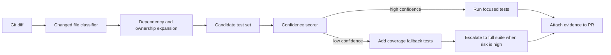

# Diff-Scoped Test Selection for AI Coding Agents Without Full Test Suite Thrash

> Visual plan
> - Hero: glowing pipeline card showing git diff, dependency graph match, and focused tests
> - Diagram: diff to mapper to verifier to fallback full-suite flow
> - Terminal visual: selected test list and confidence score output
> - Comparison table: full suite vs diff-scoped vs coverage fallback lanes
> - Tags: AI Coding Agents, Test Selection, CI Reliability, Verification, Monorepo Workflows
> - Meta description: How to build diff-scoped test selection for AI coding agents with dependency graphs, coverage fallbacks, and flaky-test guardrails.
> - Code sections: changed-file mapper and CI gate script

AI coding agents get blamed for a lot of bad verification behavior that is really a tooling problem. If every tiny patch triggers a forty minute suite, the agent either waits forever, skips verification, or learns to trust noisy green builds that had nothing to do with the files it changed.

The fix is not “trust the model more.” It is to give the verifier a tighter loop. Diff-scoped test selection uses the patch itself as the starting point, expands through ownership and dependency edges, and runs the smallest test packet that still says something useful.

This post shows how I would build that lane, where it fails, and when I still force a full suite.

## Why this matters

Full test suites are often the wrong default for agent-driven patch verification:

- tiny docs or config edits wait behind unrelated integration tests
- flaky end-to-end jobs hide whether the changed code is actually safe
- reviewers get a green check without knowing what was exercised
- agents learn perverse habits like narrowing changes to dodge expensive suites

A diff-scoped lane keeps feedback fast enough for iterative coding while preserving a visible path to broader verification. This matters most in monorepos, service fleets, and repositories where the cost of “run everything” keeps climbing.

Useful references: [Bazel query](https://bazel.build/query/overview), [pytest markers](https://docs.pytest.org/en/stable/example/markers.html), and GitHub’s guidance on [required status checks](https://docs.github.com/en/repositories/configuring-branches-and-merges-in-your-repository/managing-protected-branches/about-protected-branches).

## Architecture or workflow overview



The practical rule is simple: start from the patch, expand only as far as the evidence warrants, and expose the confidence score so humans can see when the shortcut is weak.

## Implementation details

### 1. Build a small mapper from changed files to candidate tests

A mapper usually needs more than path prefixes. I want at least three signals:

1. direct ownership, like `services/billing/**` mapping to billing tests
2. dependency graph expansion, like changed modules importing or being imported by tested code
3. coverage fallback, like “last known tests touching this file” when static mapping is incomplete

```python
from pathlib import Path

OWNERSHIP_MAP = {
    "services/billing": ["tests/billing", "tests/contracts/billing"],
    "libs/risk": ["tests/risk", "tests/integration/risk_to_billing"],
}


def candidate_tests(changed_files: list[str], import_graph: dict[str, set[str]]) -> set[str]:
    selected = set()

    for changed in changed_files:
        changed_path = Path(changed)

        for prefix, tests in OWNERSHIP_MAP.items():
            if str(changed_path).startswith(prefix):
                selected.update(tests)

        for dependent in import_graph.get(changed, set()):
            if dependent.startswith("tests/"):
                selected.add(dependent)

    return selected
```

### 2. Add a confidence gate before you trust the focused packet

I do not want the agent to treat every focused run as equally trustworthy. The verifier should score the packet and escalate when the patch crosses risky boundaries.

```python
RISKY_PATTERNS = ("migrations/", "auth/", "infra/", "schema/")


def verification_plan(changed_files: list[str], selected_tests: set[str]) -> dict:
    risky_change = any(path.startswith(RISKY_PATTERNS) for path in changed_files)
    has_tests = len(selected_tests) > 0
    touches_many_files = len(changed_files) > 12

    confidence = 1.0
    if risky_change:
        confidence -= 0.45
    if not has_tests:
        confidence -= 0.35
    if touches_many_files:
        confidence -= 0.20

    run_full_suite = confidence < 0.55

    return {
        "confidence": round(confidence, 2),
        "run_focused": has_tests,
        "run_full_suite": run_full_suite,
    }
```

### 3. Make the CI output explain itself

A focused lane is much easier to trust when it prints what it selected and why.

```bash
$ python scripts/select_tests.py --base origin/master --head HEAD
changed_files=4
selected_tests=7
confidence=0.73
reasons:
  - ownership match: services/billing -> tests/billing
  - import graph hit: libs/risk/scorer.py -> tests/integration/risk_to_billing
fallbacks:
  - coverage map contributed 2 tests
mode=focused
pytest tests/billing tests/contracts/billing tests/integration/risk_to_billing
```

### 4. Keep a fallback lane for weak mappings

Static maps are always incomplete. When confidence drops, I like a middle lane before “run absolutely everything.”

| Lane | Best for | Upside | Downside |
| --- | --- | --- | --- |
| Focused diff-scoped tests | Small app-layer edits | Fast feedback, low noise | Misses hidden coupling |
| Coverage fallback packet | Partial mapping or shared libs | Better safety without full suite cost | Depends on stale coverage history |
| Full suite | Risky core changes, schema, auth | Highest confidence | Slow and often noisy |

## What went wrong and the tradeoffs

### Hidden coupling ruins naive path maps

A file can be “owned” by one service but influence another through shared serialization, schema generation, or feature flags. If you only use directory prefixes, your focused lane will look fast and confident right before it misses the only test that mattered.

### Coverage history rots quietly

Coverage-based selection helps, but stale coverage data can lie. If the last instrumented run happened before a refactor, the fallback packet can reinforce old assumptions. I would rather expose “coverage map age: 19 days” in CI than hide that fact.

### Flaky tests distort confidence

One of the worst patterns is letting flaky end-to-end tests dominate the focused packet. When they fail, the agent cannot tell whether the patch is wrong or the test lane is noisy. I strongly prefer a quarantine list with explicit human ownership.

> **Pitfall:** do not let diff-scoped selection become a loophole for risky changes. Auth, schema, migration, and permission-boundary edits deserve escalation even when the patch is small.

### I would not use this for every change

I would not trust a focused packet alone for:

- database migrations
- auth and permission boundary changes
- infra or deployment config edits
- cross-cutting generated code
- patches that change test harness behavior itself

## Practical checklist

- Classify changed files before test selection starts.
- Combine path ownership with dependency evidence, not path rules alone.
- Print selected tests and reasons into CI logs.
- Score confidence and escalate risky edits automatically.
- Track stale coverage data age if you use it as fallback evidence.
- Quarantine flaky tests instead of pretending they are signal.
- Keep a hard allowlist of files that always force broader verification.
- Attach the verification mode, confidence, and selected tests to the PR.

## Conclusion

Diff-scoped test selection is one of the best ways to make AI coding agents feel faster without letting them get sloppier. The trick is to treat it as an evidence system, not a shortcut. Fast feedback is great. Fast feedback with visible limits is what actually holds up in review.

If I had to summarize the whole pattern in one sentence, it would be this: run the smallest honest test packet you can justify, then escalate on purpose.
