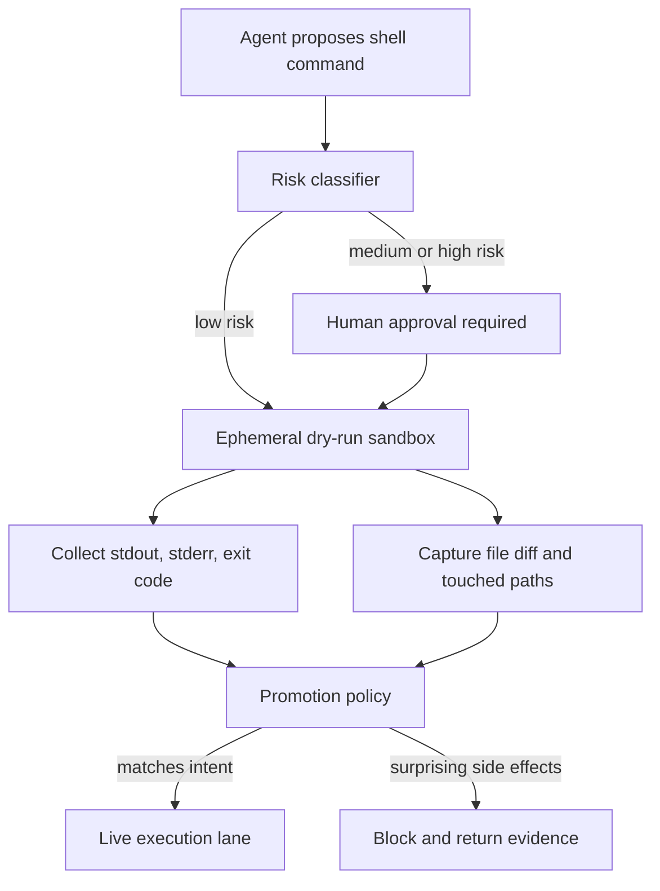

# Dry-Run Lanes for AI Agents That Need to Execute Shell Commands

Too many agent demos jump straight from "the model proposed a command" to "the command ran on something that matters." That is fine for `ls`. It is reckless for `sed -i`, `terraform apply`, `gh pr merge`, or a shell pipeline with hidden deletes in the middle.

The practical fix is a dry-run lane. Before a command gets real access, the agent rehearses it in a constrained sandbox, captures the diff, and proves the command shape matches the declared intent. If the rehearsal cannot be trusted, the live run should not happen.

This post walks through a command safety pattern I like for agentic automation: classify the command, run it in a throwaway environment, inspect file and process side effects, then promote only low-surprise commands to a live lane.

## Why this matters

Shell is still the universal adapter for engineering work. Even if your agent mostly calls structured tools, real workflows still end in commands like test runs, deploy scripts, migration helpers, changelog generators, and repo maintenance tasks.

The failure mode is rarely a dramatic "rm -rf /" cartoon. It is more often a plausible command that targets the wrong directory, rewrites a broader file set than intended, leaks environment variables into logs, or passes in rehearsal but fails live because the sandbox hid a missing secret or mounted path.

A dry-run lane helps in four places:

- it forces intent capture before execution
- it produces reviewer-friendly evidence instead of vague reassurance
- it catches path, glob, and side-effect mistakes early
- it creates an audit trail when the command does go live

## Architecture or workflow overview

### Mermaid flow



### Numbered sequence

1. The planner emits a command plus declared intent, expected paths, and allowed side effects.
2. A classifier scores the command for write risk, network risk, credential use, and blast radius.
3. The system runs the command in a throwaway sandbox with narrow mounts and redacted environment variables.
4. The executor captures exit status, touched files, output, and filesystem diff.
5. A promotion policy compares observed behavior to declared intent.
6. Only matching runs get promoted to the live lane, sometimes with fresh approval.

## Implementation details

### 1) Represent intent before the shell runs

If the command is free text with no structured envelope, you have almost no safety hooks. I prefer requiring the planner to attach expected writes, allowed network behavior, and whether the command is supposed to be read-only.

```yaml
command: "python scripts/rewrite_frontmatter.py blog/*.md"
working_dir: "/workspace/site"
intent:
  summary: "Normalize frontmatter keys in blog markdown posts"
  mode: "mutating"
  expected_writes:
    - "blog/*.md"
  forbidden_paths:
    - ".git/"
    - "secrets/"
  network: "none"
  reviewer_note: "Should only rewrite YAML frontmatter, no content body edits"
```

That looks boring, which is exactly why it is useful. Once the command has declared boundaries, you can compare reality against them.

### 2) Score commands before promotion

A simple risk model catches a lot. You do not need a research paper here, just consistent heuristics.

```python
from dataclasses import dataclass
from shlex import split

@dataclass
class CommandRisk:
    score: int
    requires_approval: bool
    reasons: list[str]

WRITE_TOKENS = ('mv', 'cp', 'sed', 'perl', 'python', 'node', 'terraform', 'kubectl', 'git', 'gh')
DANGEROUS_FLAGS = ('--force', '-f', '--delete', '--hard')
NETWORK_HINTS = ('curl', 'wget', 'scp', 'rsync', 'gh', 'npm', 'pip')


def classify_command(command: str) -> CommandRisk:
    tokens = split(command)
    reasons: list[str] = []
    score = 0

    if any(token in WRITE_TOKENS for token in tokens):
        score += 3
        reasons.append("may mutate files or remote state")

    if any(token in DANGEROUS_FLAGS for token in tokens):
        score += 3
        reasons.append("contains force or delete style flag")

    if any(token in NETWORK_HINTS for token in tokens):
        score += 2
        reasons.append("may contact external service")

    if "|" in command or "&&" in command or ";" in command:
        score += 2
        reasons.append("multi-step shell chain hides intermediate side effects")

    return CommandRisk(
        score=score,
        requires_approval=score >= 4,
        reasons=reasons,
    )
```

What I would not do is let the model self-report risk and treat that as truth. The planner can suggest risk, but policy should score independently.

### 3) Rehearse in a throwaway sandbox

The sandbox should look enough like reality to expose path mistakes, but not enough like reality to cause real damage. That usually means a copy-on-write workspace, read-only secrets by default, and no ambient network unless the command explicitly needs it.

```bash
#!/usr/bin/env bash
set -euo pipefail

RUN_ID="dryrun-$(date +%s)"
SANDBOX_ROOT="/tmp/${RUN_ID}"
mkdir -p "$SANDBOX_ROOT"
rsync -a --delete ./ "$SANDBOX_ROOT/workspace/"

bubblewrap   --ro-bind /usr /usr   --ro-bind /lib /lib   --ro-bind /lib64 /lib64   --bind "$SANDBOX_ROOT/workspace" /workspace   --dev /dev   --proc /proc   --unshare-net   --chdir /workspace   /bin/bash -lc "python scripts/rewrite_frontmatter.py blog/*.md"
```

### Example terminal evidence block

```text
$ dryrun execute --task normalize-blog-frontmatter
risk score: 5
approval: required
sandbox: /tmp/dryrun-1748174702/workspace
exit code: 0
files changed: 14
surprise paths: 1
blocked: yes
note: touched blog/index.html but intent only allowed blog/*.md
```

That output is much more useful than "the agent thinks it worked." It gives a human something concrete to approve or reject.

## What went wrong, and the tradeoffs

### Failure mode 1: dry-run success, live-run failure

This happens when the sandbox is too clean. A command may pass in rehearsal and fail live because production has different permissions, mounted tools, secrets, or repo state.

Mitigation:

- keep the sandbox environment close to the real runtime
- record which capabilities were mocked or stripped
- require a second promotion gate for commands that depend on credentials or remote services

### Failure mode 2: hidden side effects in shell chains

A chained command like `build && deploy || rollback` can be technically one command string but operationally three different risk profiles. If you only review the final status, you miss the intermediate damage.

Mitigation:

- split shell chains into explicit steps before execution
- log per-step exit status and side effects
- block promotion when the planner emits opaque one-liners for high-risk tasks

### Failure mode 3: diff noise hides the real mistake

Dry runs are only useful if the resulting evidence is reviewable. If the command reformats 300 files while also changing one sensitive config, the important part gets buried.

Mitigation:

- collapse unchanged directories
- highlight forbidden paths first
- compare touched paths against the declared intent before showing full diff detail

### Tradeoff table

| Pattern | Good at | Weak at | I would use it when |
|---|---|---|---|
| Pure allowlist, no dry run | Fast policy decisions | Misses path and context mistakes | Commands are narrow and strongly typed |
| Dry-run sandbox | Finding local side effects early | Can diverge from live env | Repo edits, scripts, migrations, codegen |
| Live-only with approval | Human oversight | Reviewer sees intent, not proof | One-off manual ops with trusted scripts |
| Full shadow execution plus promotion | High confidence | More infra and cost | Repeated automations with real blast radius |

### Security concern: logs become a second data leak path

A lot of teams focus on whether the command is safe and forget that stdout and stderr can leak secrets, file contents, or internal URLs. The dry-run lane needs output redaction too.

Best practice:

- treat command output as tainted until scrubbed
- redact env var values before persistence
- cap retained output length and preserve raw logs only in restricted storage

## Practical checklist

### What I would do again

- Require every mutating shell command to declare expected write paths.
- Score commands independently of the model's self-description.
- Rehearse commands in a fresh sandbox with narrow mounts.
- Capture path-level diffs, not just stdout and exit code.
- Block promotion when surprise paths or network access appear.
- Separate approval for rehearsal from approval for live execution when credentials are involved.
- Store a promotion receipt with command, diff summary, and reviewer decision.

### Pitfalls to avoid

- Do not trust `--dry-run` flags blindly. Many tools implement them unevenly.
- Do not run shell chains as opaque strings for high-risk tasks.
- Do not let the sandbox inherit production secrets by default.
- Do not auto-promote based only on exit code.

## Conclusion

If an AI agent is going to execute shell commands, the question is not whether you trust the model. The question is whether the system can prove what the command will do before it does it.

A dry-run lane is a practical way to get that proof. It turns shell execution from a leap of faith into a staged promotion workflow, which is a much better fit for real repositories and real infrastructure.
