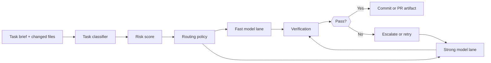

# Dynamic Model Routing for AI Coding Agents Without Burning Budget

Most teams start model selection for coding agents with a brand name and a gut feeling. That works until the cheap model misses a migration edge case, or the expensive model gets asked to rename one variable and burns money doing it.

The better pattern is routing. Score the task, reserve expensive models for the work that actually needs them, and keep a verification loop that catches bad downgrades before they become merged code.

This post walks through a practical routing setup for coding agents: task classification, model policy, escalation rules, and the failure modes that show up when routing logic gets too clever.

## Why this matters

Coding-agent traffic is not uniform. A tiny docs fix, a dependency bump, a schema migration, and a flaky test investigation are radically different jobs. Treating them the same wastes either money or attention.

In production, routing matters for three reasons:

- **Latency**: fast models unblock low-risk loops
- **Cost**: expensive reasoning should be used selectively
- **Quality**: risky edits need stronger models and stronger verification

## Architecture or workflow overview



1. Classify the task before calling a model.
2. Map the score to a model lane.
3. Run verification appropriate to that lane.
4. Escalate failed or high-risk work instead of retrying blindly on the same cheap model.

## Implementation details

### 1) Score the task before you pick the model

A routing decision should be boring and inspectable. I like a small ruleset that combines blast radius, file type, and action type.

```python
from dataclasses import dataclass

@dataclass
class TaskSignal:
    files_touched: int
    has_schema_change: bool
    has_auth_code: bool
    test_failures: int
    needs_new_code: bool


def risk_score(signal: TaskSignal) -> int:
    score = 0
    score += min(signal.files_touched, 8)
    score += 5 if signal.has_schema_change else 0
    score += 5 if signal.has_auth_code else 0
    score += min(signal.test_failures * 2, 6)
    score += 3 if signal.needs_new_code else 0
    return score
```

The goal is not academic precision. The goal is to stop sending risky edits to the cheapest possible lane.

### 2) Keep routing policy separate from prompts

Do not bury routing logic inside the agent prompt. Keep it in a policy file so you can change it without rewriting every task template.

```yaml
models:
  fast:
    provider: openrouter
    model: anthropic/claude-3.5-haiku
    max_context_tokens: 32000
  strong:
    provider: openrouter
    model: anthropic/claude-3.7-sonnet
    max_context_tokens: 120000
  verifier:
    provider: openai
    model: gpt-4.1-mini

routing:
  fast_max_score: 6
  strong_min_score: 7
  always_strong_if:
    - schema_change
    - auth_code
    - production_incident
  escalate_on:
    - failed_tests
    - patch_rejected
    - low_confidence_summary
```

This separation makes audits much easier. You can diff routing changes independently from instruction changes.

### 3) Route by task class, then verify harder than you route

Verification is where cheap routing survives contact with reality.

```ts
type Route = "fast" | "strong";

type RunResult = {
  route: Route;
  passed: boolean;
  checks: string[];
  confidence: number;
};

export function nextRoute(result: RunResult): Route {
  if (!result.passed) return "strong";
  if (result.confidence < 0.65) return "strong";
  if (result.checks.includes("snapshot-only")) return "strong";
  return result.route;
}
```

If your fast lane produces a patch that only passes weak checks, escalate anyway. Passing a shallow check is not the same as being safe to merge.

```text
$ route-agent --task "fix retry leak in sync worker"
classifier: files=4 schema_change=false auth_code=false test_failures=2 new_code=true
risk_score: 11
selected_lane: strong
verification: pytest -q && npm run lint && npm run typecheck
result: pass
cost_usd_estimate: 0.84
latency_seconds: 38.7
```

### 4) Add a small benchmark ledger

Routing gets better when you track outcomes instead of arguing from anecdotes.

| Lane | Median latency | Typical use | Common failure |
| --- | --- | --- | --- |
| Fast | 6 to 14 s | docs, narrow refactors, boilerplate tests | misses hidden invariants |
| Strong | 20 to 55 s | migrations, auth, multi-file fixes | higher cost, slower loop |
| Verifier | 4 to 10 s | second-pass critique, summary checks | can approve weak tests if prompts are vague |

A simple ledger with route, task type, pass rate, and escalation rate will tell you quickly whether your thresholds are wrong.

## What went wrong and the tradeoffs

The biggest routing mistake is overfitting to cost. Teams get excited about saving money, drop too much work into the fast lane, then pay for it later in retries, review churn, and incidents.

Another failure mode is classifier drift. If the codebase changes but your routing rules do not, new risky areas remain mislabeled. This shows up a lot when infrastructure or auth logic moves into new directories.

> **Pitfall:** If the agent can edit CI, migrations, secrets handling, or deployment config, the routing policy should default upward. Those are not places to discover that your fast lane was overly optimistic.

There is also a security angle. Routing systems often inspect filenames, issue text, and tool outputs. If those inputs are untrusted, your classifier can be manipulated into downgrading or upgrading tasks. Treat task metadata as tainted input and validate it before policy evaluation.

> **Best practice:** keep a tiny set of non-negotiable “always strong” conditions, then tune the rest with measured results.

## Practical checklist

- [ ] Score tasks using explicit signals, not prompt prose
- [ ] Keep routing policy in config, not hidden in agent instructions
- [ ] Maintain an always-escalate list for schema, auth, deploy, and incident work
- [ ] Escalate on failed verification or low confidence, not just on hard errors
- [ ] Track pass rate, escalation rate, latency, and review rejection rate by lane
- [ ] Revisit thresholds when the repo architecture changes

## What I would do again

I would start with only two execution lanes and one verifier. Most teams do not need a five-model orchestra. They need a fast path, a careful path, and a way to prove the cheap path did not lie.

## Conclusion

Model routing is one of the easiest ways to make coding agents cheaper without making them worse. The trick is to route by risk, verify aggressively, and escalate early when the cheap lane starts guessing.

## References

- [LiteLLM routing docs](https://docs.litellm.ai/docs/routing)
- [OpenRouter model routing overview](https://openrouter.ai/docs/features/provider-routing)
- [vLLM serving docs](https://docs.vllm.ai/)
