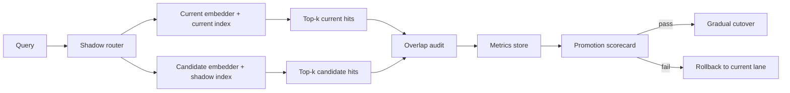

# Embedding Model Migrations for RAG Systems Without Recall Regressions

Switching embedding models looks easy right until a “better” model starts missing the passages your users actually need. Offline benchmark wins are useful, but they do not guarantee the new vectors preserve your real retrieval behavior, chunk geometry, or metadata balance.

The painful part is that most failures are quiet. Nothing crashes. Search still returns something. Your answer quality just gets slightly weirder, reviewer trust drops, and weeks later someone realizes the migration hurt recall on the queries that mattered most.

This is the migration playbook I would use for a production RAG system: dual indexing, overlap audits, shadow traffic, and a fast rollback lane. The goal is not proving the new model is smarter in theory. It is proving the retrieval system still finds the right evidence under real load.

## Why this matters

Embedding migrations change more than cosine scores.

They can change:

- which chunks cluster together
- how long chunks should be before semantic blur kicks in
- whether old metadata filters still help or now over-constrain results
- how much reranking has to clean up retrieval mistakes
- index size, rebuild time, and search latency

That is why I do not treat model swaps as a pure ML choice. It is a retrieval systems change with product, ops, and reliability consequences.

## Architecture and migration workflow

A safe migration keeps the old retrieval lane alive while the new one earns trust.



I want four things before cutover:

1. the candidate index built from the same corpus snapshot
2. query-by-query overlap and recall evidence
3. latency and cost measurements for the new lane
4. a one-switch rollback to the old embedder and index

## Implementation details

### 1) Build a versioned dual-index lane

Do not replace the old vectors in place. Keep both versions queryable.

```yaml
retrieval:
  active_lane: embed-v1
  lanes:
    embed-v1:
      embedder: text-embedding-3-large
      index_alias: docs_prod_v1
      chunk_profile: chunk-800-overlap-120
    embed-v2:
      embedder: voyage-code-3
      index_alias: docs_shadow_v2
      chunk_profile: chunk-800-overlap-120
  migration:
    shadow_percent: 100
    compare_top_k: 10
    rollback_lane: embed-v1
```

The important detail is the lane abstraction. It lets you compare retrieval behavior without rewriting the rest of the application. It also makes rollback boring, which is exactly what you want.

### 2) Log overlap, not just rank-1 wins

I care less about whether the exact same chunk stays at rank 1 and more about whether the right evidence still appears in the top-k set.

```python
from dataclasses import dataclass
from typing import Sequence

@dataclass
class RetrievalHit:
    doc_id: str
    chunk_id: str
    score: float


def overlap_at_k(current_hits: Sequence[RetrievalHit], candidate_hits: Sequence[RetrievalHit], k: int = 10) -> dict:
    current = {hit.chunk_id for hit in current_hits[:k]}
    candidate = {hit.chunk_id for hit in candidate_hits[:k]}
    shared = current & candidate

    return {
        "k": k,
        "shared": len(shared),
        "current_only": len(current - candidate),
        "candidate_only": len(candidate - current),
        "jaccard": len(shared) / max(len(current | candidate), 1),
    }
```

Low overlap is not automatically bad. Sometimes the new model finds better chunks. But low overlap is a signal to inspect, not a reason to celebrate blindly.

### 3) Run a labeled recall set before trusting shadow traffic

Shadow traffic tells you distribution behavior. A labeled set tells you whether the system still finds known-good evidence.

```python
def recall_at_k(expected_chunk_ids: set[str], hits: list[RetrievalHit], k: int = 10) -> float:
    found = {hit.chunk_id for hit in hits[:k]}
    return len(expected_chunk_ids & found) / max(len(expected_chunk_ids), 1)


def compare_lane(query_case, current_hits, candidate_hits):
    return {
        "query_id": query_case["id"],
        "current_recall_at_10": recall_at_k(set(query_case["expected_chunks"]), current_hits, 10),
        "candidate_recall_at_10": recall_at_k(set(query_case["expected_chunks"]), candidate_hits, 10),
    }
```

I would start with 50 to 200 painful real queries, not synthetic ones. Good migration sets include:

- ambiguous product questions
- long-tail internal jargon
- code or config lookups
- filter-heavy queries
- multilingual or typo-heavy prompts if your product sees them

### 4) Watch latency, rebuild cost, and index growth

Some embedding upgrades improve retrieval but increase storage and ingest cost enough to change the economics of the system.

| Area | Current lane | Candidate questions to answer |
| --- | --- | --- |
| Recall | Stable known behavior | Does recall@10 improve on the real labeled set? |
| Overlap | Baseline | Are differences understandable or chaotic? |
| Ingest | Existing pipeline | Does re-embedding finish inside maintenance windows? |
| Search latency | Known SLO | Does the new vector size or provider add user-visible delay? |
| Rollback | Simple | Can you revert without reindexing under pressure? |

If the model needs different chunking to shine, treat that as a second migration. Do not mix “new embeddings” and “new chunk strategy” in one blind cutover unless you enjoy debugging attribution problems.

## Useful terminal evidence during shadow rollout

A migration should produce operator-friendly output, not just dashboards.

```text
$ ./bin/retrieval-migration report --lane embed-v2 --window 24h
shadow queries compared: 18,422
median overlap@10: 0.70
candidate recall gain on labeled set: +3.8%
queries with severe drop (>20% recall): 14
p95 search latency delta: +18ms
index size delta: +11.4%
status: hold for manual review
```

That one report is usually enough to tell you whether you have a clean promotion candidate or a deceptive benchmark winner.

## What went wrong, and the tradeoffs I would watch

### Failure mode 1: Better average, worse important queries

This is the classic trap. The candidate lane improves aggregate metrics, but it loses rare internal terms or product-specific acronyms. If your eval set is too generic, you will miss it.

### Failure mode 2: Chunk IDs change and comparisons get noisy

If you re-chunk while re-embedding, overlap numbers become hard to interpret. Sometimes that is unavoidable, but if possible I keep chunk IDs stable for the first pass.

### Failure mode 3: Reranker masks retrieval damage

A strong reranker can hide a weak retriever in small test sets. I still inspect pre-rerank recall because the reranker cannot rescue evidence that never appears in the candidate pool.

### Failure mode 4: Security and privacy drift

A migration is also a good time to confirm the embedder path still respects data policy. If the old lane was self-hosted and the new lane sends text to a hosted provider, that is not just a model upgrade. That is a data-governance change.

> **Pitfall:** Do not declare success from cosine-distance charts alone. Users do not care that the embedding manifold looks elegant. They care whether the right source chunk showed up when they asked a messy real question.

> **Best practice:** Freeze one variable at a time. First migrate embeddings with the same chunking and filters. Then, if needed, test chunk-profile changes as a separate experiment.

## What I would not do

I would not:

- overwrite the old index in place
- cut over based only on benchmark claims from the model vendor
- mix embedding, chunking, and reranker changes into one rollout
- treat low-overlap queries as “edge cases” without reading them
- ship a migration that has no fast rollback alias

## Practical migration checklist

- [ ] Build a candidate index from the same corpus snapshot as the current lane
- [ ] Keep retrieval lanes versioned and switchable by config
- [ ] Run a labeled query set with expected chunks or documents
- [ ] Compare recall@k, not only answer quality or rank-1 matches
- [ ] Audit low-overlap queries manually before promotion
- [ ] Measure ingest time, index size, and search latency deltas
- [ ] Confirm data handling and provider routing still match policy
- [ ] Roll out gradually, with rollback tested before user traffic sees the new lane

## Conclusion

Embedding migrations should be treated like retrieval reliability work, not a cosmetic model refresh. If the new lane cannot beat the old one on your real evidence-finding tasks, it is not an upgrade yet.

A careful dual-index rollout is slower than a one-shot swap, but I’m convinced it is the difference between a measurable improvement and a quiet regression that takes a month to admit.

## Links

- [OpenAI text embeddings guide](https://platform.openai.com/docs/guides/embeddings)
- [Voyage AI embeddings docs](https://docs.voyageai.com/docs/embeddings)
- [Pinecone retrieval evaluation overview](https://www.pinecone.io/learn/offline-evaluation/)
