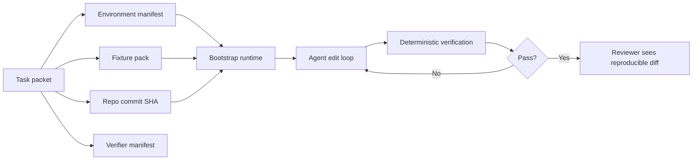

# Environment Manifests for AI Coding Agents That Reproduce the Bug You Meant to Fix

Most bad AI patches are not really reasoning failures. They are environment failures wearing a reasoning costume.

The agent saw a different Node version, a warmer cache, missing seed data, or a slightly newer formatter than the one that produced the bug. Then it "fixed" a problem that only existed in its own sandbox. That is expensive, annoying, and very easy to miss when the diff looks neat.

This post is about building environment manifests for AI coding agents so the bug, the verifier, and the toolchain stay aligned. I will show what to pin, what not to pin, where manifests drift, and how I would package the whole thing for repeatable local and CI runs.

## Why this matters

If a human developer cannot reproduce a bug consistently, they slow down. If an AI coding agent cannot reproduce it, the system quietly starts optimizing for fake confidence.

That shows up in a few predictable ways:

- tests pass locally for the agent but fail in CI
- the model edits formatting, lockfiles, or generated code because the toolchain drifted
- the agent cannot trigger the original failure, so it patches symptoms instead of causes
- reviewers waste time debating whether the fix or the environment changed

Official docs from [Development Containers](https://containers.dev/), [uv](https://docs.astral.sh/uv/), [pnpm](https://pnpm.io/), and [GitHub Actions](https://docs.github.com/en/actions) all solve pieces of this. The useful pattern for agent workflows is tying those pieces into one explicit manifest the verifier can trust.

## Architecture and workflow overview

The shape I like is simple: the task hands the agent a repo commit, an environment manifest, a fixture pack, and a verifier manifest. The agent edits code only after all four line up.



A good manifest should answer four questions quickly:

1. Which source state are we editing?
2. Which tool versions must exist?
3. Which fixtures or services make the bug reproducible?
4. Which exact commands define success?

## Implementation details

### 1. Capture the environment in one visible contract

I prefer a small checked-in manifest instead of scattered tribal knowledge across CI YAML, README notes, and prompt text.

```yaml
# .agent/environment.yml
repo:
  commit: 8e3c1f2
  branch: master

runtime:
  node: 22.11.0
  python: 3.12.4
  packageManager: pnpm@9.12.1

container:
  image: ghcr.io/acme/app-dev:2026-05-01
  devcontainer: .devcontainer/devcontainer.json

fixtures:
  seedScript: scripts/seed-repro-data.sh
  dataset: fixtures/repro-login-timeout-v3.tar.zst
  services:
    - postgres:16
    - redis:7

verify:
  install: pnpm install --frozen-lockfile
  lint: pnpm lint
  test: pnpm test -- --runInBand auth/login-timeout.spec.ts
  smoke: ./scripts/repro-check.sh
```

### 2. Make the runtime bootstrap deterministic

A manifest without a consistent bootstrap step still drifts. I like a thin launcher that validates versions before the agent starts editing.

```bash
#!/usr/bin/env bash
set -euo pipefail

manifest=.agent/environment.yml
required_node=$(yq '.runtime.node' "$manifest")
required_python=$(yq '.runtime.python' "$manifest")

actual_node=$(node -v | sed 's/^v//')
actual_python=$(python3 -c 'import platform; print(platform.python_version())')

[[ "$actual_node" == "$required_node" ]] || {
  echo "node version mismatch: need $required_node, got $actual_node" >&2
  exit 1
}

[[ "$actual_python" == "$required_python" ]] || {
  echo "python version mismatch: need $required_python, got $actual_python" >&2
  exit 1
}

pnpm install --frozen-lockfile
./scripts/seed-repro-data.sh
```

### 3. Snapshot the verifier, not just the app

One failure mode I keep seeing is "the fix passed the tests" when the real change was that the verifier itself moved. Linter upgrades, new snapshots, flaky network calls, or a different browser version can all distort the result.

```json
{
  "schemaVersion": 1,
  "commit": "8e3c1f2",
  "commands": [
    "pnpm lint",
    "pnpm test -- --runInBand auth/login-timeout.spec.ts",
    "./scripts/repro-check.sh"
  ],
  "artifacts": {
    "playwright": "1.54.1",
    "snapshotDir": "tests/__snapshots__/auth",
    "ciImage": "ghcr.io/acme/verify:2026-05-01"
  },
  "network": "blocked-except-local-services"
}
```

### 4. Treat fixture data as versioned input

If the bug depends on a database state, queue depth, API contract, or file corpus, put that under versioned control too. Not necessarily in Git if it is large, but under an immutable reference.

| Fixture strategy | Good for | Main risk | My take |
| --- | --- | --- | --- |
| Ad hoc local DB state | Fast debugging | Impossible to share | Fine for one person, bad for agents |
| Seed scripts only | Text-friendly reproducibility | Script drift, hidden external dependency | Good default if seeds stay small |
| Snapshot archive plus seed script | Stable bug reproduction | Larger storage footprint | Best default for important regressions |
| Production clone | Realism | Privacy, size, blast radius | Avoid unless heavily redacted |

## What went wrong / tradeoffs

The first candidate I considered for this run was a post on MCP auth propagation, but that felt too close to the existing transport and secure MCP server posts. I skipped it and picked environment manifests because the gap was cleaner and more useful.

The bigger tradeoff in this pattern is speed versus confidence.

- Fully pinned containers reduce drift but can slow iteration if image rebuilds are heavy.
- Loose host-based setups feel faster until the first reviewer cannot reproduce the fix.
- Large fixture snapshots improve realism but increase storage and refresh overhead.
- Aggressive determinism can hide concurrency bugs if every test runs in the same tiny lane.

Here is the kind of terminal output I want from a healthy reproducibility check:

```text
$ ./scripts/agent-bootstrap.sh
manifest: .agent/environment.yml
repo commit: 8e3c1f2
node: 22.11.0 OK
python: 3.12.4 OK
fixtures: repro-login-timeout-v3 loaded
services: postgres:16 redis:7 ready
verify profile: auth/login-timeout
status: reproducible
```

## Practical checklist

Use this when you want agent edits to stay reproducible under review:

- [ ] Pin language runtimes and package manager versions.
- [ ] Record the repo commit or exact base SHA.
- [ ] Define the verification commands in a machine-readable file.
- [ ] Version fixture packs or seed scripts explicitly.
- [ ] Separate cheap smoke verification from expensive full verification.
- [ ] Include manifest hashes in cache keys.
- [ ] Block silent manifest mutation during an agent fix run.
- [ ] Store replay artifacts for failed verifier runs.

## Conclusion

If you want better AI coding results, do not just tune prompts. Tune the environment contract around the prompt.

A reproducible environment manifest turns "works on my machine" into something much closer to "works in the lane we agreed to trust." That is a much better foundation for agents, reviewers, and CI.
