# Ephemeral Preview Environments for AI-Generated Pull Requests Without Surprise Infrastructure Spend

AI-generated pull requests are great at producing diffs and terrible at proving those diffs actually behave in something close to production. Reviewers end up reading code, guessing runtime behavior, and asking for screenshots, logs, or one more manual test run.

That gets worse when the PR came from an agent. The patch often touches config, migrations, feature flags, or glue code that looks reasonable in review but fails once real services, seeded data, and environment wiring show up.

What helps is an ephemeral preview environment per pull request. Give the PR a short-lived stack, run smoke checks against it, post the URL back into the workflow, and destroy it aggressively when the branch closes or the TTL expires.

## Why this matters

For AI-generated changes, preview environments are less about polish and more about evidence. They let reviewers inspect the actual behavior of a change before they merge it, and they force the automation to prove it can assemble the app, dependencies, and seed data in a fresh environment.

In practice, they catch the failures that static diff review misses:

- config drift between local and hosted services
- missing migrations or broken startup ordering
- environment variable assumptions hidden in agent-written code
- flaky feature flags or seed data gaps
- infrastructure spend that quietly balloons because previews never die

## Architecture or workflow overview

```mermaid
flowchart LR
    A[AI-generated PR] --> B[GitHub Actions workflow]
    B --> C[Build image or artifact]
    C --> D[Provision ephemeral namespace or stack]
    D --> E[Seed fixtures and secrets]
    E --> F[Run smoke tests and policy checks]
    F --> G[Comment preview URL on PR]
    G --> H[Reviewer tests behavior]
    H --> I[TTL janitor or PR close event]
    I --> J[Destroy preview resources]
```



The release shape I like has four hard rules:

1. each PR gets an isolated name and TTL
2. previews run against seeded but non-production data
3. smoke tests must run before the URL is announced
4. cleanup is event-driven and time-based, not just best effort

| Layer | Job | Why it matters for AI-generated PRs |
| --- | --- | --- |
| Build lane | Produce image or deployable artifact | Stops reviewers from testing stale code |
| Provisioning lane | Create short-lived namespace, branch DB, or Compose stack | Keeps one PR from stepping on another |
| Verification lane | Smoke tests, migrations, basic auth checks | Catches the agent's plausible-but-wrong failures |
| Cleanup lane | PR-close teardown plus TTL janitor | Prevents preview sprawl and surprise cloud bills |

## Implementation details

### 1) Make preview identity and TTL explicit

Treat the preview as an object with a deterministic name, owner PR, and expiration. That makes cleanup and auditing much easier.

```yaml
# .github/workflows/preview.yml
name: preview-environment

on:
  pull_request:
    types: [opened, synchronize, reopened, closed]

jobs:
  deploy-preview:
    if: github.event.action != 'closed'
    runs-on: ubuntu-latest
    env:
      PREVIEW_ID: pr-${{ github.event.pull_request.number }}
      PREVIEW_TTL_HOURS: 6
    steps:
      - uses: actions/checkout@v4
      - uses: docker/setup-buildx-action@v3
      - name: Build preview image
        run: |
          docker build -t ghcr.io/acme/app:${GITHUB_SHA} .
      - name: Provision preview namespace
        run: |
          ./ops/preview up \
            --id "$PREVIEW_ID" \
            --sha "$GITHUB_SHA" \
            --ttl-hours "$PREVIEW_TTL_HOURS"
```

### 2) Seed realistic, safe fixtures before announcing the URL

A preview without usable test data wastes reviewer time. A preview with copied production data creates a different class of problem.

```bash
#!/usr/bin/env bash
set -euo pipefail

preview_id="$1"
namespace="preview-${preview_id}"

kubectl -n "$namespace" apply -f ops/preview/base-secrets.yaml
kubectl -n "$namespace" create job --from=cronjob/seed-demo-data seed-${preview_id}
kubectl -n "$namespace" wait --for=condition=complete job/seed-${preview_id} --timeout=180s
kubectl -n "$namespace" rollout status deploy/web --timeout=180s
```

### 3) Gate the comment on smoke-test success

If the preview comment lands before the basic checks pass, the reviewer becomes the smoke test.

```ts
import fetch from "node-fetch";

export async function verifyPreview(baseUrl: string) {
  const health = await fetch(`${baseUrl}/healthz`);
  if (!health.ok) throw new Error(`healthz failed: ${health.status}`);

  const login = await fetch(`${baseUrl}/api/session/demo`, { method: "POST" });
  if (!login.ok) throw new Error(`demo login failed: ${login.status}`);

  const dashboard = await fetch(`${baseUrl}/api/projects`);
  if (!dashboard.ok) throw new Error(`projects fetch failed: ${dashboard.status}`);
}
```

```text
$ pnpm preview:smoke https://pr-1842.example.dev
✔ GET /healthz 200
✔ POST /api/session/demo 200
✔ GET /api/projects 200
✔ migration version matches image sha
preview status: READY
```

## What went wrong and the tradeoffs

The first failure mode is obvious, previews that never get cleaned up. The second is sneakier, previews that are technically up but useless because they have no seed data, broken auth, or an empty state that hides the very bug the PR was supposed to fix.

**Pitfalls to watch:**

- **No TTL janitor:** PR-close cleanup is not enough. Force-delete expired previews in case webhooks or workflows fail.
- **Using production-like secrets carelessly:** previews should use scoped credentials, not broad shared keys.
- **Stateful dependency sprawl:** per-PR databases and caches are great until they multiply without quotas.
- **Review theater:** a preview URL alone is not evidence. Require smoke logs and at least one meaningful behavior check.

| Choice | Upside | Downside | When I would use it |
| --- | --- | --- | --- |
| Docker Compose preview on a VM | Fast to start, simple mental model | Weaker isolation | Small teams or internal apps |
| Per-PR Kubernetes namespace | Strong isolation, clear TTL labels | More platform complexity | Default when already on Kubernetes |
| Hosted preview platform | Fastest setup for web apps | Less control for multi-service backends | Frontend-heavy stacks |
| Full database clone per PR | High realism | Expensive and risky | Rarely, for narrow debugging cases |

What I would not do is make every preview fully production-shaped on day one. Start with the smallest environment that proves the behavior the reviewer cares about, then add realism where it earns its keep.

## Practical checklist

**Preview environment checklist**

- [ ] Deterministic preview ID derived from PR number or branch
- [ ] TTL label attached to all preview resources
- [ ] Seeded fixture job runs before reviewer notification
- [ ] Smoke tests cover health, auth, and one business path
- [ ] Preview secrets are scoped and non-production
- [ ] Cleanup runs on PR close and on scheduled TTL sweeps
- [ ] Cost dashboard tracks preview count and age
- [ ] PR comment includes URL, commit SHA, and smoke status

## Conclusion

Ephemeral preview environments make AI-generated pull requests much easier to trust because they replace guesswork with runtime evidence. Keep them short-lived, seeded, verified, and aggressively cleaned up, and they become one of the best review tools in an AI-heavy development workflow.

## References

- [GitHub Actions workflow syntax](https://docs.github.com/en/actions/writing-workflows/workflow-syntax-for-github-actions)
- [GitHub deployments and environments](https://docs.github.com/en/actions/deployment/targeting-different-environments/using-environments-for-deployment)
- [Vercel preview deployments](https://vercel.com/docs/deployments/preview-deployment)
- [HashiCorp tutorial on preview environments](https://developer.hashicorp.com/terraform/tutorials/applications/preview-environments-vercel)
- [vCluster preview environments with GitHub Actions](https://www.vcluster.com/docs/vcluster/0.29.0/third-party-integrations/github-actions/preview-environments)

---

*This post focuses on preview environments for AI-generated pull requests, but the same patterns also clean up human-authored review workflows.*
