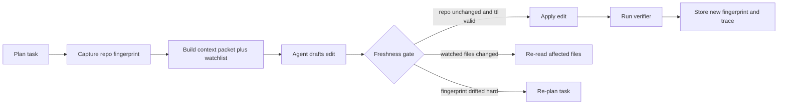

# Freshness Guards for Long-Running AI Coding Agents

Long-running coding agents do not usually fail because the model got dumber halfway through the task.

They fail because the world changed while the agent kept confidently acting on an old snapshot. A teammate merged new code. A generated file was rebuilt. A lockfile shifted. The agent still has a neat plan, but the plan is now pointed at yesterday's repository.

That is a nasty failure mode because the output often looks polished. The patch compiles. The explanation sounds coherent. The diff is just wrong for the state of the repo you actually have.

This is the pattern I like instead: freshness guards. Give the agent a repo fingerprint, file watchlists, context TTLs, and revalidation gates before risky edits. The goal is not perfect omniscience. It is stopping stale context from quietly turning into bad patches.

## Why this matters

Coding agents are getting better at longer tasks, but longer runtime means more opportunities for drift:

- another human pushes a conflicting change
- generated files or migrations change the local workspace shape
- a planning step reads one version of a file and an edit step writes against another
- verifier output refers to a build state the agent no longer has

This gets worse in repos with frequent merges, generated artifacts, or parallel agent sessions. A long context window does not solve this. If the context is stale, bigger stale context is still stale.

## Architecture or workflow overview



The key idea is simple: planning and execution should not share one blind assumption that the repo stayed still.

## Implementation details

### 1) Capture a cheap repo fingerprint before planning

Do not hash the whole repo unless you enjoy latency. A practical fingerprint usually combines the current HEAD, the working tree state, and a digest of files relevant to the task.

```bash
#!/usr/bin/env bash
set -euo pipefail

head_rev=$(git rev-parse HEAD)
status_digest=$(git status --porcelain=v1 | sha256sum | cut -d' ' -f1)
focus_digest=$(git ls-files 'src/**/*.ts' 'package.json' 'pnpm-lock.yaml'   | xargs cat   | sha256sum   | cut -d' ' -f1)

jq -n   --arg head "$head_rev"   --arg status "$status_digest"   --arg focus "$focus_digest"   '{head:$head, status:$status, focus:$focus}'
```

This does not need to be cryptographically fancy. It needs to be cheap enough that you will actually run it before planning and before writing.

### 2) Bind the context packet to a watchlist and a TTL

A context packet without an expiry behaves like cached fiction. I prefer attaching a short TTL plus a list of files that must be re-read if they change.

```ts
interface ContextPacket {
  taskId: string;
  repoFingerprint: string;
  createdAt: number;
  ttlMs: number;
  watchFiles: string[];
  pinnedFiles: string[];
}

export function needsRefresh(packet: ContextPacket, changedFiles: Set<string>, now = Date.now()) {
  if (now - packet.createdAt > packet.ttlMs) return true;

  for (const file of packet.watchFiles) {
    if (changedFiles.has(file)) return true;
  }

  return false;
}
```

Two good defaults:

- short TTLs for active repos, often 5 to 15 minutes
- watchlists that include lockfiles, schema files, migration folders, generated types, and any file the plan depends on semantically

### 3) Refresh narrowly before expensive re-planning

Not every drift event needs a full restart. If a watched config file changed, re-read it. If the merge base or task-critical files changed, re-plan.

```python
from pathlib import Path

CRITICAL_PATHS = {"package.json", "pnpm-lock.yaml", "db/schema.prisma"}


def classify_drift(changed_files: set[str]) -> str:
    if changed_files & CRITICAL_PATHS:
        return "replan"
    if any(path.startswith("src/") for path in changed_files):
        return "reread"
    return "continue"


def refresh_context(packet, changed_files):
    action = classify_drift(changed_files)
    if action == "replan":
        return {"action": "replan", "reason": sorted(changed_files)}
    if action == "reread":
        files = [p for p in packet["watchFiles"] if p in changed_files]
        return {"action": "reread", "files": files}
    return {"action": "continue"}
```

This is much cheaper than restarting every task, and much safer than pretending no drift occurred.

### 4) Put the freshness gate right before the write step

The most useful checkpoint is the one immediately before `edit`, `git apply`, or PR creation. The agent should prove the world still matches the plan before it mutates anything.

Terminal output I like to see:

```text
$ agent freshness-check --task patch-login-timeout
repo fingerprint: 1f2cc0f -> 1f2cc0f
watchlist changes: none
context ttl: 6m elapsed of 10m
write gate: PASS
```

And when it should stop:

```text
$ agent freshness-check --task patch-login-timeout
repo fingerprint: 1f2cc0f -> 927ab44
watchlist changes:
  - package.json
  - src/auth/session.ts
context ttl: 14m elapsed of 10m
write gate: BLOCK
next step: re-read changed files and re-plan edit
```

That stop is not a failure. It is the guardrail doing its job.

## What went wrong and the tradeoffs

The first tempting mistake is to rely on `git diff` alone. That catches file changes, but it does not express whether your planning assumptions are still valid.

The second mistake is the opposite one: refreshing everything on every tool call. That burns tokens, slows the run, and teaches teams to disable the check when deadlines hit.

| Strategy | Benefit | Cost | Where it fits |
| --- | --- | --- | --- |
| No freshness guard | Fastest happy path | Quietly wrong patches under drift | Tiny single-user repos only |
| Full repo refresh every step | Lowest stale-context risk | Expensive and noisy | Very high-risk write workflows |
| Fingerprint plus TTL plus watchlist | Good safety-to-cost ratio | Needs careful watchlist design | Most long-running coding agents |

### Common failure modes

> **Pitfall:** generated files drift more often than humans remember. If your task depends on generated types, lockfiles, codegen outputs, or migration state, put them on the watchlist explicitly.

Another bad pattern is letting the planner pin ten files, then only re-checking two of them before writing. Freshness policy should be based on what the plan actually used, not what happens to be easy to hash.

### Security and reliability concern

A stale context bug can become a security bug surprisingly fast. Imagine an agent reading one access-control helper, then writing policy changes after another commit weakened the surrounding call path. The patch may pass local tests and still reopen an authorization hole.

This is why I like two extra rules for write-heavy systems:

- require a fresh fingerprint before edits that touch auth, billing, infra, or migrations
- record the fingerprint in traces so incident review can prove what repo state the agent believed it was operating on

### What I would not do

I would not let the model decide, in prose, whether the repo changed “in a meaningful way.” Drift classification belongs in deterministic runtime code.

## Practical checklist

- [ ] capture a repo fingerprint before planning and before writing
- [ ] attach a TTL to every context packet
- [ ] keep a watchlist for task-critical files, not just edited files
- [ ] distinguish reread-level drift from replan-level drift
- [ ] block writes when the TTL expires or critical files change
- [ ] trace the fingerprint and refresh action with verifier results
- [ ] include generated files, lockfiles, and schema artifacts in the watchlist
- [ ] make high-risk paths like auth and migrations require a fresh pre-write check

> **Best practice:** freshness checks should be cheap enough to run often and strict enough to block wrong writes without human debate.

## Conclusion

Long-running agents need memory, but they also need humility.

A repo fingerprint, a short TTL, and a disciplined watchlist go a long way toward keeping polished nonsense out of your diffs. If an agent can act for longer, it should also prove more often that it is still acting on the right world.

## References

- [Git worktree documentation](https://git-scm.com/docs/git-worktree)
- [Git status documentation](https://git-scm.com/docs/git-status)
- [Watchman](https://facebook.github.io/watchman/)
- [OpenTelemetry](https://opentelemetry.io/)
- [Model Context Protocol documentation](https://modelcontextprotocol.io/)
