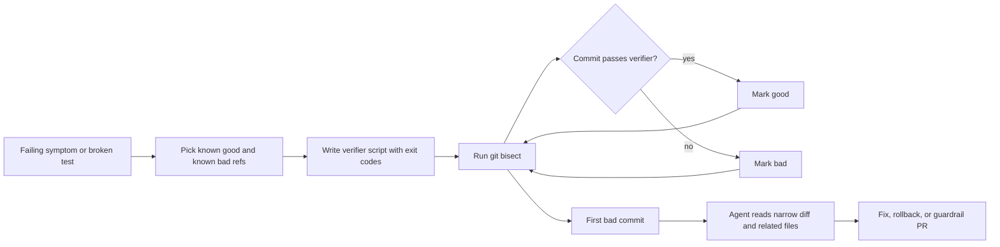

# Git Bisect Workflows for AI Coding Agents That Need to Hunt Regressions Fast

## Visual plan
- Hero image idea: dark terminal-style banner with good/bad refs, verifier script, and blame commit checkpoints
- Architecture or diagram idea: bisect loop from failing symptom to bounded verifier to culprit commit to repair lane
- Optional terminal-output visual idea: sample bisect session showing skipped commits and first bad commit
- Optional comparison table idea: when to use bisect, replay testing, or direct log forensics
- Tags: AI Coding Agents, Git Bisect, Debugging, CI, Regression Analysis
- Meta description: A practical guide to running Git bisect with AI coding agents using verifier scripts, patch checkpoints, and evidence capture so regression hunts stop turning into wide, expensive guessing.
- Suggested code snippet sections: verifier shell script, agent handoff manifest, terminal output from a bisect run

Git bisect is still one of the cleanest debugging tools in software, and AI coding agents make it weirdly easy to misuse.

The failure pattern is familiar. A test starts failing, the broken behavior clearly was not there last week, and the agent immediately starts reading the latest files as if the current state contains enough evidence to explain the regression. Sometimes it gets lucky. Usually it burns time patching symptoms instead of isolating the change that introduced them.

The better move is to hand the agent a bounded search problem. In this post I’ll show how to wrap `git bisect` with a small verifier script, a stop condition, and an evidence packet so an AI coding agent can narrow a regression to a commit range that a human reviewer can actually trust.

## Why this matters

Regression hunts get expensive when the model has too much freedom and too little ground truth. A vague instruction like “figure out what broke login” invites broad code reading, speculative edits, and accidental local fixes that hide the real change.

A disciplined bisect workflow is better because it forces four useful constraints:

- you define a known good ref and a known bad ref
- you encode the failure as a repeatable verifier
- you keep the search attached to real commits instead of narrative guesses
- you produce a narrow artifact that can drive either a fix or a rollback decision

This matters most when:

1. the failure appeared sometime across many commits
2. the codebase is large enough that “just inspect the diff” is not realistic
3. the bug is intermittent but still reproducible under a bounded harness
4. you want the agent to help without letting it rewrite history before it understands the break

## Architecture or workflow overview



The important design choice is that the agent should not start by authoring code. It should start by narrowing the search space until the blame surface is small enough to reason about safely.

## Implementation details

### 1. Treat the failure as a verifier, not a paragraph

If a regression cannot be checked by a script, the agent will fill in missing certainty with story-telling. That is risky. I prefer a small verifier that exits `0` for good, `1` for bad, and `125` for skip when a commit cannot be evaluated safely.

```bash
#!/usr/bin/env bash
set -euo pipefail

npm ci --prefer-offline --no-audit >/dev/null 2>&1 || exit 125
npm run build >/dev/null 2>&1 || exit 125

if npm test -- --runInBand auth/login-regression.test.ts; then
  exit 0
else
  exit 1
fi
```

This looks boring, which is exactly why it works. The verifier should do the minimum work needed to classify the commit.

- build dependencies the same way every run
- avoid unrelated test suites unless the regression needs them
- use `125` for broken historical commits or missing fixtures
- capture stdout and stderr somewhere if the agent will summarize the run later

### 2. Give the agent a narrow handoff manifest

Once the bisect converges, the agent should receive a small packet: refs, culprit commit, verifier path, and the handful of files that matter. That keeps the next step grounded.

```yaml
regression_handoff:
  symptom: login redirect loops after OAuth callback
  good_ref: 91ac4df
  bad_ref: 34b71c2
  first_bad_commit: c83a5a1
  verifier: scripts/verify-login-regression.sh
  inspect_files:
    - src/auth/callback.ts
    - src/auth/session.ts
    - src/routes/login.ts
  ask:
    - explain why this commit introduced the regression
    - propose the smallest safe fix
    - list rollback risk if we revert directly
```

This is where AI help starts to feel useful rather than speculative. The model is no longer searching the whole repo. It is explaining a concrete transition.

### 3. Capture the terminal path, not just the winning commit

A bisect session tells a story that reviewers care about: which commits were skipped, how stable the verifier was, and whether the first bad commit was obvious or surprising.

```text
$ git bisect start
$ git bisect bad 34b71c2
$ git bisect good 91ac4df
Bisecting: 12 revisions left to test after this (roughly 4 steps)
[c9e8f11] refactor auth callback pipeline
$ git bisect run scripts/verify-login-regression.sh
running 'scripts/verify-login-regression.sh'
Bisecting: 5 revisions left to test after this (roughly 3 steps)
[a712df0] clean up session cookie naming
running 'scripts/verify-login-regression.sh'
Bisecting: 2 revisions left to test after this (roughly 2 steps)
[c83a5a1] move oauth state validation after session hydration
running 'scripts/verify-login-regression.sh'
c83a5a1 is the first bad commit
```

That output helps the agent produce a better debugging summary, and it gives a human a way to challenge the conclusion if the harness was noisy.

## What went wrong or tradeoffs

The biggest mistake is using bisect on a verifier that is not actually stable. If the check flips between pass and fail because of timing, remote APIs, or fixture drift, the agent will “successfully” isolate nonsense.

> **Pitfall:** a flaky verifier makes the entire bisect tree untrustworthy. If the test depends on live services, wall-clock timing, or mutable seed data, you may converge on the wrong commit with a very confident-looking transcript.

| Pattern | Best for | Weakness |
| --- | --- | --- |
| Git bisect with a focused verifier | Code regressions with a reproducible pass or fail check | Weak if the verifier is flaky or expensive |
| Replay-based debugging | User-facing incidents with captured traffic | Harder to reduce to a simple exit code |
| Direct diff inspection | Small recent changes with obvious ownership | Falls apart when the break spans many commits |

A few failure modes show up repeatedly:

- **historical dependency drift**: old commits no longer build because package registries, lockfiles, or base images moved
- **schema or fixture mismatch**: the verifier relies on data that only exists in the current tree
- **wide mechanical refactors**: bisect identifies the first bad commit, but the actual behavioral cause lives across a refactor series
- **premature fixing**: the agent starts editing the bad ref before it has explained why the transition from good to bad mattered

> **Best practice:** when the verifier is expensive, first create a coarse cheap check for the bisect phase, then run a richer confirmation test only on the final candidate commit. That keeps search cost down without giving up confidence.

I also would not use bisect when the problem is obviously operational, like a secret rotation, external outage, or broken deploy artifact. In those cases the repository history is often adjacent evidence, not the cause.

## Practical checklist or decision framework

- identify one known good ref and one known bad ref
- encode the failure in a small script with deterministic exit codes
- make historical setup as reproducible as possible
- allow `125` skips for commits that cannot be judged safely
- save the bisect transcript so the review summary has evidence
- hand the agent the first bad commit plus only the relevant files
- ask for explanation before patch generation
- confirm the proposed fix against the verifier on current master

A simple decision rule works well in practice:

1. if the regression window is wide and reproducible, bisect first
2. if the regression is narrow and the diff is obvious, inspect directly
3. if the failure is flaky or environment-driven, stabilize the harness before blaming code history

## Conclusion

AI coding agents are strongest when the search space is small and the evidence is real. Git bisect gives you exactly that. Wrap it in a verifier, preserve the transcript, and hand the agent a narrow blame packet. The result is less guessing, smaller fixes, and a review trail that feels like engineering instead of vibe-driven archaeology.
