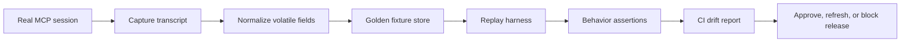

# Golden Transcript Tests for MCP Tool Adapters That Must Not Drift

## Hook

Most MCP tool breakage is boring at first. A field gets renamed, a tool starts returning a warning block before the real payload, or a transport upgrade changes ordering just enough to confuse the adapter layer. The agent does not crash dramatically. It just starts making worse decisions.

That is why I like golden transcript tests for MCP adapters. Instead of only unit-testing helper functions, you capture real request and response exchanges, replay them in CI, and diff the behavior at the boundary where the agent actually depends on it.

This post walks through the harness shape, what to record, what not to freeze too tightly, and the drift checks I would wire in before trusting a tool server upgrade.

## Why this matters

Schema-first contracts are necessary, but they are not enough. Real MCP integrations fail in the seams between schema validation, transport framing, auth decoration, retry wrappers, and adapter-specific cleanup.

Production symptoms usually look like this:

- the tool call validates, but the adapter drops a nested field the planner depended on
- the server starts returning richer errors, but the adapter collapses them into `tool failed`
- an SDK upgrade changes JSON key ordering or optional null handling, and snapshot tests become noisy while real regressions sneak past
- the agent prompt expects a stable shape, but the adapter silently starts emitting a different summary block

If you run agents against GitHub, tickets, CI, or infra tools, a thin replay layer pays for itself quickly.

## Architecture or workflow overview

### Visual plan

- **Hero:** dark terminal-style banner showing golden trace, replay harness, and drift gate stages
- **Diagram:** request capture -> normalization -> replay runner -> assertions -> CI drift report
- **Terminal visual:** failing replay diff showing removed field and changed severity
- **Comparison table:** unit tests vs schema validation vs golden transcripts
- **Tags:** MCP, Testing, Agent Reliability, Tooling, Integration
- **Meta description:** How to test MCP tool adapters with golden transcripts, replay harnesses, and schema drift checks so agent tools stay stable in production.
- **Code sections:** transcript recorder, replay harness, CI policy gate



A practical sequence looks like this:

1. Record a real tool interaction from a staging or developer session.
2. Strip volatile values like timestamps, request IDs, and expiring tokens.
3. Save the transcript with scenario metadata.
4. Replay it through the adapter in CI whenever the server, SDK, or adapter changes.
5. Fail only on meaningful drift, not cosmetic serialization changes.

## Implementation details

### 1) Record transcripts at the adapter boundary

I would capture requests and responses after auth decoration but before agent-specific summarization. That keeps the fixture close to the real contract without freezing secrets or planner fluff.

```ts
import { writeFileSync } from 'node:fs';
import { randomUUID } from 'node:crypto';

type McpMessage = {
  direction: 'request' | 'response';
  method: string;
  payload: unknown;
};

export function recordTranscript(scenario: string, messages: McpMessage[]) {
  const normalized = messages.map((msg) => ({
    ...msg,
    payload: scrubVolatileFields(msg.payload),
  }));

  const transcript = {
    id: randomUUID(),
    scenario,
    recordedAt: 'REDACTED_TIMESTAMP',
    messages: normalized,
  };

  writeFileSync(`testdata/mcp/${scenario}.json`, JSON.stringify(transcript, null, 2));
}
```

The important detail is selective normalization. If you scrub too aggressively, the replay stops protecting you. If you freeze every byte, harmless churn drowns the signal.

### 2) Replay transcripts against the adapter, not just the server

A lot of teams already test the upstream server. That still leaves your adapter layer untested, which is exactly where mapping bugs, pagination mistakes, and error squashing tend to live.

```ts
import { readFileSync } from 'node:fs';
import { strict as assert } from 'node:assert';

export async function replayScenario(name: string) {
  const transcript = JSON.parse(readFileSync(`testdata/mcp/${name}.json`, 'utf8'));
  const adapter = createAdapter({ baseUrl: 'http://localhost:8787' });

  for (const message of transcript.messages) {
    if (message.direction !== 'request') continue;

    const result = await adapter.invoke(message.method, message.payload);
    const expected = nextExpectedResponse(transcript.messages, message.method);

    assert.deepEqual(normalizeForAssertion(result), normalizeForAssertion(expected.payload));
  }
}
```

This is where I would encode behavior-level assertions too, not just raw snapshots:

- required fields still exist
- enumerated severities keep the same meaning
- pagination tokens stay resumable
- error responses preserve retryability hints

### 3) Add a policy gate for drift review

Not every diff should fail a release. Some changes are deliberate and should force review instead of causing flaky red builds forever.

```yaml
name: mcp-adapter-replay
on:
  pull_request:
    paths:
      - 'src/mcp/**'
      - 'testdata/mcp/**'
      - 'package.json'

jobs:
  replay:
    runs-on: ubuntu-latest
    steps:
      - uses: actions/checkout@v4
      - uses: actions/setup-node@v4
        with:
          node-version: 22
      - run: npm ci
      - run: npm run test:mcp-replay
      - run: npm run test:mcp-contracts
```

The useful pattern is explicit fixture refresh policy, whether that is a label, trailer, or PR checklist.

### Example drift output

```text
Scenario: github-issue-create
Method: tools/call github.issue.create

- expected result.error.severity = "retryable"
+ actual   result.error.severity = "fatal"

- expected result.output.issue.number = 418
+ actual   result.output.issue = null

Adapter drift detected after sdk upgrade 2.9.1 -> 3.0.0
```

## Comparison table

| Technique | What it catches well | What it misses | Best use |
| --- | --- | --- | --- |
| Unit tests | small helpers, parsing branches | real protocol drift | tight local logic |
| JSON schema validation | shape mismatches | semantic meaning changes | fail-closed boundaries |
| Golden transcripts | end-to-end adapter drift | totally new scenarios not recorded yet | regression protection |
| Live smoke tests | auth, connectivity, deployment wiring | deterministic assertions | staging confidence |

I would run all four, but golden transcripts are the layer that most directly protects agent behavior.

## What went wrong / tradeoffs

### Common failure modes

**1. Fixtures become too synthetic**

If you hand-author every transcript, you lose the weird edges that production traffic naturally contains. Start from captured sessions, then redact.

**2. Over-normalization hides breakage**

Teams often strip too much: nulls, warnings, field order, status hints, pagination markers. Then the replay suite stays green while planners quietly degrade.

**3. Snapshot churn makes people ignore failures**

If every SDK bump rewrites half the fixtures, the suite becomes wallpaper. Separate cosmetic normalization from semantic assertions so review stays sharp.

### Security and reliability concerns

- Never commit raw secrets, bearer tokens, cookies, or internal hostnames into fixtures.
- Be careful with personally identifiable issue titles, messages, or customer payloads.
- Treat replay fixtures as potentially sensitive operational evidence.
- Use staging identities or synthetic tenants when you can.

> **Pitfall:** do not record tool results after the agent has already summarized them for itself. That tests prompt formatting, not the adapter contract.

> **Best practice:** keep a small curated set of high-value scenarios, like happy path, permission denied, pagination, partial failure, and retryable upstream outage.

### What I would not do

I would not try to snapshot every possible tool call variant. That turns maintenance into a tax. I would keep 5 to 12 scenarios per important tool and choose them to represent real failure surfaces.

## Practical checklist or decision framework

Use golden transcript tests when most of these are true:

- [ ] the tool feeds an agent that makes multi-step decisions from structured output
- [ ] the adapter rewrites, filters, or enriches upstream MCP responses
- [ ] the server, transport, or SDK changes more than once a quarter
- [ ] a silent regression would create bad actions, not just ugly logs
- [ ] humans reviewing the PR need evidence beyond “tests passed”

If I were setting this up tomorrow, I would:

1. capture three real scenarios for the highest-risk tool
2. normalize only IDs, tokens, and timestamps
3. add one semantic assertion per scenario
4. wire the replay job into PR CI
5. require an explicit note whenever fixtures are refreshed

## Conclusion

Golden transcript tests are not glamorous, but they are one of the cleanest ways to keep MCP tool adapters honest. When the agent depends on a tool boundary, replayable evidence beats confidence every time.

## References

- [Model Context Protocol specification](https://modelcontextprotocol.io/)
- [GitHub Actions workflow syntax](https://docs.github.com/actions/using-workflows/workflow-syntax-for-github-actions)
- [JSON Schema](https://json-schema.org/)
