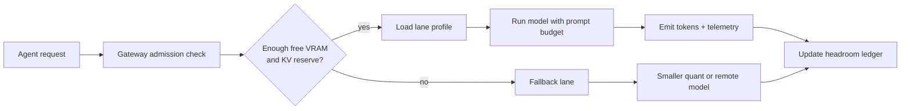

# GPU Memory Headroom Policies for Local Coding Model Gateways Without OOM Roulette

Running coding models locally feels great right up until the GPU falls off a cliff. A slightly longer prompt, one extra concurrent request, or a larger KV cache can turn a fast gateway into OOM roulette.

The annoying part is that these failures often look random. One run finishes in 8 seconds, the next dies with allocator errors, and the one after that limps along with terrible latency because the runtime is thrashing instead of refusing work cleanly.

This post is about the policy layer I wish more local model setups had. Not just "buy more VRAM," but concrete headroom rules: reserve memory for KV growth, cap prompt budgets, admit requests by lane, and fall back before the box melts.

## Why this matters

If you use local coding gateways for Claude Code, Cursor, Open WebUI, OpenAI-compatible wrappers, or homegrown agent runners, GPU memory becomes a shared production resource. The model weights are only part of the bill. Real failures come from:

- long prompts and giant diffs
- multiple simultaneous sessions
- speculative decoding or large batch settings
- embeddings or rerankers sharing the same GPU
- fragmented memory after mixed workloads

Local inference is cheap only when it stays predictable. Once the box starts flapping between success, slowdown, and crash, the saved API spend gets eaten by operator time and broken developer trust.

## Architecture and workflow overview



I like to treat local gateways as having three policy layers:

1. **Static floor** for weights, runtime overhead, and fragmentation slack.
2. **Dynamic reserve** for KV cache growth while generation is in progress.
3. **Admission policy** that rejects, queues, or reroutes work before memory goes critical.

A simple mental model is: do not schedule to the last free gigabyte. Leave room for the request to become larger than expected.

## Implementation details

### 1) Define lane budgets instead of one global limit

One mistake I see a lot is a single concurrency cap for every request. That is too crude for coding workloads. A short autocomplete-style turn and a 40k-token patch review do not have the same memory shape.

```yaml
# gateway-lanes.yaml
lanes:
  fast-edit:
    maxInputTokens: 6000
    maxOutputTokens: 1200
    concurrency: 2
    minFreeVramMb: 7000
    kvReserveMb: 5000
    fallback: qwen-coder-14b-q4

  deep-review:
    maxInputTokens: 24000
    maxOutputTokens: 2400
    concurrency: 1
    minFreeVramMb: 12000
    kvReserveMb: 9000
    fallback: remote-gpt-5.1-mini

  background-index:
    maxInputTokens: 4000
    maxOutputTokens: 400
    concurrency: 1
    minFreeVramMb: 5000
    kvReserveMb: 2500
    fallback: cpu-embedding-worker
```

The useful idea is that each lane has its own memory promises. If a `deep-review` request cannot get the reserve it needs, the gateway should say no early instead of starving everything else.

### 2) Admit work using projected memory, not current free VRAM alone

Current free VRAM is a weak signal. You need to estimate what the request will consume after prompt ingestion and during generation.

```python
from dataclasses import dataclass

@dataclass
class LaneBudget:
    min_free_vram_mb: int
    kv_reserve_mb: int
    max_input_tokens: int
    max_output_tokens: int


def can_admit(req, lane: LaneBudget, gpu):
    if req.input_tokens > lane.max_input_tokens:
        return False, "prompt_budget_exceeded"

    projected_kv_mb = estimate_kv_cache_mb(
        model=req.model,
        input_tokens=req.input_tokens,
        output_tokens=min(req.max_output_tokens, lane.max_output_tokens),
    )

    projected_total = gpu.runtime_overhead_mb + projected_kv_mb + lane.kv_reserve_mb
    free_after_admit = gpu.free_vram_mb - projected_total

    if free_after_admit < lane.min_free_vram_mb:
        return False, "insufficient_headroom"

    return True, "admit"
```

This is not perfect, but it is much better than optimistic scheduling. In practice, even a rough estimator catches the worst failures.

### 3) Log memory pressure as a product metric

If the only signal you watch is process death, you are already too late. I want three numbers on every request:

- free VRAM before admit
- projected KV usage
- free VRAM after completion

A small terminal summary is enough to spot drift:

```text
$ gateway status --recent
lane         req_id   prompt  projected_kv  free_before  outcome
fast-edit    a18f92   4200    1810 MB       10344 MB     admit
deep-review  b51d77   23800   7420 MB       11888 MB     fallback:remote
fast-edit    c90a11   6100    2470 MB       6622 MB      reject:prompt_budget
```

This tells you whether your problem is prompt inflation, oversubscription, or bad fallback routing.

## What went wrong and the tradeoffs

### Failure mode 1, thinking weights are the whole story

People size a box for model weights, then forget KV cache expansion. A 14B model that "fits" can still be unstable under real coding prompts. Long diffs and generated patches are memory events.

### Failure mode 2, sharing one GPU with everything

If embeddings, reranking, OCR, and coding generation all hit the same device, your headroom math becomes fiction. Either isolate workloads by lane or keep a larger static floor than feels comfortable.

### Failure mode 3, falling back too late

A late fallback often means you already paid the expensive part of the request. I would rather reroute a borderline request immediately than spend 12 seconds ingesting a huge prompt and then die on generation.

> **Pitfall:** Prompt compression can hide the symptom without fixing the system. If your box only works after aggressive summarization, you may have chosen the wrong quant, too much concurrency, or too small a reserve.

### Tradeoff table

| Approach | Upside | Downside | Where it fits |
| --- | --- | --- | --- |
| Static overprovisioning | Simple to reason about | Wastes capacity, still brittle under spikes | Single-user workstation |
| Adaptive admission control | Best reliability per GPU | Needs telemetry and request classification | Shared local gateway |
| Early remote fallback | Protects UX during peaks | Adds cost and policy complexity | Team or always-on setup |
| Queue everything | Avoids outright rejects | Latency becomes unpredictable fast | Background jobs only |

### What I would not do

I would not run a local coding gateway with unconstrained prompt size plus concurrency greater than one and call it production-ready. It might demo fine, but it will fail exactly when a real task gets interesting.

## Practical checklist

> **Best-practice checklist**
>
> - define per-lane prompt and output budgets
> - reserve explicit KV headroom, not just total free VRAM
> - reject or reroute before memory gets critical
> - keep embeddings and generation from silently sharing the same margin
> - log admission outcomes so budget drift is visible
> - test with worst-case diffs, not only happy-path prompts
> - keep one cheap fallback lane for peak moments

## References

- [NVIDIA DCGM](https://developer.nvidia.com/dcgm), for GPU telemetry and health metrics
- [vLLM documentation](https://docs.vllm.ai/), for serving and memory-related runtime behavior
- [llama.cpp](https://github.com/ggml-org/llama.cpp), for practical local inference tuning and KV cache tradeoffs

## Conclusion

Local coding gateways get much more trustworthy once memory becomes an explicit scheduling policy. If you reserve room for KV growth, classify requests into lanes, and fall back early, the box stops feeling "temperamental" and starts behaving like a real service.

That is the difference between a fun local demo and a setup people will actually keep using.
