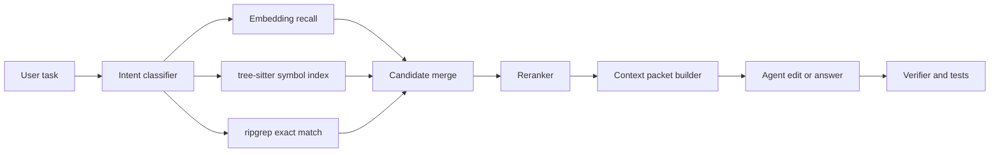

# Hybrid Code Retrieval for AI Coding Agents That Beats Full-Repo Prompt Stuffing

Most AI coding mistakes are retrieval mistakes wearing a generation costume. The model edits the wrong file, misses the helper that already exists, or rewrites an API because the only thing it saw was a vague prompt plus a pile of repo text.

The fix is usually not a bigger context window. It is better retrieval. In this post I will show the hybrid setup I would use for a real coding agent: embeddings for semantic recall, tree-sitter for code structure, ripgrep for exact matches, and a lightweight reranker before anything reaches the prompt.

This matters because smaller, more relevant context tends to improve both accuracy and reviewability. It also makes failures easier to debug when the model still gets it wrong.

## Why this matters

If your agent only has one retrieval move, it will fail in predictable ways:

- embeddings miss exact symbol names or newly added files
- keyword search misses semantically related helpers
- whole-file stuffing buries the useful lines under noise
- giant prompts increase latency and cost while making review worse

For code, retrieval has to serve three different tasks at once:

1. **Find the right files**
2. **Find the right symbols inside those files**
3. **Deliver a compact, inspectable packet to the model**

That is why a hybrid stack works better than any single index.

Direct references worth reading if you are building this for real:

- [tree-sitter](https://tree-sitter.github.io/tree-sitter/) for fast syntax-aware parsing
- [ripgrep](https://github.com/BurntSushi/ripgrep) for exact symbol and string search
- [pgvector](https://github.com/pgvector/pgvector) if you want embeddings in Postgres
- [OpenTelemetry](https://opentelemetry.io/) if you want to trace retrieval latency and failure modes

## Architecture overview



A few implementation notes matter more than the diagram itself:

- embeddings should retrieve chunks, not entire repositories
- tree-sitter should index symbols and parent-child relationships
- ripgrep should stay available as the escape hatch for literals, flags, env vars, and exact API names
- the final packet should be bounded by token budget and file-count budget

## Implementation details

### 1. Build a symbol-aware index, not just file chunks

A flat embedding index over random 800-token code chunks is better than nothing, but it loses too much structure. I prefer indexing symbols and selected surrounding spans.

```ts
import Parser from 'tree-sitter';
import TypeScript from 'tree-sitter-typescript';

const parser = new Parser();
parser.setLanguage(TypeScript.typescript);

export function extractSymbols(source: string, path: string) {
  const tree = parser.parse(source);
  const symbols: Array<{path: string; name: string; kind: string; start: number; end: number}> = [];

  function walk(node: Parser.SyntaxNode) {
    if ([
      'function_declaration',
      'class_declaration',
      'method_definition',
      'interface_declaration',
      'type_alias_declaration'
    ].includes(node.type)) {
      const nameNode = node.childForFieldName('name');
      symbols.push({
        path,
        name: nameNode?.text ?? 'anonymous',
        kind: node.type,
        start: node.startIndex,
        end: node.endIndex
      });
    }

    for (const child of node.children) walk(child);
  }

  walk(tree.rootNode);
  return symbols;
}
```

The useful trick here is that the chunk boundary follows code structure. Later, when the agent asks about `buildContextPacket`, you can fetch the function body, its imports, and maybe its nearest sibling helpers instead of pasting two pages of unrelated code.

### 2. Keep keyword search as a first-class retrieval path

Exact search is still the best tool for some jobs. If a model mentions `X-Request-Id`, `FEATURE_FLAG_AGENT_MODE`, or `dangerouslySetInnerHTML`, I do not want to hope embeddings figure it out.

```bash
rg -n --hidden --glob '!node_modules' --glob '!dist' \
  'buildContextPacket|ContextBudget|FEATURE_FLAG_AGENT_MODE' .
```

I usually treat ripgrep hits as high-confidence candidates when:

- the query includes exact symbols
- the issue references a stack trace or config key
- the repo is changing quickly and embeddings may lag behind the latest commit

A lot of retrieval bugs come from teams treating semantic search as magical and exact search as legacy. That is backwards. Good systems use both.

### 3. Merge candidates, then rerank before prompt assembly

Once you have candidates from different channels, score them together. Embeddings alone will overvalue semantically similar but operationally irrelevant files.

```yaml
retrieval:
  maxCandidates: 40
  finalContextFiles: 8
  strategies:
    - name: embeddings
      weight: 0.45
    - name: tree_sitter_symbol_match
      weight: 0.35
    - name: ripgrep_exact_match
      weight: 0.20
  rerank:
    enabled: true
    model: cross-encoder-mini
    keepTopK: 12
```

My rule of thumb is simple: retrieve broadly, rerank aggressively, prompt narrowly.

The reranker does not need to be fancy. It only needs to answer, “Which of these candidates is most likely to matter for this specific task?” That one stage often cuts prompt size by half without hurting quality.

### 4. Build context packets that are reviewable by humans too

A good context packet is not just model food. It should be readable enough that a human reviewer can inspect the evidence later.

A packet I like includes:

- task summary
- top files with a one-line reason each
- symbol excerpts, not whole files by default
- related tests
- known constraints or no-go files
- one small section called `why_these_files` for auditability

```json
{
  "task": "Add retry jitter to the GitHub webhook worker",
  "files": [
    {
      "path": "src/workers/githubWebhook.ts",
      "reason": "Primary retry loop lives here"
    },
    {
      "path": "src/lib/backoff.ts",
      "reason": "Existing delay helpers already used by adjacent workers"
    }
  ],
  "symbols": [
    "processWebhookEvent",
    "computeBackoffMs",
    "RetryPolicy"
  ],
  "tests": [
    "tests/githubWebhook.test.ts"
  ]
}
```

That shape tends to produce better edits because the agent receives a compact map instead of an undifferentiated text dump.

## What went wrong, and the tradeoffs

### Failure mode 1: stale embeddings after fast-moving refactors

This is the most common production bug. Your semantic index points to an old helper that was renamed yesterday. The agent confidently edits dead code.

What I would do:

- tie the embedding index to a commit SHA
- rebuild incrementally on changed files
- lower embedding confidence when the repository is ahead of the indexed SHA
- always allow ripgrep fallback against the working tree

### Failure mode 2: symbol indexes that ignore generated or polyglot code

Tree-sitter is great, but only where you actually have grammars and clean parse paths. In mixed repos, you will still hit YAML, SQL, shell, generated SDKs, and templates.

That means your retrieval layer needs graceful degradation. I would rather have a crude exact-match fallback than pretend the structural index is complete.

### Failure mode 3: packing too much context because the retriever found it

Retrieval recall and prompt usefulness are not the same thing. More files can reduce answer quality by making the task ambiguous.

| Choice | Benefit | Cost | When I would use it |
| --- | --- | --- | --- |
| Large top-k recall | Better coverage | More noise and latency | Early exploration, offline evals |
| Aggressive reranking | Smaller prompt, better focus | Can hide edge-case files | Normal coding tasks |
| Whole-file inclusion | More surrounding context | Token bloat | Tiny files or config files |
| Symbol-level excerpts | High precision | Needs indexing work | Most application code |

### Security and reliability notes

Two things are easy to miss:

1. **Prompt injection can ride in through retrieved docs or generated files.** Treat retrieved external content as tainted, especially markdown, HTML, and copied issue text.
2. **Retrieval is part of your correctness boundary.** If the wrong file makes the packet, the model can be perfectly obedient and still ship the wrong patch.

I would trace retrieval spans separately and log these fields at minimum:

- query type
- candidate counts per strategy
- rerank latency
- final file list
- index commit SHA
- whether fallback search changed the final result

## Practical checklist

- [ ] embeddings are built from symbol-aware chunks, not random megachunks
- [ ] exact search exists and is not hidden behind a failure path
- [ ] every packet records why each file was included
- [ ] retrieval is tied to a repo SHA or change counter
- [ ] final context has a hard token budget and hard file-count budget
- [ ] tests and adjacent config files are eligible retrieval targets
- [ ] you can inspect retrieval latency and false-positive rates in traces

## What I would do again

If I were building this today, I would start embarrassingly simple:

1. ripgrep
2. tree-sitter symbol extraction
3. embeddings in a small local store
4. one reranker
5. packet builder with explicit budgets

I would not start with a giant vector pipeline and five clever heuristics. Most teams do not have a generation problem first. They have a retrieval discipline problem.

## Conclusion

Hybrid retrieval is one of the highest-leverage upgrades you can make to an AI coding agent. It reduces prompt size, improves edit accuracy, and makes bad outputs easier to debug.

The important shift is mental, not just technical: treat retrieval as part of the agent's architecture, not as a pre-processing detail.
