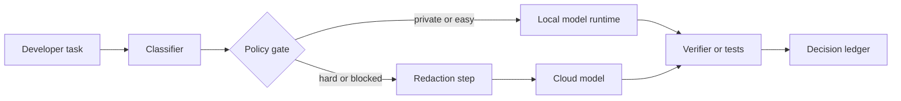

# Hybrid Local and Cloud AI Dev Workflows Without Losing Control

Running everything in the cloud is easy until the repo is private, the prompts include customer text, or the team starts noticing how much latency they are paying for routine work. Running everything locally sounds cleaner, right up until a small laptop model misses the tricky refactor and burns an hour.

That is why I like hybrid AI development setups more than either extreme. The useful question is not local or cloud. It is which tasks deserve fast private local inference, which ones deserve stronger hosted models, and how to make that handoff explicit instead of accidental.

This post walks through the workflow I would actually use: local-first defaults, policy-based escalation, redaction before remote calls, and a routing ledger that makes cost and privacy tradeoffs inspectable.

## Why this matters

A lot of teams end up with a fake architecture. They say they are using local models for privacy, but the hard prompts still get pasted into a hosted IDE extension. Or they say the cloud path is temporary, but every meaningful task quietly routes there because nobody encoded the decision rule.

A hybrid workflow matters when you care about at least one of these:

1. private code or customer context should stay local by default
2. routine edits should feel instant instead of round-tripping to a remote API
3. difficult tasks still need a stronger model sometimes
4. cost needs to be predictable instead of being rediscovered on the invoice
5. failures should produce a visible routing decision, not mystery behavior

The point is not ideological purity. The point is giving simple work the cheapest safe path, while preserving a deliberate escape hatch for the problems local models still fumble.

## Architecture or workflow overview



I think of the setup as three lanes.

| Lane | When to use it | Good examples | What I would not send there |
| --- | --- | --- | --- |
| Local fast lane | quick edits, search, summaries, boilerplate, private context | repo Q and A, shell help, small diffs | giant architecture rewrites without verification |
| Local private lane | sensitive code or customer context | incident notes, regulated code, production config review | tasks that need broad world knowledge or best-in-class reasoning |
| Cloud escalation lane | high-complexity reasoning or blocked local runs | multi-file refactors, design comparisons, migration planning | raw secrets, customer PII, whole repos by default |

My opinionated rule is simple: local by default, cloud by exception, and exceptions should be explainable in one sentence.

## Implementation details

### 1. Route by task shape, not by whoever clicks first

Start with an explicit classifier. It does not need to be magical. It just needs to be consistent enough that people stop improvising with sensitive context.

```python
from dataclasses import dataclass
from typing import Literal

@dataclass
class TaskEnvelope:
    summary: str
    changed_files: int
    contains_customer_data: bool
    requires_external_knowledge: bool
    retry_count: int
    estimated_tokens: int

Lane = Literal["local_fast", "local_private", "cloud_escalation"]


def choose_lane(task: TaskEnvelope) -> Lane:
    if task.contains_customer_data:
        return "local_private"
    if task.requires_external_knowledge:
        return "cloud_escalation"
    if task.changed_files > 8 or task.retry_count >= 2:
        return "cloud_escalation"
    if task.estimated_tokens < 12000:
        return "local_fast"
    return "local_private"
```

This is intentionally boring. Boring is good here. It is much easier to debate a few threshold values than to untangle why developers keep bypassing the privacy story under deadline pressure.

### 2. Keep the local runtime simple and inspectable

For local work I like a very plain adapter over something like Ollama or llama.cpp. Fancy orchestration before basic observability is usually a mistake.

```ts
const LOCAL_MODEL = process.env.LOCAL_MODEL ?? "qwen2.5-coder:14b";

export async function runLocalPrompt(prompt: string) {
  const response = await fetch("http://127.0.0.1:11434/api/generate", {
    method: "POST",
    headers: { "Content-Type": "application/json" },
    body: JSON.stringify({
      model: LOCAL_MODEL,
      prompt,
      stream: false,
      options: { temperature: 0.1, num_ctx: 16384 }
    })
  });

  if (!response.ok) throw new Error(`local model failed: ${response.status}`);
  return response.json();
}
```

What matters more than model fashion is whether the lane is predictable. If the local path is flaky, people will tunnel around it. If it is predictable, even a weaker model earns a lot of trust on repetitive work.

### 3. Redact before remote escalation

The most common hybrid failure is pretending that cloud escalation is safe because the destination vendor is trusted. That misses the point. You still need to minimize what leaves the machine.

```python
import re

SECRET_PATTERNS = [
    re.compile(r"AKIA[0-9A-Z]{16}"),
    re.compile(r"sk-[A-Za-z0-9]{20,}"),
    re.compile(r"-----BEGIN (?:RSA|EC|OPENSSH) PRIVATE KEY-----"),
]


def redact_for_remote(text: str) -> str:
    redacted = text
    for pattern in SECRET_PATTERNS:
        redacted = pattern.sub("[REDACTED_SECRET]", redacted)
    redacted = re.sub(r"customer_[0-9]+", "customer_[REDACTED]", redacted)
    return redacted
```

Redaction is not perfect, and it should not be marketed as perfect. But a decent scrubber plus a lane policy is far better than casually shipping raw buffers uphill because the local model needed help.

### 4. Log the routing decision like you mean it

A hybrid workflow gets better only if you can see whether your policy is helping or being ignored.

```json
{
  "timestamp": "2026-05-10T11:41:00Z",
  "task_id": "refactor-auth-middleware",
  "lane": "cloud_escalation",
  "reason": "changed_files>8 and retry_count>=2",
  "local_model": "qwen2.5-coder:14b",
  "remote_model": "claude-sonnet-4.5",
  "redaction_applied": true,
  "verification": ["npm test", "npm run lint"],
  "outcome": "accepted"
}
```

If your team cannot answer how often local work escalates, which prompts were redacted, or which lanes are cheapest per successful task, then the workflow is still running on vibes.

### 5. Give the developer a terminal-level escape hatch

Sometimes the local model is just wrong twice in a row. I would rather make escalation explicit than watch people paste whole files into browser tabs.

```text
$ ai-route explain "refactor auth middleware across api and web"
lane=cloud_escalation
reason=changed_files>8,retry_count=2
redaction=enabled
verification=npm test,npm run lint

$ ai-route run --lane cloud_escalation task.md
remote model accepted task packet
verification passed
ledger written to .ai-routing/runs/2026-05-10T11-41-00.json
```

That kind of output does two useful things. It reassures the developer that the system is behaving on purpose, and it leaves behind a paper trail when the cost conversation eventually shows up.

## What went wrong and the tradeoffs

### Failure mode 1: the local lane became a false economy

A tiny local model answered quickly but required three retries for tasks that a better hosted model solved in one pass. Low per-call cost looked cheap until developer time entered the picture.

> **Pitfall:** optimize for cost per accepted result, not cost per request. Cheap wrong answers are not actually cheap.

### Failure mode 2: the cloud lane became the real default

Teams often add a cloud fallback, then quietly route every interesting task there. The policy says hybrid. The behavior says hosted-only with extra ceremony.

> **Best practice:** review routing logs weekly. If escalation exceeds your expectation, either the classifier thresholds are wrong or the local model lane is underpowered.

### Failure mode 3: privacy claims outran the implementation

I have seen teams say "private by default" while logs still included stack traces with customer identifiers. Local inference alone does not save you if your surrounding tools keep leaking context into analytics, traces, or bug reports.

### Comparison table

| Choice | Upside | Downside | My default |
| --- | --- | --- | --- |
| All local | Maximum control and privacy | Hard tasks stall, model quality varies | Good only for narrow workflows |
| All cloud | Strong models and easy setup | Privacy, cost, and latency drift | Too blunt for daily engineering |
| Hybrid without policy | Flexible in theory | Becomes random and unreviewable | Avoid |
| Hybrid with policy lanes | Balanced privacy, speed, and quality | More plumbing upfront | Best long-term option |

### What I would not do

I would not forward full repository snapshots to the cloud just because the task felt complicated.

I would not let an IDE plugin choose the remote path silently.

I would not claim compliance or privacy wins unless routing, redaction, and logs all support the story.

## Practical checklist

- [ ] Define local fast, local private, and cloud escalation lanes
- [ ] Route by inspectable task features instead of gut feel
- [ ] Redact secrets and identifiers before remote calls
- [ ] Log the lane, reason, and verification result for every run
- [ ] Measure retry count and accepted-result cost, not just token spend
- [ ] Keep local runtimes boring and observable before making them clever
- [ ] Make cloud escalation explicit in the CLI or UI
- [ ] Review escalation rates regularly and tune thresholds

## Conclusion

Hybrid AI development workflows work best when the handoff is deliberate. Keep private and routine work local, escalate hard tasks on purpose, and treat routing as an engineering system instead of a personal habit.

That gives you something better than local-only purity or cloud-only convenience. It gives you a workflow you can actually defend when privacy, latency, and cost start pulling in different directions.

## References

- [Ollama API reference](https://github.com/ollama/ollama/blob/main/docs/api.md)
- [llama.cpp server mode](https://github.com/ggml-org/llama.cpp/tree/master/examples/server)
- [vLLM documentation](https://docs.vllm.ai/)
- [GitHub Actions secrets guidance](https://docs.github.com/en/actions/security-for-github-actions/security-guides/using-secrets-in-github-actions)
