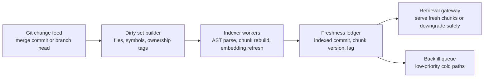

# Incremental Code Index Refresh for AI Coding Agents Without Full Rebuilds

A lot of repository retrieval stacks for coding agents still rely on a painful bargain. You either rebuild the whole index often enough to stay fresh, or you accept stale chunks and hope the model notices when a symbol moved three directories ago.

That trade is worse in monorepos. Full rebuilds chew CPU, contend with CI, and lag behind active branches. Stale retrieval is cheaper until it sends the agent toward deleted files, old interfaces, or code paths that were valid yesterday.

This post covers the workflow I would use instead: a commit-driven dirty set, symbol-level invalidation, bounded backfills, and a freshness ledger that makes index drift visible.

## Why this matters

Fresh retrieval is part of agent reliability, not just search quality. If your code index is stale, the model can reason perfectly and still choose the wrong evidence packet.

In practice, an index refresh system has to answer four boring but important questions:

- what changed since the last indexed commit?
- which symbols and chunks are now unsafe to serve?
- how quickly do we need updated embeddings or metadata?
- what do we do when refresh falls behind?

Useful references: [Tree-sitter](https://tree-sitter.github.io/tree-sitter/), [ripgrep](https://github.com/BurntSushi/ripgrep), [Sourcegraph code search](https://sourcegraph.com/docs/code_search), and [OpenTelemetry](https://opentelemetry.io/).

## Architecture or workflow overview

The trick is to separate detection, invalidation, recompute, and serving. A small dirty set beats a full rebuild almost every time.



### The internal visual plan

- **Hero image idea:** dark repo graph card with git diff feed, dirty symbol set, and freshness ledger blocks
- **Diagram idea:** change feed to invalidation to workers to retrieval gateway
- **Terminal visual idea:** lag alert showing queue depth and oldest dirty commit
- **Comparison table idea:** full rebuilds vs incremental refresh vs lazy-on-read hydration
- **Tags:** Code Retrieval, AI Coding Agents, Indexing, Monorepos, Search Infrastructure
- **Meta description:** A practical guide to incremental code index refresh for AI coding agents using change feeds, symbol-level dirty sets, bounded backfills, and rollback lanes so retrieval stays fresh without rebuilding the whole repository index.
- **Code sections:** dirty set builder, freshness-aware retrieval gate, worker queue config

## Implementation details

### 1) Build a dirty set from commits, not filesystem timestamps

File mtimes are too noisy in CI and too weak across rebases. I prefer a commit-based feed that records changed paths, commit SHA, and merge base.

```python
from dataclasses import dataclass
from pathlib import Path
import subprocess

@dataclass
class DirtyPath:
    path: str
    commit_sha: str
    change_type: str


def changed_paths(base_sha: str, head_sha: str, repo: Path) -> list[DirtyPath]:
    cmd = [
        'git', 'diff', '--name-status', f'{base_sha}..{head_sha}'
    ]
    output = subprocess.check_output(cmd, cwd=repo, text=True)
    dirty = []
    for line in output.splitlines():
        change_type, path = line.split('\t', 1)
        dirty.append(DirtyPath(path=path, commit_sha=head_sha, change_type=change_type))
    return dirty
```

This gives you a stable starting point for invalidation. Renames and deletes matter because they can leave orphan chunks behind even if retrieval still returns a high similarity score.

### 2) Invalidate by symbol neighborhood, not just file path

If `auth/token.py` changes, the right blast radius is usually bigger than one file and much smaller than the whole repo. I like a symbol graph that marks direct definitions, imports, and ownership edges as dirty.

```python
from collections import defaultdict


def expand_dirty_symbols(changed_files: list[str], symbol_index: dict, import_graph: dict) -> set[str]:
    dirty_symbols = set()
    for path in changed_files:
        for symbol in symbol_index.get(path, []):
            dirty_symbols.add(symbol)
            dirty_symbols.update(import_graph.get(symbol, []))
    return dirty_symbols
```

That gives you a better refresh slice for chunking, summaries, embedding recompute, and repo-map snippets.

### 3) Make serving freshness-aware

Retrieval should know when a chunk is stale. Otherwise the index can fall behind quietly and the agent will still consume the results as if they were current.

```yaml
retrieval_gate:
  max_commit_lag: 12
  max_age_minutes: 20
  high_risk_paths:
    - services/auth/**
    - infra/terraform/**
    - billing/**
  stale_action:
    default: degrade
    high_risk: block
  fallback_search:
    - rg_exact
    - symbol_lookup
```

My default is:

- degrade to exact search plus live file reads for normal paths
- block stale semantic chunks in high-risk directories
- emit a trace attribute so stale-serving becomes visible in dashboards

### 4) Keep a freshness ledger that humans can inspect

The ledger is the part most teams skip, and it is the part that turns indexing bugs from folklore into operations.

```json
{
  "repo": "github.com/acme/monorepo",
  "head_commit": "8a54d8c",
  "indexed_commit": "c1d44fe",
  "oldest_dirty_commit": "7b1f1a0",
  "queue_depth": 184,
  "stale_chunks_served_last_hour": 7,
  "high_risk_paths_blocked": 3
}
```

A good ledger tells you whether the system is healthy, degraded, or actively lying.

```text
$ indexctl freshness status --repo acme/monorepo
HEAD COMMIT             8a54d8c
INDEXED COMMIT          c1d44fe
COMMIT LAG              11
OLDEST DIRTY AGE        14m
QUEUE DEPTH             184
STALE SERVES (1H)       7
HIGH-RISK BLOCKS        3
MODE                    DEGRADED, SAFE FALLBACK ACTIVE
```

## What went wrong and the tradeoffs

### Failure mode 1, delete and rename churn leaves ghost chunks

The classic bug is that the embedding store still holds vectors for a file that was renamed or removed. Similarity search happily returns them because the text is still relevant even though the path is dead.

> **Pitfall:** if your invalidation layer cannot tombstone deleted chunks immediately, your retrieval stack will eventually serve ghosts.

### Failure mode 2, aggressive neighborhood expansion becomes a stealth full rebuild

Symbol-level invalidation is useful until every hot package depends on every other hot package. Put a cap on neighborhood growth and spill the rest into a background backfill queue.

### Failure mode 3, lazy-on-read refresh looks cheap until traffic spikes

Refreshing chunks only when a query touches them is attractive, but it pushes indexing latency into the interactive path. That is fine for cold paths and bad for auth, migrations, deploy code, and incident tooling.

| Strategy | Best for | Good part | Main risk |
| --- | --- | --- | --- |
| Full rebuild | small repos, nightly jobs | simplest correctness story | expensive and slow under churn |
| Incremental refresh | active large repos | fast freshness with bounded work | needs better invalidation design |
| Lazy on read | long-tail cold code | minimal background cost | query latency and stale bursts |

### Security and reliability concerns

- stale index entries can route agents into old secret-handling code or pre-hardening paths
- rebases can make branch-local freshness look better than it is unless you compare against the right merge base
- backlog growth should trip admission controls before retrieval quality collapses silently

## Practical checklist

> **Best practice:** if the index is not fresh enough to trust, let retrieval say that clearly and downgrade on purpose.

- build dirty sets from commits, not mtimes
- tombstone deleted and renamed chunks immediately
- expand invalidation by symbol neighborhood, with a hard cap
- separate hot-path refresh from low-priority backfills
- track commit lag, oldest dirty age, queue depth, and stale serves
- block stale semantic retrieval for security-sensitive paths
- keep exact search and live file reads available as safe fallback tools
- sample stale incidents weekly and compare them against agent failures

## Conclusion

The best retrieval stack for coding agents is not the one with the biggest index. It is the one that stays fresh enough to trust under real code churn. Incremental refresh, symbol-aware invalidation, and a visible freshness ledger get you there without paying for full rebuilds every hour.
