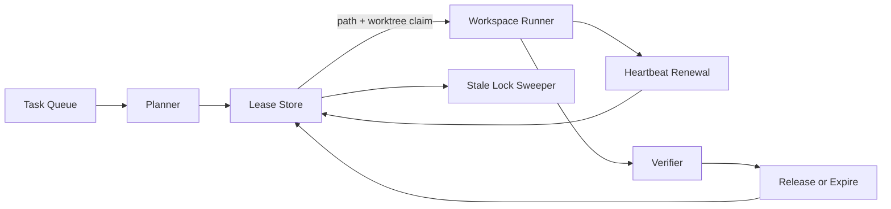

# Lease-Based Workspace Locks for Parallel AI Coding Agents Without Patch Collisions

## Hook
If you let multiple coding agents run against the same repository, they eventually step on each other. One rewrites a file another agent already patched. One reuses a worktree that still has uncommitted state. One crashes and leaves behind a lock that nobody trusts.

That failure mode is easy to miss because every individual run looks reasonable. The corruption only becomes visible later, when a verifier fails for the wrong reason or a reviewer sees a PR that mixed unrelated edits.

The fix is not “just use branches.” Branches isolate git history, not active file ownership. What you need is a small lease system around paths, worktrees, and heartbeats.

## Why this matters
Parallel AI coding is now normal in repo automation, eval harnesses, and scheduled fixers. The moment you allow more than one worker to mutate a repo, you need a coordination story.

This matters most when you have:

- multiple agents running from a queue
- shared repos with reusable worktrees
- retry behavior after timeouts or verifier failures
- long-running tasks that pause for human approval

Without coordination, you get hidden costs:

- noisy diffs with unrelated edits
- non-deterministic verifier failures
- stale worktrees that poison later tasks
- race conditions that look like model mistakes

## Visual plan
- Hero: dark control-plane banner with path lease, heartbeat TTL, and stale-lock sweep cues
- Diagram: queue → planner → lease store → workspace → verifier flow with renewal and expiry
- Terminal visual: lock acquisition and stale-lock reclaim output
- Comparison table: file lock vs branch-per-task vs lease-based scopes
- Tags: AI Coding Agents, Concurrency Control, Repo Automation, Developer Tooling, Reliability
- Meta description: A practical guide to lease-based workspace locks for parallel AI coding agents using TTL-backed claims, path scopes, heartbeats, and stale-lock recovery so concurrent runs stop clobbering the same files.
- Code sections: lease claim schema, heartbeat renewal loop, lock-aware task scheduler

## Architecture or workflow overview


The useful unit is not “repo locked” or “repo unlocked.” It is a scoped lease.

A task claims:

1. a workspace or worktree identifier
2. a path prefix or file set
3. a TTL with periodic renewal
4. an owner identity and task ID

That gives you enough coordination to let unrelated edits proceed in parallel while still blocking collisions.

## Implementation details
### 1. Store leases as explicit records
The lease record should be boring and inspectable. I like a single table or JSON document model with strong uniqueness around the scope key.

```json
{
  "leaseId": "lease_01jy4v8r9f",
  "repo": "github.com/acme/payments",
  "scope": {
    "kind": "path-set",
    "paths": ["services/billing", "libs/tax"]
  },
  "workspaceId": "wt-billing-17",
  "owner": {
    "taskId": "job_4821",
    "agentId": "codex-worker-4"
  },
  "status": "active",
  "version": 3,
  "acquiredAt": "2026-06-22T12:02:00Z",
  "expiresAt": "2026-06-22T12:07:00Z"
}
```

A few details matter here:

- keep the scope explicit, not implied by branch name
- version the record so renewals can be compare-and-swap updates
- make expiry visible so operators can reason about stale state quickly

### 2. Renew leases with heartbeats, not permanent locks
Permanent locks are how automation gets stuck forever. Use short TTLs and renew only while the task is still healthy.

```python
from datetime import datetime, timedelta, UTC

LEASE_TTL = timedelta(minutes=5)
RENEW_EVERY = timedelta(minutes=2)

def renew_lease(store, lease_id, expected_version):
    now = datetime.now(UTC)
    updated = store.compare_and_swap(
        lease_id=lease_id,
        expected_version=expected_version,
        patch={
            "version": expected_version + 1,
            "expiresAt": (now + LEASE_TTL).isoformat()
        }
    )
    if not updated:
        raise RuntimeError("lease lost or replaced")
    return expected_version + 1
```

The worker should treat a failed renewal as a stop signal. That is the safest choice. If another process reclaimed the lease, continuing to edit is now hostile.

### 3. Make scheduling aware of overlapping scopes
A queue worker should not just pop the next task and hope. It should ask whether the requested scope overlaps with active leases.

```ts
function canStart(taskScope: string[], activeScopes: string[][]): boolean {
  return !activeScopes.some(active =>
    active.some(path =>
      taskScope.some(candidate =>
        candidate.startsWith(path) || path.startsWith(candidate)
      )
    )
  );
}
```

This overlap rule is intentionally simple. Prefix-based scopes work well when repos already follow service or package boundaries. If your ownership model is weaker than that, the locking problem is not the first thing you need to fix.

### 4. Separate worktree reuse from scope ownership
A common bug is treating a reusable worktree as proof of safe ownership. It is not.

A better pattern is:

- lease the path scope first
- allocate or attach a clean worktree second
- run verification in that worktree
- release both independently

That prevents one stale worktree from becoming a hidden global singleton.

### Example terminal output
```text
$ agent-runner acquire --repo acme/payments --scope services/billing
lease acquired: lease_01jy4v8r9f
workspace: wt-billing-17
ttl: 300s

$ agent-runner renew lease_01jy4v8r9f
lease renewed: version=4 expiresAt=2026-06-22T12:09:00Z

$ agent-runner sweep-stale --repo acme/payments
reclaimed: lease_01jy4v7d2a owner=job_4818 expired=164s
```

## Comparison table
| Approach | What it helps | Where it fails | My take |
| --- | --- | --- | --- |
| Global repo lock | Easy to implement | Kills parallelism, causes queues to back up | Fine for prototypes, wasteful in production |
| Branch per task only | Cleaner git history | Does not prevent file collisions or stale worktrees | Necessary, not sufficient |
| OS file locks | Low-level exclusivity | Hard to reason about across distributed workers | Useful inside one machine, weak as a fleet policy |
| Lease-based scoped locks | Good parallelism with visible ownership | Needs heartbeat logic and stale-lock recovery | Best fit for serious agent runners |

## What went wrong and the tradeoffs
### Failure mode: stale locks after worker death
This is the obvious one. A worker crashes, the lease remains, and everything downstream waits forever.

That is why TTL-backed expiry matters more than manual unlock commands. Manual unlock is an escape hatch, not your steady-state design.

### Failure mode: scopes that are too broad
If every task asks for `src/`, your lease system becomes a fancy global lock. If every task asks for individual files, planners spend more time computing scopes than doing useful work.

In practice, path-prefix scopes such as service directories, package roots, or owned module sets are the sweet spot.

### Failure mode: unsafe lock stealing
Some teams let a newer worker steal an existing lease if it looks idle. I do not love that unless you also have proof the original task is dead.

Safer inputs for reclaiming a lease:

- TTL expired
- heartbeat missed twice
- underlying worker process no longer exists
- verifier has not emitted progress for a bounded interval

### Security concern: forged renewals
If a worker can renew any lease by ID, one compromised process can hold the repo hostage.

Minimum guardrails:

- signed or scoped worker identity
- compare-and-swap version checks
- lease owner binding on renew and release calls
- audit logs for every reclaim action

### Cost tradeoff: more coordination traffic
Yes, lease heartbeats add writes. But the alternative is wasting much larger amounts of time in failed runs, rework, and noisy reviews. This is a good trade in any system that runs agents continuously.

## Practical checklist
Use lease-based workspace locks if most of these are true:

- [ ] more than one agent can mutate the same repo at once
- [ ] tasks can run longer than a few minutes
- [ ] workers retry automatically after failure
- [ ] worktrees are reused instead of always recreated
- [ ] reviewers keep seeing mixed or flaky diffs

What I would do again:

- [ ] scope leases to service or package boundaries
- [ ] use short TTLs with automatic renewal
- [ ] stop work immediately on lost lease
- [ ] make stale-lock sweeps observable and auditable
- [ ] keep branch isolation, but do not mistake it for concurrency control

## Best-practices callout
A lease system should fail closed for writes and fail open for reads. If lock state is ambiguous, pause the mutating task. Let read-only planning or retrieval continue.

That one rule prevents a lot of quiet damage.

## Conclusion
Parallel AI coding gets messy when the system confuses “multiple branches exist” with “multiple writers are coordinated.” They are not the same thing.

Lease-based workspace locks are not glamorous, but they turn concurrency from a source of diff corruption into something you can actually reason about.

## References
- https://martin.kleppmann.com/2016/02/08/how-to-do-distributed-locking.html
- https://redis.io/docs/latest/develop/use/patterns/distributed-locks/
- https://git-scm.com/docs/git-worktree
