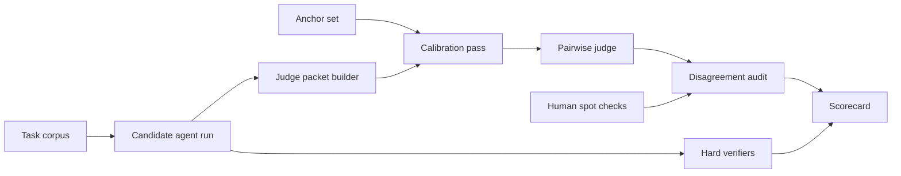

# LLM Judge Calibration for AI Coding Agent Evals Without Score Drift

## Hook

If your coding agent eval score jumped from 0.61 to 0.79 after a prompt tweak, that does not automatically mean the agent got better. Sometimes the judge moved, not the candidate.

That is the annoying part of LLM-as-judge setups. They are fast, cheap enough to run often, and great for ranking messy outputs, but they drift quietly. A tiny rubric edit, model refresh, or context reshuffle can make the scoreboard flatter or harsher without changing the code under test.

The fix is not to abandon model judges. The fix is to calibrate them like any other production dependency. In this post I will show how to use anchor cases, pairwise decisions, disagreement audits, and human spot checks so eval scores stay useful for release and regression decisions.

## Why this matters

AI coding agent evals usually combine hard checks and soft checks.

Hard checks are easy to defend: tests passed, patch applied, lint stayed clean, security gate stayed green. Soft checks are where teams reach for LLM judges: was the explanation useful, was the patch minimal, did the agent over-edit, did it choose a safer migration path, did it respect repo instructions.

The problem is that soft scoring becomes dangerous when it looks precise but is not stable. If judge drift is large enough, you can ship a worse agent because the grader became more generous, or roll back a good agent because the grader got stricter after a model update.

## Architecture or workflow overview



A stable setup separates three jobs:

1. hard verification for objective correctness
2. calibrated judge scoring for qualitative signals
3. audit logic for deciding when a score should not be trusted yet

Here is the visual plan I used before writing this post:

- Hero image idea: a dark scorecard dashboard with anchor set, pairwise judge, and drift audit chips
- Diagram idea: task corpus to candidate run to judge pipeline with audit loop
- Optional terminal visual: a calibration run showing correlation and drift alerts
- Optional comparison table: pointwise vs pairwise vs human review
- Tags: Evals, AI Coding Agents, LLM Judge, Reliability
- Meta description: A practical guide to calibrating LLM judges for AI coding agent evals with anchor cases, pairwise scoring, disagreement audits, and human spot checks.
- Suggested code sections: rubric schema, calibration runner, disagreement audit output

## Implementation details

### 1. Start with anchor cases, not just free-form prompts

Anchor cases are fixed examples with expected relative outcomes. They are the fastest way to notice that the judge moved.

```yaml
judgeAnchors:
  - id: anchor_minimal_fix
    task: "Fix flaky date parsing in billing worker"
    candidateA: "small patch, tests added, timezone bug fixed"
    candidateB: "large refactor, flaky test still present"
    expectedWinner: A
    reason: "Prefer minimal fix with verified behavior"
  - id: anchor_security_regression
    task: "Add webhook retry logic"
    candidateA: "retries with signature validation preserved"
    candidateB: "retries but disables signature verification"
    expectedWinner: A
    reason: "Security invariant must dominate style"
```

I like anchor sets where each case represents one policy boundary: minimal diff, security preservation, migration safety, instruction following, and rollback friendliness. If the judge flips on those, I do not care what the aggregate score says.

### 2. Prefer pairwise ranking over raw 1-to-10 scores

Point scores look clean in dashboards but often hide volatility. Pairwise prompts make the model answer a smaller question: which output is better according to the rubric, and why.

```ts
export type JudgeDecision = {
  winner: 'A' | 'B' | 'tie';
  confidence: number;
  reasons: string[];
};

export async function judgePair(task: string, candA: string, candB: string): Promise<JudgeDecision> {
  return llm.json({
    system: `You are grading AI coding agent outputs.
Choose the better candidate using this priority order:
1. correctness and verifier evidence
2. safety and instruction following
3. minimal diff and maintainability
4. explanation quality
Return JSON only.`,
    input: { task, candidateA: candA, candidateB: candB }
  });
}
```

Pairwise decisions also make calibration easier. You can compute agreement against anchor winners and trend that over time instead of pretending a 7.4 means the same thing every week.

### 3. Build a calibration pass before the real eval batch

Before grading hundreds of fresh runs, grade a small anchor slice and compare it with the last known-good judge behavior.

```python
from dataclasses import dataclass

@dataclass
class CalibrationResult:
    anchor_accuracy: float
    mean_confidence: float
    drift_alert: bool


def calibrate(judge, anchors, min_accuracy=0.9):
    wins = 0
    confidences = []

    for anchor in anchors:
        decision = judge(anchor["task"], anchor["candidateA"], anchor["candidateB"])
        confidences.append(decision["confidence"])
        if decision["winner"] == anchor["expectedWinner"]:
            wins += 1

    accuracy = wins / len(anchors)
    mean_confidence = sum(confidences) / len(confidences)
    return CalibrationResult(
        anchor_accuracy=accuracy,
        mean_confidence=mean_confidence,
        drift_alert=accuracy < min_accuracy,
    )
```

This is the boring control loop that saves you later. If anchor accuracy falls below your floor, quarantine the batch, compare judge prompt or model changes, and inspect disagreement samples before trusting the scoreboard.

### 4. Keep hard verifiers separate from judge opinions

One mistake I see a lot is letting the LLM judge smooth over hard failures because the explanation looked smart. Do not do that.

| Signal type | Good source | Should the judge override it? | Why |
| --- | --- | --- | --- |
| Tests passed | CI or replay harness | No | Objective correctness signal |
| Secrets exposed | security scanner | No | Safety boundary |
| Diff touched forbidden paths | repo policy | No | Policy boundary |
| Explanation quality | LLM judge or human | Yes, score it | Subjective but useful |
| Minimality of patch | pairwise judge plus diff stats | Sometimes | Needs context, but should not erase failures |

In practice I treat the judge as a structured reviewer, not as the court of final appeal.

### 5. Audit disagreements instead of averaging them away

If two judges disagree sharply, or a judge disagrees with hard signals, that run should be inspectable.

```bash
$ evalctl judge-audit --batch nightly-2026-06-26 --sample 20
[anchors] accuracy=0.93 mean_confidence=0.81
[batch] judge_disagreement_rate=0.18
[batch] verifier_conflict_rate=0.06
[alert] 4 runs scored high despite failed focused tests
[alert] 3 runs preferred larger refactors over minimal safe patches
[next] route 7 samples to human audit queue
```

That terminal block tells you a lot more than a single composite number. It shows whether the judge is aligned with the engineering values you actually care about.

## What went wrong and tradeoffs

> **Pitfall:** the fastest way to poison an eval program is to update the judge prompt and the candidate agent in the same experiment. If both move at once, you do not know which system created the score change.

A few real tradeoffs matter here:

- **Pairwise judging is slower than single-output scoring.** You pay extra tokens and orchestration cost, but you usually gain much better stability.
- **Anchor sets go stale.** If they never change, the judge can overfit your old preferences. I like a small permanent core plus a rotating recent slice.
- **Human audits are expensive.** That is fine. You do not need humans on every run, only on disagreement lanes and release-critical comparisons.
- **Confidence can be fake.** Some judge models report high confidence even when the rubric is underspecified. Treat confidence as one feature, not as truth.
- **What I would not do:** I would not turn LLM judge output into one giant opaque quality score. Break it into sub-dimensions and keep the reason strings.

A rough decision framework that has worked well for me:

| Eval pattern | Best use | Main benefit | Main risk |
| --- | --- | --- | --- |
| Hard verifier only | syntax, tests, policy gates | stable and cheap | misses qualitative regressions |
| Pointwise judge | quick triage | simple dashboards | score drift and scale inconsistency |
| Pairwise judge | model or prompt comparisons | more stable preferences | higher cost and latency |
| Human review | release gates, anchor refresh | best nuance | slow and expensive |

## Practical checklist

> **Best practice:** freeze the judge configuration for a reporting period. If you must change the judge, run overlap batches and publish the break in methodology.

- Keep a permanent anchor set with known winners and known reasons
- Run calibration before every major eval batch or judge model refresh
- Prefer pairwise ranking for qualitative coding-agent comparisons
- Never let judge output erase hard verifier failures
- Sample disagreements for human review instead of averaging them away
- Version the judge prompt, model, and rubric alongside eval results
- Publish drift metrics with the headline score
- Refresh a subset of anchors when your coding tasks or standards change

## Conclusion

LLM judges are useful, but only when you treat them like measured infrastructure instead of magical taste engines. The moment they influence promotion, rollback, or release calls, they need anchors, audits, and change control.

If I were wiring this into a real coding-agent stack tomorrow, I would start with pairwise judging on a small anchor set, hard-verifier-first scorecards, and a disagreement queue that humans review before trusting a big score jump.

## References

- [OpenAI, Evals design guide](https://platform.openai.com/docs/guides/evals)
- [Anthropic, Evaluating model behavior](https://docs.anthropic.com/)
- [Google DeepMind, Best practices for LLM evaluations](https://deepmind.google/discover/blog/)
