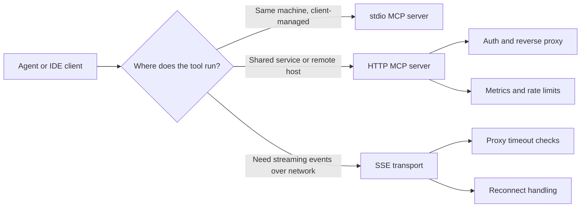

# MCP Transport Choices for Real Agent Workflows, stdio vs HTTP vs SSE

Running a Model Context Protocol server over the wrong transport creates the kind of bug that wastes a whole afternoon. The tools work on your laptop, then fail behind a gateway, stall under a proxy, or quietly lose auth once multiple users show up.

That is why transport choice matters more than most MCP tutorials admit. The protocol surface is small, but the runtime shape is not. Local tools want one thing, remote agents want another, and production traffic adds a third set of constraints.

This post is the version I wish I had before wiring MCP servers into mixed local and remote agent workflows. I will walk through when to use stdio, when to move to HTTP, when SSE still makes sense, and what I would avoid.

## Why this matters

Transport is not a cosmetic implementation detail. It changes how you authenticate users, how you supervise processes, how you debug failures, and how much operational burden lands on the team.

A local coding assistant talking to a file-system MCP server has very different needs from a hosted agent platform calling the same capability over a network boundary. If you choose a network transport too early, you add auth and exposure risk. If you stay on stdio too long, you make multi-user routing and shared infrastructure much harder than it needs to be.

The practical question is not which transport is the most elegant. It is which transport matches the trust boundary and failure mode of the workflow you are actually running.

## Architecture and workflow overview

### The simple decision rule

- Use **stdio** when the MCP server is launched and owned by the local client process.
- Use **HTTP** when you need remote access, shared infrastructure, auth, and normal observability.
- Use **SSE** only when you specifically need server-pushed events and you know the client and proxy path handle long-lived streams well.

### Mermaid flow



### Deployment shapes

| Workflow | Best transport | Why |
| --- | --- | --- |
| IDE launches a local tool server | stdio | Fast setup, no exposed port, easiest trust model |
| Shared internal MCP service for a team | HTTP | Normal auth, logs, proxies, and service ownership |
| Remote execution with push-style progress events | SSE | Works, but only if the network path is stream-friendly |
| Public internet exposure | HTTP | Easier TLS, auth middleware, rate limiting, and auditability |
| One-off local experiments | stdio | Lowest ceremony and quickest feedback loop |

## Implementation details

### 1. Local stdio server for tool launching

stdio is still the right default for local developer tooling. The client spawns the server, wires stdin and stdout, and keeps the trust boundary on one machine.

```json
{
  "mcpServers": {
    "repo-tools": {
      "command": "node",
      "args": ["./dist/server.js"],
      "env": {
        "REPO_ROOT": "/workspace/project"
      }
    }
  }
}
```

This setup is attractive for three reasons:

1. no port allocation or firewall rules
2. no separate auth layer for a single-user local workflow
3. process lifecycle stays coupled to the client session

The downside is that supervision becomes client-specific. If the client crashes, the server often disappears with it. That is fine for local tools, but it is awkward for shared infrastructure.

### 2. Remote HTTP server with explicit auth

Once the server needs to serve more than one client or live behind a gateway, I would rather move to HTTP than keep stretching stdio through wrappers.

```ts
import express from "express";
import { verifyToken } from "./auth";
import { handleMcpRequest } from "./mcp-handler";

const app = express();
app.use(express.json({ limit: "1mb" }));

app.post("/mcp", async (req, res) => {
  const principal = await verifyToken(req.headers.authorization);
  if (!principal) {
    return res.status(401).json({ error: "unauthorized" });
  }

  const result = await handleMcpRequest({
    principal,
    body: req.body,
    requestId: req.headers["x-request-id"]
  });

  res.json(result);
});

app.listen(8080);
```

HTTP wins here because the infrastructure story is boring in a good way. Reverse proxies, TLS termination, rate limits, tracing, audit logs, and service ownership all fit normal production patterns.

### 3. Reverse proxy guardrails for a networked MCP service

If the tool surface is powerful, the transport is only half the problem. The other half is making sure the service is not accidentally wide open.

```nginx
server {
  listen 443 ssl http2;
  server_name mcp.internal.example.com;

  location /mcp {
    proxy_pass http://127.0.0.1:8080;
    proxy_set_header X-Request-Id $request_id;
    proxy_set_header Authorization $http_authorization;
    proxy_read_timeout 300s;
    client_max_body_size 1m;
    limit_except POST { deny all; }
  }
}
```

The point is not that nginx is special. It is that HTTP gives you a clean place to enforce network policy, request limits, and identity propagation without inventing custom wrappers around a process pipe.

### 4. Terminal-output style failure signal

```text
$ curl -i https://mcp.internal.example.com/mcp
HTTP/2 401
content-type: application/json
x-request-id: 8cb36f14a2b8

{"error":"unauthorized"}
```

That kind of failure is healthy. It is explicit, observable, and easy to debug. Compare that with a client-managed stdio process hanging because it inherited the wrong environment or a proxy silently buffering an event stream.

## What went wrong and the tradeoffs

### The mistake I see most often

Teams start with stdio, then keep adding layers until the local process is effectively acting like a remote service. At that point, they still have process-pipe semantics, but they also have network-ish problems. That is the worst of both worlds.

### Transport tradeoff table

| Concern | stdio | HTTP | SSE |
| --- | --- | --- | --- |
| Local setup speed | Excellent | Good | Fair |
| Remote access | Weak | Excellent | Good |
| Auth integration | Minimal | Excellent | Good |
| Proxy compatibility | Not relevant | Excellent | Mixed |
| Process supervision | Client-owned | Service-owned | Service-owned |
| Streaming updates | Poor | Good with chunked responses or polling | Excellent when supported |
| Multi-user isolation | Weak | Strong | Strong |
| Debuggability | Mixed | Strong | Mixed |

### Failure modes worth planning for

> **Pitfalls to expect**
>
> - **stdio deadlocks** when a tool emits noisy logs to stdout instead of stderr.
> - **HTTP trust leaks** when internal-only MCP endpoints are deployed without real auth because they started as local experiments.
> - **SSE timeouts** when a load balancer or CDN silently closes long-lived streams.
> - **Cross-tenant confusion** when a shared MCP service does not bind requests to an authenticated principal.

### Security and reliability concerns

A remote MCP transport should always answer three questions clearly:

- Who is calling this tool?
- What resources can they touch?
- How do I audit or revoke that access?

stdio can get away with lighter answers because the user and the machine are usually the same trust boundary. HTTP cannot. If the service crosses machines, users, or environments, auth and audit stop being optional.

SSE adds another concern: reconnect behavior. If the client reconnects after a stream interruption, you need an opinion on idempotency, replay, and partial tool execution. Otherwise the agent can easily repeat a side effect.

### What I would not do

I would not expose a powerful MCP server directly to the public internet just because the protocol is simple. I would also not build a shared team service on stdio wrappers unless there is a very short migration plan to HTTP. Both choices look fast at first and then become expensive once real users arrive.

## Practical checklist

- [ ] Is the server launched by a local client on the same machine?
- [ ] Do multiple users or agents need to share the same service?
- [ ] Do you need standard auth, TLS, audit logs, and reverse proxy controls?
- [ ] Will the network path allow long-lived streams without buffering or timeout surprises?
- [ ] Can repeated requests cause side effects if a client reconnects?
- [ ] Do you have a clean ownership model for process supervision and restarts?

If most answers are local and single-user, choose stdio. If most answers involve shared infrastructure, choose HTTP. If the main reason you are hesitating is live progress streaming, test SSE in the real network path before committing to it.

## Best-practice summary

> **What I would do again**
>
> - Start local tools on stdio so the first version stays simple.
> - Promote to HTTP as soon as the service becomes shared, remote, or security-sensitive.
> - Treat SSE as a specialized choice, not the default, because proxy behavior matters more than protocol elegance.
> - Design request identity and auditability before exposing any write-capable tool remotely.

## Conclusion

MCP transport choice is really a trust-boundary choice. stdio is excellent for local ownership. HTTP is the safest default for shared systems. SSE is useful, but only when the network path behaves the way the protocol expects.

If I were setting up a new agent stack today, I would start with stdio for local tools, move shared services to HTTP early, and treat streaming transports as an optimization that has to earn its complexity.
