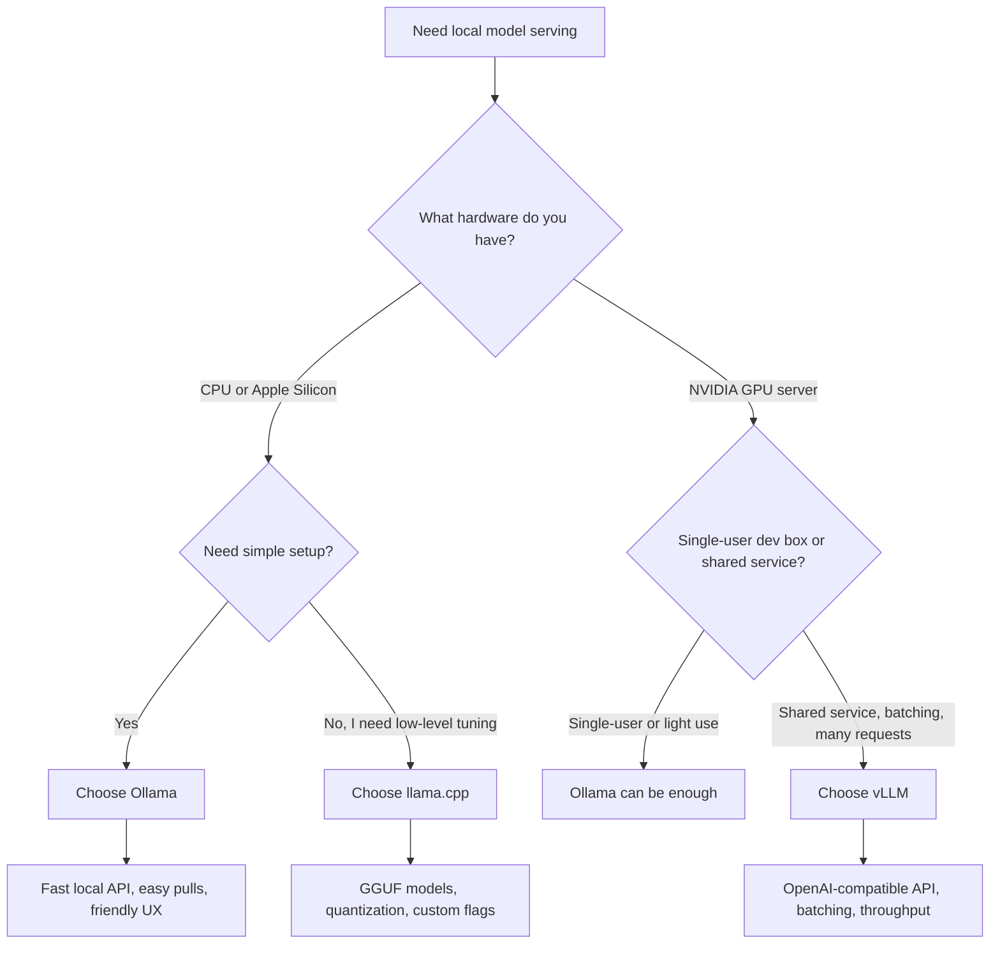

# Ollama vs llama.cpp vs vLLM for Local AI Development

Local model serving gets messy fast. A setup that feels great on a laptop can become the wrong choice the moment you need structured outputs, higher concurrency, or a clean OpenAI-compatible endpoint for tools.

The mistake I see most often is treating Ollama, llama.cpp, and vLLM as interchangeable. They are not. All three can run a model locally, but they optimize for different things: convenience, low-level control, and throughput.

If I were setting up a practical local AI stack for real developer work, I would choose based on deployment shape first, not benchmark screenshots. This post breaks down where each runtime fits, what goes wrong, and what I would actually run on a MacBook, a Linux workstation, and a small GPU box.

## Why this matters

If your local AI runtime sits behind coding tools, eval jobs, or internal automation, the serving layer becomes part of the product. Token speed matters, but so do API compatibility, memory behavior, quantization support, batching, startup time, and debuggability.

A bad runtime choice usually fails in one of four ways:

- the model fits, but latency is painful
- the model is fast, but the API shape is awkward for tools
- concurrency looks fine in a demo, then collapses under parallel requests
- the system works until you switch hardware or model format

That is why I like to treat the decision as a workflow question:

- **Ollama** when I want the fastest path to a usable developer endpoint
- **llama.cpp** when I need maximum control on constrained local hardware
- **vLLM** when I want a serious serving layer for GPUs and multi-request workloads

## Architecture and workflow overview

### Decision flow



### What each tool is really optimizing for

| Runtime | Best at | Main tradeoff | Best fit |
| --- | --- | --- | --- |
| Ollama | Fast setup and good defaults | Less low-level control than raw runtimes | Laptop dev, local coding tools, quick prototypes |
| llama.cpp | Tight hardware control, GGUF support, CPU and Apple Silicon friendliness | More manual setup and rougher serving ergonomics | Power users, edge devices, constrained hardware |
| vLLM | GPU throughput, batching, OpenAI-style serving | Wants stronger hardware and more ops discipline | Shared services, eval farms, agent backends |

## Implementation details

### 1. Ollama, the easiest way to get to "working"

Ollama is what I reach for when I want a usable endpoint in minutes. It hides a lot of model and runtime complexity behind a predictable CLI and API.

```bash
# install and start the local service
curl -fsSL https://ollama.com/install.sh | sh
ollama serve

# pull and run a model
ollama pull qwen2.5-coder:14b
ollama run qwen2.5-coder:14b
```

That is enough for local prompting, but the real value is the HTTP layer. A lot of local tooling can point at Ollama with almost no glue.

```bash
curl http://localhost:11434/api/generate \
  -d '{
    "model": "qwen2.5-coder:14b",
    "prompt": "Write a Python function that validates a webhook signature.",
    "stream": false
  }'
```

What I like:

- model management is easy
- local API is predictable
- good enough defaults for many laptop workflows
- friendly for OpenAI-compatible shims and coding assistants

What I do not like:

- the abstraction can get in the way when I want exact runtime flags
- advanced throughput tuning is not its strongest side
- model packaging can obscure what is really running underneath

### 2. llama.cpp, when hardware reality matters more than polish

llama.cpp is the runtime I trust when I care about exact control. It is especially useful when I need GGUF models, aggressive quantization, or a setup that runs acceptably on weaker hardware.

A simple server launch can look like this:

```bash
./llama-server \
  -m ./models/Qwen2.5-Coder-14B-Instruct-Q4_K_M.gguf \
  -c 8192 \
  -ngl 999 \
  --host 0.0.0.0 \
  --port 8080
```

And a request against the server:

```bash
curl http://localhost:8080/completion \
  -H 'Content-Type: application/json' \
  -d '{
    "prompt": "Summarize the security risks of exposing a local model server to a LAN.",
    "n_predict": 220,
    "temperature": 0.2
  }'
```

The biggest reason to choose llama.cpp is control over the hardware-model tradeoff. You can decide exactly how hard to quantize, how much context to allocate, and how much GPU offload to use.

A few knobs matter a lot:

- **GGUF quantization level** affects memory and quality more than most people expect
- **context size** can blow up RAM or VRAM if you copy cloud defaults locally
- **GPU offload settings** can turn an unusable setup into a decent one

### 3. vLLM, when local becomes a real service

vLLM is the one I pick when the workload starts looking like infrastructure instead of a personal toy. If multiple tools, jobs, or users will hit the model, vLLM's batching and serving model usually wins.

```bash
python -m vllm.entrypoints.openai.api_server \
  --model Qwen/Qwen2.5-Coder-14B-Instruct \
  --host 0.0.0.0 \
  --port 8000 \
  --dtype auto \
  --max-model-len 16384
```

That gives you an OpenAI-style endpoint, which is a huge operational advantage.

```python
from openai import OpenAI

client = OpenAI(base_url="http://localhost:8000/v1", api_key="local-dev")

resp = client.chat.completions.create(
    model="Qwen/Qwen2.5-Coder-14B-Instruct",
    messages=[
        {"role": "system", "content": "You are a careful coding assistant."},
        {"role": "user", "content": "Generate a bash script that rotates nginx logs safely."}
    ],
    temperature=0.1,
)

print(resp.choices[0].message.content)
```

That OpenAI-compatible surface is not just convenient. It means eval tools, internal apps, and coding clients can often switch with a config change instead of a rewrite.

## A rough deployment matrix

| Environment | What I would choose | Why |
| --- | --- | --- |
| MacBook or Mac mini for solo dev | Ollama first, llama.cpp if tuning is needed | Quick setup matters more than squeezing every token |
| Linux workstation with mixed CPU/GPU constraints | llama.cpp | GGUF flexibility and explicit control are valuable |
| Small NVIDIA server serving several tools | vLLM | Batching and API compatibility matter more than simplicity |
| Private coding assistant for one engineer | Ollama | Lowest setup friction and good enough ergonomics |
| Benchmarking many quantized GGUF variants | llama.cpp | Better visibility into what the model is actually doing |

## Terminal-output style reality check

```text
$ ollama ps
NAME                    ID              SIZE      PROCESSOR    UNTIL
qwen2.5-coder:14b       8f3c1f2f3d44    9.0 GB    100% GPU     4 minutes from now

$ curl -s http://localhost:8000/v1/models | jq '.data[0].id'
"Qwen/Qwen2.5-Coder-14B-Instruct"

$ ./llama-bench -m ./models/qwen-coder-q4.gguf -ngl 999
prompt eval time =  412.14 ms / 128 tokens
generation time  = 6150.52 ms / 256 runs   (24.00 tok/s)
```

The lesson is simple: these tools succeed on different definitions of success. Developer convenience, single-stream latency, and multi-request throughput are not the same metric.

## What went wrong and the tradeoffs that actually matter

### 1. Quantization is not free

I like quantized models, but people routinely understate the quality hit. A heavily compressed coding model can still autocomplete syntax well while quietly getting architecture decisions wrong.

**What I would not do:** choose the smallest quantization that fits and call it optimized. I would test it on the actual tasks I care about, especially code edits and structured outputs.

### 2. API compatibility becomes a force multiplier

A runtime with a clean OpenAI-style interface can save a surprising amount of glue code. This is one reason vLLM ages well once a setup grows beyond one local script.

Ollama also does well here for local development, but some advanced behaviors across tools may still need adapters.

### 3. Context defaults cause expensive mistakes

One of the easiest ways to waste RAM or VRAM is copying a large context setting from a hosted model setup into local inference without checking the memory cost.

If a laptop suddenly starts swapping, or a GPU server falls over after a model switch, oversized context is one of the first places I look.

### 4. Security gets ignored because "it is local"

Local servers stop being local the second you bind them to all interfaces or put them behind a reverse proxy for convenience. If the model server can execute tools or sits near sensitive code, that matters a lot.

> **Pitfall:** never expose a local model server to a wider network without explicit auth, network boundaries, and a clear understanding of which apps can reach it.

### 5. Throughput benchmarks can be misleading

A runtime can look amazing in a single-user benchmark and still disappoint under actual parallel load. vLLM usually earns its keep here, but only if the underlying GPU and model choice are reasonable.

## Best-practice checklist

- Pick the runtime based on deployment shape, not hype
- Start with the smallest system that satisfies the workflow
- Benchmark your real prompts, not generic token loops
- Validate structured outputs and tool-calling behavior early
- Keep context sizes conservative until proven necessary
- Do not expose the server broadly without auth and network controls
- Track model format requirements before switching runtimes
- Treat quantization changes as quality changes, not just memory changes

## A practical decision framework

If I had to reduce this to one page of advice:

- Choose **Ollama** for the shortest path from zero to useful local AI
- Choose **llama.cpp** when you need to squeeze performance from constrained hardware or control every important knob
- Choose **vLLM** when the model server is becoming shared infrastructure instead of a personal tool

The wrong move is not picking any one of these. The wrong move is pretending one runtime is best for every environment.

## Conclusion

Ollama, llama.cpp, and vLLM all belong in a serious local AI toolkit. I do not think of them as rivals so much as layers for different moments in the stack.

For most solo developer laptops, I would start with Ollama. For constrained hardware or GGUF-heavy experimentation, I would reach for llama.cpp. For shared GPU-backed services, I would move to vLLM quickly and never look back.
