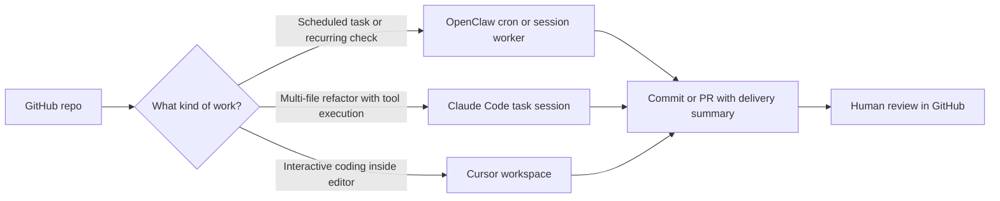

# OpenClaw vs Claude Code vs Cursor for Repository Automation

If you try to use one AI tool for every repository task, you usually get a mess. The scheduled automation ends up trapped in an editor workflow, the deep refactor gets forced into a cron lane, or the chat-first agent starts doing work that really needed local code awareness.

That is the wrong framing. OpenClaw, Claude Code, and Cursor are not interchangeable. They each fit a different control surface, and the quality of the outcome depends more on picking the right lane than on squeezing out one more benchmark point.

This is the practical comparison I wish more teams used. I will map each tool to the job it handles best, show the workflow shape, and call out where I would not trust it without extra guardrails.

## Why this matters

Repository automation has moved past simple autocomplete. People are now asking agents to:

- run scheduled maintenance
- open and update pull requests
- refactor multiple files with reviewable diffs
- work inside an editor loop while a human steers
- operate with different approval, isolation, and persistence needs

That means the real decision is not "which AI tool is smartest?" It is:

- which tool owns unattended scheduled work
- which tool owns deep repo execution
- which tool stays best when a human is actively editing
- which boundary keeps review and rollback boring

Useful references for this comparison:

- OpenClaw docs and automation patterns: <https://github.com/claw-ai/openclaw>
- Claude Code product docs: <https://docs.anthropic.com/en/docs/claude-code/overview>
- Cursor docs: <https://docs.cursor.com/>
- Git worktrees for isolation: <https://git-scm.com/docs/git-worktree>

> **Best-practice callout:** Do not choose one tool as a religion. Choose lanes, then assign the tool that fails most safely in that lane.

## Architecture or workflow overview

### Mermaid flow



### Decision sequence

1. Classify the task by who initiates it: schedule, terminal task, or active editor session.
2. Decide whether the agent needs persistence, isolation, or immediate human steering.
3. Keep repo changes reviewable by forcing output into git commits and pull requests.
4. Use worktrees or isolated sessions when tasks may overlap.
5. Reserve final approval for merge or push, not for every keystroke.

## Implementation details

### Where OpenClaw fits best

OpenClaw is strongest when the workflow starts outside the editor. If the job should happen at noon every day, on the next heartbeat, or as an isolated worker that opens a PR and reports back, this is where OpenClaw earns its keep.

It gives you scheduling, session isolation, and delivery control. That matters for repetitive repo work like blog generation, dependency checks, doc refreshes, or issue triage.

```json
{
  "name": "daily-repo-maintenance",
  "schedule": { "kind": "cron", "expr": "0 12 * * *", "tz": "UTC" },
  "sessionTarget": "isolated",
  "payload": {
    "kind": "agentTurn",
    "message": "Sync master, update the generated changelog, open a PR, and summarize the result.",
    "timeoutSeconds": 1800
  },
  "delivery": { "mode": "announce" }
}
```

That is a clean fit for unattended work. I would not use Cursor for that, and I would not want Claude Code to become my scheduler.

### Where Claude Code fits best

Claude Code is strongest when the work is repository-deep, terminal-driven, and likely to involve several verification passes. It shines on tasks where you want one agent session to inspect files, edit them, run tests, and keep a coherent chain of reasoning around the repo.

This is the lane for refactors, bug hunts, migrations, and reviewable patches that need shell access and verification more than editor UX.

```bash
git worktree add ../repo-refactor feature/refactor-auth-layer
cd ../repo-refactor
claude-code "Refactor auth middleware to separate session parsing from permission checks. Run tests after each milestone and stop if snapshots drift."
```

The worktree is not optional fluff here. It prevents one long-running agent session from trampling another task on the same checkout.

### Where Cursor fits best

Cursor is best when a human is actively present in the editor. The win is tight feedback: read code, ask for a local transformation, inspect the diff, edit manually, repeat. The model is part of the coding loop, not the whole automation surface.

That makes Cursor ideal for:

- local implementation spikes
- file-by-file refactors with visual inspection
- prompt-and-edit loops where the developer remains the driver
- navigating a large codebase while preserving editor context

A good Cursor workflow still benefits from explicit repo instructions and verification commands. Otherwise the speed turns into drift.

```markdown
# .cursor/rules/repo-automation.mdc
- Prefer edits under src/automation and tests/automation.
- Do not change CI workflows unless explicitly asked.
- After code changes, run: npm test -- automation
- Summarize tradeoffs before broad renames.
```

### Comparison table

| Tool | Best lane | Strength | Weak spot | I would use it for |
|---|---|---|---|---|
| OpenClaw | Scheduled and chat-orchestrated automation | Cron, isolation, delivery, multi-session coordination | Not the nicest place for fine-grained active editing | recurring repo jobs, PR packaging, routine checks |
| Claude Code | Terminal-first repo execution | Strong repo reasoning, shell workflow, verification loop | Less ergonomic for always-on interactive editing | refactors, debugging, migrations, test-driven patching |
| Cursor | Editor-first collaboration | Fast local iteration and inline editing | Weak fit for unattended automation and job orchestration | active development, scoped edits, pair-programming in IDE |

### Before vs after tool selection

**Before:** one tool used for everything, mixed state, weak approvals, overlapping edits.

**After:**

- OpenClaw owns recurring automation and status delivery.
- Claude Code owns deep repo tasks that need shell execution.
- Cursor owns interactive file editing with a human present.
- GitHub remains the shared review boundary.

### Example terminal-output visual

```text
$ openclaw cron run daily-repo-maintenance
run: success
artifacts: blog/openclaw-vs-claude-code-vs-cursor-repo-automation.md
commit: 7f2c1ab
pr: #214
summary: scheduled content job completed on isolated session

$ claude-code task status
repo: ../repo-refactor
checks: 18 passed, 1 skipped
result: ready for PR
```

## What went wrong, and the tradeoffs

### Failure mode 1: treating editor tools like background workers

Cursor is excellent when the human is present. It is a bad choice for recurring unattended jobs. Once you need schedule precision, delivery rules, or durable automation history, editor context is the wrong abstraction.

### Failure mode 2: letting scheduled workers mutate shared repo state

OpenClaw gets dangerous if scheduled jobs write directly into a repo that a human or another agent is already using. Use updated master, isolated sessions, or separate worktrees. Otherwise the automation starts failing for boring and preventable reasons.

### Failure mode 3: using repo-deep agents without stop conditions

Claude Code is powerful, which is exactly why it needs bounded tasks. A long prompt with vague goals can produce a polished but over-broad patch. I want milestones, verification commands, and clear no-go zones.

### Tradeoff table

| Question | OpenClaw | Claude Code | Cursor |
|---|---|---|---|
| Can it run on a schedule cleanly? | Yes | Not naturally | No |
| Is it good at multi-step repo execution? | Good with the right prompt and tool access | Excellent | Moderate |
| Is it ideal for active editor collaboration? | No | Sometimes | Excellent |
| Does it handle isolation well? | Yes, via isolated sessions and cron jobs | Yes, with worktrees and task scoping | Depends on workspace discipline |
| Where does approval feel natural? | Before external actions or final publish | Before risky commands or merge-ready patching | During live editing and final commit review |

### Security and reliability concerns

The main risk is not usually model quality. It is boundary confusion.

- scheduled agents need explicit delivery and idempotency rules
- repo-deep agents need isolated state and verification commands
- editor agents need repository rules so convenience does not widen scope
- all three need git as the recovery mechanism, not hidden local state

> **Pitfalls section:**
>
> - Do not run recurring repo automation on a dirty working tree.
> - Do not let two agents write to the same checkout without worktree isolation.
> - Do not confuse "helpful in the editor" with "safe for unattended operations."
> - Do not skip PR review just because the patch came from the tool you currently like most.

## Practical checklist

### What I would do again

- Use OpenClaw for exact-time jobs, recurring checks, and delivery-aware automation.
- Use Claude Code for shell-heavy repo work that needs test and diff discipline.
- Use Cursor for the interactive coding loop where a human stays in the driver seat.
- Put overlapping work on separate worktrees or isolated sessions.
- Keep GitHub PRs as the final review boundary.

### What I would not do

- I would not choose a single tool and force every workflow through it.
- I would not let unattended automation share mutable local repo state.
- I would not ask editor-first tooling to become my scheduler.
- I would not trust any repo automation lane without explicit verification commands.

## Conclusion

OpenClaw, Claude Code, and Cursor all belong in a modern AI development workflow. They just belong in different places.

If the work is scheduled, operational, and delivery-aware, use OpenClaw. If it is deep repo execution with shell-backed verification, use Claude Code. If a human is actively shaping the code inside the editor, use Cursor.

That division sounds simple, but it prevents a lot of expensive confusion.
