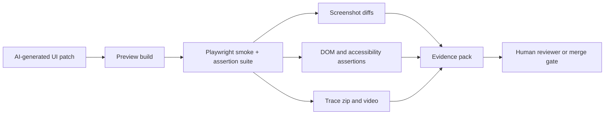

# Playwright Evidence Packs for AI-Generated UI Changes

AI-generated frontend patches are often just convincing enough to get merged and just brittle enough to break the next real user flow. A button moves, a modal closes in the happy path, and the PR screenshot looks clean. Then somebody opens Safari, changes viewport size, or triggers a loading state and the whole thing gets weird.

The problem is not that the model wrote bad code every time. The problem is that most UI review loops still accept a diff plus one static screenshot as proof. That is not enough for machine-written UI changes.

What actually helps is an **evidence pack**: screenshot diffs, DOM assertions, a trace bundle, and a short reviewer summary generated from a deterministic Playwright run. That gives you a much tighter loop between an AI patch and the proof that the patch behaves the way the PR claims.

## Why this matters

Frontend changes are a bad place to rely on optimistic review. UI bugs hide in timing, responsive layout, loading states, and focus management. AI tools can move fast here, but they also happily produce superficially plausible JSX, CSS, and event wiring.

An evidence pack changes the question from *"does this diff look reasonable?"* to *"what behavior did we actually verify?"*

That matters in production because the expensive part of UI regressions is usually not the patch itself. It is the cleanup cycle afterward: bug report, repro attempt, emergency follow-up PR, and damaged trust in automation.

## Architecture and workflow overview



The workflow I like is simple:

1. build the preview for the AI patch
2. run a narrow Playwright suite against the changed surface
3. attach visual and structural evidence to the PR
4. fail closed if key assertions or diff thresholds are exceeded

## Implementation details

### 1. Write tests that assert behavior, not just page load

A useful AI-review suite is small and opinionated. It should verify the flows that changed, not re-run your whole end-to-end catalog.

```ts
import { test, expect } from '@playwright/test';

test('pricing modal opens, traps focus, and closes cleanly', async ({ page }) => {
  await page.goto('/pricing');
  await page.getByRole('button', { name: 'Compare plans' }).click();

  const dialog = page.getByRole('dialog', { name: 'Plan comparison' });
  await expect(dialog).toBeVisible();
  await expect(dialog).toContainText('Starter');
  await expect(page.getByRole('button', { name: 'Start free trial' })).toBeFocused();

  await page.keyboard.press('Escape');
  await expect(dialog).toBeHidden();
  await expect(page.getByRole('button', { name: 'Compare plans' })).toBeFocused();
});
```

This matters because AI-generated UI code often passes a naive "element exists" check while failing focus return, keyboard behavior, or delayed render states.

### 2. Capture visual diffs with stable rendering rules

Visual checks are useful when you make them boring. Lock fonts, seed data, animations, and viewport size so the screenshot diff tells you about the patch, not random rendering noise.

```ts
import { defineConfig, devices } from '@playwright/test';

export default defineConfig({
  testDir: './tests/ui-evidence',
  fullyParallel: false,
  retries: 1,
  use: {
    baseURL: process.env.PREVIEW_URL,
    viewport: { width: 1440, height: 960 },
    colorScheme: 'dark',
    locale: 'en-US',
    timezoneId: 'UTC',
    trace: 'retain-on-failure',
    video: 'retain-on-failure',
    screenshot: 'only-on-failure',
  },
  projects: [
    { name: 'chromium', use: { ...devices['Desktop Chrome'] } },
  ],
});
```

Then in the assertion itself:

```ts
await expect(page).toHaveScreenshot('pricing-modal.png', {
  animations: 'disabled',
  caret: 'hide',
  maxDiffPixelRatio: 0.01,
});
```

A low but non-zero diff threshold is important. Zero makes UI evidence flaky. A loose threshold makes it meaningless.

### 3. Turn artifacts into a review packet

The hardest part is not generating artifacts. It is packaging them so a reviewer can use them in under two minutes.

```yaml
name: ui-evidence
on:
  pull_request:
    paths:
      - 'src/**'
      - 'components/**'
      - 'styles/**'
      - 'tests/ui-evidence/**'

jobs:
  verify-ui:
    runs-on: ubuntu-latest
    steps:
      - uses: actions/checkout@v4
      - uses: actions/setup-node@v4
        with:
          node-version: 22
          cache: npm
      - run: npm ci
      - run: npm run build
      - run: npm run preview &
      - run: npx wait-on http://127.0.0.1:4173
      - run: PREVIEW_URL=http://127.0.0.1:4173 npx playwright test
      - if: always()
        uses: actions/upload-artifact@v4
        with:
          name: playwright-evidence
          path: |
            playwright-report/
            test-results/
```

That artifact bundle usually gives you four high-value things:

- screenshot diffs for changed states
- DOM and accessibility assertion results
- a Playwright trace you can inspect locally
- a failure video when timing gets weird

### A simple review summary format

A reviewer summary should say what was checked and what was not checked. Short beats clever here.

```text
UI evidence summary
- Surface: pricing modal and comparison table
- Browsers: Chromium desktop
- Assertions: open, focus trap, Escape close, CTA visibility
- Visual snapshots: pricing-modal.png, pricing-table.png
- Artifacts: trace zip attached, failure video attached on retry
- Not covered: mobile layout, logged-in state, Safari-specific rendering
```

That last line is doing real work. One of the easiest ways to over-trust AI-generated UI fixes is to confuse *verified* with *complete*.

## What went wrong and the tradeoffs

### Common failure modes

**Snapshot churn from unstable pages**  
If timestamps, rotating testimonials, remote avatars, or animations are still live, the evidence pack turns into screenshot noise. Fix the page determinism first.

**False confidence from one browser**  
Chromium-only evidence is better than nothing, but it is still a lane, not universal truth. If the patch touches layout primitives, I would add WebKit before merge.

**Review packets that are too big to use**  
If every PR uploads fifty screenshots and three trace bundles, nobody opens them. Keep the suite scoped to changed surfaces.

**AI-written tests that mirror the broken implementation**  
This is subtle and common. The model often asserts the same fragile selector structure it just created. Prefer role-based selectors and user-visible outcomes.

### Tradeoff table

| Approach | Good at | Weak at | When I would use it |
| --- | --- | --- | --- |
| Static PR screenshots | Fast manual context | No proof of behavior | Tiny cosmetic copy changes |
| DOM assertions only | Detects structural regressions | Misses spacing and layout drift | Form logic and accessibility-heavy flows |
| Screenshot diffs only | Detects visible change | Misses hidden interaction bugs | Pure visual polish work |
| Full evidence pack | Balances behavior plus visuals | More CI time and artifact handling | AI-generated UI changes with real risk |

### Security and reliability concerns

Do not point Playwright at a preview environment with production data unless you are comfortable exporting that data into traces, screenshots, and videos. Evidence artifacts are easy to share and easy to leak.

I also would not let an agent auto-approve its own UI patch based on self-authored tests. The point of the evidence pack is to strengthen human review, not simulate it.

## Practical checklist

Use this when wiring evidence packs into an AI-assisted frontend repo:

- [ ] run Playwright only for changed UI surfaces, not the entire product on every PR
- [ ] freeze time, locale, viewport, and animation settings for deterministic screenshots
- [ ] prefer role and text assertions over brittle CSS selectors
- [ ] attach trace bundles and screenshot diffs as CI artifacts
- [ ] state clearly what was not covered in the review summary
- [ ] add WebKit or mobile coverage when layout risk is high
- [ ] keep artifact retention short if screenshots may contain sensitive staging data

## What I would do again

If I were setting this up from scratch, I would start with one narrow UI lane: high-risk AI-generated PRs that touch navigation, forms, dialogs, or pricing surfaces. That gives you the most value quickly.

Then I would add two guardrails before scaling it out:

1. a changed-files rule that decides when the evidence lane is required
2. a standard summary template so reviewers know exactly what proof they are looking at

That combination keeps the system reviewable. Without it, UI automation turns into a pile of artifacts nobody trusts.

## Conclusion

AI can write frontend code quickly, but UI trust is earned through evidence. A small Playwright evidence pack, with screenshot diffs, behavioral assertions, and a trace bundle, gives reviewers something much better than hope.

It does not replace judgment. It gives judgment better inputs.
