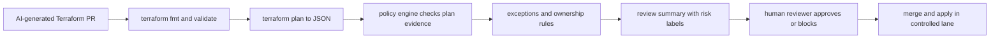

# Policy-as-Code Gates for AI-Generated Infrastructure Changes

AI-generated infrastructure diffs are often convincing in exactly the wrong way. The Terraform looks tidy, the resources have reasonable names, and the PR summary sounds confident, but one small change can widen public access, remove encryption, or multiply cost before anyone notices.

That problem gets worse when reviewers only see a pretty diff. Infra failures are rarely about syntax. They are about side effects, defaults, blast radius, and the one missing guardrail that an agent did not know mattered in your environment.

What helps is a policy gate that evaluates the plan, not just the code. In this post I’ll show a simple workflow that turns AI-generated infra changes into evidence-backed review, with Terraform plan output, Conftest policies, exception handling, and a reviewer summary that surfaces what actually changed.

## Why this matters

AI tools are very good at producing syntactically valid infrastructure code. They are much less reliable at preserving organization-specific intent such as “never expose Redis publicly,” “all buckets must have lifecycle rules,” or “production IAM changes require a human exception ticket.”

In practice, the dangerous failures are usually one layer above the HCL:

- a security group quietly adds `0.0.0.0/0`
- an S3 bucket loses encryption or public-access blocking
- an RDS or cache node tier changes and doubles spend
- a module upgrade forces replacement on a stateful resource
- an IAM policy widens action scope because the generated least-privilege set was guessed wrong

## Architecture or workflow overview



The important shift is that the policy engine reads the evaluated plan, where computed values, replacements, and drift are visible, instead of trusting the source diff alone.

| Review layer | What it checks | Why AI-generated infra needs it |
| --- | --- | --- |
| Syntax lane | `fmt`, `validate`, provider init | Catches broken output, not risky intent |
| Plan lane | adds, deletes, replacements, field values | Shows the real side effects of the change |
| Policy lane | org rules over plan JSON | Blocks unsafe but plausible diffs |
| Reviewer lane | ownership, exceptions, business context | Handles the cases policy cannot fully encode |

## Implementation details

### 1) Convert the plan into evidence your policies can read

The source diff is not enough. Policy becomes much more reliable once it evaluates Terraform’s JSON plan.

```yaml
# .github/workflows/infra-policy.yml
name: infra-policy

on:
  pull_request:
    paths:
      - 'infra/**'

jobs:
  policy-check:
    runs-on: ubuntu-latest
    defaults:
      run:
        working-directory: infra/prod
    steps:
      - uses: actions/checkout@v4
      - uses: hashicorp/setup-terraform@v3

      - name: Terraform init
        run: terraform init -input=false

      - name: Terraform plan
        run: terraform plan -out=tfplan -input=false

      - name: Export plan JSON
        run: terraform show -json tfplan > tfplan.json

      - name: Conftest policy gate
        run: conftest test tfplan.json --policy ../../policy
```

That single `terraform show -json` step is where the workflow gets teeth. Now your rules can reason over exposure, replacements, tags, encryption settings, and size changes in a structured way.

### 2) Write policies around dangerous outcomes, not stylistic preferences

I prefer a small set of hard-fail policies for security and cost, then softer reviewer warnings for everything else.

```rego
package terraform.security

deny[msg] {
  resource := input.resource_changes[_]
  resource.type == "aws_security_group_rule"
  resource.change.actions[_] == "create"
  resource.change.after.type == "ingress"
  resource.change.after.cidr_blocks[_] == "0.0.0.0/0"
  port := resource.change.after.from_port
  port == 6379
  msg := sprintf("redis ingress exposed to the internet in %s", [resource.address])
}

deny[msg] {
  resource := input.resource_changes[_]
  resource.type == "aws_s3_bucket_server_side_encryption_configuration"
  resource.change.actions[_] == "delete"
  msg := sprintf("bucket encryption removed for %s", [resource.address])
}
```

Two things matter here. First, the rules target outcomes that are expensive to miss. Second, they stay readable enough that reviewers and platform engineers can audit them without turning the policy folder into a black box.

### 3) Summarize the risky changes for the human who has to approve them

A blocked check is useful. A blocked check plus a good summary is much better.

```python
import json
from collections import Counter

plan = json.load(open("tfplan.json"))
counts = Counter()
replacements = []

for rc in plan.get("resource_changes", []):
    actions = tuple(rc.get("change", {}).get("actions", []))
    counts[actions] += 1
    if actions == ("delete", "create"):
        replacements.append(rc["address"])

print("Terraform plan summary")
print(f"create: {counts[('create',)]}")
print(f"update: {counts[('update',)]}")
print(f"delete: {counts[('delete',)]}")
print(f"replace: {counts[('delete', 'create')]}")
if replacements:
    print("replacement targets:")
    for addr in replacements:
        print(f"- {addr}")
```

```text
$ python3 scripts/plan_summary.py
Terraform plan summary
create: 3
update: 2
delete: 0
replace: 1
replacement targets:
- aws_db_parameter_group.primary
risk labels: replacement, network, encryption-reviewed
```

## What went wrong and the tradeoffs

My least favorite failure mode here is false confidence. Teams add a policy step, see green checks, and assume the workflow is now safe. It is not safe unless the rules cover the outcomes that actually hurt you.

**Pitfalls to watch:**

- **Plan trust:** if state is stale or the provider version drifted, policy is judging the wrong evidence.
- **Bypass sprawl:** manual applies and invisible exceptions rot the safety model quickly.
- **Over-gating:** too many hard fails pushes engineers toward bypasses instead of better review.
- **Sensitive output leakage:** plan artifacts can expose details you should not spray into logs.

| Choice | Upside | Downside | When I would use it |
| --- | --- | --- | --- |
| Conftest over Terraform plan JSON | Simple, inspectable, Git-friendly | You maintain the rules yourself | Best default for small to medium teams |
| Sentinel or hosted policy platform | Rich ecosystem and governance features | More tooling lock-in | Large Terraform-heavy organizations |
| Hard-fail on every policy warning | Strong safety posture | Slows delivery and breeds bypasses | Only for narrow high-risk controls |
| Warning plus owner review on some checks | Better developer experience | Requires disciplined reviewers | Good for cost and replacement signals |

What I would not do is gate on file-level regex checks alone. A diff that removes encryption or replaces a stateful resource can still look harmless in raw HCL if the semantic effect is buried in module behavior or defaults.

There is also a security angle that gets missed. If your AI assistant can read plan output, make sure the plan does not leak secrets, endpoint details, or sensitive tags into logs, PR comments, or public CI artifacts. Redaction and artifact retention rules matter here.

## Practical checklist

**Best-practice checklist**

- [ ] Run `terraform plan` in CI with pinned provider versions
- [ ] Export plan JSON and evaluate policy against the plan, not just source files
- [ ] Hard-fail on exposure, encryption loss, destructive replacements, and forbidden IAM widening
- [ ] Add reviewer-facing summaries for replacements, cost shifts, and stateful resources
- [ ] Require named exceptions with ticket links for policy bypasses
- [ ] Keep policy rules readable enough for normal code review
- [ ] Redact or avoid sensitive values in CI logs and PR comments
- [ ] Apply only from a controlled post-merge lane, not from arbitrary PR automation

## Conclusion

AI can help write infrastructure code quickly, but infrastructure review still needs semantic evidence. Once you gate on Terraform plan output, encode a few high-value policies, and hand reviewers a crisp summary, AI-generated infra changes become much less of a trust fall.

## References

- [Terraform JSON output format](https://developer.hashicorp.com/terraform/internals/json-format)
- [Conftest](https://www.conftest.dev/)
- [Open Policy Agent](https://www.openpolicyagent.org/)
- [Terraform plan command](https://developer.hashicorp.com/terraform/cli/commands/plan)
- [AWS prescriptive guidance for policy as code](https://docs.aws.amazon.com/prescriptive-guidance/latest/patterns/use-open-policy-agent-opa-to-enforce-policy-as-code-in-a-terraform-development-workflow.html)

---

*This is one of those places where AI speed is useful, but only if the safety rails evaluate the actual blast radius of the change.*
