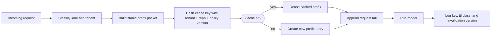

# Prompt Cache Segmentation for Shared AI Coding Gateways Without Cross-Tenant Leakage

Prompt caching is one of the easiest ways to make coding gateways feel faster. It is also one of the easiest ways to create a subtle data leak.

If multiple users, repos, or approval states share the same cache namespace, a perfectly valid cache hit can still be wrong. The model gets a stale system prefix, a mismatched repo summary, or context that belonged to someone else.

This post is about how to keep the speed win without turning a shared cache into a trust bug. I will show the cache-key boundaries, TTL choices, invalidation rules, and logging I would put in front of any shared coding gateway.

## Why this matters

Prompt caches work best when the prefix is large and stable. Shared coding gateways have exactly that shape.

- stable system prompts
- repo instructions and tool manifests
- repeated scaffold text for planner, editor, and verifier lanes
- many short requests that differ only in the tail

That sounds perfect until the cache key forgets something important. The failure is usually quiet:

- a user sees the wrong repo summary
- an approval-gated lane reuses an unapproved prefix
- a tenant gets lower quality because the gateway served stale instructions
- nobody notices until behavior drifts or a review incident happens

## Architecture or workflow overview

A safe shared cache has three layers: prefix freezing, identity segmentation, and invalidation ledgers.



The core idea is simple: only cache what should be reusable, and make the cache key prove why reuse is safe.

## Implementation details

### 1) Freeze only the stable prefix

The most common mistake is caching too much. Do not hash the entire request blob and call it done. Split the prompt into a frozen prefix and a volatile tail.

```python
from dataclasses import dataclass

@dataclass
class PromptPacket:
    system_prompt: str
    tool_manifest: str
    repo_rules: str
    task_tail: str


def build_prefix(packet: PromptPacket) -> str:
    return "\n\n".join([
        packet.system_prompt,
        packet.tool_manifest,
        packet.repo_rules,
    ])


def build_full_prompt(packet: PromptPacket) -> str:
    return build_prefix(packet) + "\n\n" + packet.task_tail
```

If the cacheable unit includes chat recency, ad hoc tool output, or user-specific notes, the hit rate may still look good while correctness quietly degrades.

### 2) Segment the key with trust-relevant identity

The cache key should include more than model name and prefix hash. If reuse depends on tenant, repo, or approval state, they belong in the key.

```python
import hashlib
import json


def cache_key(*, tenant_id, repo_id, lane, approval_fingerprint, policy_version, prefix_text):
    payload = {
        "tenant": tenant_id,
        "repo": repo_id,
        "lane": lane,
        "approval": approval_fingerprint,
        "policy": policy_version,
        "prefix_sha": hashlib.sha256(prefix_text.encode()).hexdigest(),
    }
    raw = json.dumps(payload, sort_keys=True)
    return hashlib.sha256(raw.encode()).hexdigest()
```

I would not share one prompt cache between different tenants, unrelated repos, human-approved and auto-approved lanes, or prod and staging policy bundles.

### 3) Use TTL classes instead of one global expiry

Stable policy text changes slower than repo summaries. Repo summaries change slower than volatile review scaffolds. So do not give them the same TTL.

```yaml
cacheClasses:
  global-policy:
    ttlSeconds: 86400
    invalidators: [policyVersion, toolManifestVersion]

  repo-instructions:
    ttlSeconds: 3600
    invalidators: [repoMapVersion, agentsFileHash]

  review-lane:
    ttlSeconds: 900
    invalidators: [approvalFingerprint, branchHead]
```

A single one-hour TTL sounds tidy, but it creates the worst of both worlds: some entries live too long, others churn too fast.

### 4) Keep an invalidation ledger, not just a delete button

When behavior goes weird, you need to know what prefix version the model actually used.

```json
{
  "key": "93e0...d12",
  "tenant": "acme-prod",
  "repo": "billing-api",
  "lane": "review-lane",
  "policyVersion": "2026-06-28.2",
  "repoMapVersion": "7f991b4",
  "approvalFingerprint": "human-approve:db-migration",
  "ttlClass": "review-lane",
  "createdAt": "2026-06-28T11:52:14Z"
}
```

A ledger gives you replayability, auditability, and a sane way to explain cache-miss spikes after policy changes.

## What went wrong / tradeoffs

The first bad version of this design usually over-optimizes for hit rate.

### Failure mode 1: cache keys ignore approval state

This one is nasty because the text may look almost identical. The only difference is that one lane was allowed to perform a risky tool step and the other was not.

### Failure mode 2: repo summaries outlive the branch head

A long TTL on repo context can make the model confidently act on code that moved an hour ago. The response still sounds coherent, which makes the bug more expensive.

### Failure mode 3: global invalidation every time something changes

This avoids stale context, but it destroys the whole point of the cache. Teams swing from under-segmented to over-invalidated all the time.

> **Pitfall:** If your cache hit rate is great but your verifier failure rate rises after merges, the cache may be preserving stale repo assumptions better than fresh ones.

| Approach | Upside | Downside | Best fit |
| --- | --- | --- | --- |
| One shared cache namespace | Highest raw hit rate | Cross-tenant and stale-prefix risk | Never for multi-user systems |
| Tenant-only segmentation | Easy to implement | Repo and approval bleed still possible | Small internal tools |
| Tenant + repo + lane segmentation | Good safety and solid hit rate | More key cardinality | Most shared coding gateways |
| Full request hashing | Very safe | Misses most cache benefit | Debug-only or high-risk lanes |

## Practical checklist or decision framework

If I were setting this up from scratch, I would do this in order:

- split prompts into stable prefix and volatile tail
- include tenant, repo, lane, and approval state in the key
- create separate TTL classes for policy text, repo context, and review lanes
- tie invalidation to concrete versions like branch head, repo map hash, and tool policy version
- log cache-key metadata without logging sensitive prompt text
- compare cache hit rate against verifier pass rate, not speed alone
- keep a manual bypass for any lane that looks suspicious during incident response

## References

- [OpenAI prompt caching guide](https://platform.openai.com/docs/guides/prompt-caching)
- [Anthropic documentation](https://docs.anthropic.com/)
- [OWASP LLM Top 10](https://owasp.org/www-project-top-10-for-large-language-model-applications/)

## Conclusion

Prompt caching is worth doing, especially for shared coding gateways. But the useful unit is not “same big string.” It is “same stable prefix, for the same trust boundary, with the same policy version.” Build the key like identity matters, because in multi-user agent systems it absolutely does.
