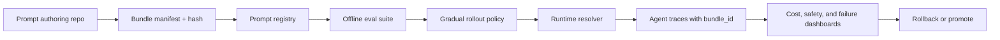

# Prompt Provenance for AI Agents That Need Safe Rollbacks

## Hook
A lot of teams still treat prompt changes like a harmless text edit. Then a two-line instruction tweak lands on Friday, tool selection shifts, retries spike, and nobody can say which prompt version actually caused the mess.

That is the uncomfortable part of agent systems. Behavior often changes before code does. If prompts are not versioned, hashed, evaluated, and rolled out like real production artifacts, debugging turns into folklore.

This guide shows how to build prompt provenance for AI agents: versioned prompt bundles, immutable hashes, behavior diff runs, and a rollback path that is actually fast enough to use during an incident.

## Why this matters
In production agent workflows, prompts are part of the executable system. They influence:

- tool selection
- retrieval behavior
- safety boundaries
- verbosity and cost
- retry patterns and escalation

If you only version application code, you lose the trail when an agent starts over-calling tools, leaking extra context into outputs, or suddenly sounding more confident while being more wrong.

I would treat prompts like configuration with blast radius, not like scratchpad prose. That means every prompt change should ship with identity, evidence, and a rollback handle.

## Visual plan
- **Hero idea:** a release-style panel showing prompt bundle hash, behavior diff, and rollback lane
- **Diagram idea:** authoring to registry to eval to deploy to runtime trace feedback loop
- **Terminal visual idea:** a prompt bundle publish and rollback session
- **Comparison table idea:** loose text editing vs pinned prompt bundles
- **Tags:** Prompt Engineering, AI Agents, Reliability, MLOps, Observability
- **Meta description:** A practical guide to prompt provenance for AI agents using version pins, hashable prompt bundles, behavior diffs, and rollback playbooks so prompt edits stop behaving like invisible production deploys.
- **Code sections:** bundle manifest, runtime resolver, behavior diff CLI

## Architecture or workflow overview


The important design choice is that the runtime never asks for "the latest prompt". It asks for a resolved bundle ID, and every trace, tool call, and outcome record carries that ID forward.

## Implementation details
### 1. Define a prompt bundle as a versioned artifact
A prompt bundle should capture more than the main system prompt. Include the exact policy fragments, tool instructions, retrieval hints, and templating variables that affect behavior.

```yaml
bundle_id: support-agent@2026-05-24.1
model_family: gpt-5-class
owner: platform-ai
files:
  - prompts/system.md
  - prompts/tool_rules.md
  - prompts/escalation.md
variables_schema: schemas/support-agent-vars.json
defaults:
  tone: concise
  max_tool_hops: 4
eval_suite: evals/support-regression.yaml
rollout:
  lane: canary
  initial_percent: 5
```

This is boring on purpose. The bundle manifest gives you something reviewable, diffable, and easy to pin in deployment config.

### 2. Hash the fully rendered bundle, not just the top-level file
Hashing only `system.md` misses included fragments and default variables. Resolve the full bundle first, then hash the canonical output.

```python
import hashlib
import json
from pathlib import Path


def render_bundle(manifest: dict, root: Path) -> dict:
    rendered = {
        "bundle_id": manifest["bundle_id"],
        "model_family": manifest["model_family"],
        "defaults": manifest.get("defaults", {}),
        "files": {}
    }
    for relpath in manifest["files"]:
        rendered["files"][relpath] = (root / relpath).read_text().strip()
    return rendered


def bundle_hash(rendered: dict) -> str:
    payload = json.dumps(rendered, sort_keys=True, separators=(",", ":"))
    return hashlib.sha256(payload.encode()).hexdigest()
```

If a trace says `bundle_hash=5eb8...`, you can reconstruct the exact instructions that produced a bad action. That is a huge debugging upgrade.

### 3. Resolve prompts through a registry instead of hardcoding text in the app
A registry can be as simple as object storage plus metadata, or as formal as a dedicated config service. What matters is that the application resolves an approved bundle and emits the chosen ID in telemetry.

```ts
export async function resolvePromptBundle(agentName: string, lane: "canary" | "stable") {
  const response = await fetch(`${process.env.PROMPT_REGISTRY_URL}/v1/bundles/resolve?agent=${agentName}&lane=${lane}`);
  if (!response.ok) throw new Error(`bundle resolve failed: ${response.status}`);

  const bundle = await response.json();
  return {
    bundleId: bundle.bundle_id,
    bundleHash: bundle.bundle_hash,
    systemPrompt: bundle.rendered.files["prompts/system.md"],
    toolRules: bundle.rendered.files["prompts/tool_rules.md"],
    escalationRules: bundle.rendered.files["prompts/escalation.md"]
  };
}
```

The app should never silently fall back to some stale inline prompt string. If the registry is unavailable, fail closed for write-capable agents or fall back only to the last known-good pinned bundle.

### 4. Run behavior diffs before promotion
This is where most teams cut corners. String diffs are easy, but behavior diffs catch what matters: tool choice, refusal rate, cost, latency, and escalation behavior.

```bash
promptctl diff   --candidate support-agent@2026-05-24.1   --baseline support-agent@2026-05-17.2   --eval-suite evals/support-regression.yaml   --metrics answer_quality,tool_calls,escalations,p95_latency,total_tokens
```

Example output worth saving with the release artifact:

```text
suite: support-regression
baseline: support-agent@2026-05-17.2
candidate: support-agent@2026-05-24.1

answer_quality      +1.8%
tool_calls          +19.4%
escalations         -8.1%
p95_latency         +11.2%
total_tokens        +14.7%

warning: candidate overuses refund_lookup on low-confidence tickets
recommendation: hold promotion, tighten tool_rules.md confidence threshold
```

That kind of diff keeps prompt reviews grounded. A prompt that looks cleaner on GitHub can still be more expensive and less safe.

## Tradeoff table
| Approach | What it optimizes | Failure mode | My take |
| --- | --- | --- | --- |
| Inline prompt strings in app code | Simplicity | No provenance, awkward rollback | Fine for prototypes only |
| Git-only prompt files | Reviewability | Runtime may not know what version is live | Better, but incomplete |
| Registry with pinned bundle IDs | Reproducibility and rollback | Needs a resolver path and metadata discipline | Best default for serious agents |
| Dynamic "latest" prompt fetches | Fast iteration | Incident debugging becomes guesswork | I would avoid this |

## What went wrong and the tradeoffs
### 1. Prompt includes drift quietly breaks reproducibility
Teams often version the main prompt but let included snippets come from another branch, a CMS entry, or a manually edited knowledge blob. The result is fake provenance.

**What I would not do:** mix versioned and non-versioned prompt fragments for the same agent path.

### 2. Canary metrics can look good while tool misuse gets worse
A prompt that lowers escalations may simply be making the agent more willing to act. That can look like success until you inspect tool-call classes or side effects.

**Best practice:** compare behavior by task slice, not just blended averages.

### 3. Rollback is useless if caches keep serving the bad bundle
If your runtime caches bundle resolution too aggressively, the control plane says "rolled back" while half the fleet still runs the broken version.

**Reliability concern:** keep bundle TTLs short, log the resolved bundle per request, and expose a purge path for incidents.

### 4. Security review matters for prompt changes too
Prompt edits can widen data disclosure or make agents more vulnerable to prompt injection via tool output. A "just docs" mindset is risky here.

Useful references:
- [OpenTelemetry semantic conventions](https://opentelemetry.io/docs/specs/)
- [OWASP LLM Prompt Injection Prevention Cheat Sheet](https://cheatsheetseries.owasp.org/cheatsheets/LLM_Prompt_Injection_Prevention_Cheat_Sheet.html)
- [Model Context Protocol](https://modelcontextprotocol.io/)

## Practical checklist
- [ ] Every production agent resolves a pinned `bundle_id` and `bundle_hash`
- [ ] All prompt fragments and defaults are included in the rendered hash
- [ ] Runtime traces attach bundle metadata to model and tool spans
- [ ] Prompt changes run an eval suite before promotion
- [ ] Canary rollout has explicit promotion and rollback thresholds
- [ ] Last known-good bundle is cached for safe fallback
- [ ] Security-sensitive prompt changes get the same review discipline as code

## Terminal workflow example
```text
$ promptctl publish prompts/support-agent.bundle.yaml
published bundle_id=support-agent@2026-05-24.1
bundle_hash=5eb8fd2d58c7b3...
status=awaiting-eval

$ promptctl promote support-agent@2026-05-24.1 --lane canary --percent 5
promotion started

$ promptctl rollback support-agent --to support-agent@2026-05-17.2
rollback complete
fleet convergence: 96% in 40s
```

## Conclusion
If an agent prompt can change behavior, it deserves provenance. Once you version bundles, attach hashes to traces, and keep rollback boring, prompt incidents stop feeling mystical and start feeling like normal engineering.

That is the real win. Not prettier prompt files, but faster answers when something weird happens at 2 AM.
