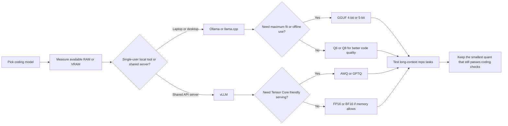

# Quantization Tradeoffs for Coding Models on Consumer Hardware

Running a coding model locally usually fails for one boring reason first: memory. The second failure is more annoying. You squeeze the model hard enough to fit, then autocomplete quality drops, long diffs get sloppy, and the model starts feeling dumber exactly when you need it for real engineering work.

That is why quantization decisions matter more than people admit. Picking 4-bit versus 8-bit is not just a storage choice. It changes what fits in VRAM, how much context you can keep hot, what runtime you can use, and whether the model is still good enough for code edits instead of toy prompts.

This is the practical version of the decision. I will focus on coding models running through Ollama, llama.cpp, and vLLM, and the tradeoffs I would make on laptops, gaming GPUs, and small home servers.

## Why this matters

For coding workflows, the model is rarely doing one short reply. It is summarizing a repository, diffing files, generating patches, and staying coherent across many turns. That pushes on:

- weight memory
- KV cache growth as context expands
- throughput during edits and retries
- output quality on syntax-heavy tasks
- runtime support for the quantized format you picked

A quant that looks fine in a one-shot benchmark can feel much worse in real coding because code requires exact tokens, stable indentation, long-range dependencies, and fewer silent mistakes.

Useful rule of thumb: the best quant is the smallest one that still preserves reviewable coding behavior at your target context length. Not the smallest one that merely loads.

## Architecture and workflow overview

**Visual plan**

- **Hero:** dark benchmark-style banner with Q4, AWQ, and INT8 tiles
- **Diagram:** decision flow from hardware budget to runtime and quant format
- **Terminal visual:** sample llama-server startup and Ollama model listing
- **Comparison table:** format-by-runtime tradeoffs for coding workloads
- **Tags:** Quantization, Local LLMs, Ollama, llama.cpp, vLLM
- **Meta description:** A practical guide to choosing 4-bit, 6-bit, 8-bit, and mixed quantization for coding models on consumer hardware, with concrete runtime tradeoffs for Ollama, llama.cpp, and vLLM.
- **Code sections:** Ollama Modelfile import, llama.cpp server launch, vLLM quantized serve config



The workflow I like is boring on purpose:

1. choose the runtime first
2. choose the quant format that runtime handles well
3. test on real coding tasks, not chatbot prompts
4. only then optimize for smaller memory

## Implementation details

### Step 1, match the quant format to the runtime

Different runtimes are good at different kinds of quantization.

| Runtime | Best fit | What it is good at | What I would avoid |
| --- | --- | --- | --- |
| Ollama | GGUF imports and packaged local models | Fast setup, good developer UX, easy local API | Treating it like a high-throughput multi-user inference server |
| llama.cpp | GGUF, especially 4-bit to 8-bit variants | Tight memory budgets, CPU or mixed CPU/GPU offload, broad hardware support | Assuming the smallest GGUF is automatically fastest |
| vLLM | FP16/BF16, AWQ, GPTQ, bitsandbytes depending on model support | Shared serving, batching, strong throughput on GPUs | Forcing every exotic quant into production without checking support and kernel quality |

The practical split is simple:

- Use <a href="https://ollama.com/library" target="_blank" rel="noopener noreferrer">Ollama</a> when you want the easiest local coding setup.
- Use <a href="https://github.com/ggml-org/llama.cpp" target="_blank" rel="noopener noreferrer">llama.cpp</a> when the box is constrained and you need precise control over offload, context, and GGUF choices.
- Use <a href="https://docs.vllm.ai/" target="_blank" rel="noopener noreferrer">vLLM</a> when the model is serving multiple clients and batching matters more than tiny memory wins.

### Step 2, import or build the model the way the runtime expects

For Ollama, I like being explicit about the source artifact and context window instead of relying on whatever default tag happens to exist.

```dockerfile
FROM ./DeepSeek-Coder-V2-Lite-Instruct-Q4_K_M.gguf
TEMPLATE """{{ if .System }}<|system|>
{{ .System }}<|end|>
{{ end }}{{ if .Prompt }}<|user|>
{{ .Prompt }}<|end|>
{{ end }}<|assistant|>
"""
PARAMETER num_ctx 16384
PARAMETER temperature 0.1
PARAMETER repeat_penalty 1.05
```

Then build it:

```bash
ollama create coder-q4km -f Modelfile
ollama run coder-q4km
```

For llama.cpp, the important thing is to separate fit from performance. A model can fit only because most layers stay on CPU, and that often feels awful for coding latency.

```bash
./llama-server \
  --model ./models/coder-q6_k.gguf \
  --ctx-size 16384 \
  --n-gpu-layers 999 \
  --batch-size 1024 \
  --threads 8 \
  --host 0.0.0.0 \
  --port 8080
```

If you have to reduce `--n-gpu-layers` heavily to fit, you may be better off dropping to a smaller base model before dropping another quantization level.

For vLLM, start from supported quantization modes rather than from a random model card claim.

```bash
vllm serve Qwen/Qwen2.5-Coder-14B-Instruct-AWQ \
  --quantization awq \
  --dtype half \
  --max-model-len 16384 \
  --gpu-memory-utilization 0.92 \
  --served-model-name qwen-coder-awq
```

That setup usually makes sense when you have a real GPU and multiple clients, not when you just want a private editor companion on one machine.

### Step 3, test the workload that actually matters

I care less about generic benchmark scores and more about whether the quantized model can survive tasks like these:

- explain an unfamiliar module without inventing nonexistent functions
- generate a narrow patch without touching unrelated files
- continue editing after 8k to 16k context without losing local naming consistency
- produce tests that actually run

A tiny local eval script is enough to catch obvious regressions:

```python
TASKS = [
    "Summarize the auth middleware and list its side effects.",
    "Write a unit test for retry jitter edge cases.",
    "Refactor this function without changing behavior.",
]

for task in TASKS:
    result = run_model(task, repo_snapshot="./fixtures/repo_map.txt")
    score = review_patch(result)
    print(task, score)
```

This is where aggressive 3-bit or weak 4-bit settings often fail first. They still answer. They just answer with less stable code.

### A rough decision framework I actually use

| Hardware shape | Quant I would try first | Why | Backup move |
| --- | --- | --- | --- |
| 16 GB unified memory laptop | 4-bit GGUF or small AWQ model | Best chance of fitting a useful coder with some context | Move to a smaller model before going below solid 4-bit |
| 24 GB consumer GPU | AWQ 4-bit or strong GGUF Q5/Q6 depending on runtime | Good balance of fit and code quality | Reduce context length before dropping to lower bits |
| 48 GB workstation or dual-purpose server | BF16 or 8-bit first, AWQ if needed | Coding quality usually benefits from less aggressive compression | Only quantize harder if concurrency forces it |
| CPU-heavy home server | GGUF Q4_K_M or Q5_K_M in llama.cpp | CPU-friendly deployment with predictable memory | Accept lower throughput and keep prompts narrower |

## Terminal reality check

The fastest sanity check is often just watching the runtime expose its constraints.

```text
$ ./llama-server --model coder-q4_k_m.gguf --ctx-size 16384 --n-gpu-layers 999
llama_model_loader: loaded meta data with 33 key-value pairs
llama_context: n_ctx = 16384
llama_context: KV self size  = 4096.00 MiB
llama_model_load: offloaded 43/43 layers to GPU
server is listening on http://0.0.0.0:8080
```

If the KV cache is already eating several gigabytes, chasing a smaller weight quant may not solve the real problem. Long-context coding sessions are often KV-cache-bound before they are weight-bound.

## What went wrong and the tradeoffs

> **Pitfalls I keep seeing**
>
> - Choosing the smallest quant that loads, then blaming the model when code quality collapses.
> - Ignoring KV cache growth and only comparing model file sizes.
> - Using a quantization mode that the runtime technically supports but does not optimize well on that hardware.
> - Measuring on short prompts even though the real workflow uses 8k to 32k context.

### Tradeoff 1, smaller weights do not guarantee better latency

This surprises people the first time. On some setups, a slightly larger quant that stays on GPU can beat a smaller quant that spills more work to CPU. In coding workflows, that difference matters because edit loops are interactive.

### Tradeoff 2, code quality degrades before chat quality does

A quantized model may still sound smart while quietly getting worse at:

- bracket matching
- indentation stability
- exact symbol reuse
- structured edits across multiple files

That is why I would trust repo tasks and patch reviews more than generic “write a Python function” prompts.

### Tradeoff 3, security and reliability still matter

Local serving feels safe, but it is still software listening on a port and loading large binary artifacts. I would not:

- expose a local inference port to the public internet without auth and rate limits
- pull random GGUF or AWQ artifacts without verifying provenance
- let an editor agent auto-upgrade models during a coding session

Official references worth checking before you ship anything:

- <a href="https://huggingface.co/docs/hub/gguf" target="_blank" rel="noopener noreferrer">Hugging Face GGUF format guide</a>
- <a href="https://github.com/ggml-org/llama.cpp/blob/master/tools/quantize/README.md" target="_blank" rel="noopener noreferrer">llama.cpp quantization notes</a>
- <a href="https://github.com/ollama/ollama/blob/main/docs/modelfile.md" target="_blank" rel="noopener noreferrer">Ollama Modelfile docs</a>
- <a href="https://docs.vllm.ai/en/latest/features/quantization/" target="_blank" rel="noopener noreferrer">vLLM quantization support</a>
- <a href="https://huggingface.co/docs/transformers/quantization/bitsandbytes" target="_blank" rel="noopener noreferrer">bitsandbytes quantization docs</a>

## Practical checklist

> **What I would do again**
>
> - Pick the runtime first, because runtime support narrows the useful quant choices fast.
> - Test at the context length you really need for repository work.
> - Prefer Q5, Q6, AWQ, or 8-bit when the hardware allows it for code-heavy tasks.
> - Drop model size before dropping to an extremely aggressive quant.
> - Record latency, fit, and patch quality together instead of optimizing one metric in isolation.

My default recommendation is simple:

- for a private local coding assistant, start with Ollama or llama.cpp and a strong 4-bit or 5-bit GGUF
- for a shared GPU server, start with vLLM and AWQ or BF16
- if you care about serious code edits, spend your extra memory budget on quality before you spend it on larger context windows you cannot use well

## Conclusion

Quantization is not just a compression trick. It is part of the product decision for your local coding stack. The right choice is the one that still feels dependable when the model is reading a real repo, proposing a real patch, and staying coherent over a long session.

If I only had one rule, it would be this: optimize for trustworthy coding behavior first, then squeeze memory.
