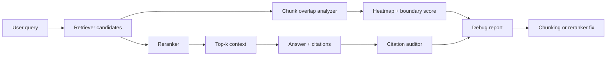

# Debugging RAG Recall With Overlap Heatmaps and Citation Audits

## Hook

A lot of RAG systems fail in an annoying way. The answer is in the corpus, sometimes in the exact source document, but retrieval still hands the model the wrong chunk. Teams then blame the model, add a bigger context window, or swap vector databases when the real bug is usually chunk boundaries, weak reranking, or citations that hide missing evidence.

When I want to debug that class of failure, I stop looking at aggregate hit rate first and start looking at overlap heatmaps, chunk boundary probes, and citation coverage. Those three views make it obvious whether the system is missing the right document, slicing it badly, or surfacing a chunk that sounds relevant but does not actually contain the needed fact.

This post walks through a practical recall-debugging workflow with code, visuals, tradeoffs, and the failure modes I would actively design around.

## Why this matters

Production RAG failures are rarely just "retrieval is bad." They usually fall into a few concrete buckets:

- the gold document was never retrieved
- the gold document was retrieved, but the answer span was split across chunk boundaries
- the reranker promoted a chunk with semantic similarity but no usable evidence
- the answer generator cited a nearby chunk and papered over the missing fact

If you only watch answer correctness, all of those collapse into one number. That is not enough to fix the system.

Useful references here are:

- [RAGAS](https://docs.ragas.io/) for evaluation ideas
- [BM25](https://en.wikipedia.org/wiki/Okapi_BM25) for lexical fallback baselines
- [Cross-encoders from Sentence Transformers](https://www.sbert.net/examples/cross_encoder/applications/README.html) for reranking
- [LangSmith](https://www.langchain.com/langsmith) or your own trace store for query-level debugging

> **Best-practice callout:** Treat retrieval misses as observable engineering failures, not mysterious model behavior.

## Architecture or workflow overview

### Mermaid flow



### Debug sequence

1. Save the query, top-k retrieved chunks, and final citations for every evaluated run.
2. Attach gold answer spans or at least gold source documents for a failure set.
3. Compute token overlap between the answer span and each retrieved chunk.
4. Render a heatmap so chunk-boundary misses become obvious.
5. Compare retriever rank, reranker rank, and final cited chunk rank.
6. Fix the narrowest failing layer before changing embeddings or models.

## Implementation details

### 1) Score chunk overlap instead of guessing

I like a simple overlap score first because it catches a surprising number of problems before heavier eval machinery is needed.

```python
from dataclasses import dataclass
from collections import Counter

@dataclass
class ChunkHit:
    chunk_id: str
    rank: int
    overlap_ratio: float
    contains_exact_phrase: bool


def token_overlap(answer_span: str, chunk_text: str) -> float:
    gold = Counter(answer_span.lower().split())
    chunk = Counter(chunk_text.lower().split())
    shared = sum((gold & chunk).values())
    return shared / max(sum(gold.values()), 1)


def score_chunks(answer_span: str, ranked_chunks: list[dict]) -> list[ChunkHit]:
    hits = []
    for idx, chunk in enumerate(ranked_chunks, start=1):
        hits.append(
            ChunkHit(
                chunk_id=chunk['id'],
                rank=idx,
                overlap_ratio=token_overlap(answer_span, chunk['text']),
                contains_exact_phrase=answer_span.lower() in chunk['text'].lower(),
            )
        )
    return hits
```

This is intentionally boring. It gives you an answer to a concrete question: did the retrieved chunk actually overlap the evidence you expected, or did it only look semantically adjacent.

### 2) Render overlap heatmaps per query family

Once you have overlap scores, aggregate them by query type. If your product has policy, onboarding, pricing, or API questions, heatmaps show where chunking strategy is uneven.

```python
import pandas as pd
import seaborn as sns
import matplotlib.pyplot as plt


def render_heatmap(rows: list[dict], out_path: str) -> None:
    df = pd.DataFrame(rows)
    pivot = df.pivot_table(
        index='query_family',
        columns='rank',
        values='overlap_ratio',
        aggfunc='mean',
        fill_value=0,
    )
    sns.heatmap(pivot, cmap='mako', vmin=0.0, vmax=1.0)
    plt.title('Average answer-span overlap by rank')
    plt.xlabel('Retrieved rank')
    plt.ylabel('Query family')
    plt.tight_layout()
    plt.savefig(out_path, dpi=180)
```

If rank 1 through 3 are cold and rank 8 is hot, your retriever is under-ordering good chunks. If every rank is cold but the gold document is present, your chunk size or boundary strategy is usually the problem.

### 3) Audit citations separately from retrieval

A nasty failure mode is when retrieval works, but the answer cites the wrong chunk anyway. That is why I like a citation auditor as a separate step.

```python
from typing import Any


def audit_citations(answer_text: str, citations: list[dict[str, Any]], chunks_by_id: dict[str, str]) -> dict[str, Any]:
    supported = 0
    unsupported = []

    for citation in citations:
        text = chunks_by_id.get(citation['chunk_id'], '')
        snippet = citation.get('claim', '').strip()
        if snippet and snippet.lower() in text.lower():
            supported += 1
        else:
            unsupported.append({
                'chunk_id': citation['chunk_id'],
                'claim': snippet,
            })

    return {
        'citation_count': len(citations),
        'supported_count': supported,
        'unsupported': unsupported,
        'coverage_ratio': supported / max(len(citations), 1),
    }
```

This catches the polished failure where the model answers confidently, names a plausible source, and still does not ground the exact claim.

### Example terminal-output visual

```text
$ rag-debug inspect query_01842
query_family: pricing
retrieved_gold_doc: true
best_overlap_rank: 6
best_overlap_ratio: 0.81
reranker_promoted_rank: 2 -> 1
final_cited_rank: 1
citation_coverage: 0.33
boundary_split_detected: true
recommended_fix: increase overlap from 40 to 80 tokens for pricing docs
```

### Comparison table, where the miss is happening

| Signal | Good at | Weak at | What I infer from it |
| --- | --- | --- | --- |
| Document recall | Tells you if the right source surfaced at all | Hides chunk-level misses | Bad here means retriever or corpus issue |
| Chunk overlap heatmap | Exposes boundary and rank problems | Needs gold spans or strong proxies | Hot lower ranks suggest reranking or ordering trouble |
| Citation audit | Shows whether final claims were grounded | Can miss paraphrased support | Low coverage means generation is outrunning evidence |
| Latency and token traces | Shows pipeline cost and fan-out | Does not explain semantic quality | Useful when fixes hurt performance |

## What went wrong, and the tradeoffs

### Failure mode 1: chunk overlap improves, answer quality does not

This usually means the system is retrieving better evidence, but the answering stage is still over-summarizing, ignoring citations, or mixing multiple chunks badly. Retrieval metrics are necessary, not sufficient.

### Failure mode 2: overlap heatmaps reward lexical coincidence

If your gold spans are short, token overlap can overvalue repeated product names or boilerplate. I like using it with exact-phrase checks and a small human-reviewed sample, not as the only truth source.

### Failure mode 3: bigger chunks hide the bug for one query family and create another

Increasing chunk size can rescue split facts, but it also hurts precision, increases reranker cost, and makes citations fuzzier. Pricing and legal docs often want more overlap. API references often want smaller, more surgical chunks.

### Security and reliability concerns

If your debug pipeline stores queries and citations, it is probably collecting customer prompts and internal document snippets. That means retention, redaction, and access controls matter just as much as recall quality.

Also, do not let offline heatmap wins trick you into shipping a slower stack without guardrails. Cross-encoder rerankers and larger chunk overlaps can improve recall while quietly blowing out latency budgets.

> **Pitfalls section:**
>
> - Do not change embeddings, chunk size, and reranker at the same time.
> - Do not trust answer-level accuracy alone to explain recall failures.
> - Do not call a citation valid just because it came from the same document.
> - Do not optimize for one query family without checking the others.

## Practical checklist or decision framework

### What I would do again

- Log top-k chunks, reranked order, and final citations for every eval query.
- Keep a small failure set with gold spans or annotated supporting paragraphs.
- Render overlap heatmaps by query family, not just globally.
- Audit citation support separately from retrieval recall.
- Change one retrieval variable at a time and rerun the same failure slice.
- Track latency and token cost before promoting a reranker-heavy fix.

### What I would not do

- I would not jump straight to a new embedding model because a few queries looked bad.
- I would not use giant chunks as a permanent fix for poor boundary design.
- I would not let unsupported citations count as a successful grounded answer.
- I would not evaluate recall fixes without a stable query set and before-vs-after reports.

## Conclusion

RAG recall bugs are usually diagnosable if you look at the right level of detail. Overlap heatmaps show where chunking fails, citation audits show where grounding fails, and rank comparisons show whether the retriever or reranker is the real problem.

That is a much better loop than swapping models and hoping the failure disappears.
