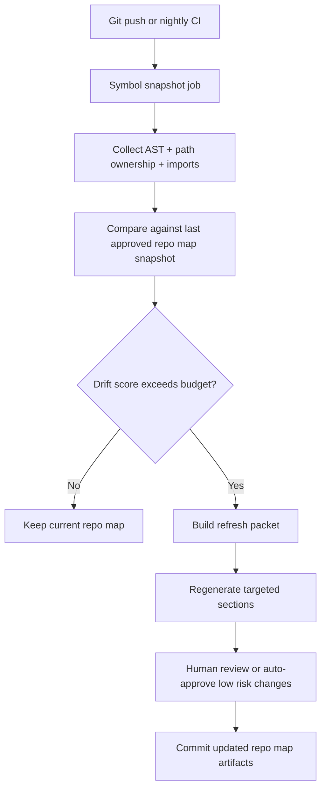

# Repo Map Drift Detection for AI Coding Agents

Repo maps are one of the best force multipliers for AI coding agents, right up until they go stale.

The failure mode is subtle. The map still reads well, the package names look familiar, and the agent sounds confident. But ownership moved, entrypoints changed, a service was split, and the context packet is now steering edits toward a codebase that no longer exists.

The fix is not "write better docs once." It is to treat repo maps like generated infrastructure: snapshot the code shape, score drift, and refresh the summary only when the evidence says it changed enough to matter.

## Why this matters

Teams often add `REPO_MAP.md`, `ARCHITECTURE.md`, or agent instructions because they want smaller prompts and better edits. That works, but only if the summary keeps pace with the repository.

In practice, stale repo maps cause four expensive problems:

- agents edit old extension points that no longer own the workflow
- retrieval packs include renamed files and dead directories
- reviewers get plausible PRs built on obsolete assumptions
- humans stop trusting the map, so the whole context layer collapses

A drift detector gives you a middle path. You do not regenerate everything on every commit, and you do not wait for a human to notice drift after an agent writes code in the wrong lane.

## Architecture or workflow overview



I like thinking of this as a freshness gate, not a documentation bot. The goal is to surface meaningful structural change, then regenerate only the map sections that matter.

## Implementation details

### 1) Snapshot the code shape, not just file counts

A cheap `git diff --stat` is not enough. Drift becomes visible when symbol ownership, imports, or top-level entrypoints change.

```python
from dataclasses import dataclass
from pathlib import Path
import json
import subprocess

@dataclass
class FileShape:
    path: str
    exported_symbols: list[str]
    imports: list[str]
    owner_hint: str | None


def build_snapshot(repo_root: Path) -> dict:
    files = []
    for path in repo_root.rglob('*.ts'):
        if 'node_modules' in path.parts:
            continue
        shape = extract_typescript_shape(path)
        files.append(FileShape(**shape).__dict__)

    return {
        'commit': subprocess.check_output(
            ['git', 'rev-parse', 'HEAD'], cwd=repo_root, text=True
        ).strip(),
        'files': files,
    }
```

The exact parser can vary. Tree-sitter is great when you need language-agnostic snapshots. Native parsers are better when you want higher-confidence symbol ownership.

### 2) Score drift by importance, not raw churn

A repo map should care more about moved entrypoints and changed package boundaries than about one more helper function in a utility module.

```ts
type DriftSignal = {
  kind: "entrypoint-move" | "symbol-delete" | "owner-change" | "import-fanout" | "path-rename";
  weight: number;
  file: string;
};

export function scoreDrift(signals: DriftSignal[]) {
  return signals.reduce((sum, signal) => sum + signal.weight, 0);
}

const budget = 18;
const score = scoreDrift(signals);

if (score >= budget) {
  enqueueRepoMapRefresh({ score, signals });
}
```

A weighting model keeps the system from flapping on harmless churn. I would give heavy weight to these changes:

| Drift signal | Why it matters | Suggested weight |
| --- | --- | --- |
| service entrypoint moved | agent edits may start from the wrong root | 8 |
| ownership annotation changed | reviewers need a different team or package mental model | 6 |
| public symbol deleted or renamed | context packets become misleading fast | 5 |
| import fanout spike | hidden coupling usually means architecture text changed | 4 |
| test-only helper churn | usually low map impact | 1 |

### 3) Keep the refresh packet compact and reviewable

Do not ask the summarizer to reread the whole monorepo if only two domains drifted.

```json
{
  "repo_map_section": "billing-api",
  "baseline_commit": "c1d2e3f",
  "head_commit": "f7a8b9c",
  "signals": [
    {"kind": "entrypoint-move", "file": "apps/billing-api/src/server.ts"},
    {"kind": "owner-change", "file": "packages/billing-core/src/invoice.ts"}
  ],
  "related_files": [
    "apps/billing-api/src/server.ts",
    "apps/billing-api/src/routes/invoices.ts",
    "packages/billing-core/src/invoice.ts"
  ]
}
```

This packet is what I would feed into a coding agent or summarizer. Small packets are easier to review, cheaper to generate, and less likely to include irrelevant stale text.

### 4) Publish a terminal-style drift report humans will actually read

```text
repo-map-drift check
baseline: c1d2e3f  head: f7a8b9c
score: 21  budget: 18  status: refresh-required

signals:
  +8  entrypoint-move   apps/billing-api/src/server.ts
  +6  owner-change      packages/billing-core/src/invoice.ts
  +4  import-fanout     apps/billing-api/src/routes/invoices.ts
  +3  path-rename       apps/billing-api/src/http.ts -> src/server/http.ts

next step: regenerate sections [billing-api, billing-core]
```

This is one of those tiny usability wins that matters. If the artifact reads like a judgment call instead of a wall of machine output, people trust it more.

## What went wrong, and the tradeoffs

### Failure mode 1, the map is hand-written but never revalidated

This is the common failure. The map was accurate once, maybe even excellent, but nobody tied it to structure changes. Six weeks later the agent still thinks `src/index.ts` owns bootstrapping when the real root moved to `src/bootstrap/server.ts`.

### Failure mode 2, drift detection is too noisy

If every rename or import shuffle triggers regeneration, people will ignore the job. That is why I like budgets and weighted signals more than binary "anything changed" rules.

### Failure mode 3, the refresh job rewrites the whole map

Full rewrites create review fatigue and erase stable language that humans already recognize. Targeted section refreshes are slower to build at first, but much safer in practice.

<div class="callout callout-warning"><p><strong>Pitfall:</strong> do not let the same agent both declare drift severity and auto-approve a large map rewrite with no structured evidence. That collapses detection and remediation into one opaque step.</p></div>

<div class="callout callout-best"><p><strong>Best practice:</strong> preserve a small ledger of approved snapshots, drift scores, and affected sections. When a map summary changes, reviewers should be able to see which structural signals justified it.</p></div>

Here is the tradeoff table I would use:

| Choice | Benefit | Cost | When I would use it |
| --- | --- | --- | --- |
| full repo re-summary | simple pipeline | expensive and noisy | very small repos |
| targeted section refresh | narrow diffs, cheaper prompts | needs section ownership model | most active codebases |
| nightly drift scan | predictable cost | lag between change and refresh | medium velocity repos |
| per-push drift gate | freshest maps | more CI pressure | repos with heavy agent usage |

## Practical checklist

- [ ] define repo map sections that align to real package or service boundaries
- [ ] generate structural snapshots with symbols, imports, and entrypoints
- [ ] weight drift signals instead of triggering on raw churn
- [ ] keep a drift budget per repo, not one universal threshold
- [ ] generate compact refresh packets with only affected files
- [ ] show a human-readable CI report alongside machine artifacts
- [ ] keep an approval ledger for map updates and snapshot baselines
- [ ] spot-check whether agent retrieval actually improved after refreshes

## What I would not do

I would not put a giant evergreen architecture essay in every coding prompt and hope it stays right.

I would also not regenerate the entire map on every commit just because it feels thorough. That creates token burn, diff noise, and eventually reviewer blindness.

## Conclusion

Repo maps are useful because they compress a codebase into something an agent and a reviewer can both reason about.

That only works if the compression stays fresh. Drift detection, weighted budgets, and targeted refresh packets are the difference between a repo map that compounds engineering speed and one that quietly teaches your agents the wrong codebase.

## References

- [tree-sitter](https://tree-sitter.github.io/tree-sitter/)
- [TypeScript Compiler API](https://github.com/microsoft/TypeScript/wiki/Using-the-Compiler-API)
- [OpenTelemetry semantic conventions](https://opentelemetry.io/docs/specs/semconv/)
- [Sourcegraph engineering blog](https://sourcegraph.com/blog)
