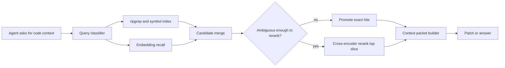

# Reranker Budgets for AI Coding Agents That Need Better Code Retrieval

## Visual plan
- **Hero image idea:** dark retrieval pipeline banner with exact hits, rerank slice, and final token packet stages.
- **Architecture diagram idea:** query flow from ripgrep and symbol index into embedding recall, reranker slice, and context packet builder.
- **Optional terminal-output visual idea:** latency log showing exact hit promotion and reranker cutoff.
- **Optional comparison table idea:** compare exact search only, wide embedding top-k, and budgeted reranker pipeline.
- **Tags:** Code Retrieval, AI Coding Agents, Reranking, Embeddings, Latency Budgets
- **Meta description:** A practical guide to using reranker budgets, exact-match promotion, and latency caps so AI coding agents retrieve the right code paths without turning every lookup into a slow expensive search stack.
- **Suggested code snippet sections:** candidate generation config, reranker budget policy, retrieval trace output.

## Hook
AI coding agents often fail retrieval in a very specific way: the right file is in the repository, but the context packet still arrives padded with almost-right code. The model then writes a plausible patch against the wrong abstraction layer.

A lot of teams react by increasing top-k everywhere. That usually raises latency, prompt size, and review noise faster than it raises accuracy.

This guide shows how to use reranker budgets, exact-match promotion, and context packet caps so code retrieval gets sharper without turning every agent lookup into a slow expensive mini-search engine.

## Why this matters
Production coding agents do not just need *some* relevant files. They need the right function, the right config, and the right test nearby enough that the model can patch with confidence.

Retrieval quality falls apart when:
- symbol names are overloaded across packages
- embeddings recall broad conceptual neighbors but miss the exact call site
- monorepo helpers flood the candidate list
- the reranker burns time on fifty near-duplicates the model never needed

A reranker is useful, but only if it spends latency on ambiguity instead of on obvious cases that exact search already solved.

> **Bottom line:** budgeted reranking beats unconditional reranking because most developer queries are mixed workloads, not pure semantic search.

## Architecture or workflow overview
```text
agent request
  -> query classifier
  -> exact search + symbol lookup + embedding recall
  -> candidate merge and dedupe
  -> reranker budget policy
  -> top context packet builder
  -> code-editing model
```



## Implementation details
### 1. Split retrieval into cheap recall and expensive judgment
The fastest retrieval systems do not ask the reranker to do everything. They let exact search catch precise identifiers, use embeddings for broader recall, then reserve reranking for the slice that is still ambiguous.

```yaml
query_router:
  exact_search:
    enabled: true
    max_hits: 20
    promote_if:
      - identifier_match
      - filepath_match
  embedding_search:
    enabled: true
    top_k: 24
  reranker:
    enabled: true
    only_if:
      - merged_candidates > 8
      - exact_confidence < 0.9
    slice_k: 10
    timeout_ms: 120
  packet_builder:
    max_files: 6
    max_tokens: 4800
```

That policy is boring on purpose. The key idea is that exact identifier hits should not compete with weak semantic neighbors unless the query is actually ambiguous.

### 2. Merge candidates by evidence, not arrival order
If your pipeline appends exact hits, then embedding hits, then reranks the whole pile, you waste time scoring duplicates. Merge first and keep an evidence ledger.

```python
from dataclasses import dataclass, field

@dataclass
class Candidate:
    path: str
    symbol: str | None = None
    exact_score: float = 0.0
    embedding_score: float = 0.0
    evidence: list[str] = field(default_factory=list)


def merge_candidates(exact_hits, embedding_hits):
    merged: dict[str, Candidate] = {}

    for hit in exact_hits:
        item = merged.setdefault(hit.path, Candidate(path=hit.path, symbol=hit.symbol))
        item.exact_score = max(item.exact_score, hit.score)
        item.evidence.append(f"exact:{hit.match_type}")

    for hit in embedding_hits:
        item = merged.setdefault(hit.path, Candidate(path=hit.path, symbol=hit.symbol))
        item.embedding_score = max(item.embedding_score, hit.score)
        item.evidence.append("embedding")

    return sorted(
        merged.values(),
        key=lambda c: (c.exact_score, c.embedding_score),
        reverse=True,
    )
```

This makes the reranker score *distinct hypotheses* instead of repeatedly scoring the same file because it appeared in three recall lanes.

### 3. Spend reranker budget only on uncertainty
The reranker should behave like a tie-breaker, not a mandatory middle layer. I like simple gates based on confidence and candidate count.

```ts
export function shouldRerank(input: {
  exactConfidence: number;
  mergedCount: number;
  queryType: 'identifier' | 'stacktrace' | 'concept' | 'diff';
}) {
  if (input.queryType === 'identifier' && input.exactConfidence >= 0.9) {
    return { enabled: false, reason: 'exact-hit-promoted' };
  }

  if (input.mergedCount <= 4) {
    return { enabled: false, reason: 'candidate-set-small' };
  }

  return {
    enabled: true,
    sliceK: input.queryType === 'concept' ? 12 : 8,
    timeoutMs: input.queryType === 'stacktrace' ? 80 : 120,
  };
}
```

That one gate keeps latency stable. In practice, symbol lookups and stack traces often have a strong exact signal already. Conceptual queries like “where do retries get bounded” benefit much more from reranking.

### 4. Log retrieval traces so humans can debug the retrieval layer
If an agent patches the wrong file, you want to know whether the model was confused or the retrieval packet was weak.

```text
[retrieve] query="where is billing retry backoff applied"
[retrieve] exact_hits=2 embedding_hits=24 merged=11
[retrieve] exact_confidence=0.42 rerank=enabled slice_k=10 timeout_ms=120
[retrieve] top_after_rerank=
  1 src/billing/retry_policy.ts score=0.93 evidence=embedding,exact:symbol
  2 src/billing/worker.ts score=0.88 evidence=embedding
  3 tests/billing/retry_policy.test.ts score=0.84 evidence=embedding
[packet] files=4 tokens=4310
```

## Tradeoff table
| Approach | What it optimizes | Failure mode | My take |
| --- | --- | --- | --- |
| Exact search only | Speed and explainability | Misses conceptual or paraphrased queries | Great first lane, weak full strategy |
| Wide embedding top-k | Recall | Bloated packets and semantic noise | Better demos than production |
| Always rerank everything | Ranking quality | Latency spikes and cost creep | Usually too blunt |
| Budgeted rerank slice | Accuracy per millisecond | Needs routing logic and telemetry | Best default for agent workflows |

## What went wrong, and the tradeoffs
### A bigger top-k made the model worse
I have seen retrieval stacks improve offline recall while making agent edits worse, because the packet builder stuffed in more similar helpers than the model could reliably separate.

**What I would not do:** treat retrieval recall as independent from prompt budget. The model still has to use the packet.

### Rerankers love duplicates if you let them
If you chunk code too aggressively, one file can dominate the rerank slice with five nearly identical fragments. That looks like confidence, but it is really duplication.

**Best practice:** dedupe by file first, then allow at most a small number of chunks per file in the rerank slice.

### Timeout policy matters more than benchmark bragging
A slower but better reranker is not actually better if it blows the interactive budget for every coding step.

**Rough comparison:** if exact plus embeddings returns in ~40 ms, spending another 80 to 120 ms on ambiguous queries is usually fine. Spending 350 ms on every query is where the stack starts to feel sticky.

### Security and privacy still apply
If you ship repository text to a hosted reranker, that is still source code leaving the primary boundary even if the main model is local.

**Security concern:** apply the same source-code handling rules to reranking infrastructure that you apply to your model gateway.

## Practical checklist
- promote exact identifier and filepath hits when confidence is high
- merge and dedupe candidates before reranking
- rerank only an ambiguity slice, not the full recall set
- cap reranker latency with timeouts and query-type-specific budgets
- keep packet size bounded by both file count and token count
- log retrieval traces so bad patches can be explained
- audit whether reranker gains survive contact with prompt limits

## References
- <https://www.pinecone.io/learn/series/rag/rerankers/>
- <https://www.sbert.net/examples/cross_encoder/applications/README.html>
- <https://platform.openai.com/docs/guides/embeddings>

## Conclusion
Rerankers are useful, but they are not magic. For AI coding agents, the winning pattern is usually exact search first, embeddings for broader recall, and a tightly budgeted reranker only where ambiguity remains.

That keeps retrieval sharp, latency predictable, and context packets small enough for the model to actually use.
