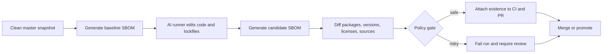

# SBOM Diff Gates for AI Coding Runners Before Dependency Drift Ships

A dependency-changing AI patch can look harmless in review. Maybe it updates one lockfile, maybe it adds one package, maybe the tests pass. But supply-chain risk rarely announces itself in the diff. It shows up as a new transitive edge, an unverifiable artifact, or a registry fetch you did not expect.

That is why I like SBOM diff gates for AI coding runners. Instead of treating dependency changes as "just build output," the runner produces a before-and-after inventory, checks provenance where possible, and gives reviewers a short evidence packet instead of a vague green CI badge.

This post walks through the workflow I would actually use: generate SBOMs from the pre-change and post-change workspace, diff them in CI, fail on the risky classes, and keep the policy narrow enough that routine upgrades do not become a weekly firefight.

## Why this matters

AI coding runners are unusually good at making package changes that look locally reasonable. They see an error, install a missing library, bump a client SDK, or regenerate a lockfile to make tests pass. All of those can be correct, and all of them can quietly widen the dependency graph.

The production problem is not only CVEs. It is also license drift, provenance gaps, surprise native binaries, package source changes, and dependency sprawl that nobody notices because the code diff looks small.

A plain install log is not enough. If you want safe automation, the review surface needs to answer a few very boring questions fast.

- What packages were added, removed, or upgraded?
- Did the patch introduce a new registry or download path?
- Are any new artifacts missing provenance or signature evidence?
- Did risk increase enough to require a human stop instead of auto-merge?

## Architecture or workflow overview

**Visual plan**
- Hero: dark control-card banner with SBOM diff, provenance, and review gate blocks
- Diagram: runner flow from baseline SBOM to patched SBOM to policy gate and reviewer evidence
- Terminal visual: syft generation and failing policy output
- Comparison table: no gate vs vuln-only gate vs full SBOM diff gate
- Tags: AI Coding, Supply Chain, SBOM, Dependency Security, CI Guardrails
- Meta description: A practical guide to SBOM diff gates for AI coding runners using lockfile-linked SBOM snapshots, severity-aware policy checks, provenance verification, and reviewer evidence so dependency-changing agent patches stay fast without turning into supply-chain blind spots.
- Code sections: SBOM generation script, policy check script, GitHub Actions workflow



The important part is that the baseline comes from a known-good state, not from whatever the runner already mutated. Otherwise the evidence starts after the damage.

## Implementation details

### 1) Generate baseline and candidate SBOMs from the same task lane

I prefer a runner wrapper that captures the repository state before the agent touches dependencies, then regenerates inventory after the patch. Syft works well here because it is simple to automate and outputs usable JSON.

```bash
#!/usr/bin/env bash
set -euo pipefail

repo_root="${PWD}"
out_dir=".ai-evidence/sbom"
mkdir -p "$out_dir"

syft dir:"$repo_root" -o cyclonedx-json > "$out_dir/baseline.cdx.json"

# agent run happens here
./scripts/run-agent-task.sh

syft dir:"$repo_root" -o cyclonedx-json > "$out_dir/candidate.cdx.json"
```

The trick is not the tool, it is the timing. If you generate only one SBOM after the patch, you lose the ability to say what changed.

### 2) Diff on package identity, version, source, and license, not only vulnerability count

A lot of teams stop at "scan the new image for CVEs." That helps, but it misses the reviewer question: what new thing entered the build graph at all?

```js
import fs from 'node:fs';

const before = JSON.parse(fs.readFileSync('.ai-evidence/sbom/baseline.cdx.json', 'utf8'));
const after = JSON.parse(fs.readFileSync('.ai-evidence/sbom/candidate.cdx.json', 'utf8'));

function indexComponents(doc) {
  return new Map((doc.components || []).map(c => {
    const key = `${c.purl || c.name}@@${c.version || 'unknown'}`;
    return [key, {
      name: c.name,
      version: c.version,
      purl: c.purl,
      licenses: (c.licenses || []).map(x => x.license?.id || x.license?.name).filter(Boolean),
      publisher: c.publisher || null,
      scope: c.scope || 'required'
    }];
  }));
}

const prev = indexComponents(before);
const next = indexComponents(after);
const added = [...next.keys()].filter(k => !prev.has(k)).map(k => next.get(k));
const removed = [...prev.keys()].filter(k => !next.has(k)).map(k => prev.get(k));

console.log(JSON.stringify({ added, removed }, null, 2));
```

This is the point where I would also enrich with lockfile path, package manager, and registry host if that data is available. Reviewers care about package edges and origins more than giant raw JSON blobs.

### 3) Gate on policy classes that matter in practice

A useful policy gate should block the scary stuff and stay quiet on ordinary patch churn.

| Policy class | Example trigger | Default action | Why it matters |
| --- | --- | --- | --- |
| New direct dependency | package added to package.json or pyproject | Require human review | Changes runtime surface area |
| New package source | package fetched from unfamiliar registry | Fail | This is how supply-chain surprises sneak in |
| High severity introduced | new unresolved critical advisory | Fail | Obvious stop sign |
| Provenance missing | no attestation for a high-trust package lane | Require human review | Green builds can still be unverifiable |
| License drift | copyleft or unknown license newly introduced | Require human review | Often caught too late otherwise |
| Large transitive jump | huge component count increase | Fail or review | Good smell test for broken lockfile updates |

```js
import fs from 'node:fs';

const diff = JSON.parse(fs.readFileSync('.ai-evidence/sbom/diff-summary.json', 'utf8'));
const registryAllow = new Set(['registry.npmjs.org', 'pypi.org', 'files.pythonhosted.org']);

const findings = [];
for (const pkg of diff.added) {
  if (pkg.direct === true) findings.push({ level: 'review', reason: 'new_direct_dependency', pkg });
  if (pkg.registryHost && !registryAllow.has(pkg.registryHost)) {
    findings.push({ level: 'fail', reason: 'new_registry_host', pkg });
  }
  if ((pkg.licenses || []).includes('UNKNOWN')) {
    findings.push({ level: 'review', reason: 'unknown_license', pkg });
  }
  if (pkg.provenanceVerified === false) {
    findings.push({ level: 'review', reason: 'missing_provenance', pkg });
  }
}

const failed = findings.some(f => f.level === 'fail');
console.log(JSON.stringify({ status: failed ? 'fail' : 'review_or_pass', findings }, null, 2));
if (failed) process.exit(1);
```

The useful design choice here is severity by class, not one giant score. Reviewers should see *why* a run stopped.

### 4) Publish evidence into CI, not only logs

If the gate fails, the reviewer should not have to reconstruct the story from raw workflow output.

```yaml
name: sbom-diff-gate

on:
  pull_request:
  push:
    branches: [master]

jobs:
  diff-gate:
    runs-on: ubuntu-latest
    steps:
      - uses: actions/checkout@v4
      - uses: anchore/sbom-action/download-syft@v0
      - run: ./scripts/generate-sbom-pair.sh
      - run: node scripts/sbom-diff.mjs > .ai-evidence/sbom/diff-summary.json
      - run: node scripts/sbom-policy-check.mjs > .ai-evidence/sbom/policy-result.json
      - uses: actions/upload-artifact@v4
        if: always()
        with:
          name: sbom-evidence
          path: .ai-evidence/sbom/
```

I like uploading three things every time:
- baseline SBOM
- candidate SBOM
- the reduced diff summary and policy result

That is enough for most reviews. If a run is risky, you can attach vuln scan output or provenance attestations too, but those are secondary evidence, not the main story.

```text
SBOM diff gate: REVIEW REQUIRED

Added packages: 4
Removed packages: 1
New direct dependencies: 1
New registry hosts: 0
Unknown licenses: 1
Missing provenance evidence: 2

Top findings:
- review: new_direct_dependency -> @opentelemetry/exporter-trace-otlp-http@0.54.0
- review: unknown_license -> tiny-helper-lib@1.2.1
- review: missing_provenance -> tiny-helper-lib@1.2.1
```

## What went wrong / tradeoffs

### Vulnerability-only gates miss the real change surface

The first bad version of this pattern usually says, "scan the final image and fail on critical CVEs." That catches some obvious problems, but it does not tell you whether the AI runner quietly added three new packages, changed registry source, or replaced a pure JavaScript utility with a native module.

### Registry host detection is messier than it looks

Modern package managers use mirrors, CDNs, signed metadata endpoints, and fallback URLs. If you try to build policy from raw DNS logs alone, you will get noise. I prefer deriving package source from lockfiles or package manager metadata first, then using network telemetry as a second signal.

### Provenance is uneven across ecosystems

This is the annoying part. Some ecosystems are getting much better at attestations and signing, others are still inconsistent. I would not block every unverifiable package on day one. I would start by requiring review for high-trust lanes and only fail hard where your tooling is mature.

### Cost and runtime are real

Generating SBOMs and running policy checks adds time. Usually it is worth it, but I would not run the full heavyweight pipeline on every typo fix. The practical compromise is to trigger the gate when dependency manifests, lockfiles, container recipes, or package manager config changed.

### What I would not do

I would not let an AI runner auto-merge a dependency-changing patch based only on passing tests. Tests prove behavior on sampled paths, not supply-chain trust. Those are different questions.

## Practical checklist or decision framework

> **Best practice:** Treat dependency changes from AI runners as a separate trust lane. Code review and package review overlap, but they are not the same job.

- Generate a baseline SBOM before the runner mutates manifests or lockfiles.
- Regenerate a candidate SBOM after the patch.
- Produce a reduced diff summary, not just raw scan output.
- Fail on new registry hosts and newly introduced critical advisories.
- Require review on new direct dependencies, license drift, and missing provenance.
- Scope the gate to dependency-related file changes so routine docs edits stay fast.
- Upload evidence artifacts so reviewers can inspect without rerunning CI.
- Keep an allowlist ledger for accepted exceptions instead of one-off suppressions.

| Approach | Operational cost | Reviewer clarity | Supply-chain coverage | My take |
| --- | --- | --- | --- | --- |
| No dependency gate | Low | Low | Low | Too trusting for agent-written patches |
| Vulnerability-only gate | Medium | Medium | Medium | Better than nothing, still blind to provenance and graph expansion |
| Full SBOM diff gate | Medium-high | High | High | The best default once your evidence format is trimmed |

## Conclusion

If AI coding runners are allowed to change dependencies, they need a reviewer surface that shows more than "install succeeded." SBOM diff gates are not glamorous, but they make package changes legible, auditable, and much harder to sneak through under the cover of a small code diff.

That is the standard I would want before letting automated patches touch the dependency graph at scale.
